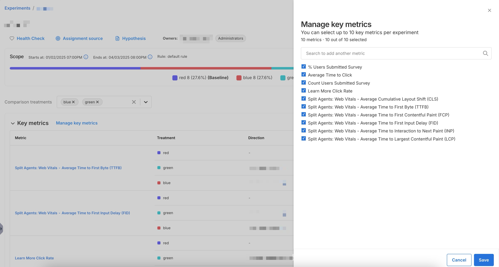

## Overview

Once you've [created an experiment](../../setup/), you can assign up to 10 key metrics to your experiment. 

## Add key metrics

1. Navigate to **Harness FME** > **Experiments** and click on an experiment.
1. Click **Manage key metrics** next to the **Key metrics** section.
1. Search for key metrics to add by using the search bar or select individual key metrics.
1. Click **Save**. 