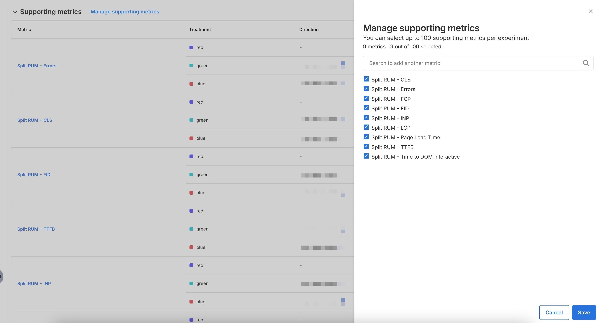

## Overview

Once you've [created an experiment](../../setup/), you can assign up to 100 supporting metrics to your experiment. 

## Add supporting metrics

1. Navigate to **Harness FME** > **Experiments** and click on an experiment.
1. Click **Manage supporting metrics** next to the **Supporting metrics** section.
1. Search for supporting metrics to add by using the search bar or select individual supporting metrics.
1. Click **Save**. 
