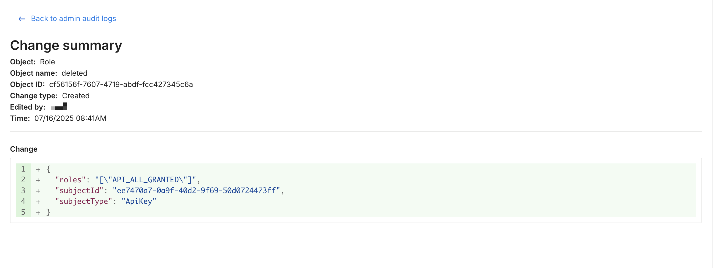

## Overview

Admin audit logs are captured every time an admin makes a creates, changes, or deletes any of the below objects. These logs provide detailed records of every change that took place and who made them.

- API keys
- Environments
- Traffic types
- Dimensions
- Users and their group memberships
- Groups
- Security settings
- General settings
- Monitor window and statistics
- Amplitude integrations
- AppDynamics integrations
- Datadog integrations
- Email integrations
- Jira integrations
- Librato integrations
- mParticle integrations
- New Relic integrations
- Outgoing webhook (audit logs) integrations
- Outgoing webhook (Impressions) integrations
- Papertrail integrations
- Rollbar integrations
- Segment integrations
- Sentry integrations
- Slack integrations
- SumoLogic integrations
- Outgoing webhook (admin audit logs) integrations

## Viewing changes

Access Admin audit logs by navigating to **Admin settings**, select **Security**, and click the **Admin audit logs** tab. Admins see a table of all changes that made by Admins against the objects listed above.

When hovering over the row for an audit log, click on the object name for that change to see more information about each update, including a diff view of what elements of the object were edited.

Monitor this data using the user interface to more easily audit every modification made to feature flags over time or to troubleshoot any issues that occur during rollout. You can also pull out this data via the [outgoing webhook](/docs/feature-management-experimentation/api/webhook/admin-audit-logs) for analysis within other tools.