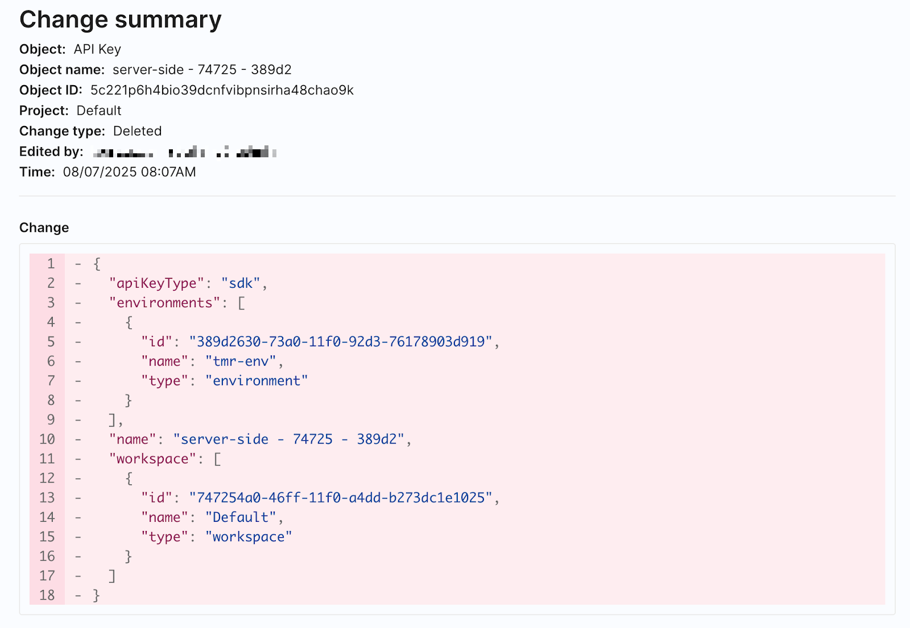

## Overview

import Tabs from '@theme/Tabs';
import TabItem from '@theme/TabItem';

<Tabs>
<TabItem value="Harness FME (Recommended)">

FME-specific Admin audit logs are captured every time an admin creates, changes, or deletes any of the below objects. These logs provide detailed records of every change that took place and who made them.

- SDK API keys
- Admin API keys (legacy Split Admin API keys only)
- Environments
- Traffic types
- Dimensions
- Security settings
- General settings
- Monitor window and statistics
- Amplitude integrations
- AppDynamics integrations
- Datadog integrations
- Email integrations
- Jira integrations
- mParticle integrations
- New Relic integrations
- Outgoing webhook (audit logs) integrations
- Outgoing webhook (impressions) integrations
- Rollbar integrations
- Segment integrations
- Sentry integrations
- Slack integrations
- SumoLogic integrations
- Outgoing webhook (admin audit logs) integrations

:::tip
Over time, these audit log entries will move to the Harness platform’s [Audit Trails](https://developer.harness.io/docs/platform/governance/audit-trail/) feature, but for now they are only accessible in the FME UI or by FME’s [Admin Audit Log webhook](/docs/feature-management-experimentation/api/webhook/admin-audit-logs).
:::

</TabItem>
<TabItem value="Legacy Split">

Admin audit logs are captured every time an admin creates, changes, or deletes any of the below objects. These logs provide detailed records of every change that took place and who made them.

- SDK API keys
- Admin API keys
- Environments
- Traffic types
- Dimensions
- Users and their group memberships
- Groups
- Security settings
- General settings
- Monitor window and statistics
- Amplitude integrations
- AppDynamics integrations
- Datadog integrations
- Email integrations
- Jira integrations
- mParticle integrations
- New Relic integrations
- Outgoing webhook (audit logs) integrations
- Outgoing webhook (impressions) integrations
- Rollbar integrations
- Segment integrations
- Sentry integrations
- Slack integrations
- SumoLogic integrations
- Outgoing webhook (admin audit logs) integrations

</TabItem>
</Tabs>

## Viewing changes

<Tabs>
<TabItem value="Harness FME (Recommended)">

Access Admin audit logs by navigating to **FME Settings**, select **Security**, and click the **Admin audit logs** tab. Admins see a table of all changes that are made by Admins against the objects listed above.

When hovering over the row for an audit log, click on the object name for that change to see more information about each update, including a diff view of what elements of the object were edited.

</TabItem>
<TabItem value="Legacy Split">

Access Admin audit logs by navigating to **Admin settings**, select **Security**, and click the **Admin audit logs** tab. Admins see a table of all changes that are made by Admins against the objects listed above.

When hovering over the row for an audit log, click on the object name for that change to see more information about each update, including a diff view of what elements of the object were edited.

</TabItem>
</Tabs>

Monitor this data using the user interface to more easily audit every modification made to feature flags over time or to troubleshoot any issues that occur during rollout. You can also pull out this data via the [outgoing webhook](/docs/feature-management-experimentation/api/webhook/admin-audit-logs) for analysis within other tools.