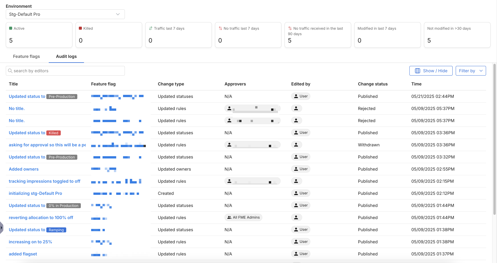

## Overview

The environment-level audit log lists all changes made to feature flags within an environment. It’s similar to the **Audit log** tab found in each feature flag; however, it allows you to see all changes without visiting each feature flag separately. It also supports sophisticated filtering, for example, whether a feature flag has had traffic in the last seven days, hasn’t been modified in more than 30 days, etc.

View these changes in the **Audit log** tab of the **Environments** dashboard. Changes to each feature flag are logged, regardless of whether the change is made by a user or using the API.

For more information about environments, see [Environments](/docs/feature-management-experimentation/management-and-administration/fme-settings/environments/). 