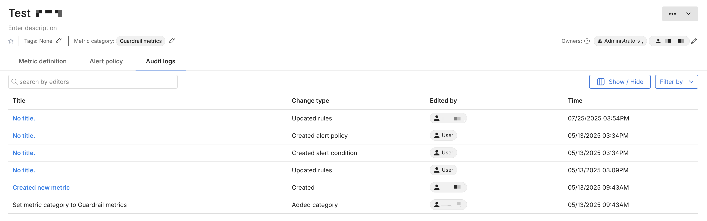

## Overview

Changes to individual objects within Split such as a feature flag, segment, or metric are logged, regardless of whether the change is made by a user, an API call, or an integration.

Object-level changes are viewed in the **Audit log** tab of the object that was changed. Changes are also viewed across all feature flags changed within an environment in the **Audit log** tab of the Environments dashboard. 

For more information, see [Audit logs](/docs/feature-management-experimentation/management-and-administration/account-settings/audit-logs/). 