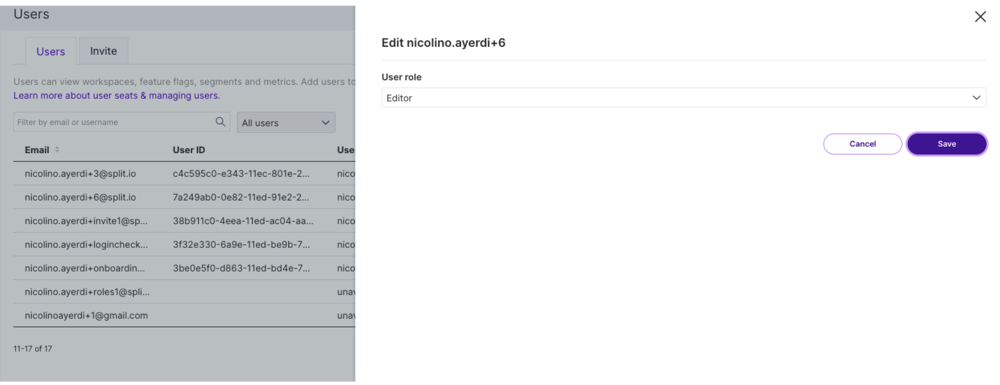
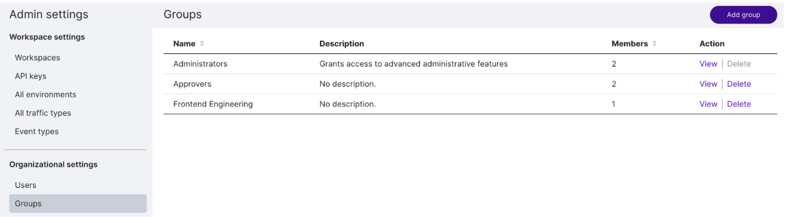
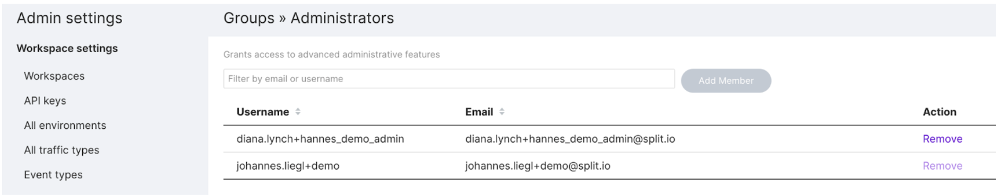
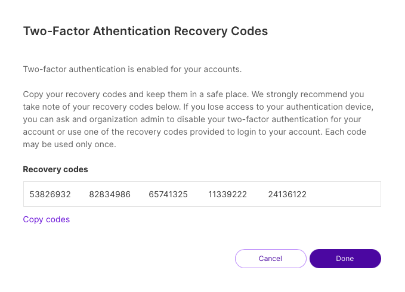

## Overview

Split supports three roles to give users different permission levels in the Split UI:

* **Viewer**: Users with the **Viewer** role are only allowed to view data and objects. They cannot modify any objects like feature flags or segments in the web console.

* **Editor**: Users with the **Editor** role can modify objects like feature flags and segments. They also can approve or reject change requests.

* **Administrators**: Users with the **Administrators** role have full permissions. They can view and modify all objects in the web console. They also participate in approval decisions and perform all administrative responsibilities. For example, they can create new users or manage groups. **Administrators** are also the only users that can create and manage API and SDK keys.

:::note 
Administrators is a group that has been created for you. The first user in a new account is automatically added to the Administrators group. A user added to the Administrators group will have full administrator privileges, without regard for other role assignments.
:::

## Assigning user roles

The following sections explain how a user in the Administrators group can assign a role to other users.

### Assigning an Editor or Viewer Role when creating a user

A role is assigned when creating a new user as described below.

1. From the left navigation, click the user's initials at the bottom and click the **Invite** menu item.
1. Assign the Editor or Viewer role by selecting the role in the User role menu list. The Editor role is selected by default.
1. Click the **Invite** button. The new user is created.

### Creating a new user in the Administrators group

A new user can be created in the Administrators group as described below.

1. From the left navigation click the **Invite** menu item.
1. Add the user to the Administrators group by typing 'Administrators' in the Group text box.
1. Click the **Invite** button. The new user is created.

    :::note
    The Invitation link sent to new users will expire within 2 weeks from the time they are sent. If they are used after expiration, the login page will not change after updating the login email and password, and no account is created.
    :::

### Changing permissions of existing users by assigning the Editor or Viewer role

The Editor or a Viewer role can be assigned to an existing user by following the steps below.

1. In the left navigation, click the user's initials at the bottom, select **Admin settings**, and click **Users**. A list of users appears.

1. Find the desired user and click **Edit**.

1. Select the desired role from the User role menu list.

   

1. Click the **Save** button. The new role will be assigned to the user.

### Adding an existing user to the Administrators group

An existing user can be added to the Administrators group as described below.

1. In the left navigation, click the user's initials at the bottom and select Admin settings.

1. Click **Groups** and in the **Action** column, click **View** in the Administrators group.
   
   

1. Select an existing user and click **Add member**. A new member is added.
   
   

## Managing users

Split’s permissions model allows for by-environment or by-feature access controls, as well as the creation of groups for easier administration of permissions by teams.

Administrators can visit the admin section of Split to enable or disable access to any environment or feature at the individual user level, or create groups to quickly grant permissions to all the users within them. Any Split user can be a part of as many groups as you’d like.

In addition to [tags](/docs/feature-management-experimentation/management-and-administration/tags), you can use owners to organize and manage feature flags, segments and metrics across the Split user interface. Use owners to isolate feature flags, segments, and metrics in the browse panes to those **owned by me** and simplify permissions by providing owners edit rights for a single feature flag across all environments by toggling permissions on. When toggled on, permissions will inherit owners as editors.

Harness recommends using groups where possible as owners. As you onboard new teammates their Split instance will have several feature flags owned by their team.

For more information about Split’s permissions controls, using owners, and creating groups, see [Groups](/docs/feature-management-experimentation/management-and-administration/account-settings/groups).

## About object-level edit permissions

For a user that is not in the Administrators group, object-level edit permissions previously granted will no longer be honored once the user is switched to the Viewer role. 

In other words, even if the user still appears in object-level edit permissions (Feature flag, Segment, or Metric owners), Environment settings (in the list of editors and approvers), or Feature flag change requests (in the list of approvers), the user will only be able to view any of those objects, and will not be able to edit them.

## About audit logging

A change in the role assignment for a user (e.g. from Editor to Viewer) is tracked in the Admin audit logs (under Admin settings, Security). Viewing behavior of a Viewer user is not captured in audit logs.

## Google account sign-in (SSO)

Users can authenticate in the Split user interface using Google account sign-in, as long as the login ID (email address) used in Split matches their Gmail account.

:::info
If you are a new user, your Split account must be activated before you can use Google authentication. When you receive your invitation, make sure to click the invite link, set a password, and log in to Split at least once before signing in with Google.
:::

## Two-factor authentication (2FA)

For increased login security, you can add two-factor authentication (2FA) for your Harness FME account. With 2FA enabled, Harness FME asks you to enter a verification code after authentication.

### Setup
 
Set up 2FA in a few steps: 

1. In the left navigation, click on the **profile button** at the bottom, and go to **Personal Settings** > **Security**.
2. Click **Enable Two-Factor Authentication**.
3. Download an authenticator app like Google Authenticator.
4. Scan the QR code on your screen.
5. Enter the 6-digit verification code generated by the app to complete setup.
6. On your next login, you are prompted to enter a code generated from the authentication app on your smartphone.

## Manage
 
### See 2FA status for users

Administrators can see which users on your team have set up two-factor authentication. In **Admin Settings** > **Users**, column 2FA shows a user's 2FA status (enabled or disabled).

### Disable 2FA for someone who cannot sign in

Administrators can disable 2FA for users on their team: 

1. Go to **Admin Settings** > **Users**.
2. Click **Disable 2FA** in the Action column next to a user's name.

### Session reset

By default, we do not automatically kill active user sessions. However, team administrators can kill an active user session and force them to log out.

Administrators can do this by going to Admin settings > Users and then clicking Force Logout in the Action column next to a user’s name.

After you force a session to reset, the affected team member is automatically logged out of Harness FME. This user must sign in again and complete two-factor authentication if it has been set up.

### Session timeout

Administrators can modify session timeout settings to ensure that a session closes when it is no longer in use. By default, sessions automatically time out after 30 minutes of inactivity, forcing users to re-authenticate for access. However, team administrators can customize this setting for their organization by specifying a timeout value. All sessions will timeout after 7 days regardless of your organization's setting, forcing users to re-authenticate.

The timeout value represents the length of time after which the system logs out inactive users. The timeout is between 15 minutes and 7 days. We recommend maintaining a shorter timeout period to enforce stricter security.

To update session timeout settings:

1. Go to **Admin settings** > **Security** > **Session settings**.
1. Select a timeout value.
1. Click **Update**.

## Deactivate or reactivate a user

Administrators can take a number of actions to help manage users in their Harness FME account.

### Deactivate a user

1. From the left navigation, click the **profile button** at the bottom, select **Admin settings** and then **Users**.
1. Click **Deactivate** next to a user’s name. The user’s status changes to **Inactive**.

When the user’s login is deactivated, they cannot access your account in Harness FME and cannot reactivate their own login.

### Reactivate a user

1. From the left navigation, click the **profile button** at the bottom, select **Admin settings** and then **Users**.
1. Click **Activate** next to a user’s name. The user’s status changes to **Active**.

When the user’s login is activated, they can access your account in Harness FME.

## Unblock a user

### Password reset

A user can go through the password reset flow to unblock their login.

1. Go to [app.split.io/login](https://app.split.io/login).
1. Click **Forgot?**.
1. Enter your email.
1. Follow the instructions sent to the email, provided the user exists.

### Admin intervention

An administrator can unblock users in Admin settings.

1. From the left navigation pane, click the project switcher at the bottom and select **Admin settings**.
1. Click **Users**.
1. If the user's status is blocked, click **Unblock** next to the username. The user’s status changes to **Active**.

## Troubleshooting
 
### I've deleted or can't find the authenticator app used to enable two-factor authentication. How can I log in? 

If you lose your phone or no longer have access to the authentication app used during setup, use one of the recovery codes provided when you set up two-factor authentication for your account.

You can use any of these codes to access your account. **Note that each recovery code can only be used once.**

:::note
While the recovery codes allow you to access Harness FME in an emergency, you should contact your team's Administrator to disable two-factor authentication and then complete the setup process again. If you do not have access to the recovery codes, your team's administrator can disable two-factor authentication for your account.
:::

### User invitation emails were never received

An invitation is sent successfully to a user for the given organization, but the user never receives the email containing the invitation link.

Split’s backend servers use SendGrid, an enterprise email service typically configured for individually targeted business emails. In some cases, emails from SendGrid may be blocked or filtered if they are not recognized as individually targeted, causing invitation emails from Split.io to fail to reach the recipient.

To resolve this, contact your IT team and request that individually targeted emails from SendGrid be allowed or allowlisted.

### User unable to login after accepting invitation

An invitation is sent successfully to a user for the given organization. However, after setting their password and clicking the Login button, nothing happens. The login screen remains unchanged.

There are multiple potential causes for this issue:

* The same user ID (email address) already exists in another organization. The Split platform does not allow users to belong to multiple organizations.

* The invitation link has expired.

* The user is trying to log in with Google Authentication instead of using Split authentication for their first login.

If the user’s email already exists in another organization, consider one of the following options:

1. Have the user log in to their existing organization, navigate to My settings, and change their email address to one other than their official work email.

   

1. Use the same email address with a +1 suffix to differentiate the user in Split. For example, if the user’s email is first.last@email.com, they can use first.last+1@email.com. The email server will route the message to the same inbox, but Split will treat it as a separate user.

   

1. [Contact Harness Support](/docs/feature-management-experimentation/fme-support) or use this form to request deletion of the existing account, then reissue the invitation.
