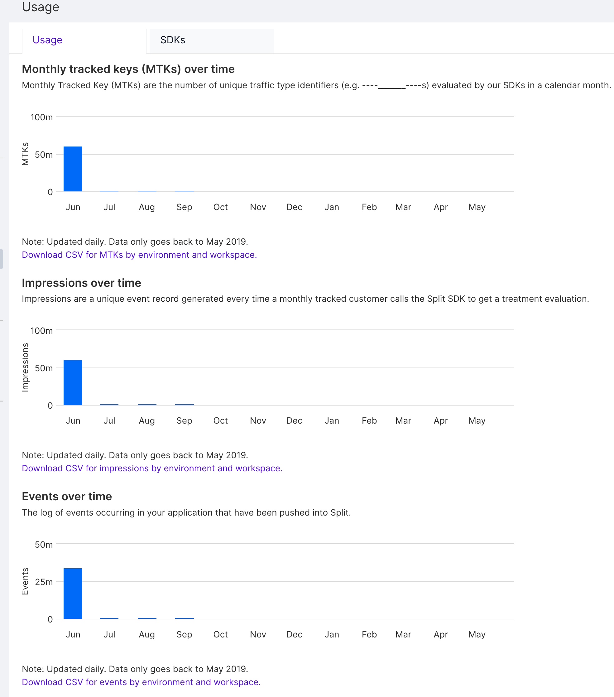

The following describes your available billing details, limits, and usage data within Harness FME. 

## Usage data

To access your usage data, do the following:

1. From the left navigation pane, click the project switcher at the bottom, and then select **Admin settings**.
2. Under Account settings, select **Usage**. 

The three types of usage data are:

### Monthly Tracked Keys

Monthly Tracked Key (MTKs) are the number of unique [traffic type](/docs/feature-management-experimentation/management-and-administration/fme-settings/traffic-types) identifiers (e.g. users) evaluated by our SDKs in a calendar month.

An MTK count is the number of unique keys that were evaluated for treatments over the entire month. Unique keys are deduplicated and only counted once across Projects, Environments, Traffic types, and Feature flags. A single key being used in getTreatment calls for multiple different feature flags (and possibly multiple different traffic types) is only one MTK. An MTK count is not the same as the number of impressions. An MTK count should however be roughly equivalent to the number of unique users expected on your site. For known user keys, it should map directly. 

### Impressions

[Impressions](/docs/feature-management-experimentation/feature-management/monitoring-analysis/impressions/) are a unique event record generated every time a monthly tracked key calls the FME SDK to get a treatment evaluation.

### Events

[Events](/docs/feature-management-experimentation/release-monitoring/events/) are records of user or system behavior. Events can be as simple as a page visited, a button clicked, or response time observed, and as complex as a transaction record with a detailed list of properties.

MTK, impression, and event counts are updated daily. Data is reported by month, so you can understand trends over time:

Each of these reports is available as an exportable CSV, which can be downloaded by selecting the "Download CSV" link below each chart. For additional usage data, contact our Support team at [support@split.io](mailto:support@split.io). 

## Billing and limits

To find data about your account's billing plan, limits, and currently enabled packs, do the following:

1. From the left navigation pane, click the project switcher at the bottom, and select **Admin settings**.
2. Under Account settings, select **Billing and limits**.

### Billing plan and limits

Under the Billing section, you can find data about your current plan, the expiration date of your plan, your current support plan, as well as the limits that your billing plan gates you on.

## Service limits

Under the Service limits section, you can find your current service limits. Harness FME maintains service limits for each account to help guarantee the availability of the Harness FME service, as well as to minimize billing risks to customers. Harness FME service limits require that you request limit increases manually.

Request limit increases by emailing [support@split.io](mailto:support@split.io).
