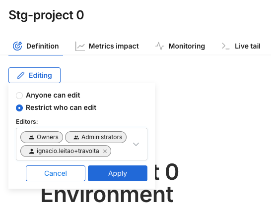
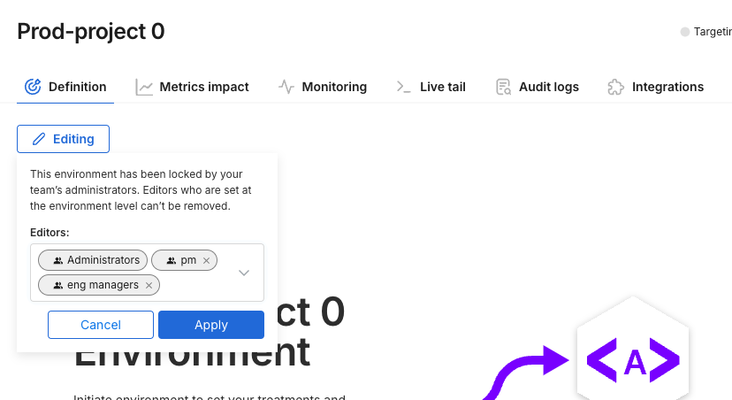

## Overview

When you and your team first come onboard to Split you'll likely wonder: 

* How should we organize and group our users? 
* What kind of permissions should we give users and groups to provide the right level of accessibility and control?
* How should we utilize projects and environments for our application(s)?

Recommendations differ for every company based on how your teams are structured and existing workflows. Below is an example of organizing your team within Split.

## Roles and Organization

There are four main ways to think about organizing users that will impact how you approach setup.

* **Administrators**: By default, Split creates an Administrators group and whoever initially sets up the account is a member of that group. That user can be removed as long as there is at least one admin. 

  Admins have the power to do everything within an account. As a result, you want to be thoughtful about who is a member of this group, keeping it to a limited number of individuals. 
  
  Admins can manage users and groups, security, experimental settings, projects, traffic types, environments, API keys, event types, and integrations. Admins can monitor usage and have full edit rights to all objects in all environments.
* **Users**: A user logs in to the Split UI using an email address. A user is often called a seat. The same email address cannot be used to log in to more than one Split account. 
* **Groups**: Users can belong to one or more groups. You might have groups such as QA, Product Managers, Front End, Search Team, Developers, etc. Groups are useful to help manage edit rights and organize feature flags. 

  Once users are placed in a group, you can give that group edit permissions at either the environment or object level. 

* **Owners**: Objects can be owned by one or more individual users or groups. Admins, by default, have ownership rights for all objects. Current owners of an object can add other owners.

Below is an overview of the default structure of users, environments, projects, and objects within your Split account. From here, you can organize and customize how you would like to structure

Typically, you'll use multiple projects if you have multiple applications and the feature flags do not have any dependencies or share the same traffic types or environments. Every project has separate environments, API keys, and traffic types. Events are sent to environments, which means they will only visible in that project (you can send an event to multiple environments). 

While users can navigate between projects, you can use environment permissions to restrict edit rights, if needed.

### Permissions

You can set edit rights on an object or for an environment. Permissions are assigned to either individuals or groups. This allows the appropriate group to have the right level of accessibility while maintaining compliance with security requirements. A common pattern using Staging and Production:

* **Staging**: No environment level permissions are set. This means that, by default, any user can edit any object. An owner of the object (or admin) can click on the Permissions toggle to set permissions for that object to on. If that happens, only owners and admins can edit the object. An owner or admin can add additional editors by either adding a user or group as an owner or as an editor. Editors can also be removed.
  
  

* **Production**: An Administrator can set environment-level permissions, which is not unusual for production environments. For example, they may want to give only Engineering Managers, Senior PMs, and DevOps the ability to edit a production feature flag. In that case, when setting up the environment they'd give edit rights to those groups and individuals. Again, anyone with edit permissions can add additional editors, if appropriate. In the case below, we have two groups, in addition to Administrators, and one individual who have permissions. You'll note that the Permissions toggle cannot be turned off.

  

Whether or not you choose environment-level permissions is dependent on if you want the default behavior to be 1) anyone can edit with the option to restrict an object or 2) only specific people can edit with the ability to open up an object to others. 

### Approvals

As an alternative, you can use approvals for an environment. Approvals can be optional or required. If you want to limit publishing changes to an environment, instead of restricting edit rights you can gain greater flexibility, in many cases, by allowing anyone to edit feature flags and segments, but preventing them from publishing those edits without approval. Instead of limiting editors, using approvers can potentially eliminate a bottleneck in getting updates into sensitive environments.

You have two options: 

1. The user can request a teammate approve the change, to ensure a second set of eyes is on a change
1. Or, you can identify a group of authorized approvers, perhaps the same people who might otherwise have default edit rights in a locked-down environment.

Two example patterns:

* An environment is locked down such that only Administrators and a team responsible for production deployment have the right to approve. All approval typically go to the Prod Deploy team. 
* Team leaders are approvers and team members request approval from their team leader. So approvers might include Team1 Mgr, Team2 Mgr, etc. As a member of Team 1, I’d submit my change to Team1 Mgr. In that case, the appropriate manager is approving changes made in his part of the app.

You can have many permutations in how you might implement.