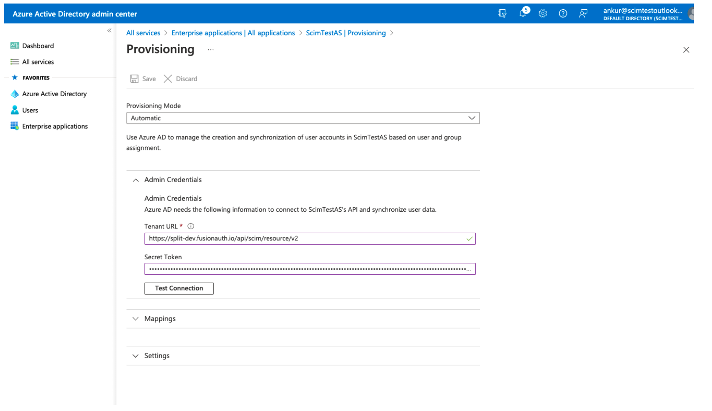

## Overview

System for Cross-domain Identity Management (SCIM) is an open standard that allows admins to automate user and group provisioning. SCIM communicates user and group information between identity providers (e.g., Okta, AzureAD) and service providers requiring user and group information (Split). With SCIM, IT administrators can govern Split users and groups within their own identity provider.

## Enabling SCIM for Microsoft Entra ID

You can enable SCIM user provisioning to work with your SSO-Strict mode enabled Split account. SCIM facilitates user provisioning which allows your IdP to create, update, and deactivate members in Split. You can:

* Enable SCIM for your Split organization
* Connect Split to Microsoft Entra ID
* Create and manage users and groups in Split directly from Microsoft Entra ID

:::tip
Once SCIM is enabled for your organization:

- You must add new users in AzureAD to give them access to Split. You can’t invite new users to Split. Any existing open invites are revoked.
- Be aware that the display or user name of the users reflects the username in Azure AD and cannot be edited in Split.
- `Split_Administrators` is a reserved group name. Use this group name in AzureAD to map it to Administrators on the Split side.
- User management actions such as deactivate and activate are disabled in Split. Azure AD administrators control the user management within Azure AD.
- Groups that are synced from AzureAD are uneditable in Split. If you want to change the members in a group, the AzureAD administrators can add them.
:::

## Enabling SCIM for your Split organization

:::tip 
As a prerequisite, you must enable SAML in SSO Strict mode to use this capability. See [Single sign-on with Azure](../sso/azure) to enable SAML before configuring SCIM.
:::

To enable SCIM for your organization, do the following:

1. From the left navigation, select **Admin settings** and then **Security**. Click the **SCIM** tab on the **Security Settings** page.
1. From the IDP menu list, select **Microsoft Entra ID**. Click the **SCIM** toggle to **On**.
1. The SCIM enable modal appears. The following information displays and must be copied:
   
   * The access token. Be sure to copy and store this token in a safe location as you won’t be able to access this token again. This only displays once. If you do lose it, you can regenerate a new token.
     
     :::info
     For security reasons, the access token is valid for one year from the time it is created. At the end of this period, Administrators should regenerate this token and update Microsoft Entra ID with the new token to continue using the SCIM functionality.
     :::

   * SCIM connector base URL.

## Connecting Split to Microsoft Entra ID

To connect Split to AzureAD, do the following:

:::tip
Only an Azure administrator can do the following setup on the Azure’s Split Enterprise app. The group name `Administrators` is a reserved keyword in Split and cannot be overridden. It must have at least one member. 

The group name `Split_Administrators` on AzureAD maps to Administrators on Split.
:::

1. Log into your Azure administrator account in your Microsoft Entra ID Admin Center. Click **All Services and Enterprise Applications**, and then **Split**. This should already be set up for you if you enabled SAML.
1. From the left navigation, click **Provisioning** and then **Get started** to begin setting up SCIM for your Split application.

   

1. Select the Provisioning Mode as **Automatic** and copy over the SCIM Base Connector URL from Split into **Tenant URL** and the Access Token from Split into the **Secret Token** field.

   

1. Click the **Test Connection** button and then **Save**. You will receive a message indicating that the supplied credentials are authorized to enable provisioning. The mappings and settings sections are now available.
1. Click **Mappings** and click **Provision Azure Active Directory Users** to change the user settings.
1. Click the attribute **mail** and change the source attribute to `userPrincipalName` or `originalUserPrincipalName`. The target attribute remains as `emails[type eq “work”].value`.

   

1. Click **Ok** and then **Save**.

   

1. Toggle the provisioning status to **On** and click the **Save** button.

## Provisioning users or groups from Microsoft Entra ID to Split

:::tip
Because users are pushed from Microsoft Entra ID, they are now IdP managed and you can’t deactivate them from Split. Go back to Microsoft Entra ID to deactivate them.

Group name length must be less than 25 characters.
:::

To provision users, do the following:

1. Click the **Users and groups** tab.
1. Click the **Add user/group** button and from the list, click **None Selected** under **Users and Groups** and search for the users or groups in the modal.
   
   

1. In the search field, find the desired person and click the **Select** and then **Assign** buttons to assign access to Split.

   

1. To ensure the person is added, click the **Admin settings** of the Split application, and under **Organizational settings**, click **Users**. The new user appears in the list.
1. Follow the same process to assign groups to your Split application.

You can monitor the Provisioning status by viewing the logs on the **Provisioning** tab. The provisioning cycle is set to 40mins. All changes made to Microsoft Entra ID reflect in Split at this frequency.

:::tip
The Group Name in Microsoft Entra ID is the same as the Group Name in Split. To link an Microsoft Entra ID Group to a Split Group, create a Group in Microsoft Entra ID with the same name. The linking happens behind the scenes.

There is a special case for Administrators. As Administrators is a reserved word on the Split application, this group must exist and have at least one member. If you are unable to create a group with name Administrators in Microsoft Entra ID to link to Split, create one with name Split_Administrators. If a group with the name Split_Administrators is synced from Microsoft Entra ID, it automatically maps to the Administrators group on Split. The name on Split remains Administrators.

Provisioning runs at a 40 min interval by default and all changes made to Assigned users and Groups reflect in Split after the next provisioning cycle run.
:::

## Troubleshooting

### Error message in Microsoft Entra ID setup

If you see the `AADSTS50105` error message, it means that you aren't a direct member of a group with access or the administrator hasn't assigned you with access. Contact the admin to assign you access to the Split application in the Azure AD Enterprise Apps section.