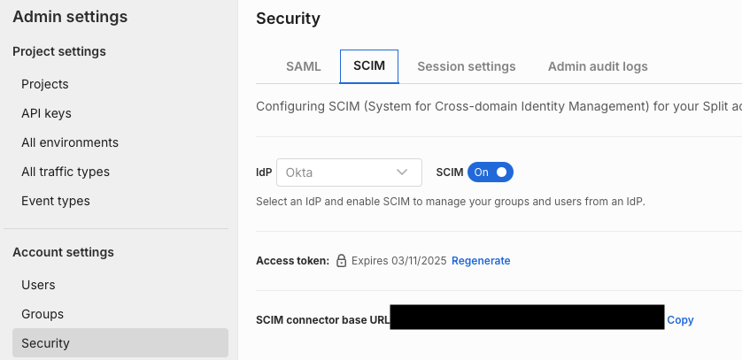
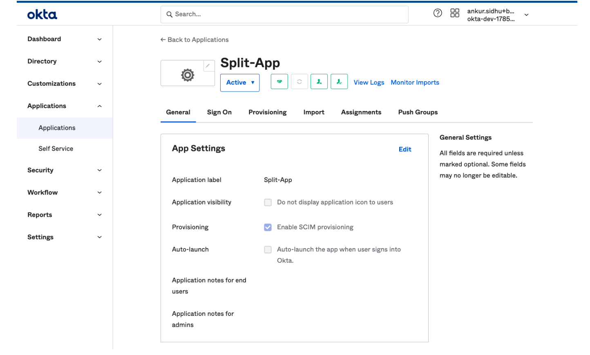
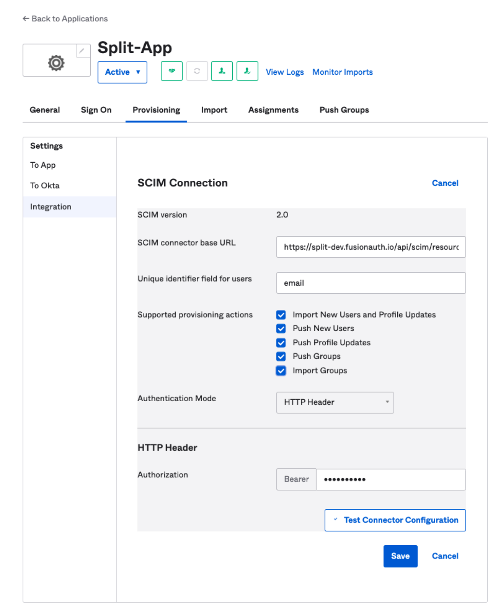
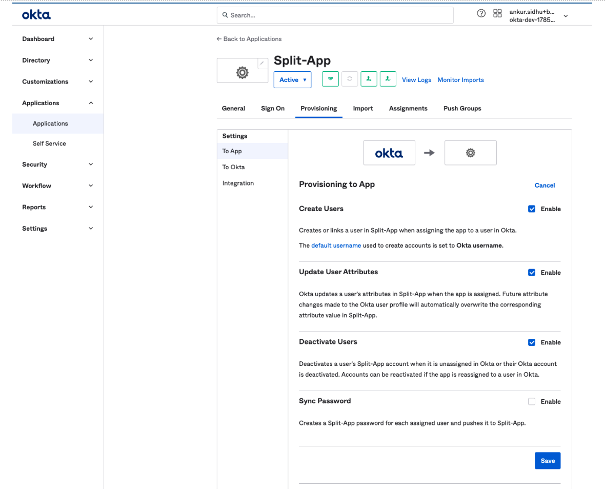
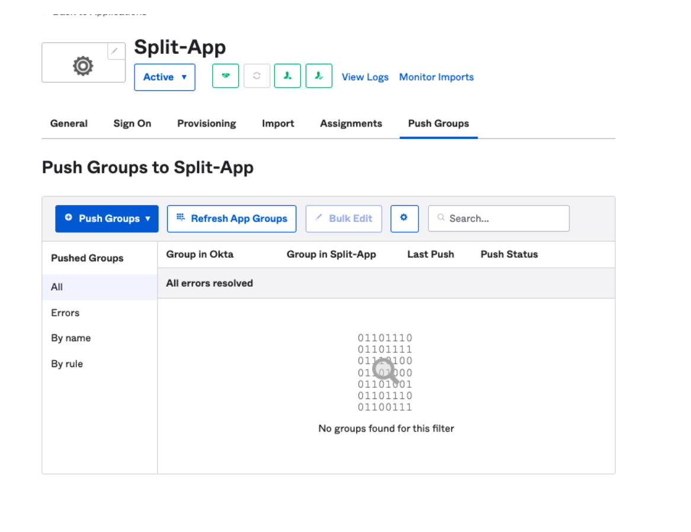
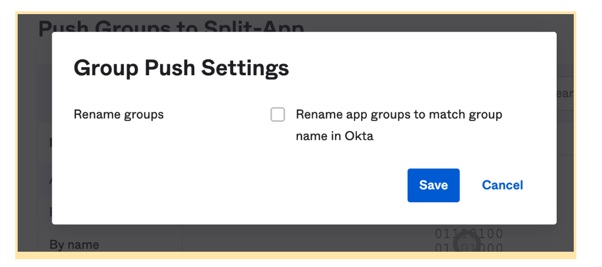
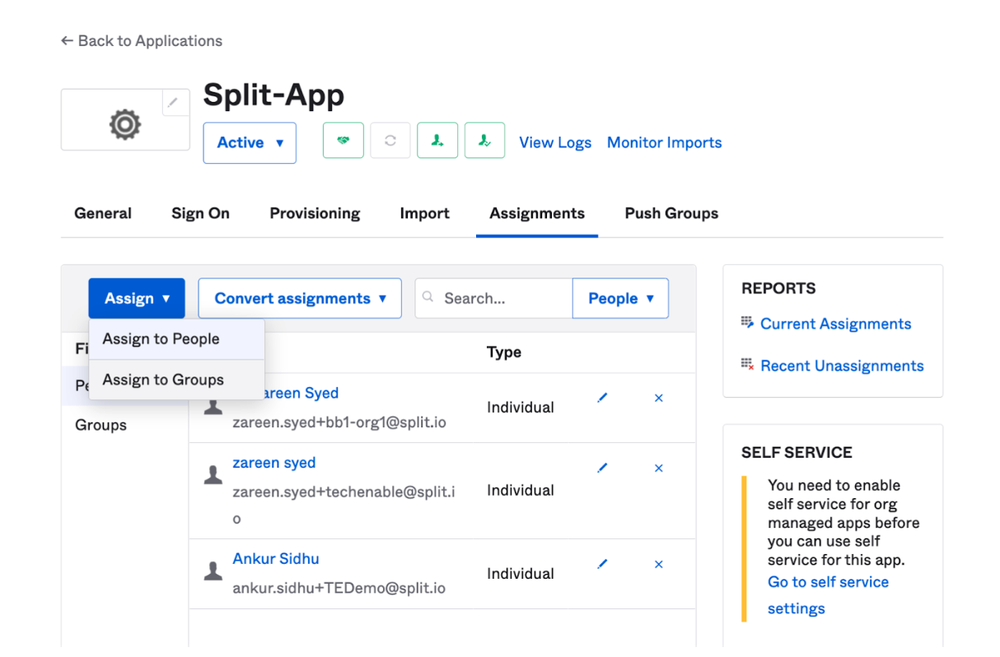
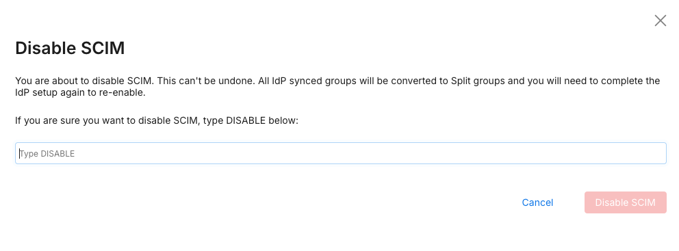

## Overview

System for Cross-domain Identity Management (SCIM) is an open standard that allows admins to automate user and group provisioning. SCIM communicates user and group information between identity providers (e.g., Okta) and service providers requiring user and group information (Split). 

With SCIM, IT administrators can govern Split users and groups within their own identity provider Okta.

## Enabling SCIM for Okta

You can enable SCIM user provisioning to work with your SSO-strict enabled account. SCIM facilitates user provisioning which allows your IdP to create, update, and deactivate members in Split. You can:

* Enable SCIM for your Split organization
* Connect Split to Okta
* Create and manage users and groups in Split directly from Okta

:::tip
Once SCIM is enabled for your organization: 

- You must add new users in Okta to give them access to Split. You can't invite new users to Split and any existing open invites are revoked.
- User management actions such as Deactivate and Activate is disabled in Split. Okta administrators control the user management within Okta.
- Groups that are synced from Okta are uneditable in Split. If you want to change the members in a group, the Okta administrators can push them over.
:::

## Enabling SCIM for your Split organization

:::tip
You must enable SAML in SSO Strict mode to use this capability. See [Single sign-on with Okta](../sso/okta) to enable SAML before configuring SCIM.
:::

To enable SCIM for your Split organization, do the following:

1. From the left navigation, select **Admin settings** and then **Security**. Click the **SCIM** tab on the **Security Settings** page.    

   

1. The default IDP selection is Okta. Click the SCIM toggle to **On**.

1. The SCIM enable modal appears. Two pieces of information display and must be copied:

   * Access tokens. Be sure to copy and store this token in a safe location as you won’t be able to access this token again. This only displays once. If you do lose it, you can regenerate a new token.

     :::info
     For security reasons, the access token is valid for one year from the time it's created. At the end of this period, administrators should regenerate this token and update Okta with the new token to continue using the SCIM functionality.
     :::
   
   * SCIM connector base URL

## Connecting Split to Okta

:::tip
Only an Okta administrator can do the following setup on the Okta app.
The group name `Administrators` is a reserved keyword in Split and cannot be overridden. It must have at least one member.
:::

To connect Split to Okta, do the following:

1. Log into your Okta administrator account, select **Applications**, and then **Split**. This should already be set up for you if you enabled SAML.

1. On the App settings modal under General, click **Edit** and select **Enable SCIM provisioning**.

1. Click **Save**.

   

1. Click the **Provisioning** tab and then **Edit**. Fill in the fields as follows:

   * In the **SCIM connector base URL** field, copy and paste the connector base URL generated in Split when you enabled SCIM.

   * In the **Unique identifier** field for the user, enter the email. This is case sensitive.

   * On the **Supported provisioning actions** selections, select **Push new users**, **Push profile updates**, and **Push groups**.

   * In the **Authentication mode** list, select **HTTP header**. The HTTP header field appears.

   * In the **Token** field of **Authorization**, copy and paste the access token generated when you enabled SCIM into the field.

     

1. Click the **Test connector configuration** button to test and wait for the success message to appear with the create users, update attributes, and push groups checked.

1. Once the connection is confirmed, click **Close**.

1. Click **Save** to save your SCIM configuration.

1. On the **Provisioning** tab, under **Settings**, click **To App** and then **Edit**.

1. Select **Create users**, **Update user attributes**, and **Deactivate users** and click the **Save** button.

   

1. On the **Push groups** tab, do the following:

   * Click **Refresh App Groups**. This loads the existing groups in Split to Okta in case you want to link to an existing Split Group.
   refresh-app-groups.png

     

   * Click the **Settings** icon on the **Push Groups** tab and uncheck the **Group Push Settings** to not rename the App Groups in Split.

     

The SCIM connection setup between Okta and Split is now complete and we are ready to provision users and groups to Split.

## Provisioning users from Okta to Split

:::tip 
Because users are pushed from Okta, they are now IdP managed and you can’t deactivate them from Split. Go back to Okta to deactivate them.
:::

You can provision users by doing the following:

1. In Okta, click the **Assignments** tab.

   

1. Click the **Assign** button and from the list, select **Assign** to people.

1. In the search field, find the desired person and click the **Assign** button to assign access to Split. The Assign selection turns to Assigned.

1. Click the **Done** button to finish.

1. To ensure the person is added, from the **Admin settings** of the Split application, under **Organizational settings**, click **Users**. The new user appears in the list.

## Provisioning groups from Okta to Split

:::tip
Because groups are pushed from Okta, they are now IdP managed and you can’t deactivate them from Split. Go back to Okta to deactivate them.
Group name length should be less than 25 characters.
:::

You can assign groups by doing the following:

1. In Okta, click the **Assignments** tab.
1. Click the **Assign** button and from the list, select **Assign** to groups.
1. In the search field, find the desired group and click the **Assign** button to assign group access to Split.
1. Click the **Done** button. An additional modal appears where you can optionally add extra information to your group.
1. Click **Save and go back**, then **Done**.
1. To configure the Push groups to Split, click the **Push groups** button and then **Find groups** by name.
1. Enter the name of the group in Okta that you want to push. From here, you can either create a group or link a group and click **Save**:

   * **Create a new group**: Creates a new group in Split by this name. If a group by the same name exists in Split, you must use the Link a group option. All members of the Group are synced with Split.
   * **Link a group**: Links an existing group.

1. To ensure the group is added, from the **Admin settings** of the Split application, under **Organizational settings**, click **Groups**. The new group appears in the list as a View Only group. All further changes to the group are managed in Okta.

## Regenerating access tokens

If you lost or forgot your access token, you can regenerate it by doing the following:

1. In **Admin Settings**, select **Security** and then the **SCIM** tab.
1. Click the **Regenerate** link next to the access token. You now have a new access token.

## Disabling SCIM

:::warning
If you disable SCIM, you must set up the connection between Okta and Split again.

All IDP-synced groups and users are converted to Split groups and users. You must map these again on re-enablement.
:::

To disable SCIM, do the following:

1. In **Admin Settings**, select **Security** and then the **SCIM** tab.
1. Click the **SCIM** toggle. A message appears with a text box to type `DISABLE`.
1. Type `DISABLE` and click the **Disable SCIM** button.

   