## Overview

This page explains how to set up Microsoft Active Directory Federation Services (AD FS) as an SAML IdP using Split's SAML 2.0 API, allowing users to log in to Split using their single sign-on (SSO) credentials.

## Configure SAML

If you are a Split administrator, you can configure SAML in the **Security** section of **Admin Settings**.

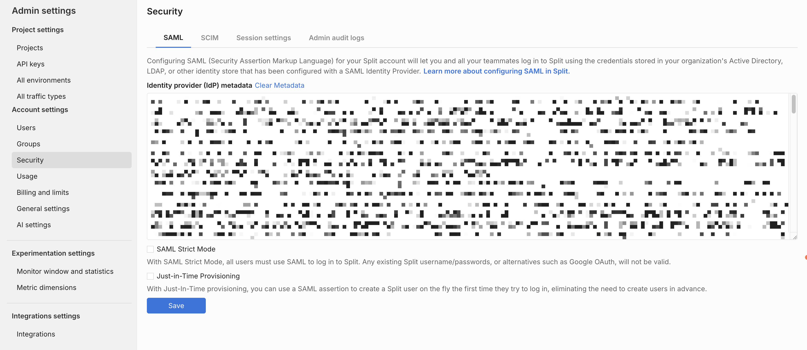

1. Go to **Admin Settings** > **Security** > **SAML**.
1. Add your IdP metadata to the text area.
1. Enable/disable **SAML strict mode**.
1. Enable/disable **Just-in-time user provisioning**.
1. Click **Save**.

When you save these changes, you can view the summary of the SAML configuration parameters. You use these settings in Okta.

## Add relying trust party

1. Open the AD FS management console by going to the Server Manager console and selecting **AD FS Management** from the **Tools** list (on the right).

   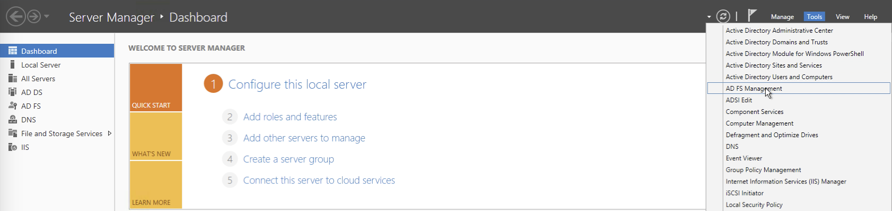

1. Click **Required: Add a trusted relying party**.

   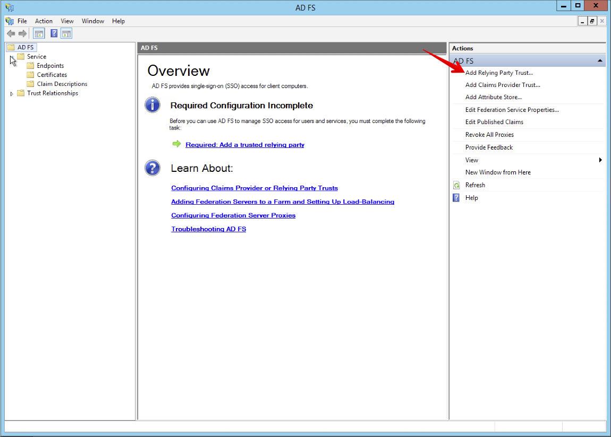

1. A walk-through opens to assist you in adding a new relying party trust to the AD FS configuration database. Read the instructions and click **Next**.
1. Select **Import data about the relying part from a file**.
1. Click **Browse** to select the metadata file then click **Next**.

   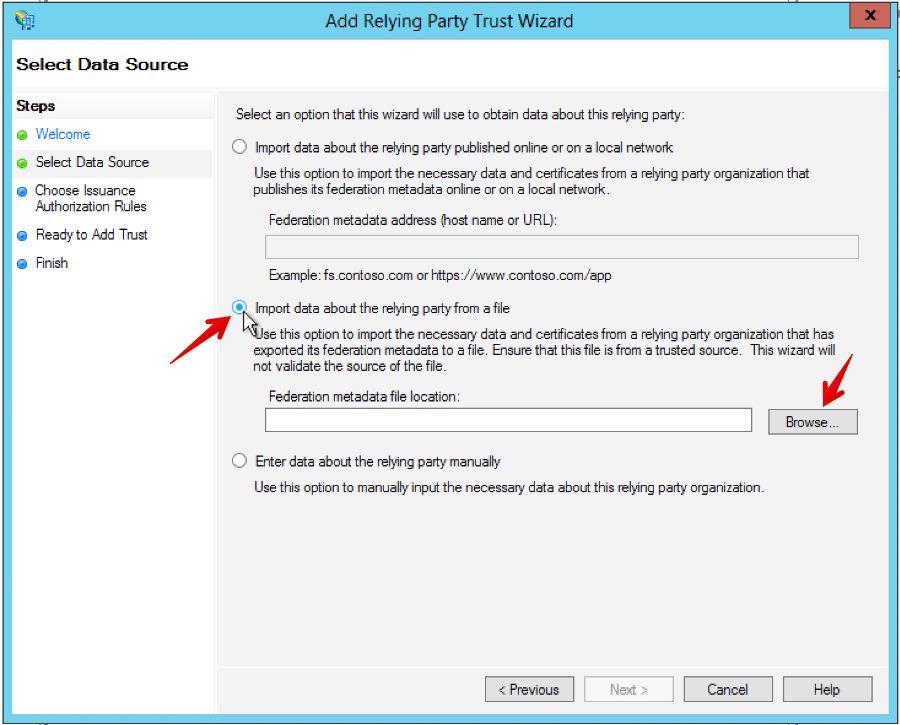

1. Provide a display name for the Trust, for example, Split, and then click **Next**.

   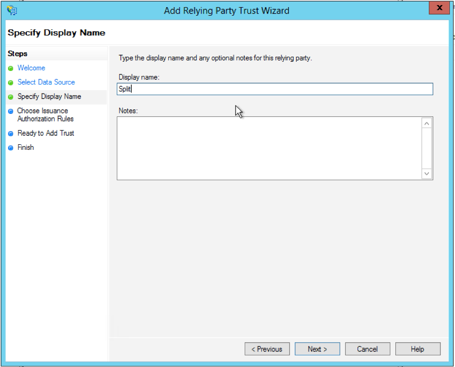

1. Select **Permit all users to access this relying party**, and then click **Next**.

   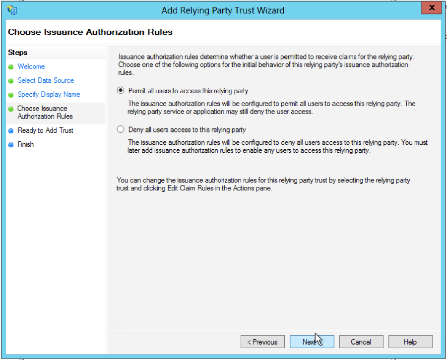

1. Review the settings, and then click **Next**.

   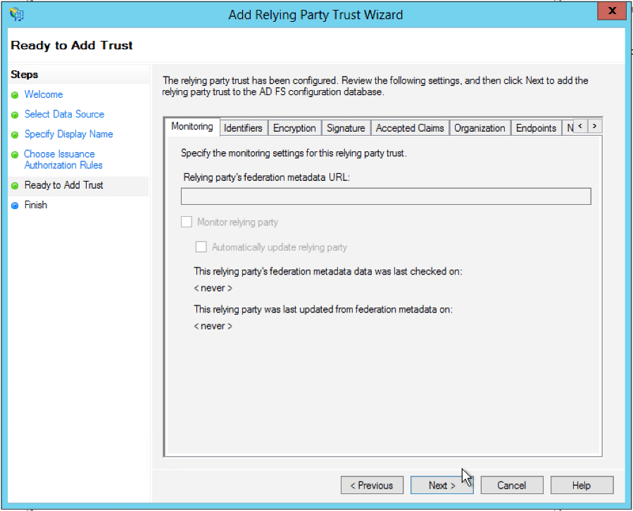

1. Click **Close**. This saves the trust and opens the **Edit Claim Rules**. Harness recommends using two claim rules for brokering the SAML assertions. Follow the steps below to configure.

1. Click **Add Rule**.

   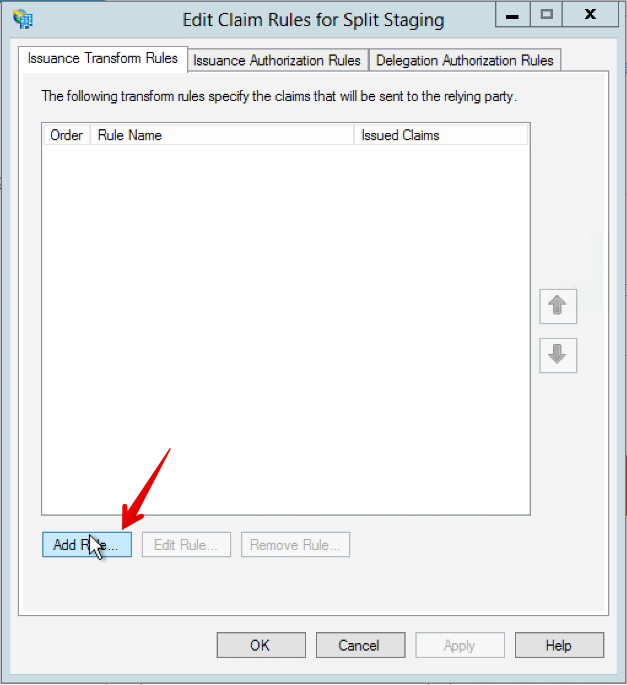

1. Select **Send LDAP Attributes as Claims**, and then click **Next**.

   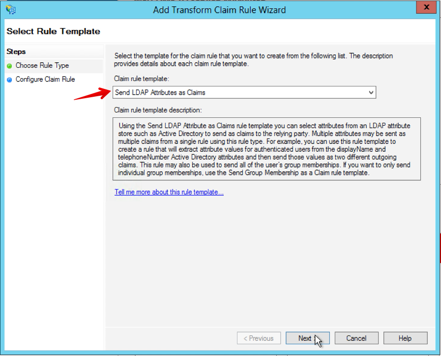

1. Configure the rule as follows. When all settings are configured, click **Finish**.

   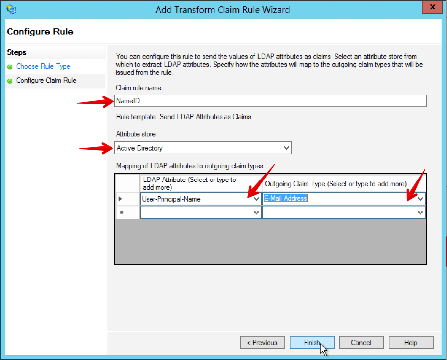

   * Set the Claim rule name as `NameID`.
   * Set the Attribute store as `Active Directory`.
   * Set the LDAP Attribute as `User-Principle-Name`.
   * Set the Outgoing Claim Type as `E-Mail Address`.

1. Add the second rule by clicking **Add Rule**.
1. Select **Transform an Incoming Claim**, and then click **Next**.
   
   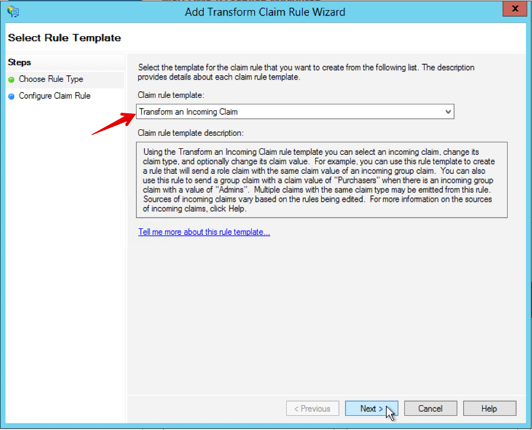

1. Configure the rule as follows. When all settings are configured, click **Finish**.
   
   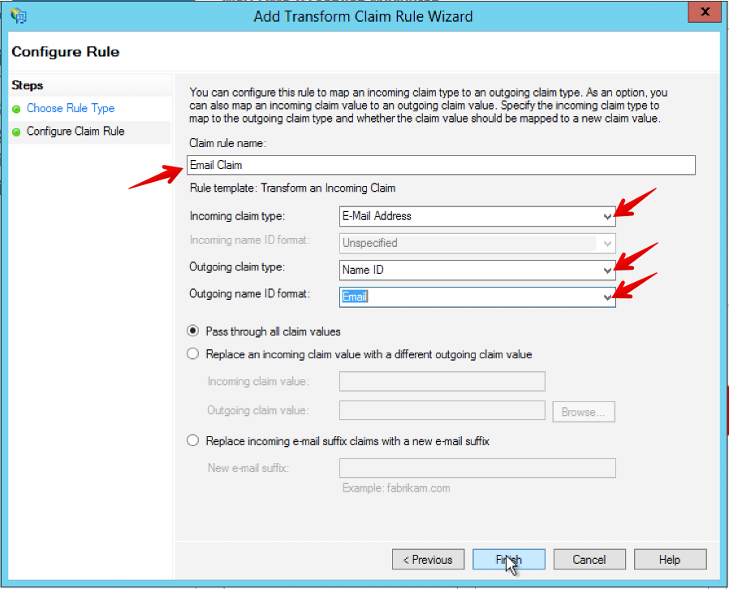

   * Set the Claim rule name as `Email Claim`.
   * Set the Incoming claim type as `E-Mail Address`.
   * Set the Outgoing claim type as `Name ID`.
   * Set the Outgoing name ID format as `Email`.

1. Right-click the properties of the relying party trust and select the **Advanced** tab.
1. Select `SHA-1` for the **Secure hash algorithm**, and then click **Apply**.

   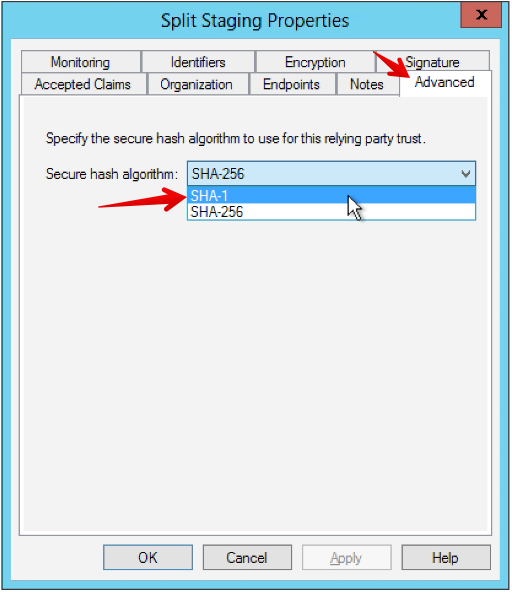

Split is now set up with AD FS.