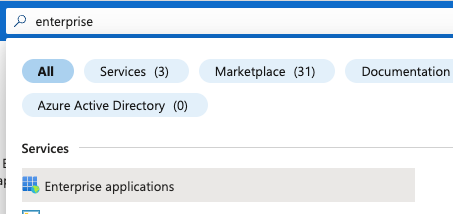
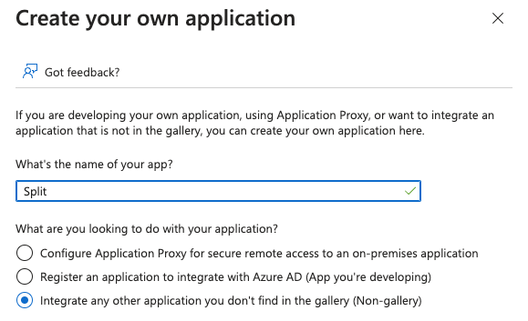
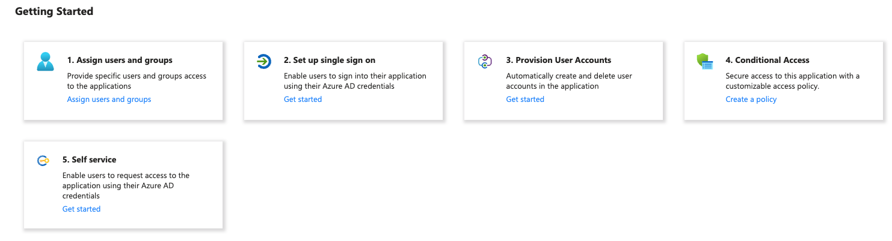
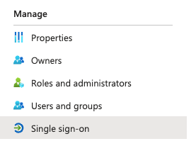
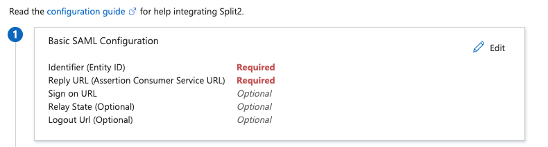
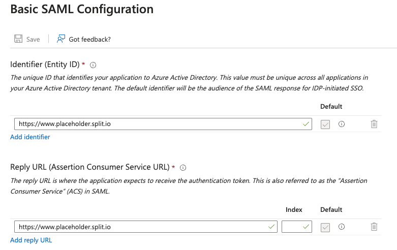
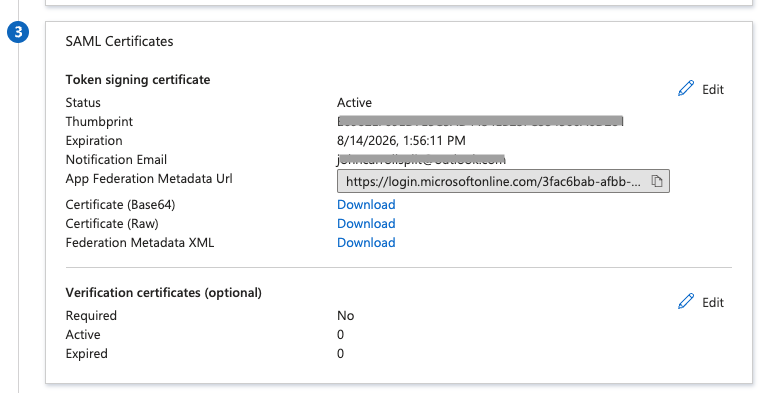
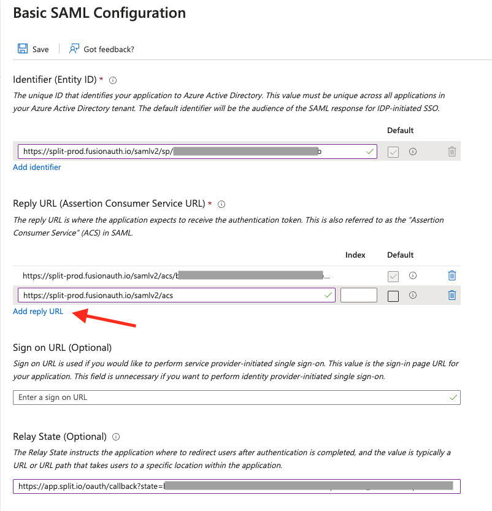
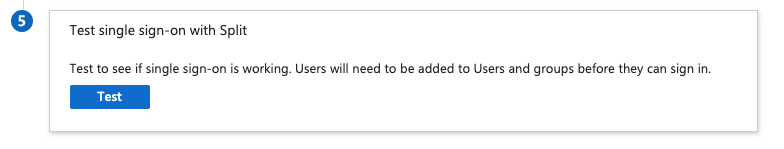
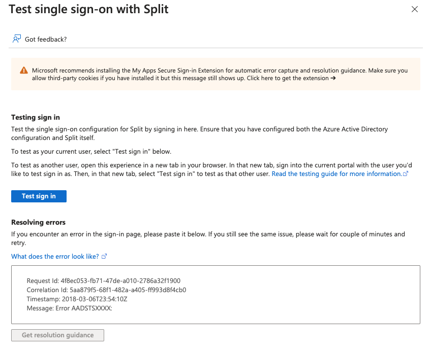

## Overview

Microsoft Entra ID is Microsoft's cloud-based directory and identity management service that you can integrate with Split's SAML 2.0 API to allow users to log into Split using their single sign-on (SSO) credentials. To learn more about configuring SAML in Split, see [Single Sign-On](../sso/).

## Create an enterprise app in Azure

To create an enterprise app in Azure, do the following:

1. From the MS Azure console, enter **Enterprise** in the top search box and click **Enterprise Applications**.

   

1. Click **New Application**, then **Create your own application**. The **Create your own application** page appears.

1. In the **What’s the name of your app?** field, enter "Split".

1. Select the **Integrate any other application you don’t find in the gallery** radio button.

   

1. Click **Create**.

## Configure the enterprise app for SSO

Once the application is added, you can add users and set up SSO by doing the following:

1. Click the **Assign Users and Groups** link, and then **Add user/group** to add the users or groups that will use Split.

   

1. Under **Manage**, click **Single sign-on**.

   

1. Click **SAML**.

1. In the **Basic SAML Configuration** view, click **Edit**.

   

1. In both the **Identifier** and **Reply URL** fields, enter `https://www.placeholder.split.io` and click **Save**.

   

1. In the **SAML Certificates** section, click to download the **SSO Federation Metadata XML**. Note where you save the XML file.

   

## Configure Split

:::info
You need to be a Split administrator to configure SAML.
:::

To configure Split SSO, do the following:

1. Navigate to **Admin settings**.
1. Under **Organizational settings**, select **Security**. The **Security** page appears.
1. In the **SAML** tab, copy and paste the XML file contents into the **Identity provider (IdP) metadata** field.
1. Depending on your needs, select either **SAML Strict Mode** or **Just-In-Time Provisioning (JIT)** and click **Save**.

A message displays indicating that the SAML is enabled. This gives you the proper information to place in the Identifier and Reply URL from the **Basic SAML Configuration** box that you first filled in with `https://placeholder.split.io`. Copy the Assertion Consumer Service URL link to your clipboard.

## Add SAML settings

1. Navigate back to Azure and use the value for Assertion Consumer Service URL, provided in Split in the configuration parameters, into the **Basic SAML Configuration** box for Reply URL.
1. Use the value for **Audience URI**, provided in Split in the configuration parameters, into the **Basic SAML Configuration** box for Identifier.
1. Use the value for **Default RelayState**, provided in Split in the configuration parameters, into the **Basic SAML Configuration** box for Relay State.
1. Optionally, place the Single Sign-on URL from Split’s user interface into the **Sign on URL** to enable SP Initiated SSO using that URL.
1. Click on **Add reply URL** and set the Reply URL to the Requestable SSO URL provided in Split in the configuration parameters:

   

1. Click **Save**. SSO is enabled.
1. You can test that single sign-on now works with Split by following the instructions below, depending on your setup. 

   If you have JIT enabled or if your Azure account’s email address already exists in your Split organization, click **Test** in Test single sign-on with Split.

   

   A new panel will open in Azure. Click on **Test sign in**.

   

   A new tab will open and you will be logged into Split if the test is successful.

   If you do not have JIT enabled and your Azure account's email address does not exist in your Split organization, you can test with a user that is in the Split app you created in Azure and in Split itself. Use the Single Sign-on URL provided in Split in the configuration parameters to test single sign-on using this user.