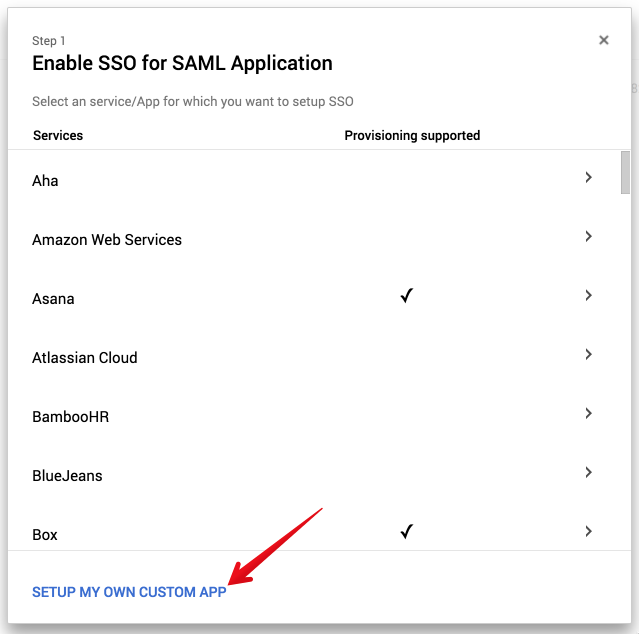
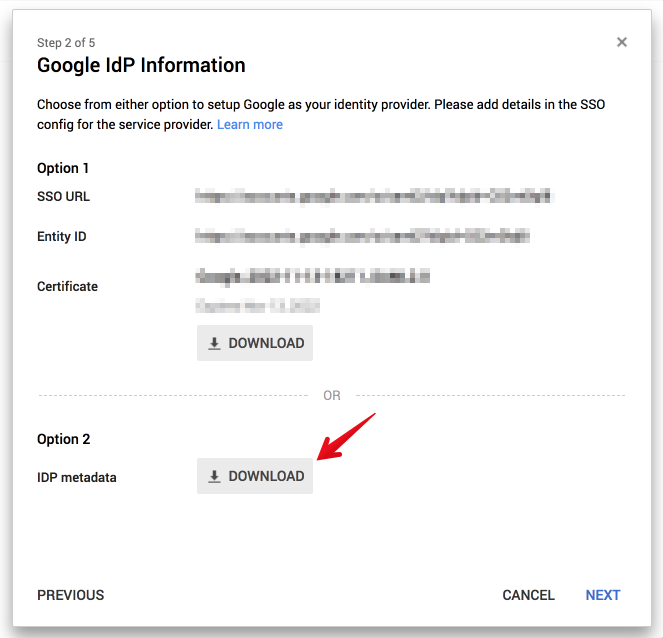
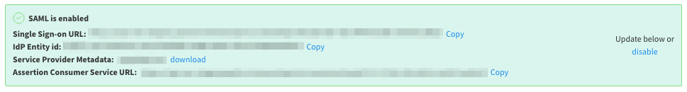
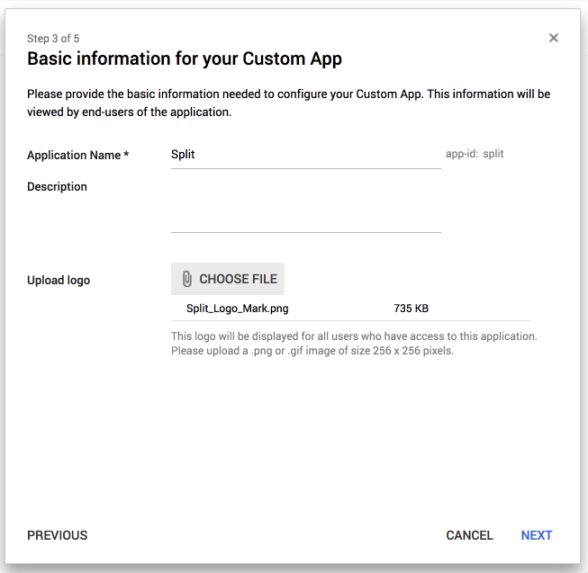
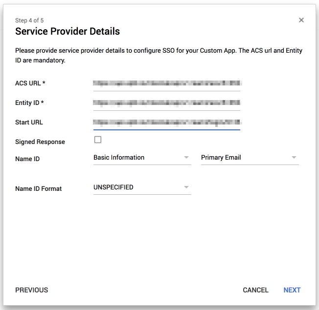

## Overview

With Split's SAML 2.0 API, you can use your managed Google account credentials to sign in to Split using your single sign-on (SSO) credentials. 

## Create an SSO application

1. Sign in to the **Google Admin console**.
1. From the console dashboard, go to **Apps** and then **SAML Apps**.
1. Click the **+** icon in the bottom corner.
1. Click **Setup my own custom app**.
   
   

1. Use **Option 2** to download the IdP metadata, and copy and paste for later use in Split.
   
   

1. Click **Next** and go to Split.

## Configure SAML

If you are a Split administrator, you can configure SAML in your Admin settings.

1. Go to **Admin Settings** > **Security** > **SAML**.
1. Add the **IdP metadata** copied from Google.
1. Enable/disable **SAML strict mode**.
1. Enable/disable **Just-in-time user provisioning**.
1. Click **Save**.

When you save these changes, you can view the summary of the SAML configuration parameters. You use this information when adding SAML settings in Google.

## Add SAML settings

1. Go to the Google Admin console.
1. Enter the **Application Name** and **Description**, add the Split logo, and then click **Next**.

   

1. Paste the **Assertion Consumer Service URL** from Split in the **ACS URL** and **Entity ID** fields.
1. Paste the **Single Sign-on URL** from Split in the **Start URL** field.
   
   

1. Click **Next** and then **Finish**. Remember to select **ON** for everyone.

Split is now linked with Google.