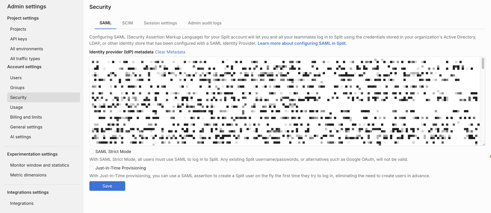
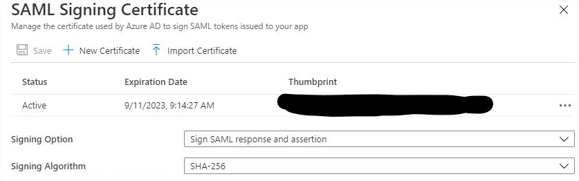

## Overview

Split implements single sign-on (SSO) using the SAML 2.0 protocol. Security assertion markup language (SAML) is an XML-based data format that makes it easier for your users to log in to their Split account using your organization's identity provider (IdP). With SAML, users can sign in to multiple software applications using the same login details.

Configuring SAML for your Split account lets you and your teammates log into Split using the credentials stored in your organization's active directory, LDAP, or other identity stores that are configured with a SAML IdP.

## Configure SAML

If you are a Split Administrator, configure SAML as follows:



1. From the left navigation, navigate to **Admin Settings**.
1. Click **Security** and then the **SAML** tab.
1. Add your IdP metadata to the text area.
1. Enable or disable [**SAML strict mode**](#about-saml-strict-mode).
1. Enable or disable [**Just-in-time provisioning**](#about-just-in-time-user-provisioning).
1. Click the **Save** button.

## Update SAML session settings

You can update your SAML session settings by doing the following:

1. Click the **Session settings** tab. The timeout value page opens.
1. Select a new timeout value and click **Update**.

### About SAML strict mode

If you enable SAML strict mode, all users must use SAML to log into Split. Any existing Split usernames and passwords, or alternatives such as Google OAuth, are not valid. 

As an alternative to Split’s shortcut in your company’s IdP, users may follow the **Single Sign-on URL** found on the **SAML** tab in the **Admin** panel.

Any user may still set up a password, either through **Personal Settings** or after creating an account through an invite link, but will get the following message when attempting to log into Split using username and password:


To test your SAML configuration before forcing all users in your organization to log in using your IdP, leave this disabled before rolling out the change to your organization. You can then enable it in the future.

You can enable or disable SAML strict mode at any time.

### About just-in-time user provisioning

Under most circumstances, users must be invited to Split, even for organizations where SAML is enabled. If a user has not been invited to Split using your organization's IdP, Split validates the SAML assertion, but the user is redirected to an error page because that user does not exist in Split.

To eliminate the need of creating and inviting users in advance, enable just-in-time provisioning. This provisioning uses a SAML assertion to create a Split user on the fly the first time a new user attempts to log in. New users can still be added through invites via the **Admin** panel, but in such cases, the user must first complete registration through the invite link before logging into Split through SSO.

Harness recommends not sending invites for users that have Split available through SSO when JIT is enabled, and especially if Strict mode is also enabled.

New users cannot sign in using Split's login screen until they access Split from your IdP.

## Invite users

### Both Strict Mode and JIT are not checked

* Invite users via the **Invite** tab under **Users** in **Admin Settings**. This will send an email to users with a link, which they can then follow to complete their registration.
* Since the user can establish login credentials with Split they will be able to create a password and log in either via username/password or SSO.

### Strict Mode only checked

* You will invite users via the Invite tab. Users will need to log in one time via username and password. 
* After that, users will need to log in via the SSO portal. 
  
  As an alternative, the user can connect using the **Single Sign-on URL** found on the **SAML** tab.  

### JIT only checked

* Add a user via the SSO portal.  You can add a user via an invite, in which case the first login must be through the invite. 
* If the user does not accept the invite when you subsequently try to add via the portal an error will be thrown and you’ll need to contact support. 
* If added through the portal, the first time they log in must be via the portal, which will create a user in Split and log them in. 
* Once logged in they can create a password in My Settings.  If added via an invite they will create a password when they respond to the invite. 
* They can log in either via SSO or username/password.

### Strict Mode and JIT checked

*  The best practice is to add via the portal. If added via the portal the first time they log in must be via the portal, which will create a user in Split and log them in. 
* You can add a user via an invite, in which case the first login must be through the invite.  That will be the only time they log in using username and password. 
* If the user does not accept the invite if you subsequently try to add via the portal an error will be thrown and you’ll need to contact support. 
* All subsequent logins must be via the portal or the Single Sign-on URL.  Or they can put in just their email address on the login page to get redirected and logged in via most SSO implementations.

### Using SCIM

* If SCIM is enabled to work with your SSO-strict mode account user provisioning to create, update, and deactivate members in Split is done directly via your IdP. 
* You must add new users in the IdP to give them access to Split. You can't invite new users using Split.
* Any existing open invites are revoked.
* User management actions such as deactivate and activate are disabled in Split. IdP administrators control user management.
* Groups that are synced from the selected IdP are uneditable in Split. If you want to change the members in a group, the administrators must push them over.

## Disable SAML

To disable your SAML settings, click **Disable** in the top right of the enabled banner.

:::tip
When you disable SAML, members need to sign in to Split with their username and password. If a user is provisioned with just-in-time provisioning, they can reset their password on the login screen to sign into Split.
:::

## Troubleshooting

### Invalid IdP metadata

When setting up your SSO integration, you may encounter the following error: `SAML not configured. Invalid IdP Metadata. Please update.`.

This error occurs when the IdP metadata is missing required information or is improperly formatted.

To resolve the issue:

1. Verify that your IdP metadata includes all of the following elements:

   * `EntityDescriptor`
   * `IDPSSODescriptor`
   * A signing key descriptor and certificate
   * A `SingleSignOnService` binding of type **HTTP-Redirect** (this is the only supported binding)

1. Update the metadata as needed and re-upload it.

A valid IdP metadata file should look similar to the example below:

```xml
<?xml version="1.0" encoding="UTF-8"?>
<md:EntityDescriptor xmlns:md="urn:oasis:names:tc:SAML:2.0:metadata" entityID="yourIdPEntityId">
<md:IDPSSODescriptor WantAuthnRequestsSigned="false" protocolSupportEnumeration="urn:oasis:names:tc:SAML:2.0:protocol">
<md:KeyDescriptor use="signing">
<ds:KeyInfo xmlns:ds="http://www.w3.org/2000/09/xmldsig#"><ds:X509Data>
<ds:X509Certificate>...</ds:X509Certificate>
</ds:X509Data></ds:KeyInfo>
</md:KeyDescriptor>
<md:NameIDFormat>urn:oasis:names:tc:SAML:1.1:nameid-format:emailAddress</md:NameIDFormat>
<md:SingleSignOnService Binding="urn:oasis:names:tc:SAML:2.0:bindings:HTTP-Redirect" Location="yourIdPSAMLredirectURL"/>
</md:IDPSSODescriptor>
</md:EntityDescriptor>
```

### Users fail to log in using SAML SSO (405, 403, or 475 errors)

After setting up Split SSO integration with a SAML provider (such as Okta, GSuite, etc.), some users may receive 405, 403, or 475 HTTP errors and be redirected back to the Split login page.

This issue can have several possible causes:

* The **ACS URL** field in the SAML provider setup page does not match the Entity ID field.
* For GSuite, the **Signed Response** box is checked.
* There are multiple certificates in the IdP metadata. Split’s SSO integration only supports a **single** certificate.
* Users are attempting to log in directly from the Split login page instead of using the SAML provider.
* A new user has an existing Split invite that conflicts with the Just-in-Time (JIT) provisioning feature.
* The SSO provider requires the SAML response to be signed, but this configuration option is not enabled for the Split app in the SSO server.

To resolve the issue:

1. Verify that the **ACS URL** is identical to the **Entity ID** field (for example, in the Okta SAML integration).
   
   

1. Make sure **Signed Response** is unchecked in GSuite.

   

1. Make sure to use only one certificate in GSuite for the IdP metadata.

1. Always use your SAML page to login to Split app, you can also use the login URL from the Administrator site, Security page

   

1. Go to the **Split Administrator** page, click on the **Users** tab, verify if the user show up under the `Pending` **Status** Column, if the record does exist, click **revoke invite** to delete the invitation.

   

1. Confirm with the SSO Admin if the SSO provider requires signing SAML Response, and make sure the option is enabled for Split app configuration in the SSO provider server.

   For Azure SSO, make sure to select **Sign** for both the **response** and the **assertion**:

   
