## Overview

Okta is a cloud-based identity management provider that you can integrate with Split’s SAML 2.0 API, allowing you to log in to Split using your single sign-on (SSO) credentials.

## Create an SSO application

1. Sign in to Okta.
1. Click **Admin** to go to the Admin panel.
1. Select the **Applications** sidebar menu item.
   
   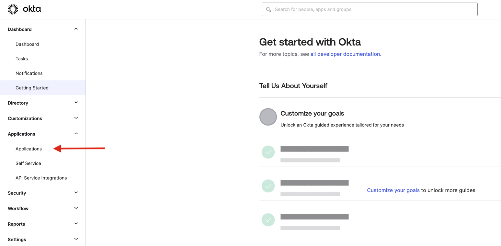

1. Click **Create App Integration**.
   
   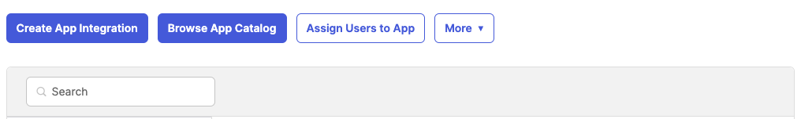

1. Select **SAML 2.0**, and then click **Next**.

   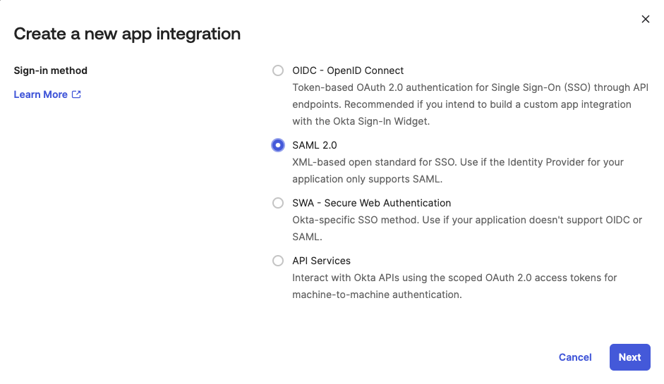

1. For the **App name** field, enter a name for your Split app and click **Next**.

   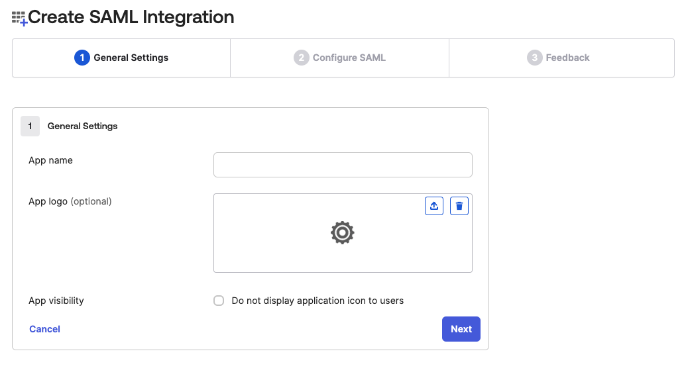

1. Create the app with a temporary **Single sign-on URL**. You will get the real URL later during the Split configuration, and come back to change it. 
   
   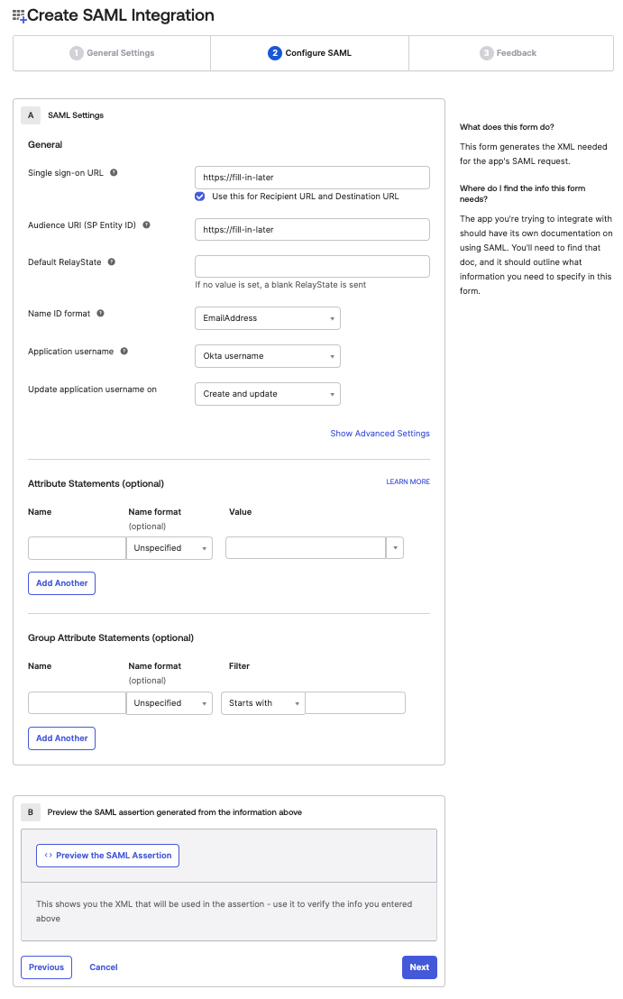

   Use the following settings:

   * Set a temporary **Audience URI** (SP Entity ID). You will also get the real value during the Split configuration and change it later.
   * Set the Name ID format as `EmailAddress`.
   * Leave the rest of the options as default and click **Next**.

1. Before finishing, select **I'm an Okta customer adding an internal app**.

   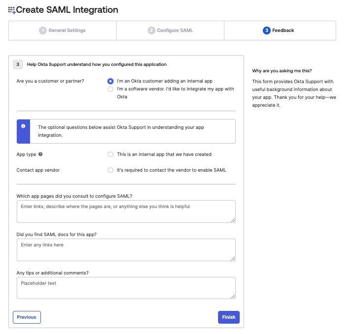

1. Click **Finish**.

1. SSO parameters are now available. Click **View Setup Instructions**.
   
   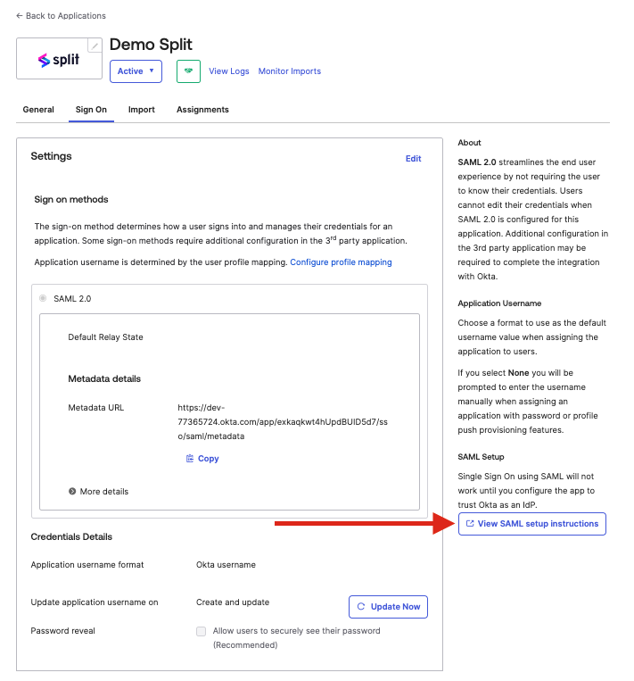

1. Copy the IDP metadata.
   
   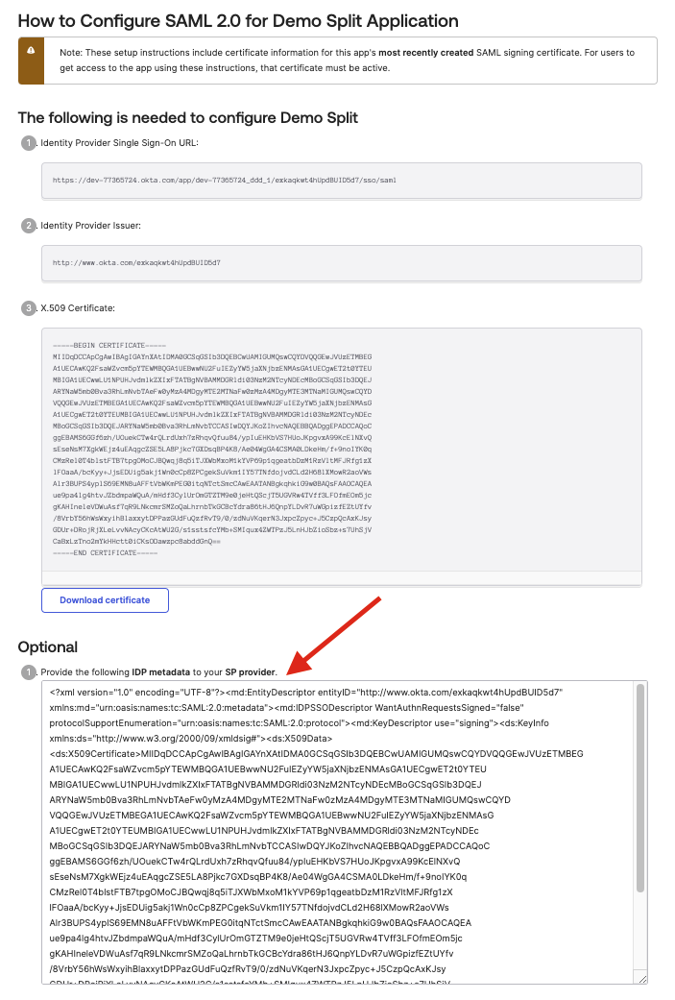

## Configure SAML

If you are a Split administrator, you can configure SAML in Admin Settings.

1. Go to **Admin Settings** > **Security** > **SAML**.
1. Add the IdP metadata copied from Okta.
1. Enable/disable **SAML strict mode**.
1. Enable/disable **Just-in-time user provisioning**.
1. Click **Save**.

When you save these changes, you can view the summary of the SAML configuration parameters. You use this information when adding SAML settings in Okta.

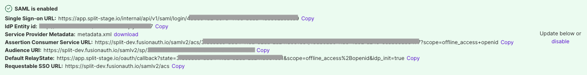

## Add SAML Settings

1. Go to the Okta Admin Panel.
1. Select the **General** tab.
1. Under **SAML Settings**, click **Edit**.

   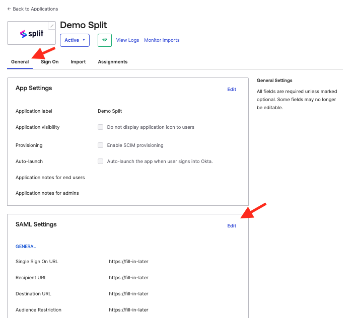

1. Click **Next**.
1. Change the **Single sign-on URL** to the Assertion Consumer Service URL provided in Split in the configuration parameters.
1. Change the **Audience URI** to the Audience URI provided in Split in the configuration parameters.
1. Change the **Default RelayState** to the Default RelayState provided in Split in the configuration parameters.
   
   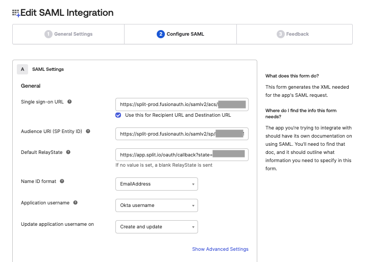

1. Click **Show Advanced Settings**.
1. Click **Add Another** under **Other Requestable SSO URLs** and set the **URL** to the **Requestable SSO URL** provided in Split in the configuration parameters. Set the **Index** value to 1.

   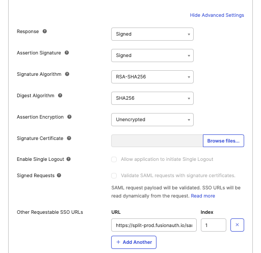

1. Click **Next** and then **Finish**.

Split is now linked with Okta.