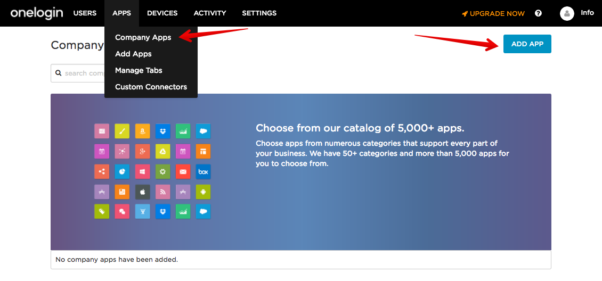
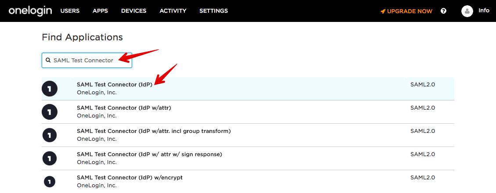
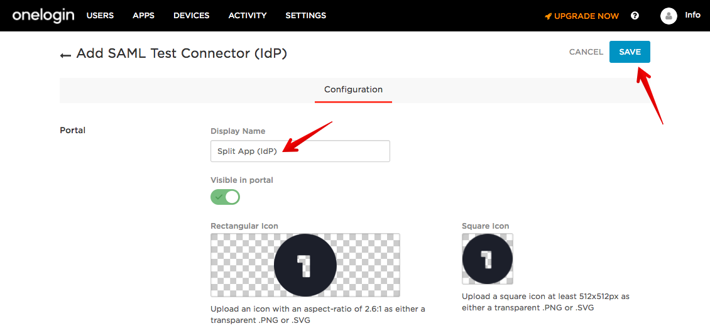
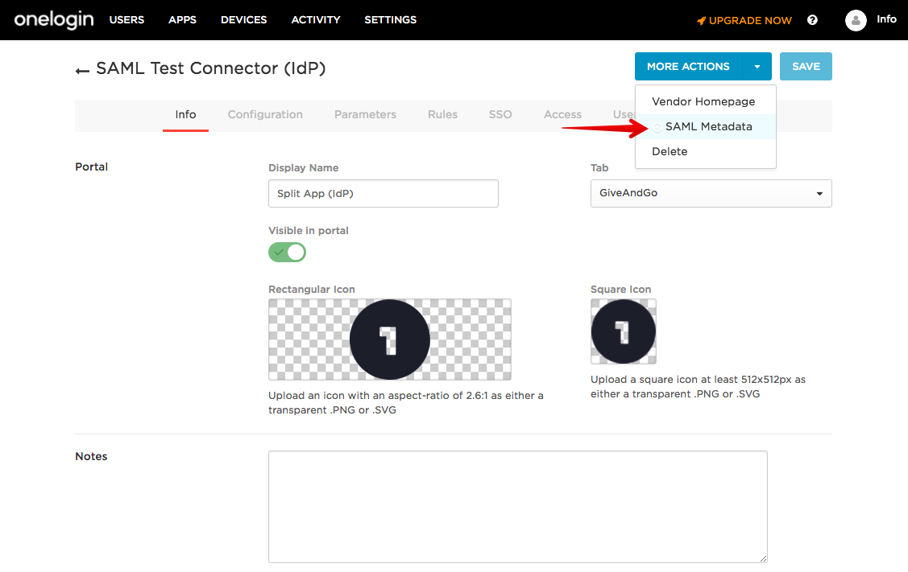
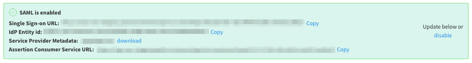
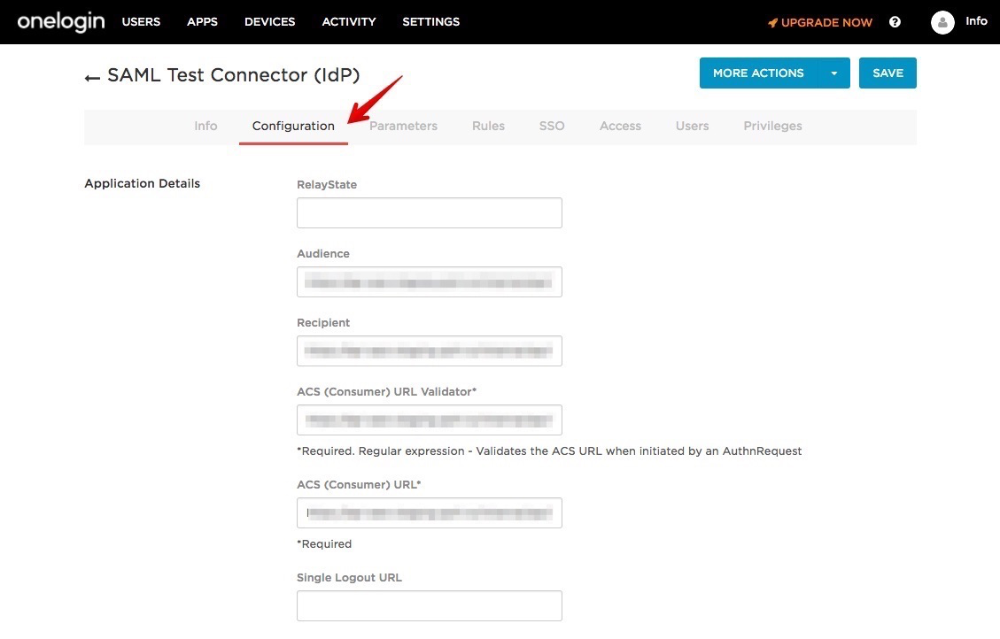

## Overview

OneLogin is a cloud-based identity management provider that you can integrate with Split’s SAML 2.0 API, allowing you to log in to Split using your single sign-on (SSO) credentials.

## Create an SSO application

1. Sign in to OneLogin.
1. Click **Apps** > **Company Apps** > **Add App**.

   

1. Search and select **SAML Test Connector (IdP)**.

   

1. Edit the **Display Name** and click **Save**.

   

1. In **More Actions**, select **SAML Metadata** to download the file to be used in Split.

   

## Configure SAML

If you are a Split administrator, you can configure SAML in Admin Settings.

1. Go to **Admin Settings** > **Security** > **SAML**.
1. Add the IdP metadata downloaded from OneLogin.
1. Enable/disable **SAML strict mode**.
1. Enable/disable **Just-in-time user provisioning**.
1. Click **Save**.

When you save these changes, you can view the summary of the SAML configuration parameters. You use this information when adding SAML settings in OneLogin.

## Add SAML settings

1. Go to the OneLogin app that you created.

1. Select the **Configuration** tab.

1. Populate the **Audience**, **Recipient**, **ACS URL Validator**, and **ACS URL** with the **Assertion Consumer Service URL** from above.

1. Click **Save**.

Split is now linked with OneLogin.