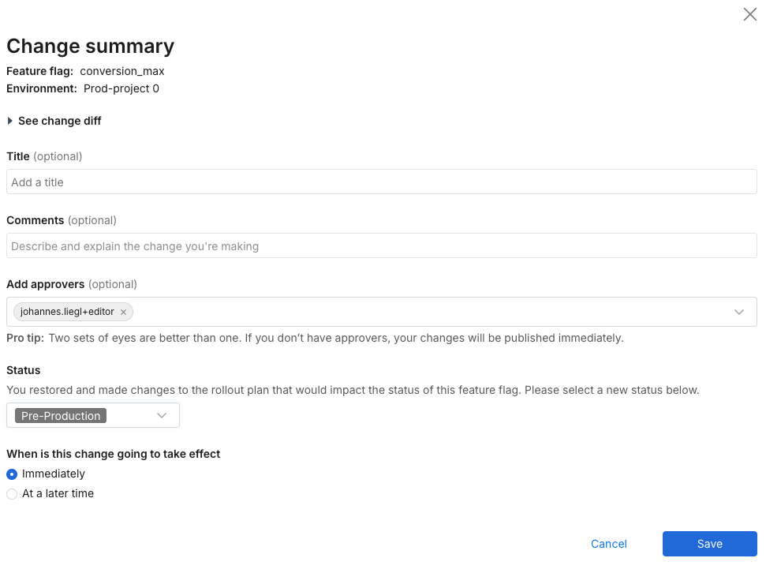
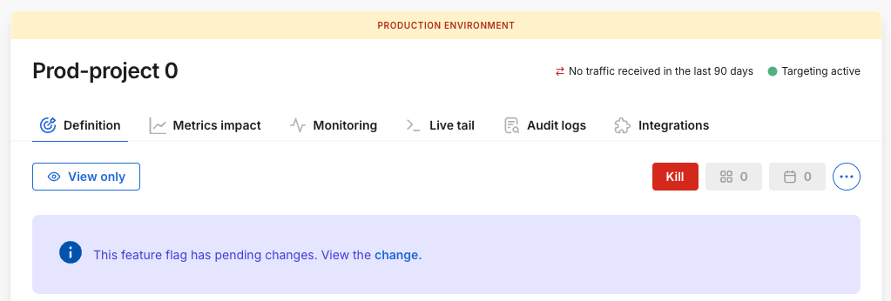
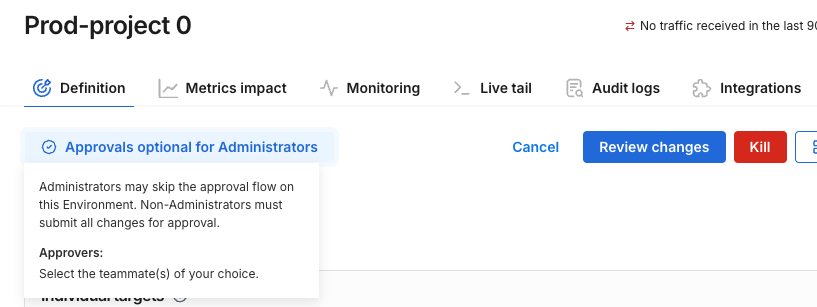
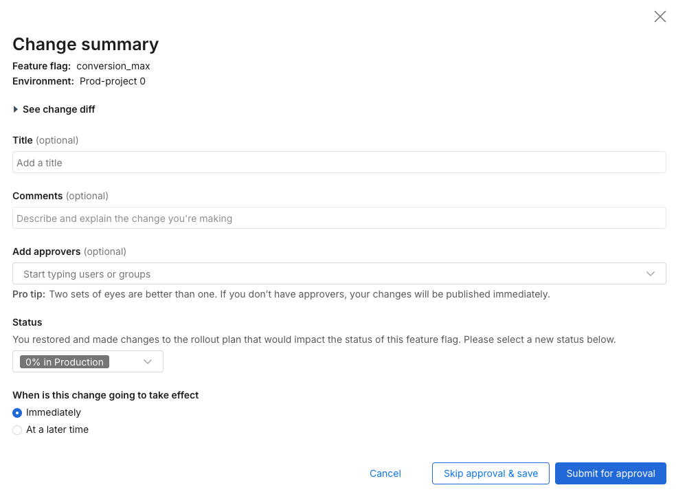
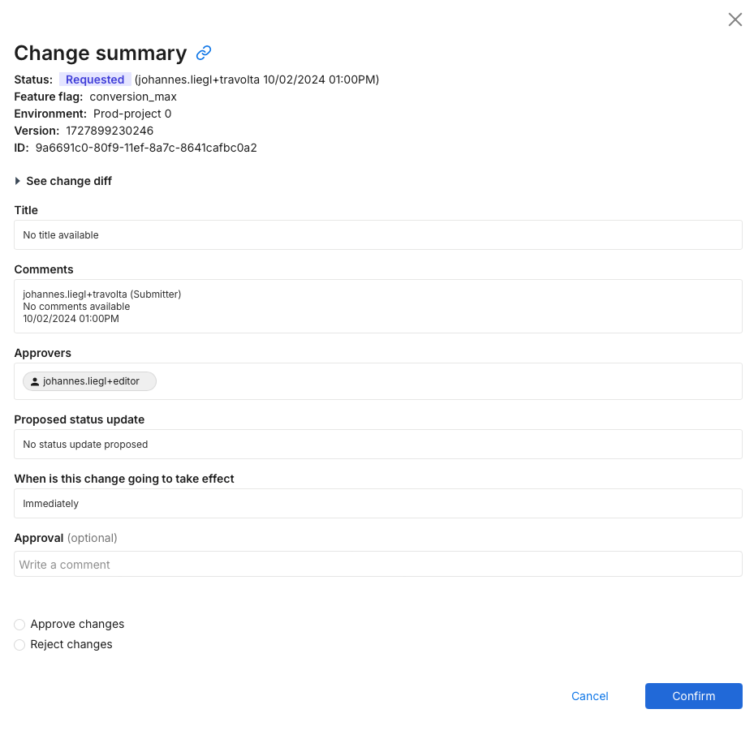
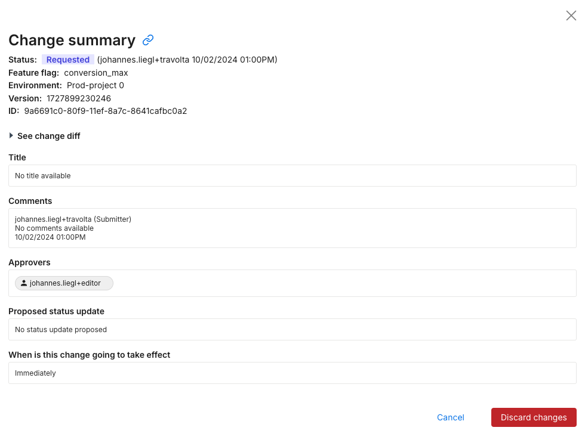

As an administrator, you can set up approval workflows in your environment. These workflows help you manage what changes users or groups are allowed to make on any given environment. These approvals apply to feature flags and segments. Editors on an environment can submit the change for approval to another teammate using Harness FME to ensure no mistakes were made in the release. For more information about setting up approval flows, refer to the [Permissions](/docs/feature-management-experimentation/management-and-administration/fme-settings/permissions) guide.

## Submitting for approval

As part of the review and [comment process](/docs/feature-management-experimentation/management-and-administration/account-settings/audit-logs) for your changes, you can select a set of teammates or [groups](/docs/feature-management-experimentation/management-and-administration/account-settings/groups) to review the change. Enter the name of the teammate or group into the search bar and select your desired approvers.

Once you submit a change for approval, the selected approvers receive an email notification letting them know their review is required. In addition, the object you submitted a change for is locked and no other changes are possible until your submission is withdrawn, approved, or rejected. The object displays a banner letting your teammates know that a pending change needs to be reviewed before more changes can be made.

## Skipping approval

If the environment is set to Allow Admins to Skip the Approval, the following message appears on the feature flag that indicates that the admin now has the option to skip approvals. This message is only available for Admins. For other users, the message Approvals required appears.

Additionally, you can also change permissions when you click the **Review changes** button on the Targeting rules page. This takes you to the Change summary page with the option to either click the **Skip Approvals & Save** link or go through the approval process similar to other users.

:::note
The Skip Approvals & save link only appears for admins.
:::

## Reviewing a request

As an approver, you can review the diff of the proposed change and then either approve or reject the change with a comment to let the submitter know why you made your decision to approve or reject. From the left navigation, go to My work to see a list of changes that are waiting for your approval.

## Withdrawing a request

As a submitter, if you make a mistake or no longer believe your change is relevant, you can withdraw the change and notify the approvers that their review is no longer needed. From the left navigation, select **My work** to see a list of changes that you submitted for approval. To withdraw a change, click the **View** link to review or withdraw your changes.

