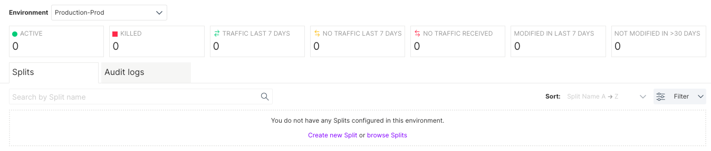
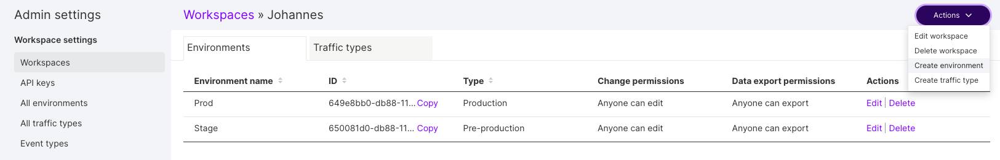

## Overview

Environments allow you to manage your feature flag throughout your development lifecycle, from local development to staging and production.

When you first create your account, your default project is provided with two environments which are named `Staging` and `Production` by default. Each environment is automatically set up with its own API keys. These API keys are used to connect the FME SDK to a specific environment.

Each feature flag that you create has its own set of targeting rules in each environment making it easy to define different targeting rules in your staging and production environments. This allows you to quickly change the targeting rules for a specific feature flag for quality testing on your staging environment with confidence that the feature flag is not enabled for users on your production environments.

## Manage environments

You can manage your environments for each project from your Admin settings. You can also add new environments or edit existing ones. Every project in Split has its own environments. Environments typically represent the SDLC, with one for each stage: Dev, Test, Staging, Production. There's usually no reason to have more than one Split environment per SDLC environment, other than if multiple projects use the same environments.

That said, there are cases where you might have multiple staging, dev or even production environments in Split. There are some best practice recommendations:

* Every feature flag should go through all your team's environments (dev, test, & production). Skipping directly to production can lead to bugs showing up directly in production that you might otherwise uncover earlier.

* It's common, and often critical, to have environment-level permission controls enabled for production environment(s). New, inexperienced teammates may accidentally edit a feature flag or make a rollout change they did not have the authority to make. For any pre-production environments, permission controls are not as important given the lack of customer impact and the robust auditing capability.

* For any pre-production environments, our guidance is to keep it simple - focus on simple on/off instead of creating complex targeting plans. For most companies, pre-production environments often have dummy data and just a few hundred customers, and is most often used for testing.

* You don't necessarily need to see metrics in pre-production environments - unless, for example, you're doing a performance test.

We're cognizant that many companies have their own unique requirements and Harness is always happy to help define an approach that will work best for you.

## Navigate environments

The Environments section provides you and your team insights into the feature flags configured in each environment. Teams can now easily toggle between any environment via the environments dropdown.

Navigate to the environments icon to quickly see the status of each feature flag in a given environment and a log of feature flag changes to quickly see any modifications made by your team. Summary statistics and sorting provide an easy starting point to find the feature flags you and your team are managing.

## Editing

When you first create your account, you are provided with two environments. To manage your environments, go to the **Projects** tab in your **Admin settings** page. Select the project that you want to edit environments for. You can: 

* Rename environments to match your deployment process as well update their permissions by clicking **Edit**.
* Add additional environments by clicking **Create environment**.

## Localhost

A developer can set up a feature flag on their development machine without the SDK requiring network connectivity. This is called the localhost environment. This environment does not show up in the user interface because, by definition, that requires network connectivity. To configure your SDK for this mode, refer to your language SDK guide.
