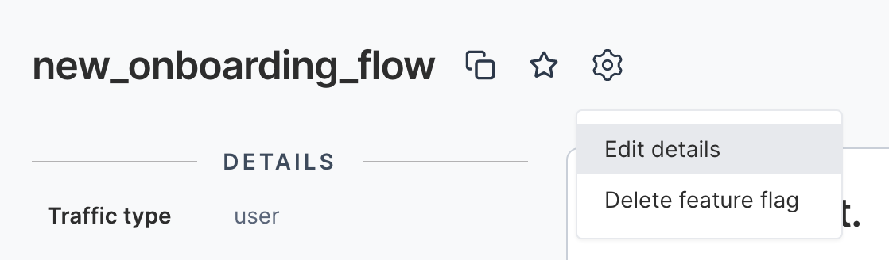
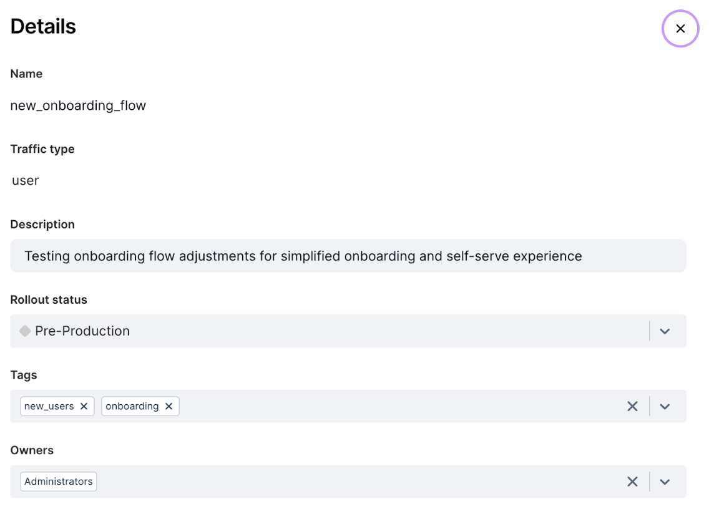
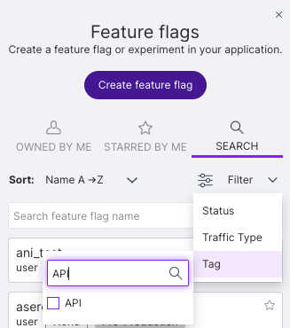

Use tags to organize and manage feature flags, segments, metrics, and experiments across the FME user interface. Tags can isolate a particular team or feature release, for example, _reporting team_, _front end_, or _geo search release_.

We recommend creating tags that are specific to your workflow. Here are some ideas to get you started: 

* **By team.** Identify the responsible team using tags such as _front end_, _infrastructure_, _web_, or _mobile_.
* **By feature release.** Identify all of the feature flags associated with a particular release using tags such as _reporting_, _new permissioning_, or _contact database migration_.
* **By feature flag type.** Identify all the feature flags associated with paywalls or those that are permanent versus temporary, using tags such as _paywall_, _permanent_, or _temporary_.
* **By experiment purpose or scope.** Identify all of the experiments associated with onboarding flows, checkout optimizations, or other test initiatives using tags such as _onboarding_, _checkout_, or _retention-test_.

:::info[note]
Be aware of the following:
* **Tag names of tags are case sensitive.**
* **Tags are shared across projects, so avoid giving them sensitive names you don't want all users in all projects to see.**
:::

## Adding tags
 
To tag feature flags, segments, metrics, or experiments: 

1. Select the item you want to tag. 
2. Click the Gear icon next to the feature flag title and select **Edit details**. The Details view appears.
   
   

3. In the Tags field, either click in the field to display a list of tags or start entering to select an existing tag from the menu list. You can also create a new tag.

   

4. Click the **Save** button.

## Removing tags

To remove a tag, do the following:

1. Select the item you want to remove the tag from.
2. Click the Gear icon next to the feature flag title and select **Edit details**. The Details view appears.
3. In the Tags field, either delete the selected tag or click the X to delete all tags at once.
4. Click the **Save** button.

## Filter by
 
Tags are most useful if they allow you to locate those items using a particular tag. When looking at lists in FME, whether of feature flags, segments, or metrics, you can use tags to filter the list to focus on just the items that have those tags.

1. Click **Filter** and hover over **Tag**. A list of tags appears.
2. Use the list to select as many tags as you want to filter by.

   

:::info
All tags are clickable within FME, making it easy to filter for the tag that you care about most. 
:::