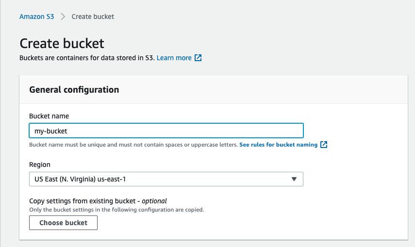
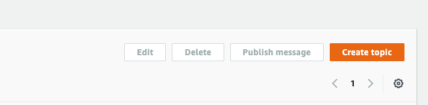
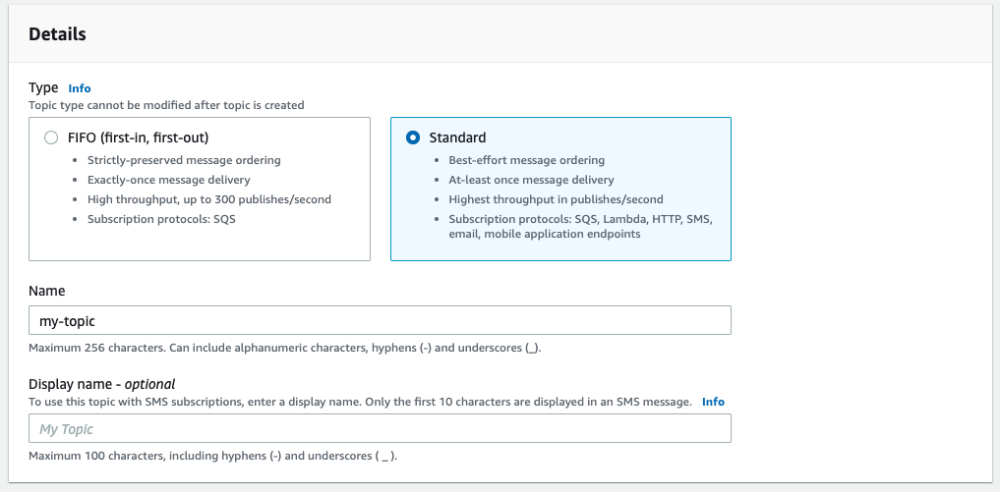
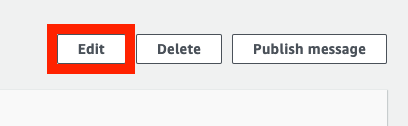
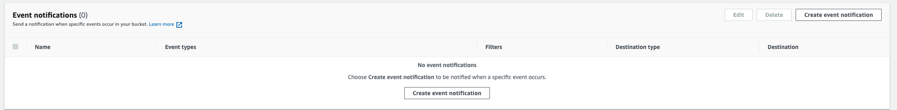
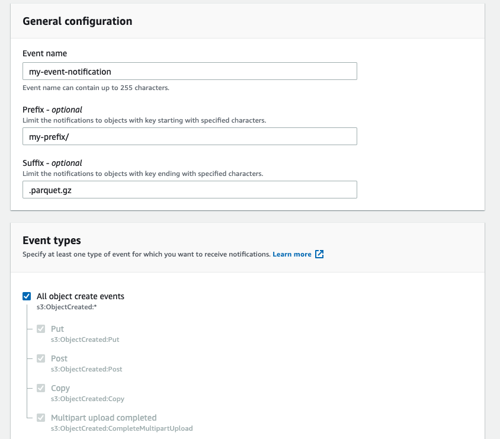
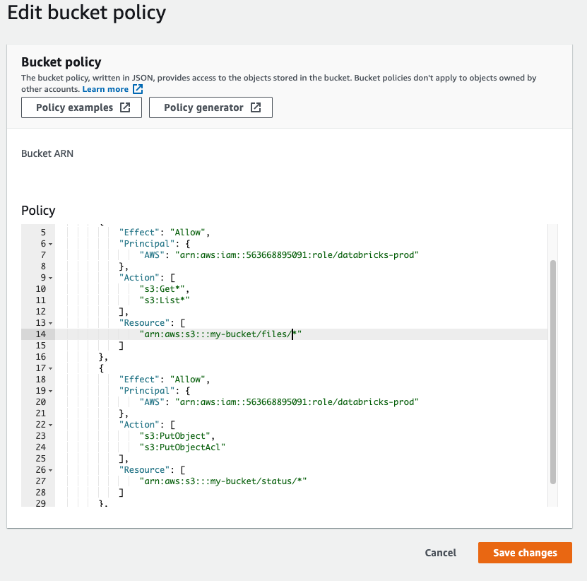
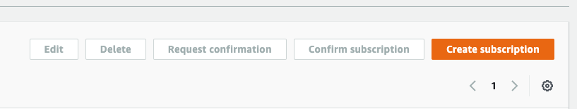
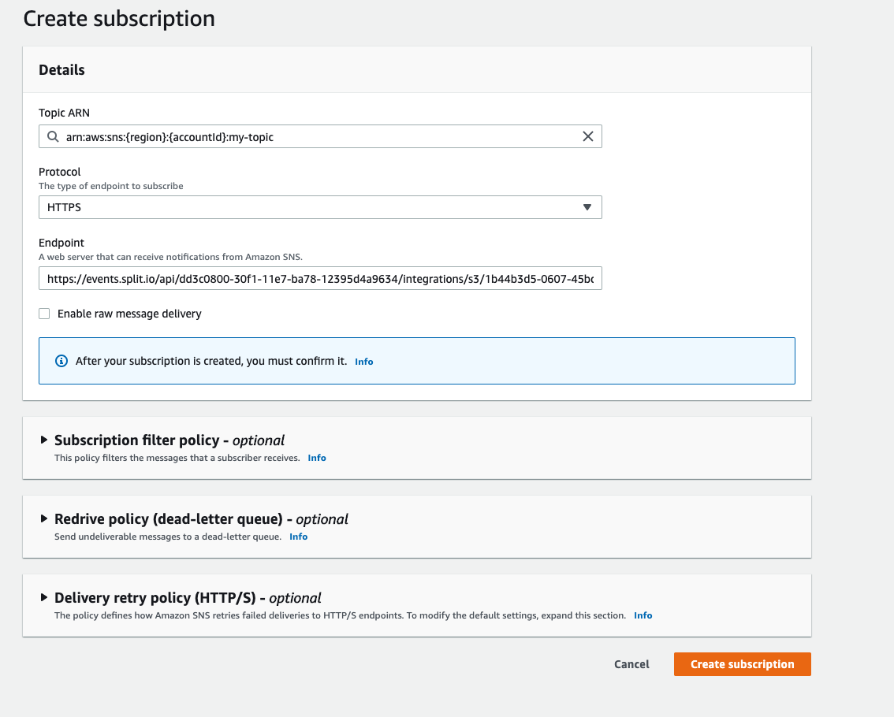
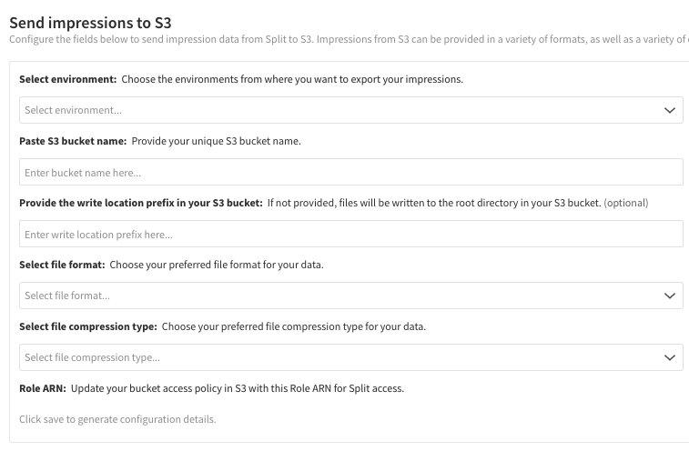

Amazon Simple Storage Service (Amazon S3) is an object storage service offered by Amazon as part of Amazon Web Services (AWS) that offers the ability to store and retrieve any amount of data, at any time, from anywhere on the web. With this integration, you can easily and reliably send high volumes of event data to Harness FME, as well as export your impression data.

## Send events to Harness FME

The following describes how to send events to Harness FME.

### Prepare your S3 bucket and event files

To connect your AWS S3 bucket to Harness FME, you need:

* An S3 bucket that contains files with supported file types and encodings, e.g. gzip, bzip2, snappy, or LZO compression. 
* An AWS account with the ability to grant Harness FME permission to read the folder with data in the bucket as well as read/put permission for the folder where the status is expected to be posted.

**File restrictions:**

* Compression examples: gzip, bzip2, snappy, or LZO compression.
* File format: *Parquet only*
* Schema:
  * environmentId: \[String\] Identifier for the environment in Harness FME
  * trafficTypeId: \[String\] Identifier for the traffic type in Harness FME
  * eventTypeId: \[String\] Name for the type of event
  * key: \[String\] Identifier for the "user" or "system" triggering or associated with the event
  * timestamp: \[Long\] The time when the event took place, in milliseconds past epoch
  * value: \[Double, Nullable\] A numeric value associated with this event
  * properties: \[Map\<String,String\>, Nullable\] Arbitrary properties data providing context to the event

To send the same event into multiple environments within Harness FME, duplicate the events with different environment IDs.

### Create Amazon S3 bucket

:::tip
Follow this step only if you do not already have an S3 bucket. If you already have one created, find your Bucket ARN and move to the next step.
:::

1. Sign in to the AWS Management Console and open the [Amazon S3 console](https://signin.aws.amazon.com/signin?redirect_uri=https%3A%2F%2Fconsole.aws.amazon.com%2Fs3%2F%3Fstate%3DhashArgs%2523%26isauthcode%3Dtrue&client_id=arn%3Aaws%3Aiam%3A%3A015428540659%3Auser%2Fs3&forceMobileApp=0&code_challenge=ncyvgDnr9uUmgDd1AlgF-WOMiiEb7H_FL1qzwp_CKi8&code_challenge_method=SHA-256).

2. Click **Create bucket**.
3. Create a unique bucket name. All other settings are optional.
4. Click **Save**. Note your Bucket ARN. 

   

### Create an SNS topic

1. Navigate to the Amazon SNS console and click **Create topic**.

   

2. Under Details, select **Type** and then **Standard**.
3. Create a **Name** for your SNS topic, e.g. "fme-events".

   

4. Click **Save**. Note the SNS Topic ARN.
5. Navigate to your SNS topic and click **Edit**.

   

6. Navigate to Access policy.
7. Edit the JSON snippet by adding the following snippet as a new statement. Do not replace the full snippet. Be sure to update the JSON snippet with your SNS Topic ARN, your AWS Account ID, and your Bucket ARN.

<ul>

```json
{
      "Sid": "S3 Events Notification",
      "Effect": "Allow",
      "Principal": {
        "Service": "s3.amazonaws.com"
      },
      "Action": "SNS:Publish",
      "Resource": "{YourSNSTopicARN}",
      "Condition": {
        "StringEquals": {
          "aws:SourceAccount": "{YourAwsAccountID}"
        },
        "ArnLike": {
          "aws:SourceArn": "{YourBucketArn}"
        }
     }
}
```

</ul>

8. Click **Save** to save your SNS topic.

### Configure S3 event notifications

1. In the Amazon S3 console, navigate to your S3 bucket.
2. Under Event notifications, click **Create event notification**.

   
  
3. Enter an **Event name**.
4. Under Suffix, add the suffix for your compression type, e.g. *.parquet.gz* or *.snappy.parquet*.
5. Optionally specify a Prefix like "_events/_".
6. Under Event types, select **All object create events**.

   

7. Under Destination > Destination, select **SNS topic**. Under Specify SNS topic, select **Choose from your SNS topics**. Find your SNS topic created in the previous section.
8. Optionally enter the SNS topic ARN if you cannot find your topic in the list.
9. Click **Save changes**.

   

### Configure integration in Harness FME (inbound)

1. Click the **profile button** at the bottom of the left navigation pane and click **Admin settings**.
2. Click **Integrations** and navigate to the Marketplace tab.
3. Click **Add** next to Amazon S3, and select a project. You can also click Warehouse under Categories to filter to Amazon S3.
4. Under Send events to Split, click **Add configuration**.
5. Under Select environment, select the Harness FME environments that receive S3 data.
6. Under Paste S3 bucket name, provide the name of your unique S3 bucket from above. (The directory will be created if it does not exist.)
7. Under Paste SNS topic ARN, provide the SNS topic ARN from above.
8. Under Paste status folder location, provide the file path for status files.

   

9. Click **Save**.
10. Navigate back to your Amazon S3 integration. Harness FME has generated the Notification endpoint URL and Role ARN fields.

### Update S3 bucket policy for Harness FME access (inbound)

1. In the Amazon S3 console, navigate to your S3 bucket.
2. Under Edit bucket policy, select **Bucket policy** and replace the JSON with the following snippet. Update the Role ARN with the value generated by Harness FME as well as your bucket name as appropriate.

<ul>

```JSON
    {
        "Version": "2012-10-17",
        "Statement": [
            {
                "Effect": "Allow",
                "Principal": {
                    "AWS": "{role-ARN}"
                },
                "Action": [
                    "s3:Get*",
                    "s3:List*"
                ],
                "Resource": [
                    "arn:aws:s3:::{bucketName}",
                    "arn:aws:s3:::{bucketName}/{filePrefix}/*"
                ]
            }, 
            {
                "Effect": "Allow",
                "Principal": {
                    "AWS": "{role-ARN}"
                },
                "Action": [
                    "s3:PutObject",
                    "s3:PutObjectAcl"
                ],
                "Resource": [
                    "arn:aws:s3:::{bucketName}/{statusPrefix}/*"
                ]
            } 
        ]
    }
 ```




</ul>

### Update SNS topic subscriptions

1. Navigate to the Amazon SNS console and find your SNS topic created above. Click **Create Subscription**.

   

2. Under Details, enter your Topic ARN.
3. Under Protocol, select **HTTPS**.
4. Under Endpoint, enter the Notification endpoint URL generated by Harness FME.
5. Click **Create subscription**. On the confirmation page, confirm that Check status is "confirmed” and Protocol is “https."

   

   

### About the status file

The status file path format is a consolidated file that includes information about all files with events that have been uploaded to Harness FME during its latest batch. The following sections explain the path format and contents.

#### Status file path format

Each s3 bucket and status folder prefix has a consolidated status file that includes all files with events that are uploaded to Harness FME during that latest batch. This means that if there are multiple different integrations set up, but the s3 bucket and status folder prefix are the same, the statuses of files uploaded for all integrations that have input from the same exact s3 bucket and status folder prefix are consolidated into one file per status report. This assumes that the files from different integrations are uploaded at nearly the same time (i.e., only minutes apart) and these integrations all share the same s3 bucket and status folder prefix.

The status files are saved to the following S3 key:

`yourS3bucket/statusfolderlocationprefix/UTCdatestring/UTCtimestring_report.status`

Expect the status files to display in the above location 15 minutes to an hour after customer creation time (i.e., when that object is first created in the S3 bucket that is linked to the active S3 Inbound integration).

| **Name** | **Description** | 
| --- | --- |
| S3 bucket name| Bucket used for the specific S3 inbound integration. Input by customer within the Harness FME S3 integration creation user interface.| 
| Status folder location prefix | Input by customer within the Harness FME S3 integration creation user interface.|
| UTC date string| When a particular status file is created. Use the following format: yyyy-MM-dd.| 
| UTC time string | Exact time that status file is created using the following format  (hours are shown using a 24 hour format): HH-mm-ss.SSS.UTC.| 

For example, if you have the following:

`s3://split_s3_inbound_integration/my_statuses/2022-01-03/12-34-20.345.UTC_report.status`

this is what each segment of the S3 key means:

* S3 bucket name: `split_s3_inbound_integration`
* status folder location: `my_statuses`
* status file is created on: `2022-01-03 (UTC)`
* status file is created at: `12-34-20.345 (UTC time)`

Be aware that Harness FME does not edit status files once they are generated and sent to your bucket. Subsequent status reports on files uploaded in the future are reported in newly generated files.

:::note 

* **It is possible that a single input file can have status entries spread across different ..._report.status files. The status of one input file must confined to one status file, but there are instances, e.g. larger input files where the status of one input file can be distributed across multiple status files.** 

* **Status files are generated only if there are new files that have been uploaded to the S3 input bucket or there are still individual records from input files that haven’t had their status reported.**
:::

#### Status file content

Each JSON status file has an outer level of keys which are fileNames as described below. The content of each status file holds only incremental information and doesn’t have information that was already presented in a previous status file. Harness FME aggregates our status information using the following on seven attributes. The corresponding value for each fileName key is a list of StatusEntry objects, which are in the following format:

```
fileName
{
"originalCreationTime”: 1642198960000,
"entryId": 3
"valid": true,
"numberOfRows": 100,
"errors": [],
"errorsDetails": [],
"warnings":[]
}
```

The following table describes each value:

| **Name** | **Type** | **Description** |
| --- | --- | --- |
| originalCreationTime | long | Timestamp in milliseconds of when this file was first uploaded. |
| entryID | int | An ID to help with identification and possible deduplication of entries. |
| valid | boolean | True indicates successful upload, false indicates unsuccessful upload.|
| numberOfRows | int | Number of rows that this entry corresponds to. |
| errors | Array\[String\] | An array of strings that explains all error codes applicable to this set of rows for a specific `fileName`. If empty, there were no errors. |
| errorDetails | Array\[String\] | An array of strings that gives more specific details on what triggered the error codes for the corresponding records. |
| warnings | Array\[String\] | An array of strings that explains all warning codes applicable to this set of rows for a specific `fileName`. If empty, there were no warnings.|

Every unique combination of the above constitutes an individual StatusEntry object in a resulting status JSON file. StatusEntry is an individual JSON object with the above listed seven key-value pairs. Be aware that we don’t record the number of rows in each original input file. If you want to write a script to ingest the status files and check if all rows of an input file are properly ingested by our integration, you must keep track of the original input file’s total number of rows and cross check against the values sent back within the status files.

:::info

  `originalCreationTime` and `entryId` are included for the following reasons:

  * We only guarantee at least once delivery of each StatusEntry. In rare cases, between status files sent one after the other, there could be some duplicate entries. Harness FME has added information to enable you to identify which ones are duplicates.

  * Every triplet of `fileName`, `originalCreationTime`, and `entryId` should be unique. If there are entries in status file 1 and status file 2 with duplicate triplets, then one of them is a duplicate status entry object. This is especially relevant if you have logic that ingests status files and sums the returned number of rows ingested or not ingested by filename.
:::

The following is an example of a labeled mock status file. Assume since the last status report file was written, we uploaded files named fileA and fileB:

```json
1{
2  "fileA": [
3    // Ex. assume fileA had a total of 100 + 798 + 798 + 10 rows attempted to be uploaded.
4    // (see the below individual corresponding "StatusEntry" dictionaries that show more detail.)
5    {
6      “originalCreationTime”: 1642198960000,
7      “entryId”: 3
8      "valid": true,
9      "numberOfRows": 100,
10      "errors": [],
11      "errorsDetails": [],
12      "warnings": ["WARNING_XYZ"], // 100 rows were successfully uploaded from `fileA` but with WARNING_XYZ.
13    },
14    {
15      “originalCreationTime”: 1642198960022,
16      “entryId”: 3
17      "valid": true,
18      "numberOfRows": 798, // means 798 rows were successfully uploaded from fileA with no warnings.
19      "errors": [],
20      "errorsDetails": [],
21      "warnings": []
22    },
23    {
24      “originalCreationTime”: 16421989600123,
25      “entryId”: 3
26      "valid": false,
27      "numberOfRows": 798, // 798 rows were not uploaded due to these rows triggering ERROR_CODE_1.
28      "errors": ["ERROR_CODE_1"],
29      "errorsDetails": ["message explaining what specifically triggered ERROR_CODE_1"],
30      "warnings": []
31    },
32    {
33      “originalCreationTime”: 1642198960000,
34      “entryId”: 3
35      "valid": false,
36      "numberOfRows": 10,
37      "errors": ["ERROR_CODE_1", "ERROR_CODE_2"], // 10 rows were not uploaded because these 10 rows triggered both ERROR_CODE_1 and ERROR_CODE_2.
38      "errorsDetails": ["message explaining what specifically triggered ERROR_CODE_1",
39                        "message explaining what specifically triggered ERROR_CODE_2"],
40      "warnings": []
41    },
42  ],
43  "fileB": [
44    {
45      “originalCreationTime”: 1642198960222,
46      “entryId”: 3
47      "valid": true,
48      "numberOfRows": 110, // 110 rows were successfully uploaded for fileB with no warnings.
49      "errors": [],
50      "errorsDetails": [],
51      "warnings": []
52    }
53  ],
54  "fileC": [
55    {
56      “originalCreationTime”: 1642198960222,
57      “entryId”: 3
58      "valid": true,
59      "numberOfRows": 1, // We don’t record the number of rows in files with invalid schemas. The value under numberOfRows can be ignored for StatusEntry objects with INVALID_SCHEMA error codes.
60      "errors": [INVALID_SCHEMA],
61      "errorsDetails": ["message explaining what specifically triggered INVALID_SCHEMA error"]
62      "warnings": []
63    }
64  ]
65}
```

:::info[Note]
The `INVALID_SCHEMA` StatusEntry example for fileC doesn’t mean that this file only had one row in it. We don't record the number of rows in files with invalid schemas. The value under numberOfRows can be ignored for StatusEntry objects with `INVALID_SCHEMA` error codes.
:::

### About warning codes

Initially, some of our warning codes gave you an idea of why a file might have had only a partial number of rows from one file uploaded. We now give higher granularity status reports so the codes that were previously warnings now display as errors.

### About error codes

Any rows with an error code associated with are not uploaded into our final database and not considered during any metrics analysis or data export reports. The following table explains the error codes:

| **Error code** | **Description** | 
| --- | --- |
| INVALID_ENVIRONMENT_ID| Event has an environmentId that is not found under the current integration.| 
| REQUIRED_FIELDS_NULL | Required fields for an event that should be non-null are null.|
| INTEGRATION_CONFIG_NOT_FOUND| Integration configuration not found in the database. Possible causes are: <br /> * An integration could have been deleted by another user. <br /> * There is an error internal to Harness FME. | 
| INVALID_SCHEMA | Input file schema is incorrect. Possible causes are: <br /> * The required field not found in input filed. <br /> * Field within input file is incorrect data type. <br /> **Note: The schema validation checks are now more restrictive. Previously, there were scenarios where customers could upload files where a field was an int type but our spec calls for a double. To improve performance and reliability, we expect the types to be exact and will not do these type of conversions, and will instead not upload those rows and return this error code for the affected file.**|
| INVALID_TIMESTAMP | Input timestamp in the uploaded event are not in milliseconds. |

### Additional status file information

This information discusses additional considerations related to Harness FME generated status files.

**When you have multiple S3 Inbound integrations and the statuses are mixed together.** With the migration to v2, if the multiple S3 integrations use the same s3 bucket and status folder location, the status entries for each individual S3 inbound integrations that share those two properties now have their statuses consolidated into one file. If you want separate status reports for separate integrations - you will need to go to the Harness FME user interface S3 Integrations page, and change either the S3 bucket of that integration or if you want to use the same bucket, then change the status folder location of that integration. Either, or both of these actions results in integrations having completely independent status report files.

**A large range of when to expect status on any given file.** In most cases, status reports on any particular file should return to the customer within 15 minutes. However, if you upload pattern results in uploading many large files all at once, this causes an expected delay for a status on an input file to increase.

## Send Harness FME impressions to S3

The following describes how to send Harness FME impressions to S3. Impressions are sent in batches every 30 minutes.

### Prepare your S3 bucket

To connect your AWS S3 bucket to Harness FME, you need:

* An S3 bucket destination already created.
* An AWS account with the ability to grant Harness FME permission to read, put, and remove data in the bucket. **Note: We only remove transactional files created during the transfer.**

**File restrictions**:

* Compression examples: gzip, bzip2, snappy, or LZO
* File format: *Parquet only*
* Schema: 
  
  * key: [String] Identifier for the user or system triggering or associated with the impression
  * label: [String] Label associated with the impression
  * treatment: [String] The treatment shown for this impression
  * splitName: [String] Name of the feature flag
  * splitVersion: [Long] Version of the feature flag
  * properties: [String] Arbitrary properties data providing context to the impression
  * environmentId: [String] Identifier for the environment in Harness FME
  * trafficTypeId: [String] Identifier for the traffic type in Harness FME
  * sdk: [String] Name of the SDK sending the impression
  * sdkVersion: [String] Version of the SDK
  * machineName: [String, Nullable] Name of the machine sending the impression
  * machineIp: [String, Nullable] IP of the machine sending the impression
  * timestamp: [Long] The time when the impression occurred, in milliseconds past epoch
  * receptionTimestamp: [Long] Timestamp when the impression was received by Harness FME

### Configure integration in Harness FME (outbound)

1. Click the **profile button** at the bottom of the left navigation pane and click **Admin settings**.
2. Click **Integrations** and navigate to the Marketplace tab.
3. Click **Add** next to Amazon S3, and select a project. You can also click Warehouse under Categories to filter to Amazon S3.
4. Under Send impressions to S3, click **Add configuration**.
5. Under Select environment, select the Harness FME environments that receive S3 data.
6. Under Paste S3 bucket name, enter the name of your unique S3 bucket name.

   

7. Under Provide the write location in your S3 bucket, optionally put the S3 prefix you’d like the impressions files to be saved to. If no value is provided, files are saved to the root directory of your provided S3 bucket. 
8. Under Select file format, select the desired format for your impressions files.
9. Under Select file compression type, select the desired file compression format for your impression files.
 
   :::info[Note]
   The list only displays compression methods that are compatible with your chosen file format.
   :::

10. Click **Save**. Note your role ARN generated by Harness FME.

### Update S3 bucket policy for Harness FME access (outbound)

1. In the [Amazon S3 console](https://signin.aws.amazon.com/signin?redirect_uri=https://console.aws.amazon.com/s3/?state=hashArgs%2523&isauthcode=true&client_id=arn:aws:iam::015428540659:user/s3&forceMobileApp=0&code_challenge=ncyvgDnr9uUmgDd1AlgF-WOMiiEb7H_FL1qzwp_CKi8&code_challenge_method=SHA-256), navigate to your S3 bucket.
2. Under Permissions, select **Edit bucket policy** and then **Bucket policy**.
3. Replace the JSON with the snippet below. Be sure to replace the following parameters in the snippet:
    * *\{role-ARN-to-be-provided-to-you-by-FME\}* with the _Role ARN_ generated by Harness FME above.
    * *\{bucketName\}* with your S3 bucket name.
    * *\{writeLocationPrefix\}* with the write location prefix as appropriate. If you left the write location section blank in the Harness FME configuration step, and intend to write to the root directory, you must update the following line:
       * _“Resource": "arn:aws:s3:\:\:\{bucketName\}/\{writeLocationPrefix\}/*" > "Resource": "arn:aws:s3:\:\:\{bucketName\}/*”._
4. Optionally, if you later update the integration to include a write location prefix, or change the write location in any way, we recommend changing the policy to the more restricted line provided below to include the *\{writeLocationPrefix__\}/* *:

 ``` json
 {
   "Version": "2012-10-17",
   "Statement": [
       {
           "Effect": "Allow",
           "Principal": {
               "AWS": "{role-ARN-to-be-provided-to-you-by-FME}"
           },
           "Action": "s3:ListBucket",
           "Resource": "arn:aws:s3:::{bucketName}"
        },
        {
           "Effect": "Allow",
           "Principal": {
               "AWS": "{role-ARN-to-be-provided-to-you-by-FME}"
           },
           "Action": [
               "s3:GetObject",
               "s3:PutObject",
               "s3:PutObjectAcl",
               "s3:DeleteObject"
           ],
           "Resource": "arn:aws:s3:::{bucketName}/{writeLocationPrefix}/*"
       }
   ]
}
```

### SSE_KMS support

If your S3 bucket is encrypted using an AWS KMS key (SSE-KMS), optionally update the policy to allow Harness FME's AWS ARN to encrypt data using the KMS key you have chosen. 

:::tip
If your S3 bucket is using an Amazon S3 key for encryption (SSE-S3), then the following is not necessary.
:::

1. In the [Amazon S3 console](https://signin.aws.amazon.com/signin?redirect_uri=https://console.aws.amazon.com/s3/?state=hashArgs%2523&isauthcode=true&client_id=arn:aws:iam::015428540659:user/s3&forceMobileApp=0&code_challenge=ncyvgDnr9uUmgDd1AlgF-WOMiiEb7H_FL1qzwp_CKi8&code_challenge_method=SHA-256)​, navigate to the Key Management Service (KMS) dashboard.
2. Navigate to the KMS key being used for your encrypted S3 bucket.
3. Navigate to the KMS key policy and make sure the following actions are included in your existing key policy:

<ul>

```json
{
   "Version": "2012-10-17",
   "Id": "cross-account-policy",
   "Statement": [
       {
           "Sid": "KMSOwner",
           "Effect": "Allow",
           "Principal": {
               "AWS": "arn:aws:iam::{your-aws-account-id}:root"
           },
           "Action": "kms:*",
           "Resource": "*"
       },
       {
           "Sid": "KMSCrossAccount",
           "Effect": "Allow",
           "Principal": {
               "AWS": "{role-ARN-to-be-provided-to-you-by-FME}"
           },
           "Action": [
               "kms:DescribeKey",
              "kms:GenerateDataKey",
   "kms:Decrypt"
           ],
           "Resource": "*"
      }
    ]
}
```

</ul>