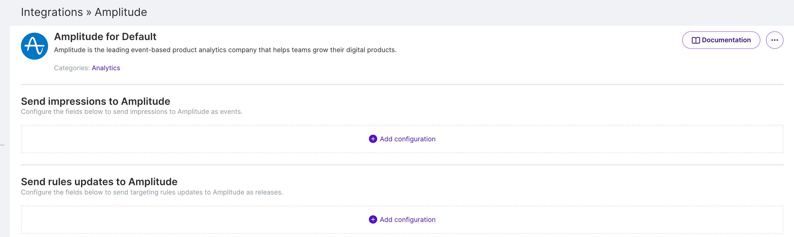

Amplitude is a product intelligence platform that helps teams convert, engage, and retain customers. Harness FME provides multiple integration options to send impression data from the FME as a data source to Amplitude, export Amplitude cohorts to be used in FME for targeting, or extract Amplitude events to be used as events in FME.

## Sending Harness FME impressions to Amplitude (Recommended)

This integration will send impressions to Amplitude as events, mapped according to the configuration settings. It gives you the ability to connect Harness FME to Amplitude and easily run deeper analysis on A/B and beta tests.

Each call to **getTreatment** in an FME SDK is passed to Amplitude as a separate event.

### In Amplitude

Within your Amplitude account, set up Harness FME as a data source. Copy your Amplitude project's API Key to be used in FME.

### In Harness FME

1. Click the **profile button** at the bottom of the left navigation pane and click **Admin settings**.
2. Click **Integrations** and navigate to the Marketplace tab.
3. Find Amplitude in the integrations list, click **Add** and select the project for which you would like to configure the integration.

    

4. Select the environment from where you want data sent and then select how you want to map Harness FME traffic types to Amplitude identities. You can select either:
    * user_id
    * device_id 
5. FME impressions are shown as ‘get_treatment’ events in Amplitude by default. You can customize this event name, with a maximum of 1,024 characters.
6. Paste the API key and secret from your Amplitude account, copied above, and click **Save**.
7. Select your Amplitude region. The default region is Standard.
8. Once you save the configuration, send a test event from Harness FME into Amplitude.

You can repeat this process depending on how many environments and traffic types you want to configure.

## Sending Harness FME impressions to Amplitude (Alternative)

There are some situations where the recommended approach to send FME impressions to Amplitude is not preferred. One example is when the same impression is expected to be sent frequently. Amplitude bills by event volume so each impression counts against your organization's event quota.

Using Amplitude’s Identify API, you can leverage a **User Property** in Amplitude to store which FME feature flag treatments a user receives. If you have already instrumented your application with Amplitude, this approach should be seamless to configure, and the user properties can then be used in Amplitude for further analysis. This integration does not send events to Amplitude. This use case is discussed further in [Amplitude's documentation](https://help.amplitude.com/hc/en-us/articles/115001580108-Analyze-A-B-test-results-in-Amplitude) under **2) Identify API**. As Amplitude notes, be cautious that:

*The user property will not take effect until the user takes an action.*

### How to implement

If you have an existing Amplitude integration with Harness FME, you will need to disable and remove the packaged Harness FME to Amplitude integration from the Harness FME Admin panel by selecting **Uninstall** from the dropdown menu at the top right.


#### Step 1: Rationalize the Harness FME traffic type with the Amplitude id

If you are using an id in Amplitude other than that of a known user, you should not call the identity API to set a user_id with that id. The device_id may be an appropriate alternative in that scenario. If using the SDK, this may be already handled, but it is important to keep in mind which Amplitude id you are using and to which traffic type it maps to in Harness FME.

#### Step 2: Update your code to use the Amplitude Identify API

You have several options to do this. There are interfaces to the identify API in all of the Amplitude SDKs. For example, see [Amplitude's documentation](https://www.docs.developers.amplitude.com/data/sdks/javascript/#set-a-user-property) for the JavaScript SDK.

Below are three examples of using the [HTTP API](https://www.docs.developers.amplitude.com/analytics/apis/identify-api/#keys-for-the-event-argument) to do this. This can be called from any language, frontend or backend.

1. This can be set up as an [impression listener](/docs/feature-management-experimentation/sdks-and-infrastructure/optional-infra/split-evaluator#impression-listener) that accepts the Amplitude API Key, the user ID, the FME feature flag name, and the treatment value. Other than the Amplitude API Key, these are all accessible as properties of the data object passed into the impression listener. `data.impression.keyName` is the name of the user ID being evaluated in the getTreatment call. `data.impression.feature` is the name of the feature flag, which will be used as the property. `data.impression.treatment` is the name of the treatment received. You will want to use an appropriate and easy to understand naming convention for the property, such as keeping the name being identical to the FME feature flag name. If there are only a subset of FME feature flags that you would like to attach as user properties, this could be run outside of the impression listener only for the FME feature flag treatments received.

<ul>

```javascript
function amplitudeIdentify(amplitudeApiKey, userId, splitName, treatment) {
    var myHeaders = new Headers();

    myHeaders.append("Content-Type", "application/x-www-form-urlencoded");

    var urlencoded = new URLSearchParams();

    urlencoded.append("api_key", amplitudeApiKey);
    urlencoded.append("identification", `[{"user_id":"${userId}", "user_properties":{"${splitName}":"${treatment}"}}]`);

    var requestOptions = {
        method: 'POST',
        headers: myHeaders,
        body: urlencoded,
        redirect: 'follow'
    };
    
    fetch("https://api.amplitude.com/identify", requestOptions)
        .then(response => response.text())
        .then(result => console.log(result))
        .catch(error => console.log('error', error));
}
```

</ul>

2. Running as an impression listener should only be used for calling the identify API with additional properties that are available from the frontend that you need. The next option we will go over is a more robust approach. The code below outlines the creation of a service that can utilize Harness FME's [impressions webhook](https://help.split.io/hc/en-us/articles/360020700232-Webhook-impressions) using a Node.js script.

   The piece of Node.js code below requires the express and axios libraries.

<ul>

```javascript
const express = require("express");
const app = express();
const port = 3000;

var axios = require("axios");
var qs = require("qs");

const AMPLITUDE_API_KEY = "API_KEY";

app.get("/", (req, res) => {
    res.send("Hello World!");
});

app.use(express.json());

app.use(express.urlencoded({
    extended: true
}));

app.post("/", (req, res) => {
    console.log(JSON.stringify(req.body))

    let impressions = req.body;
    impressions.forEach(function(value, index, array) {
        var data = qs.stringify({
            api_key: AMPLITUDE_API_KEY,
            identification:
                `[{"user_id":"${value.key}", "user_properties":{"${value.split}":"${value.treatment}"}}]`,
        });
        var config = {
            method: "post",
            url: "https://api.amplitude.com/identify",
            headers: {
                "Content-Type": "application/x-www-form-urlencoded",
            },
            data: data,
        };
        axios(config)
            .then(function(response) {
                console.log(JSON.stringify(response.data));
                res.send(JSON.stringify(response.data));
            })
            .catch(function(error) {
                console.log(error);
                res.send('error: ' + error)
            });
    });
});

// Server listening to port 3000

app.listen(port, () => {
    console.log(`Example app listening on port ${port}`);
});
```

</ul>

3. You could also implement this using a serverless function, such as AWS Lambda. This code below can be used as an AWS lambda function. Note that Lambdas are limited to running 15 minutes. Harness FME webhooks run every 10 seconds. Each call of the Identify API takes around 250ms to run when the Lambda is warm. That means that if you have more than ~20,000 FME feature flags evaluated per minute during bursts, the Lambda may time out. Other more sophisticated approaches like queuing using SQS, or falling back to running your own service like the Node.js code above, may be more appropriate.

<ul>

```javascript
var axios = require("axios");
var qs = require("qs");

const AMPLITUDE_API_KEY = "API_KEY";

async function sendIdentify(value) {
    var data = qs.stringify({
        api_key: AMPLITUDE_API_KEY,
        identification: `[{"user_id":"${value.key}", "user_properties":{"${value.split}":"${value.treatment}"}, "country":"United States"}]`,
    });
    var config = {
        method: "post",
        url: "https://api.amplitude.com/identify",
        headers: {
            "Content-Type": "application/x-www-form-urlencoded",
        },
        data: data,
    };
    return axios(config)
        .then(function(response) {
            return 200;
        })
        .catch(function(error) {
            return error;
        });
}

exports.handler = async (impressions) => {
    let errors = "An Internal Server Error occurred for: ";
    let hasErrored = false;
    for (let i = 0; i < impressions.length; i += 1) {
        let response = await sendIdentify(impressions[i]);
        if (response != 500) {
            hasErrored = true;
            errors += ` Key: ${impressions[i].key}, Split: ${impressions[i].split} - ${response} ;`;
        }
    }

    if (hasErrored) {
        return {
            body: errors,
            statusCode: 500,
        };
    } else {
        return {
            body: "success!",
            statusCode: 200,
        };
    }
};
```

</ul>

User properties will show up on the User Look-up screen to be used for further analysis and processing in Amplitude. You do not need to pass all of the properties at once. In the examples above, each FME feature flag sends a single property as individual Identify calls, but all properties sent to Amplitude will be associated with the user.

## Exporting Amplitude cohorts for FME feature flag targeting

With Amplitude’s Harness FME integration, you can export your Amplitude cohorts and use them for targeting in FME. For more information, refer to [Amplitude's documentation](https://www.docs.developers.amplitude.com/data/destinations/split-cohort/).

## Sending Amplitude events to Harness FME

:::info[Note]
This is a third-party integration that has been tested by the Harness FME team. Harness does not own or maintain this integration. For more information, contact the [contributor](https://github.com/dbmartin00).
:::

This integration extracts events from Amplitude via the API, transforms them to the Harness FME event format, and then sends these events to Harness FME via the API. Refer to the [Github repository](https://github.com/dbmartin00/amplitude2split) for instructions on how to install this integration.