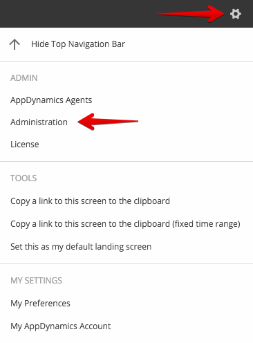
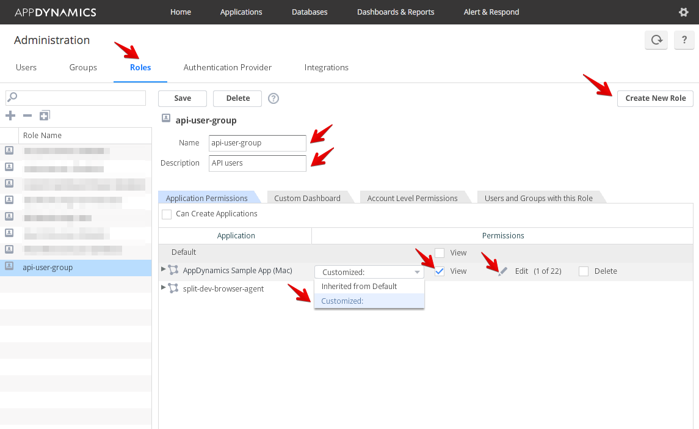
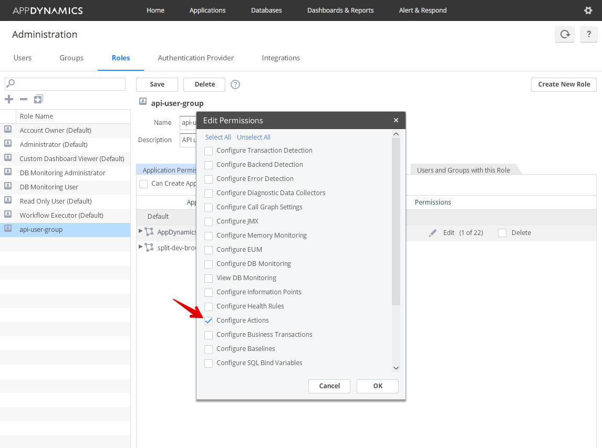
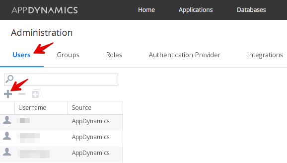
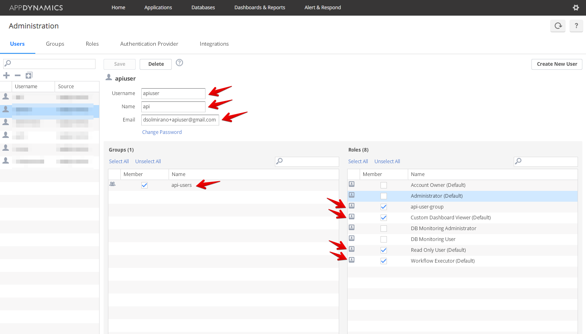
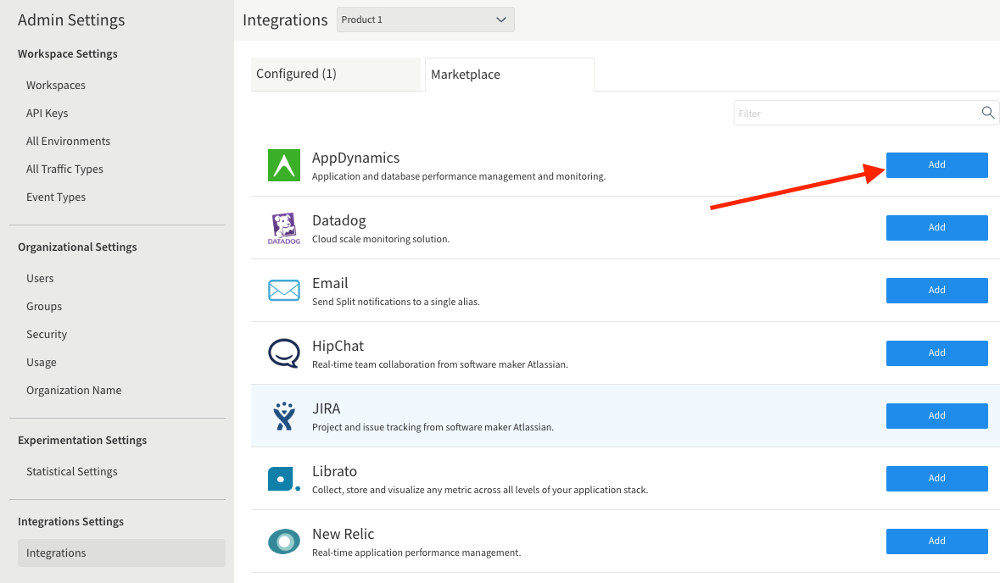
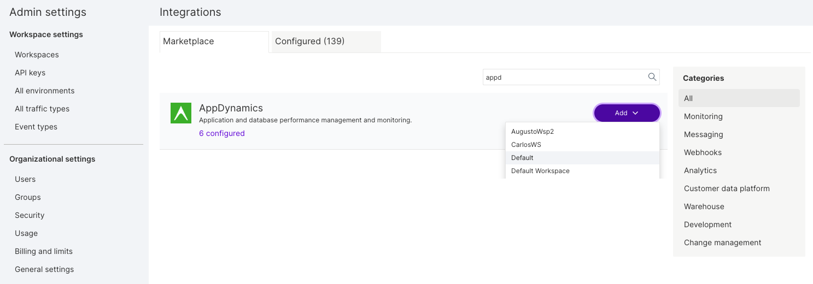
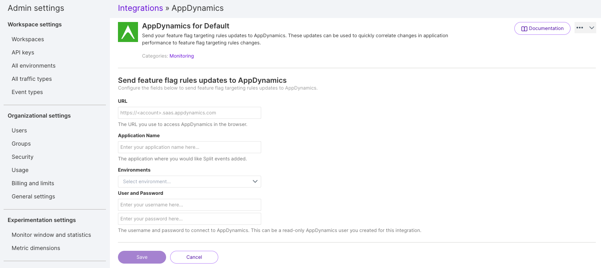

  <button style={{borderRadius:'8px', border:'1px', fontFamily:'Courier New', fontWeight:'800', textAlign:'left'}}> help.split.io link: https://help.split.io/hc/en-us/articles/360020898371-AppDynamics </button>

AppDynamics allows users to proactively monitor, manage, and optimize the most complex software environments. Split integrates with AppDynamics to provide custom events in AppDynamics highlighting Split changes.

If you have trouble completing the integration, contact us at [support@split.io](mailto:support@split.io).

:::info[Integration requirements]
The Split pre-built integration with AppDynamics does not support AppDynamics On-Premise (self-hosted) solution.
:::

## In AppDynamics
 
To connect Split to AppDynamics, create a role and a user within that role.

1. From AppDynamics top menu, select **Settings** > **Administration**.

   

2. Select the **Roles** tab.
3. Click **Create New Role**.
4. Type in a **Name** and **Description** for this role.
5. Select the application that you want the role to be able to push events to, and select **Customized** from the **View** dropdown. 
6. Click **View** and then **Edit** (the pencil).

   

7. Select **Configure Actions** as the minimal permission required for Split to be configured.

   

8. Click **OK** to close the Edit Permissions popup, then click **Save**.
9. Select the **Users** tab.
10. Click **+** above the user list. 

    

11. Type in a **Username**, **Name**, and **Email** for the user, and click **Change Password** to enter a password. 

    

12. Verify that the user belongs to the group you created in steps 1 through 8.
13. Click **Save**. 

## In Split

1. From the left navigation, click the **user's initials** at the bottom, select **Admin settings**, click **Integrations**, and navigate to the Marketplace.

   

2. Click **Add** next to **AppDynamics**.
   
   

3. Paste the URL you use to access AppDynamics Controller user interface in a browser.
      Typical value: **http://\<account\>.saas.appdynamics.com/controller**.
4. Paste the application name (exactly as it appears) where you would like Split events added.
5.  Enter the username and password for the user you created in Step 9 through 13.
6. Click **Save**.

Split notifications should now be flowing into AppDynamics.  Of course, please contact [support@split.io](mailto:support@split.io) if you have any issues with this integration.
