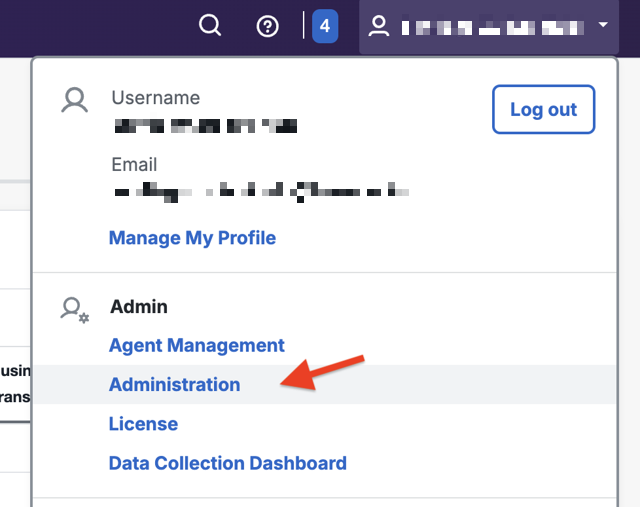
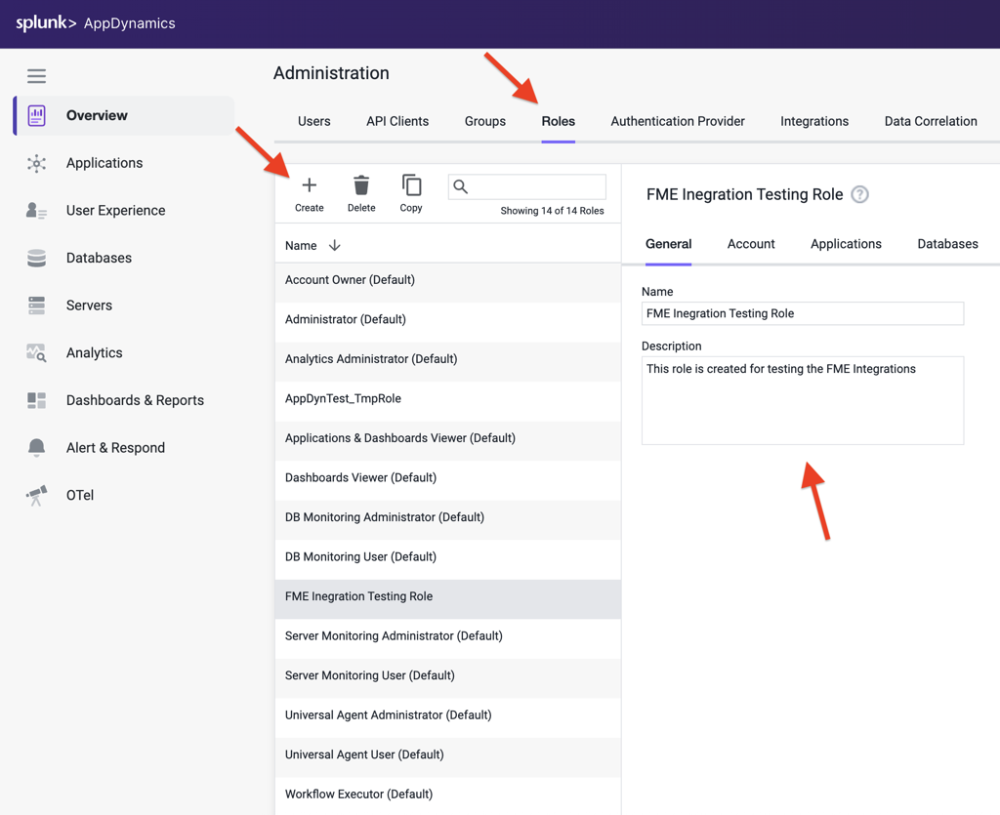
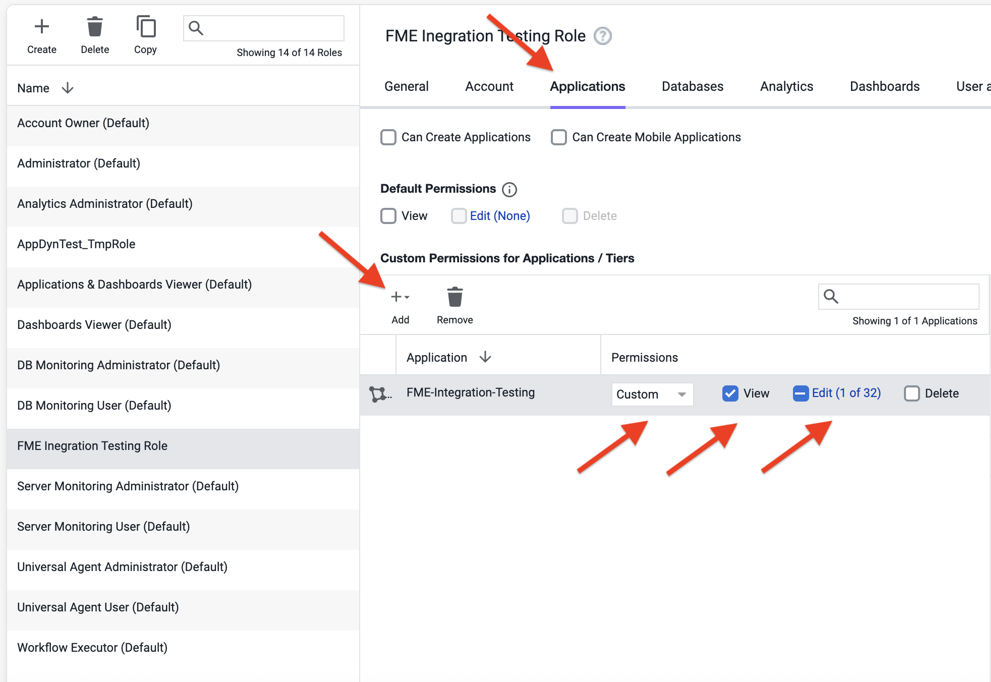
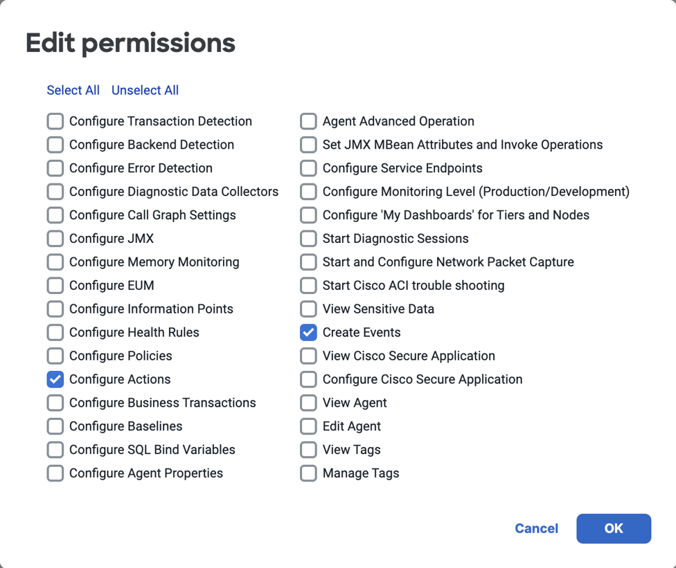
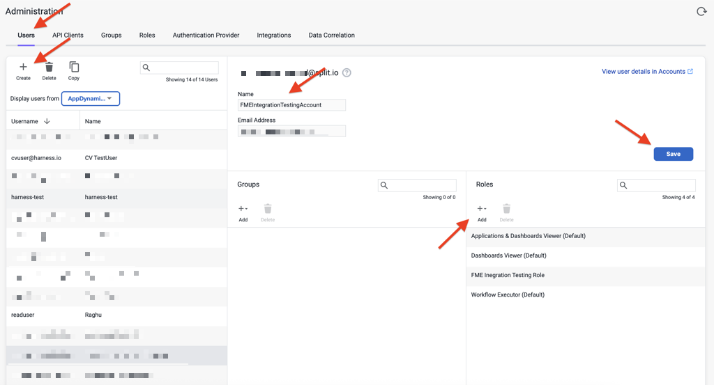
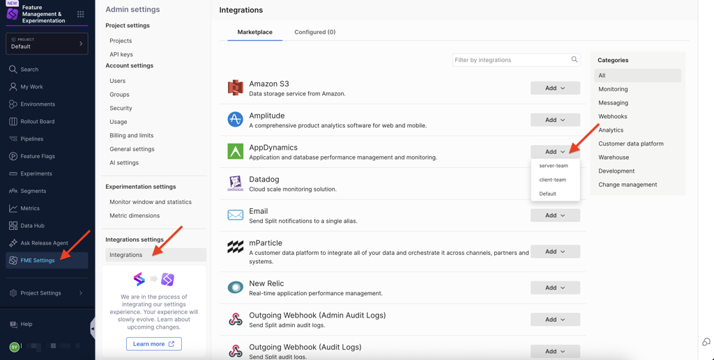
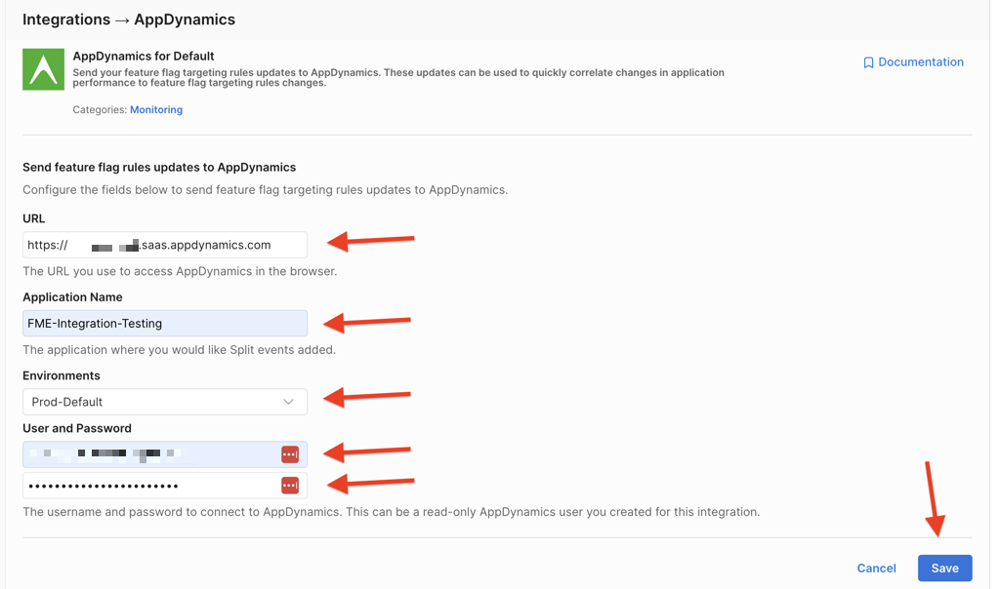
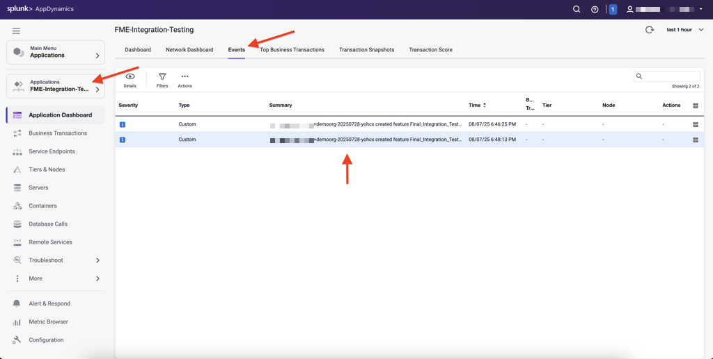

Splunk AppDynamics allows you to proactively monitor, manage, and optimize complex software environments. Harness FME integrates with Splunk AppDynamics to send custom events that highlight Harness FME changes.

:::danger[Integration requirements]
The Harness FME pre-built integration with Splunk AppDynamics does not support the Splunk AppDynamics On-Premise (self-hosted) solution.
:::

## In Splunk AppDynamics
 
To connect Harness FME to Splunk AppDynamics, create an Administrator role and a user within that role.

1. In Splunk AppDynamics, select the user profile dropdown menu on the top right corner and click **Administration**.

   

1. To create a role, navigate to the **Roles** tab and click **+ Create**. Enter a name (for example, `FME Integration Testing Role`) and a description for this role.

   

1. Navigate to the **Applications** tab and click **+ Add** under **Custom Permissions for Applications/Tiers**. Select `Custom` from the **Permissions** dropdown menu, and enable the **View** and **Edit** checkboxes.

   

1. Once you've clicked the **Edit** checkbox, select the permissions for this role in the **Edit permissions** modal. The minimum permissions required are `Configure Actions` and `Create Events`. 

   

1. Click **OK**, and click **Save**.
1. To create a user, navigate to the **Users** tab and click **+ Create**.
1. Enter a name and an email address for this user. Use a real email address because you will need to reset your password from an email notification.

    

1. Under **Roles**, click **+ Add** to add the user to the role you created (for example, `FME Integration Testing Role`) as well as `Applications & Dashboards Viewer`, `Dashboards Viewer`, and `Workflow Executor`.
1. Click **Save**. 

## In Harness FME

After creating an Administrator role and a user within that role in Splunk AppDynamics, configure the AppDynamics integration in Harness FME.

1. In Harness FME, navigate to **FME Settings** > **Integrations**.
1. From the **Marketplace** tab, click the **Add** button to the right of `AppDynamics` and select the workspace where you want to configure the integration.

   

1. Add the URL for your AppDynamics tenant ID (the URL you use to access AppDynamics in the browser with) in the **URL** field. For example, `http://<YOUR-ACCOUNT>.saas.appdynamics.com/controller`.
1. Add the AppDynamics application name (exactly as it appears) to identify where you'd like the Harness FME events added. For example, `FME-Integration-Testing`.
1. Select the FME environment to collect events from in the **Environments** field.
1. Enter the AppDynamics user (an email address) and password for the user you created in AppDynamics with the Administrator role.
   
   

1. Click **Save**.

Harness FME notifications should start appearing in Splunk AppDynamics. 

## View events

Actions like initializing an environment, making a change over a feature flag, or killing a feature flag trigger events that are visible in your AppDynamics application's **Application Dashboard**.

In Splunk AppDynamics, navigate to **Applications** and click on the application you configured in the Harness FME configuration (for example, `FME-Integration-Testing`). Navigate to the **Events** tab to see the events that capture changes in Harness FME.

Contact [support@split.io](mailto:support@split.io) if you have any issues with this integration.