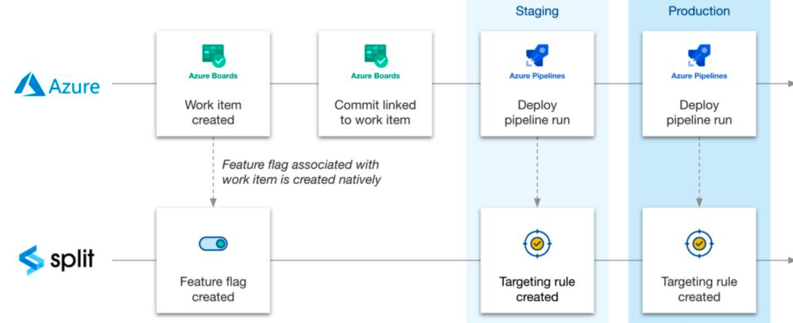

<p>
  <button hidden style={{borderRadius:'8px', border:'1px', fontFamily:'Courier New', fontWeight:'800', textAlign:'left'}}> help.split.io link: https://help.split.io/hc/en-us/articles/4408032964493-Azure-DevOps </button>
</p>

The Harness FME integration with Azure DevOps gives you access to FME feature flags which enables a streamlined workflow when you are managing your deployment. Use this integration to:

* Customize rollouts: With feature flags, teams can strategically enable rollouts as needed, including canary releases, dark launches, and A/B tests.
* Save time: Teams can associate feature flags with items in development with menus and native integration. You no longer have to switch between solutions.

Within Azure DevOps, you can:

* Select a feature flag to associate with a given work item 
* Create a feature flag directly within your project 
* Automatically configure feature flag rollout plans with each pipeline run
* Directly link Azure work items to Harness FME

Within Harness FME, you can view your Azure work items connected to each feature flag and the associated status and assignee.

The following flowchart shows how this integration works:



## Set up in Harness FME 

To start, you need to first set up in Harness FME by doing the following:

1. Click the **profile button** at the bottom of the left navigation pane and click **Admin settings**.
2. Click **Integrations** and navigate to the Marketplace tab.
3. Locate the Azure DevOps integration, click **Add** and select the project for which you would like to configure the integration. This allows you to map each instance of the integration to a Microsoft Azure DevOps project.
4. Enter your Azure Org ID and optionally enter your Azure personal access token (PAT) and click **Save**. This takes you back to the marketplace.
5. From the Azure selection, click **Edit**. The Connect to Azure DevOps page displays with your generated Harness FME token. 
6. Copy your token to configure your Harness FME extension in Azure.

## Set up in Azure DevOps

Once you have performed your set up in Harness FME, you can set up your extension in Azure DevOps. The following sections describe how to install and set up an extension.

### Install an extension in Azure DevOps organization

The following explains how to install your extension in Azure DevOps organization. To install your Harness FME extension, do the following: 

1. Go to [Azure marketplace](https://marketplace.visualstudio.com/items?itemName=SplitSoftware.split-for-azuredevops) and click the Harness FME extension. The extension displays.
2. Click **Get it free**. This brings the extension into your Azure organization. The Split for Azure page displays.
3. Select your organization and click **Install**.
4. Once the installation completes, click **Proceed to organization**. The Projects page with a list of your projects displays.

### Set up an extension

Once you install your extension, you can set it up in the Azure DevOps organization. To set up the extension, do the following:

1. Go to Azure DevOps project dashboard and click **Project Settings**.
2. Select **Service connections**.
3. Click **New service connections**. A new service connection area displays.
4. Select Split and click **Next**. 
5. In the Project name field, enter a unique name per service connection.
6. In the Split token field, enter your Harness FME token that's associated with the project you want to map to the environment to and click **Verify**.
7. In the Service connection name field, enter a name. Be sure to name it in a way that is specific to the project in Harness that the integration was configured to and allows you to remember the name you enter. Following this pattern, you can map multiple Harness projects to a single project in Azure DevOps. 
8. In the Description field, optionally enter a description.
9. Add all necessary users or groups to the service connection's security settings. Be aware that to work with Harness FME's Azure DevOps integration, you must be assigned a User role or higher.
10. Click **Verify and save** to establish and save the connection. A successful service connection displays as Active on the Harness FME integration page. You can now connect your work items to feature flags and configure release tasks. 

## Use the Azure integration

This section provides instructions on how to use the Azure DevOps integration with Harness FME. From here, you connect your work items to feature flags, which allows you to see what work pertains to which feature flag. You can also automate the creation and update of feature flag targeting rules with pipeline tasks. 

### Connect feature flags with Azure work items

You can connect your work items with the associated feature flag in Harness FME. To connect a work item to a feature flag, do the following:

1. From the Work item screen, select the Split tab on the right hand side. The Harness FME fields display in the page. 
2. In the Service connection field, select the desired service connection.
3. In the Harness FME field, you can: 
   * Create a new feature flag. If you create a new feature flag, enter the name, traffic type, and optionally a description.
   * Select one or more feature flags to link to.

### Update feature flag targeting definitions with pipeline task

You can trigger feature flag definition changes as part of your deployment process.The targeting definitions can be both written in YAML or via Azure’s task builder. You can create the definition by selecting Split from the tasks menu in the pipeline editing screen. You can then select the desired service connection, Harness FME project and environment. You can also customize your target definition. To configure your definitions, do the following:

1. From the Azure Project settings page, click **Pipelines** from the left hand navigation.
2. On the right-hand menu, click **… menu** and then **Edit**. The pipeline yml page displays.
3. On the Tasks menu, select the Splits task. The configuration fields display. 
4. In the Service connection field, select the desired service connection.
5. In the Project field, select the desired Harness project you want to work on.
6. In the Environment field, select the desired environment. This updates the targeting rules of this feature flag in this environment.
7. Under the Split targeting definition section, the default targeting definition displays. You can customize this definition to something other than 0% ON and 100% OFF. Similar to our API, enter the JSON representation of the targeting definition in this field. Refer to the sample JSON payload below. For more information, refer to our [Create feature flag definition in environment](https://docs.split.io/reference/create-feature-flag-definition-in-environment) API documentation or if you have questions, contact [support@split.io](mailto:support@split.io).
8. Click **Add** to add this task to the YML file.

**Sample JSON payload**

The following is a sample payload.

```json
{
  "treatments": [
    {
      "name": "on",
      "description": "feature enabled",
      "keys": [
        "some-user-id"
      ],
      "configurations": "{\"color\":\"green\"}"
    },
    {
      "name": "off",
      "description": "feature disabled",
      "configurations": "{\"color\":\"red\"}"
    }
  ],
  "defaultTreatment": "off",
  "baselineTreatment": "off",
  "trafficAllocation": 40,
  "rules": [
    {
      "buckets": [
        {
          "treatment": "off",
          "size": 100
        }
      ],
      "condition": {
        "combiner": "AND",
        "matchers": [
          {
            "type": "IN_LIST_STRING",
            "strings": [
              "John",
              "Mary"
            ]
          }
        ]
      }
    }
  ],
  "defaultRule": [
    {
      "treatment": "off",
      "size": 100
    }
  ]
}
```

## Visualize Azure work items in Harness FME

Once you link your Azure work items, you can visualize your key work item information associated with a feature flag. To visualize your work items, do the following:

1. Within the Work items page of Azure DevOps, click the Split tab. The associated feature flags display. 
2. In the desired work item, click the link icon. This takes you to Harness FME. 
3. Click the **Additional settings** tab. You can now visualize your Azure information in Harness FME.

## Troubleshooting

The following errors may occur when you run a job:

* **Targeting definition could not be updated because the feature flag exists in another Split workspace** (a Split workspace is now called a project in Harness)

  If the workspace in the pipeline task (also known as the agent task in Azure) is different from the workspace in the work item, the pipeline task does not create a targeting rule.

* **Targeting definition could not be updated because a definition already exists in the environment** 

  When you create a work item that is linked to an existing build, and there are more than one flags associated with it, some of the feature flags get updated but others do not. This action occurs because the targeting rules were already created within the pipeline's environment for that flag.

* **Targeting definition could not be updated because of environment change permission settings**

  Currently, the integration only updates targeting rules if change permissions are disabled in the pipeline's environment. If the permissions are enabled in the pipeline's environment, no flag is updated.

* **Targeting definition could not be updated because of an invalid definition structure**

  When you define a custom rollout option and you make a syntactical or semantic error in the treatment definition, the task fails when it runs because of a validation error.

* **Task failed due to invalid JSON**

  If the JSON has invalid formatting, the task cannot be parsed and it fails.