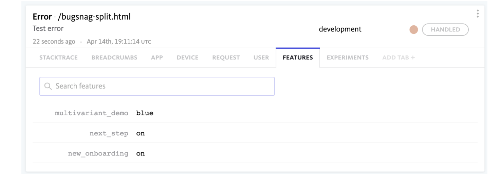

Harness FME + BugSnag is a community-supported integration. We do our best to ensure that we share only high-quality community integrations and solutions but we do not work on these projects directly, nor can we guarantee that they’re consistently maintained.

:::info[Note]
The BugSnag integration is built and managed by BugSnag. For questions about the integration or for technical support, contact support@bugsnag.com.
:::

The BugSnag community integration with Harness FME lets you identify which feature flags or experiment treatments are impacting the user experience within an application in real-time. With this integration, you can:

**Correlate user impact with feature releases.** Once you configure Harness FME with BugSnag, you can set up alerts in BugSnag to monitor how your feature flags and experiments are influencing user behavior in your application, allowing you to decide whether to roll out or roll back features in FME. 
**Gain actionable insights.** Use Bugsnag’s Feature Dashboard to determine if unusual error activity in the application is connected to a feature flag. You can isolate errors that occur when a feature flag is enabled, so you can see what’s happening and troubleshoot your errors. Log into Harness FME to adjust the feature flag definition.



## Supported SDKs

Harness FME SDKs support listeners so you can automatically declare the flags and their variations to BugSnag whenever they are queried within your app. BugSnag supports the following SDKs when declaring feature flags and experiments from Harness FME: Android, iOS, Electron, Expo, JavaScript (browser and Node.js), and React Native. 

## Integrating Harness FME and BugSnag

For more information on integrating BugSnag and Harness FME, refer to the [Integrate BugSnag with Split](https://docs.bugsnag.com/product/integrations/feature-management/split) documentation. 

## Integrating BugSnag to Harness FME

This integration uses a BugSnag webhook to report errors to Harness FME, where they become events eligible for inclusion in A/B test results. This integration uses a BugSnag webhook to report errors to Harness FME, where they become events eligible for inclusion in A/B test results. There are two possible approaches to this integration: 

* Sending FME feature flags to BugSnag. Involves using the FME SDK and is documented on BugSnag's site.
* Using a webhook to pass BugSnag errors to Harness FME. This is described in the following sections.

### How it works

BugSnag has built-in webhooks. When you create a webhook that reports errors, Harness FME can provision a service to listen for errors. The service receives an error, transforms it into an FME event, and sends the event on to FME for use in metrics and experimentation.

The BugSnag errors have rich property information, and not all of it is sent to Harness FME. Some of the properties are flattened in order to be suitable for an FME event.

### Setting it up

The Harness FME service is expected to be an AWS node.js lambda. The lambda can also be provisioned as a serverless function in another cloud, but the instructions are not provided. The installer is expected to be a Git user, have access to AWS, and understand how to provision new lambdas. It is also assumed you have both Harness and BugSnag accounts.

#### Installing the integration at the command line

The following explains the command line steps for installing the integration.

**Note: The repository is at [bugsnag2split](https://github.com/splitio/bugsnag2split).**

Create a new directory and clone the integration code into it:
```
git clone https://github.com/splitio/bugsnag2split.git
```

Change into the new bugsnag2split directory. Create a new SPLIT_API_KEY file:
```
touch SPLIT_API_KEY
```

Create a new server-side API token in Harness FME, and copy it into this file. There should be no spaces or carriage return arount it. This token is used to validate the integration when it sends an event to Harness FME.

Run an npm install:

```
npm install
```

Create a zip file for your soon-to-be-created lambda:

```
zip -r bugsnag.zip *
```

### AWS Installation

Create a node.js lambda. On the code page, upload your bugsnag.zip file.

Under configuration, create a function URL for your lambda.

* No auth type
* Configure CORS
* Allow methods POST

### Install on BugSnag

1. From Projects, select Data forwarding, then  Webhook.
2. Paste in the function URL from the previous step.
3. Click Test. Look to the lower, left-hand screen to see if you're  successful.
4. Turn on **Every time an error occurs** in the config below.
5. Click the checkbox to **Notify me every time an error occurs**.
6. Update your preferences. The integration install is now complete.

### View BugSnag errors in Harness FME

Using the Harness FME Data hub, you can view errors as they arrive in Harness. They have a lot of information available in properties. The following is an example error:

```
{
   "environmentId":"194da2f0-3e22-11ea-ba75-12f2f63694e5",
   "environmentName":"Prod-Default",
   "eventTypeId":"bugsnag_error_wh",
   "key":"dmartin-bugsnagger",
   "properties":{
      "occurrences":"82",
      "device.browserVersion":"103.0.0",
      "releaseStage":"development",
      "user.name":"David B. Martin",
      "receivedAt":"2022-07-19T15:00:50.843Z",
      "device.id":"ckvcjhzya00003e5uichx3sxy",
      "app.type":"browser",
      "app.duration":"792196",
      "unhandled":"false",
      "device.browserName":"Chrome",
      "user.email":"david.martin@split.io",
      "requestUrl":"http://localhost:8080/bugsnag-split.html",
      "context":"/bugsnag-split.html",
      "id":"62d6c722009557e6c9b80000",
      "errorId":"628850cb3ae8290008a73487",
      "severity":"warning",
      "device.locale":"en-US",
      "user.id":"dmartin-bugsnagger",
      "device.orientation":"landscape-primary",
      "exceptionClass":"Error",
      "message":"error during donate click handling",
      "app.releaseStage":"development",
      "userId":"dmartin-bugsnagger",
      "url":"https://app.bugsnag.com/split-software/split/errors/628850cb3ae8290008a73487?event_id=62d6c722009557e6c9b80000&i=wh&m=oc",
      "device.time":"2022-07-19T15:00:50.607Z",
      "device.osName":"Mac OS X 10.15",
      "firstReceived":"2022-05-21T02:39:07.000Z",
      "status":"open"
   },
   "receptionTimestamp":1658242853018,
   "timestamp":1658242852567,
   "trafficTypeId":"194c6a70-3e22-11ea-ba75-12f2f63694e5",
   "trafficTypeName":"user",
   "value":0
}
```

### About the Harness FME traffic key

The FME traffic key of the error events must agree with the FME traffic key of your impressions. In practice, you’ll want to configure the key in your BugSnag initialization. Use the same ‘id’ key for your FME SDK configuration.
```
  BugSnag.start({
		apiKey: '<bugsnag spi key',
		user: {
		   id: 'dmartin-bugsnagger',
		   name: 'David B. Martin',
		   email: 'david.martin@split.io'
	  	}		
	})
```

### A hint on triggering errors

If you want to stimulate some errors from your JS app, you can use the notify function of BugSnag. In this example, a buttons onclick has been passed a clickHandler that creates a new exception. If your integration is fully installed, you’ll see the event arrive at the Data hub “momentarily”.
```
  function clickHandler() {
		alert('click! (error trigger)');
		BugSnag.notify(new Error('error during test click handling'));
	}
```