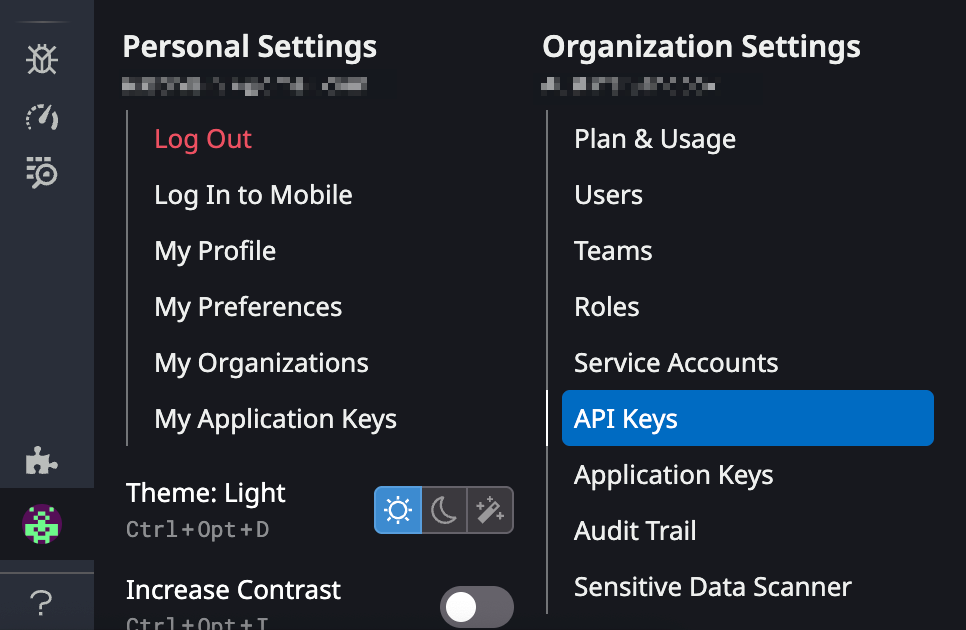
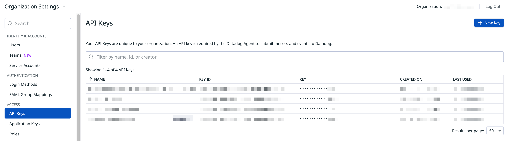
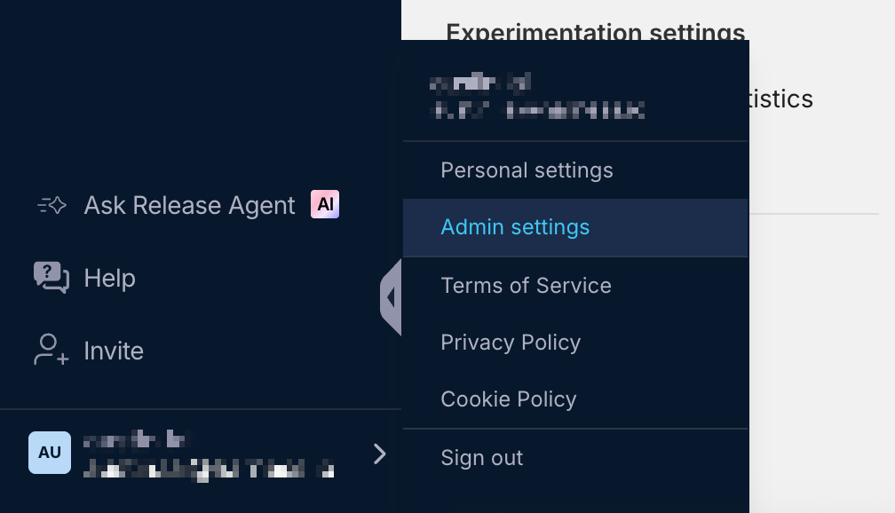
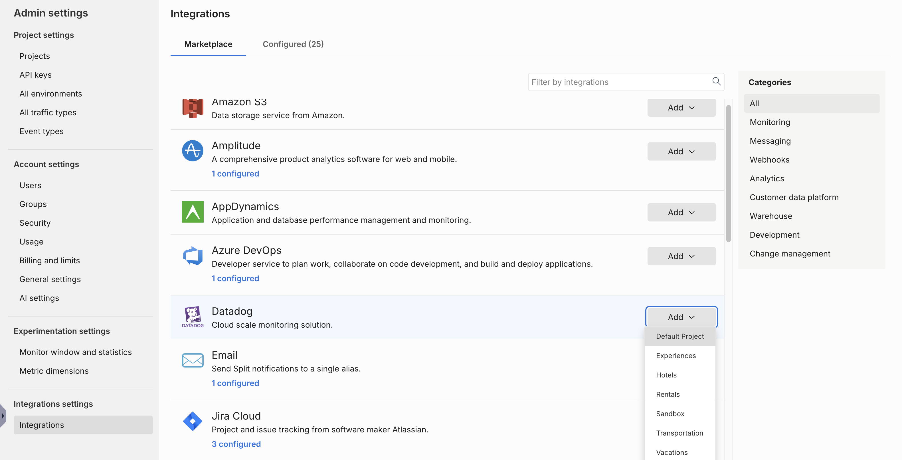

  <button hidden style={{borderRadius:'8px', border:'1px', fontFamily:'Courier New', fontWeight:'800', textAlign:'left'}}> help.split.io link: https://help.split.io/hc/en-us/articles/4822553169933-Datadog </button>

Datadog is a cloud-hosted monitoring and analytics platform for development and operations teams. Integrate Harness FME data into Datadog to monitor and measure the performance impact of Harness FME changes. If you are having trouble completing the integration, contact us at [support@split.io](mailto:support@split.io).

## In Datadog
 
1. Go to **Organization Settings** and click **API Keys**.

   

2. Click **+ New Key**.

   

3. Copy the API key that you just created.

## In Harness FME

1. Click the **profile button** at the bottom of the left navigation pane and click **Admin settings**.

   

2. Click **Integrations** and navigate to the Marketplace tab.

   

3. Click **Add** next to Datadog and select the project for which you would like to configure the integration. The Harness FME Datadog interface appears.
4. In the Environment field, specify the environment from where you want audit logs sent to Datadog.
5. In the Site field, map the integration to a specific Datadog site. This supports the integration for any Datadog site, including the EU. Refer to the [Datadog Sites page](https://docs.datadoghq.com/getting_started/site/) for more information about sites.

   **Note: If you’re a current Datadog integration user, your integrations will continue to work. However, when you edit the integration, you must select the environments and the URLs again before you save your new setting.**

6. In the API key field, paste the API key that you copied in step 3 of the Datadog instructions.
7. Click **Save** to save your selections. You have now mapped your integration to your selected site.

Harness FME notifications should now display in Datadog as "tags:role:split.io".

If you have any issues with this integration, contact [support@split.io](mailto:support@split.io). 

## Using FME with Datadog RUM

This Harness FME integration automatically enriches your RUM data with a feature flag variant. It allows you to correlate feature releases with performance and troubleshoot any issues to ensure safe feature releases. 

To get started, go to [Using Feature Flags](https://docs.datadoghq.com/real_user_monitoring/feature_flag_tracking/using_feature_flags/) and [Split - Rum](https://docs.datadoghq.com/integrations/split-rum/) to set up data collection for your feature flags with this Harness FME integration. You can monitor your feature flags, turn them off, or roll them back, without causing negative user experiences.

:::info[Note]
The Datadog RUM integration has been tested by Harness FME but is owned and maintained by Datadog. For more information, contact Datadog support.
:::