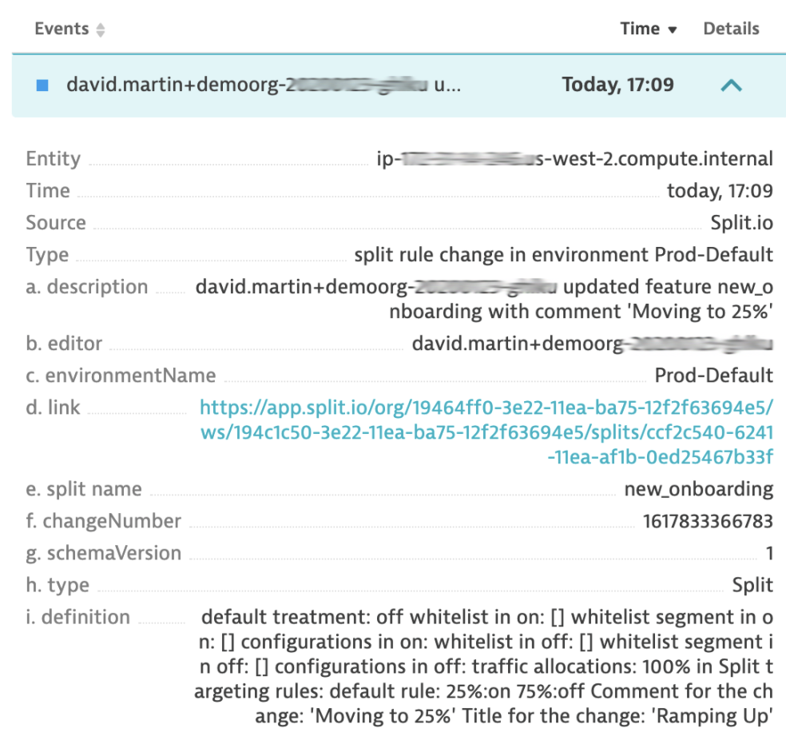
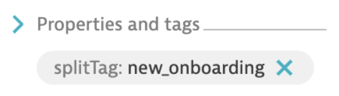
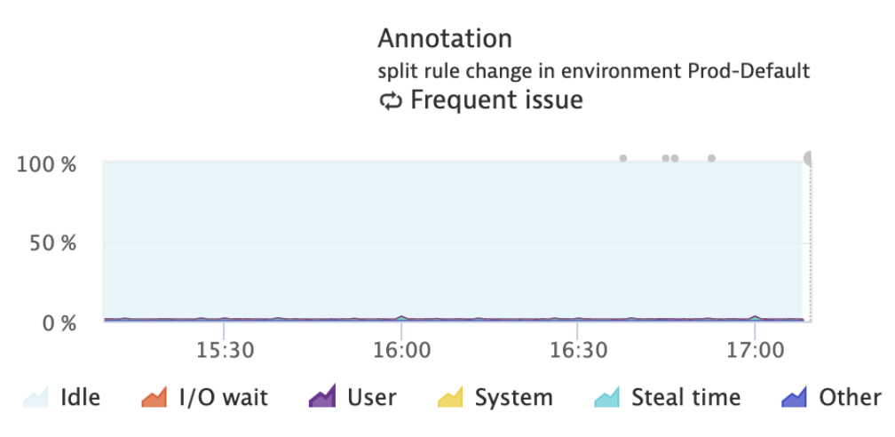

## Harness FME + Dynatrace

Dynatrace is a versatile monitoring solution for applications, services, and infrastructures. This integration uses a feature flag audit trail webhook to post annotations on tagged Dynatrace hosts, services, applications, and more. Using this integration, Dynatrace users see a feature flag change reflected in Dynatrace and identify when a change has impacted an entity, including complete details about the change, and a link to Harness FME for further investigation.

<div style={{maxWidth:800}}>  </div>

## Prerequisites

To connect Dynatrace to Harness FME, you need the following:
* Your Dynatrace URL
* A Dynatrace API token (with API v1 rights to “Access problem and event feed, metrics, and topology”)
* Administrator access to your Harness account

## How to use this integration

The following explains how to use this integration

### Publish a webhook

This integration is for deployment as an AWS Lambda. The lambda is a webhook for a feature flag audit trail of a specific Harness FME environment. The webhook takes changes from Harness FME and annotates tagged Dynatrace entities with these changes using Dynatrace APIs. The results are discoverable in the Dynatrace user interface. To publish a webhook, do the following:

1. Clone the repository: https://github.com/dbmartin00/split2dynatraceAws

2. To install, edit the following src/main/java/split2dynatrace.config file:

   **File name:** split2dynatrace.config

<ul>

```javascript
{
    "dynatraceUrl" : "https://YOUR_URL.live.dynatrace.com",
    "dynatraceApiKey" : "YOUR.KEY.FROM_DYNATRACE",
    "entities" : [
        "HOST",
        "APPLICATION",
        "SERVICE"
    ]
}
```

* `dyntraceUrl`: copied from your browser when logged into Dynatrace
* `dynatraceApiKey`: created and copied from Dynatrace; see Dynatrace manual; be sure to enable API V1 "Access problem and event feed, metrics, and topology"
* `entities`: host, application, service, or any on the list of meTypes under the TagMatchRule object found at this [Dynatrace URL](https://www.dynatrace.com/support/help/dynatrace-api/environment-api/events/post-event/#expand-the-element-can-hold-these-values-382)

</ul>

### Deploy the AWS Lambda 

:::info[Note]
You need to be working with Java 8, because AWS does not support higher versions at this time.
:::

When you deploy the lambda at the API Gateway, it should be a public REST API. Save the URL of your deployed lambda. The lambda logs include helpful information and debugging output to CloudWatch. For example, I used the [AWS Toolkit for Eclipse](https://aws.amazon.com/eclipse/). 

### Configure Harness FME to use your webhook

To register your AWS Lambda with Harness FME, follow the Harness FME instructions for creating a webhook. Provide the URL you saved previously when you deployed your lambda. Select if you want changes to be passed from DEV, QA, or PROD environments (changes to other environments are ignored).

**Advanced instructions:** Deploy a webhook for each of your environments separately. Tag dev, qa, and prod environments with unique tags. Environment-specific webhooks will annotate with changes only from that environment.

### Configure Dynatrace

<div style={{maxWidth:400}}>  </div>

In the Dynatrace user interface, find the hosts, services, applications, and other entities that you want to annotate.

For each entity, create a tag with `splitTag` as its key and the feature flag name as its value. This entity receives an annotation any time the referenced feature flag name is edited. Create as many tags for as many different feature flags as you like. 

Use Dynatrace's advanced tagging functionality to automatically apply tags to larger portions of your infrastructure. Tags on entities that are not of a type listed in split2dynatrace.config are ignored.

### Verify the Integration

To indicate a rule change, charts show grey dots. Each annotation comes with details in the events table.

<div style={{maxWidth:700}}>  </div>

### How it works

Assuming the webhook was made for the production environment, a change to a feature flag in that production environment triggers a notification to the AWS lambda web

### Troubleshooting

Make sure your webhook is unauthenticated on setup. This is an option when you first create the function.

If the CloudWatch log displays the following, it should exit as 200. The time to finish depends on entity types defined and number of tags.

* successfully parsed change
* DEBUG of full JSON from Harness FME
* "sending annotations to Dynatrace"

If you see the following error, it means that no matching entities were found with the tag generated for this annotation ("splitTag:dynamic_boxes"):

```javascript
INFO - post to dynatrace status code: 400 response body: 
{
    "error": {
        "code": 400,
        "message": "Invalid attachRules object provided. No entity IDs match: Matching rule: PushEventAttachRules{entityIds=null, tagRules=[TagMatchRule{meTypes=[HOST, APPLICATION, SERVICE], tags=[[CONTEXTLESS]splitTag:dynamic_boxes]}]}"
    }
}
```

To resolve this, tag an entity in Dynatrace (as discussed above) and make a change to the corresponding feature flag in Harness FME.

## Code

This is a third-party integration that has been tested by the Harness FME team. Harness does not own or maintain this integration. For more information, reach out to the [contibutor](mailto:david.martin@split.io).

We encourage contribution for all third-party integrations. You can find the repo that backs this integration which is found in [GitHub](https://github.com/dbmartin00/split2DynatraceAws).

If you’d like a demo of Harness FME, or help to implement any of our integrations, contact [support@split.io](mailto:support@split.io).