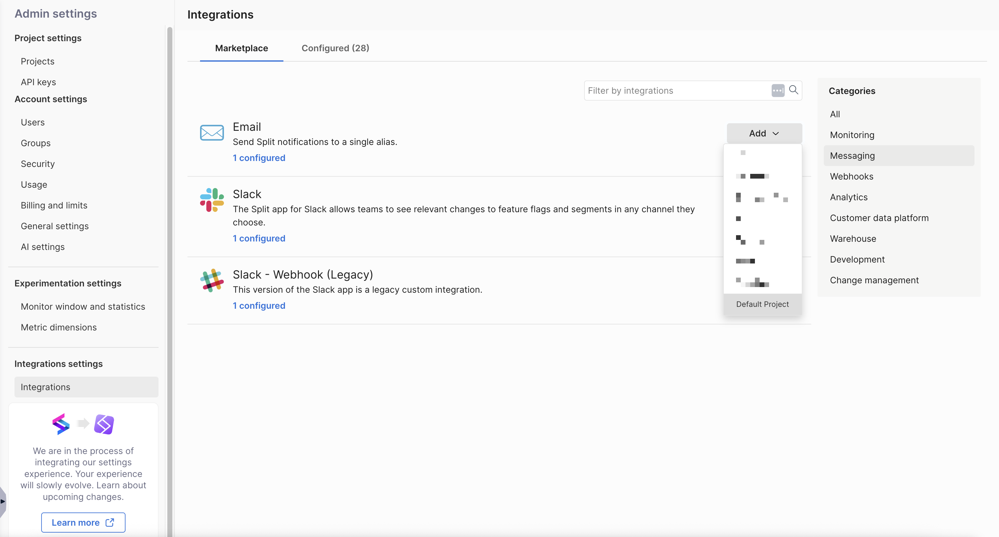
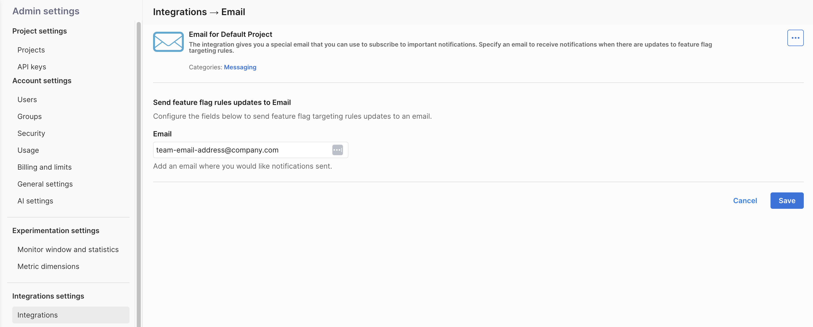

## Overview

The Email integration allows you to receive Harness FME notifications at a single email alias. This is useful if you want your team to stay informed about feature flag targeting rule updates without having to log in to the Harness UI.

With this integration, you can configure an email address to receive notifications whenever targeting rules are modified.

:::tip
If you are having trouble completing the integration, contact [Harness Support](/docs/feature-management-experimentation/fme-support).
:::

## In Harness FME

1. Navigate to **FME Settings** > **Integrations** and select the `Messaging` category.

   

1. Click the **Add** dropdown menu and select a project where you want this integration to apply to (for example, `Default Project`).

   

1. In the **Send feature flag rules updates to Email** section, enter the email address where you want notifications to be sent.
   
   

1. Click **Save**.

Once configured, Harness FME automatically sends feature flag targeting rule update notifications to the provided email address. If you have any issues with this integration, contact [Harness Support](/docs/feature-management-experimentation/fme-support).