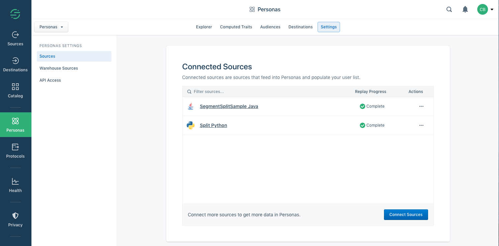
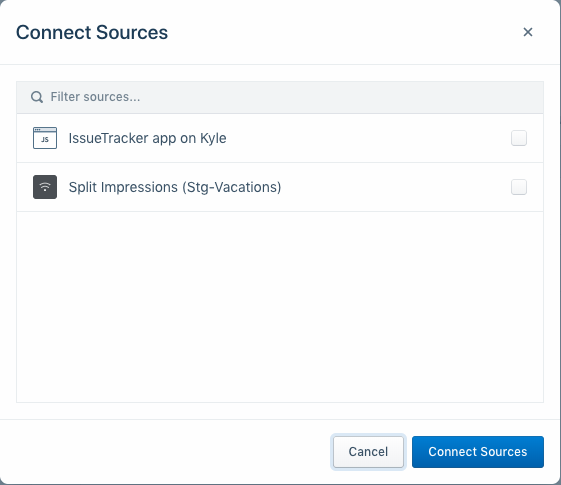
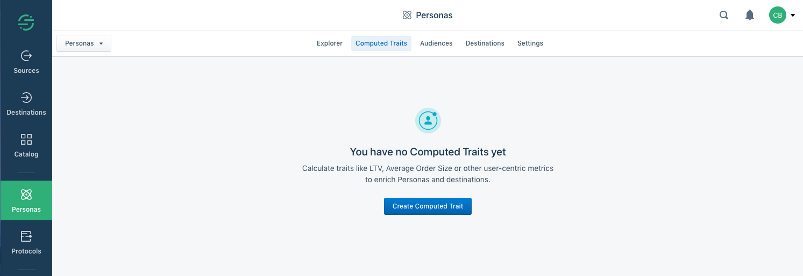
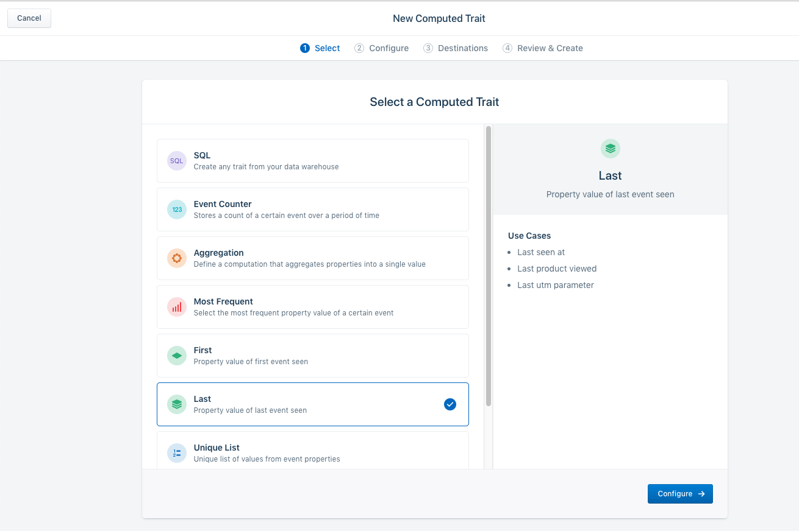
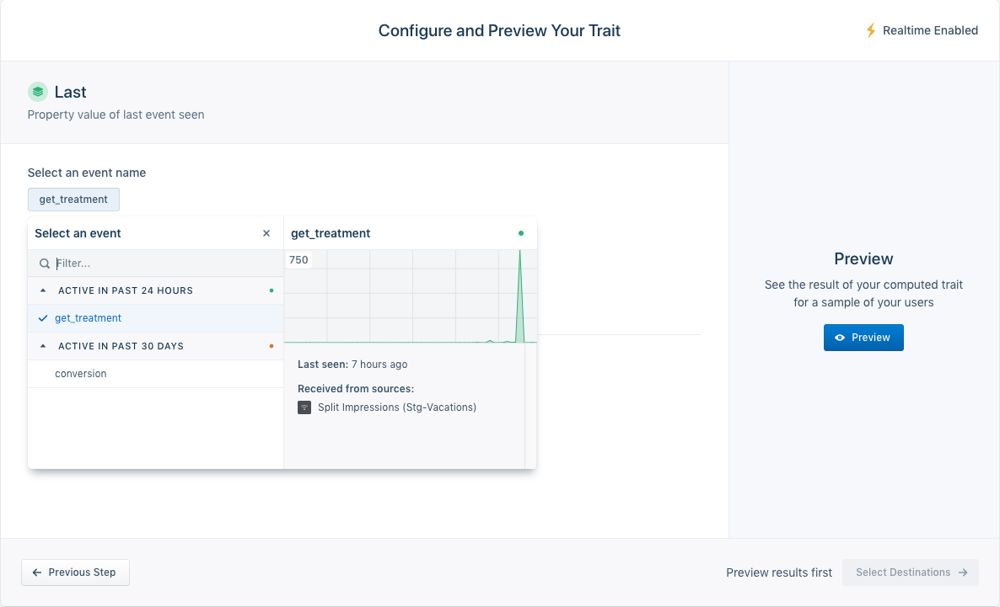
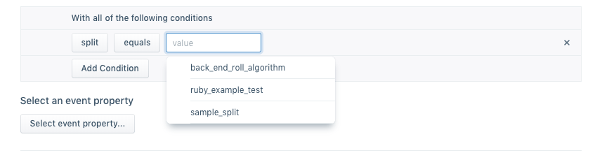
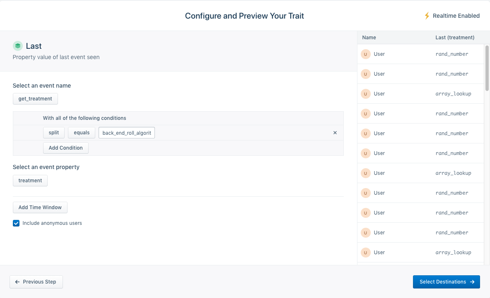
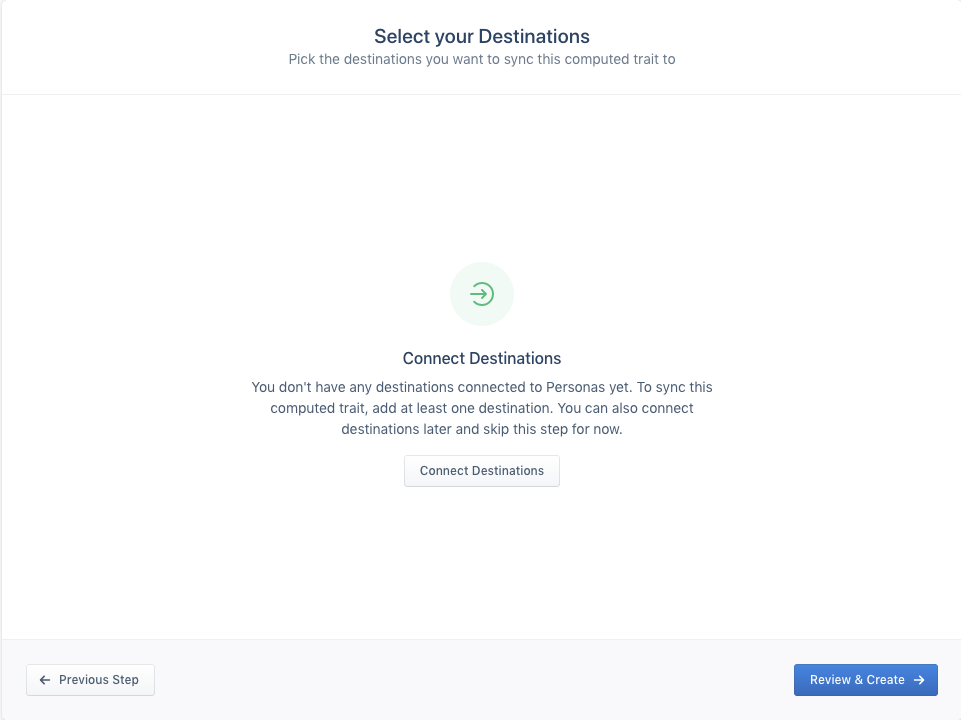
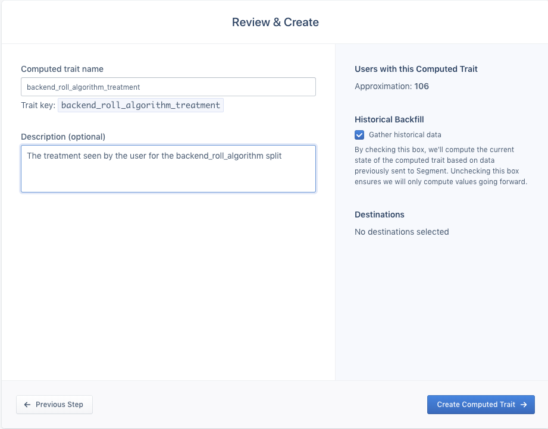
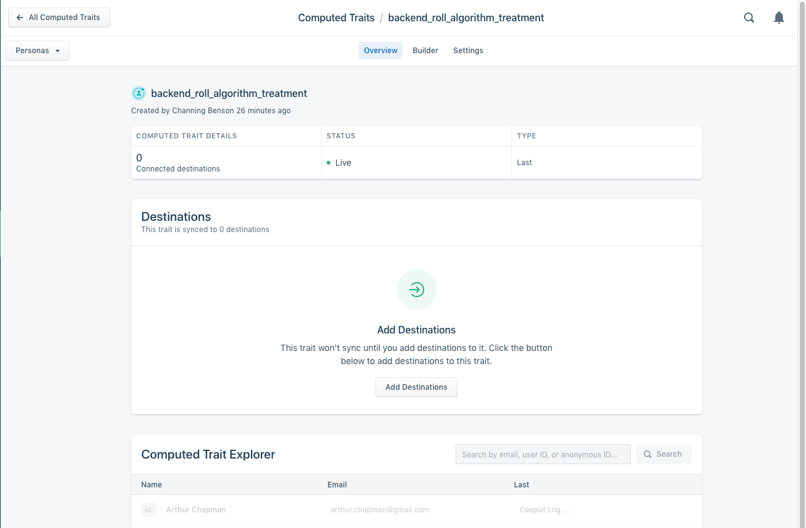

## Overview

Split is a unified solution for feature flagging, monitoring, and experimentation that enables product owners and developers to control rollouts and make data-driven product decisions. Segment makes customer data simple by giving you a single point for collecting, cleaning, and controlling that data.

If you are a customer of both Split and Segment, you are probably already integrating the two tools by sending events from Segment to Split, sending impression data from Split to Segment, or both. If you are not already using these integrations, see the [Segment integration](/docs/feature-management-experimentation/integrations/segment). 

Computed traits in [Segment Personas](https://segment.com/product/twilio-engage/) allow you to utilize Split impression data to build audiences to enrich and personalize marketing campaigns and in-app experiences through additional Segment destinations.

It can be useful for you to be able to identify which treatment a particular user has seen for a particular feature flag to enrich and personalize marketing campaigns and in-app experiences through additional Segment destinations. If you’ve configured the Split/Segment integration to pass impression events from Split to Segment, you can use those events as the basis for computing a trait where the trait key represents the feature flag name and the value represents the last seen treatment.

Let’s walk through building a user trait based on Split impressions.

## Connect Split impressions to Segment personas

First, make sure that the Segment Source associated with your Split impression data is connected to Personas.

1. Navigate to the Sources section of Personas Settings and select “Connect Source”
   
   

1. Select the Source corresponding to the HTTP API Source to which Split is sending impression events. Depending on your configuration settings within Split, this will be specific to a particular Split workspace/environment.  Depending on how many of your environments are configured to send impression data to Segment, there may be more than one you want to connect to Personas, though typically this is something that is only done on production environments.
   
   

1. Click “Connect Sources”.

## Configure a computed trait in Segment

To configure the computed trait, you will need to know the name of the feature flag for which you want to obtain the user’s treatment.

1. Select the Computed Traits section in Personas.

   

1. Select the “Last” category to set the property value as the last event seen.

   

1. For event name, choose *get_treatment*. If you have a lot of event types, you can use the filter box to find **get_treatment**.

   

1. Click on Add Condition. Select `split` as the property and filter to match the name of the feature flag for which you want to set the trait (in this example, that is `back_end_roll_algorithm`). Optionally, add additional conditions to filter down based on other properties including `environmentName`, `label`, and the feature flag version.

   

1. Click Select event property, and then choose the property *treatment* to have the value of the treatment seen for the given feature flag be used as the computed trait’s value. Then click Preview.

   

1. Click Select Destinations. If you have a backend data warehouse configured for Personas, you will have the option to select them to have the computed traits synchronized to them.
   
   

1. Click Review & Create, and enter the name of the computed trait as well as an optional description.

   

1. Finish the process by clicking Create Computed Trait. There will be some delay before the values of the computed trait start appearing in the explorer window.

   

## Use Cases

Using computed traits and the key value mappings of `split:treatment`, you can accomplish the following:

* Show personalized experiences, [targeting by user property in Appcues](https://docs.appcues.com/en_US/user-experiences-targeting/targeting-by-user-property) based on a user’s split:treatment.
* Analyze A/B test results or dive deeper into your analytics, [filtering by user property in Amplitude](https://amplitude.com/docs/get-started/analyze-a-b-test-results#how-many-user-properties-should-i-send). 
* Build email campaigns based on [user properties in Iterable](https://support.iterable.com/hc/en-us/articles/204780539-Segmentation-Overview).
* View FullStory sessions for users experiencing your new feature by [searching custom fields](https://help.fullstory.com/hc/en-us/articles/360020828613-How-to-Search-Custom-User-Data).