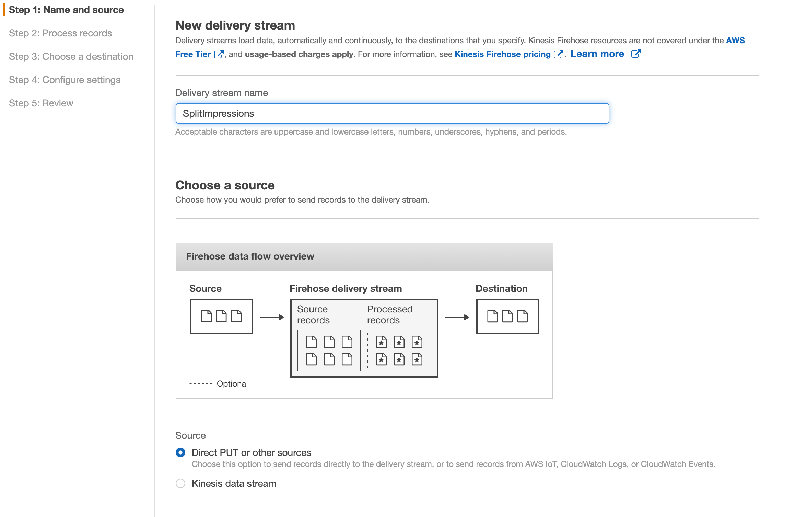
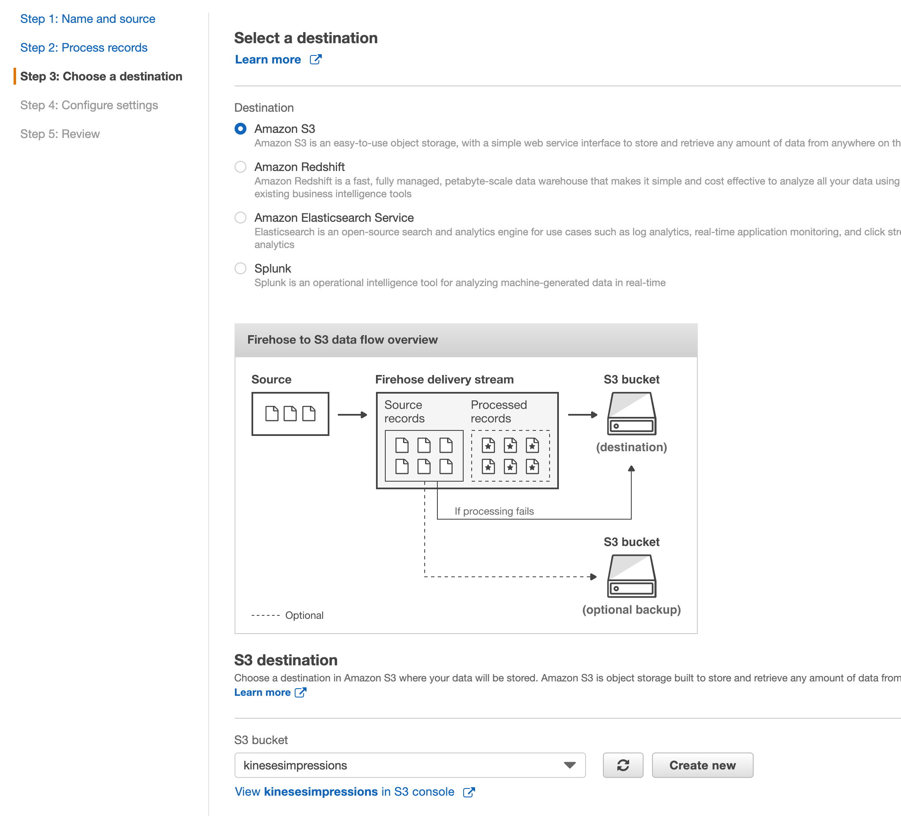
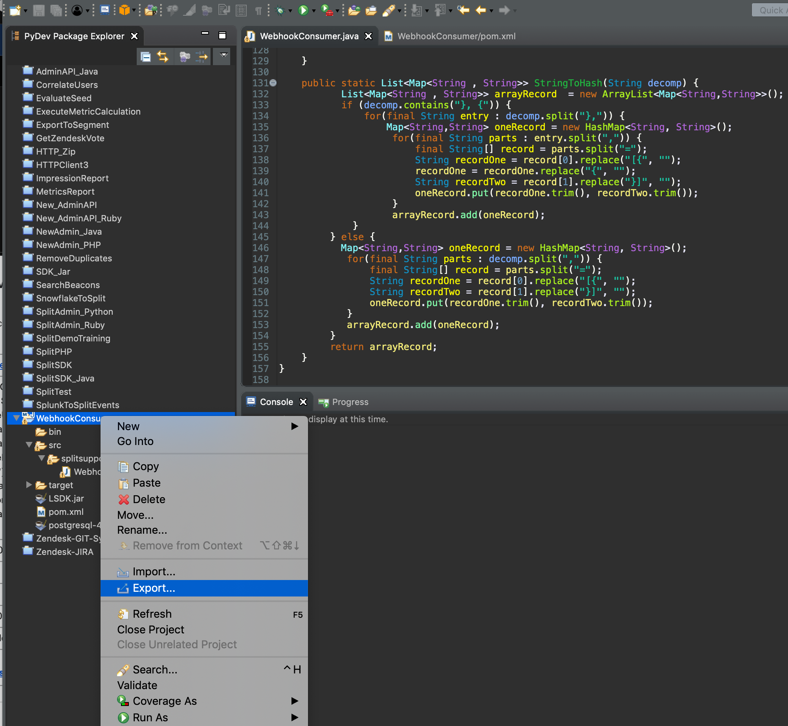
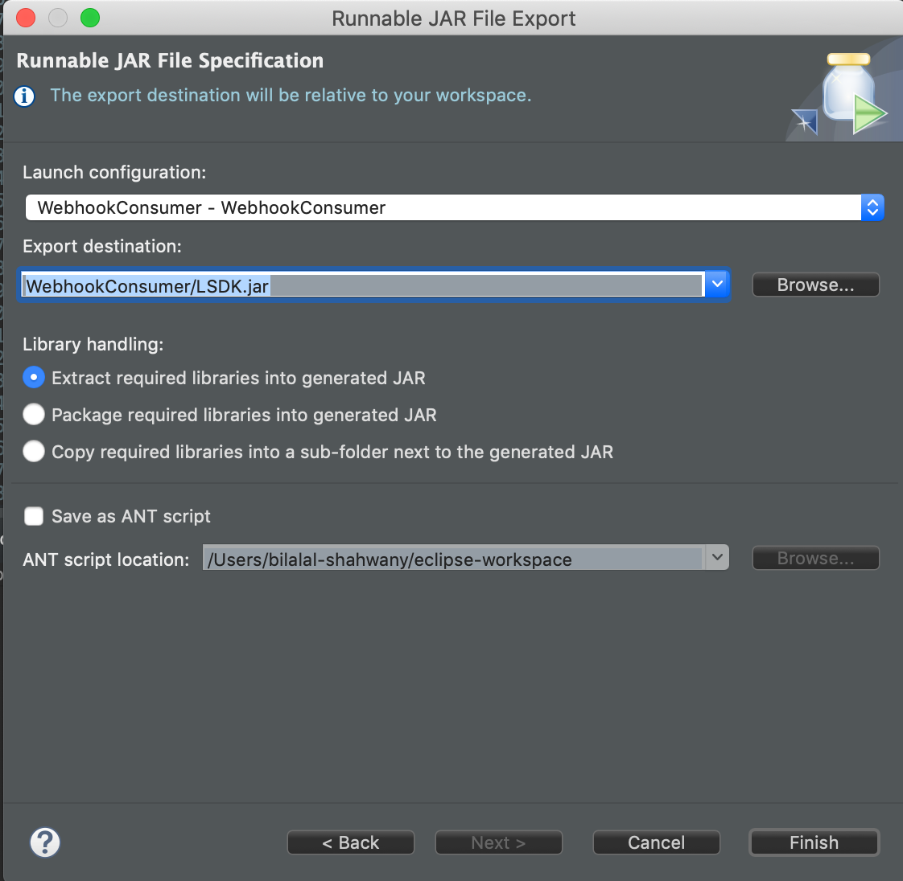
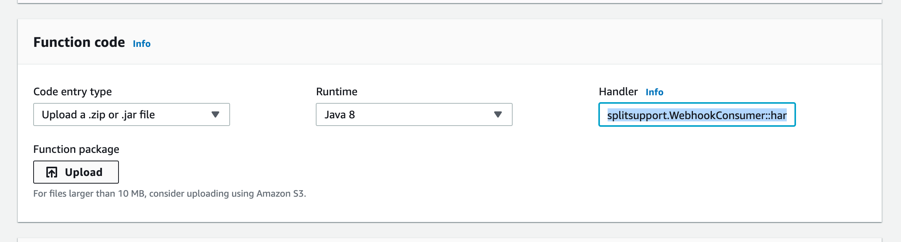
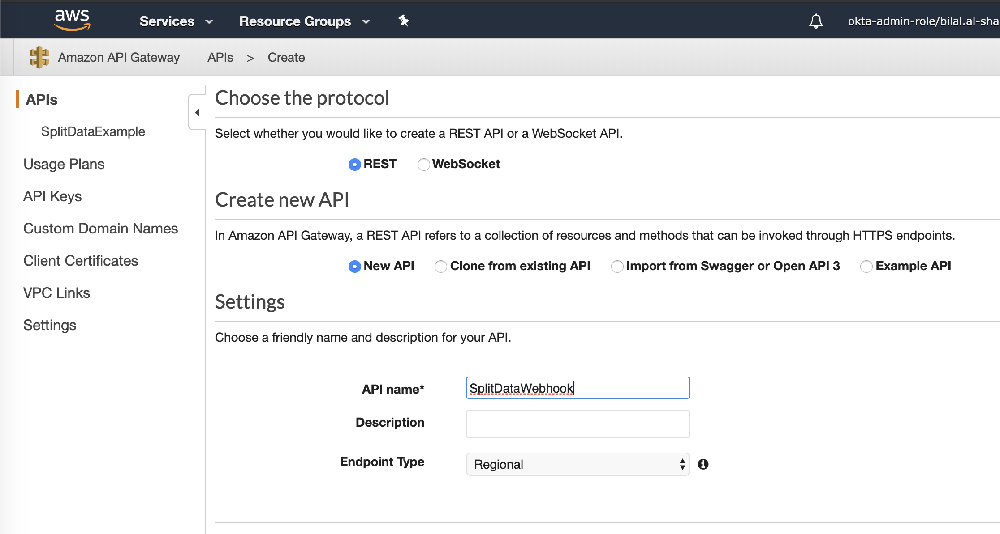
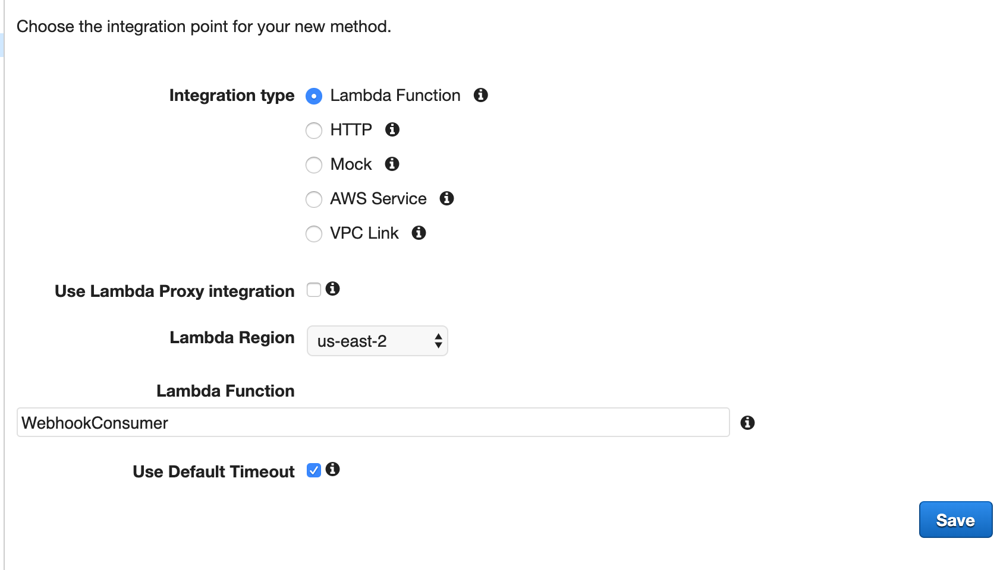
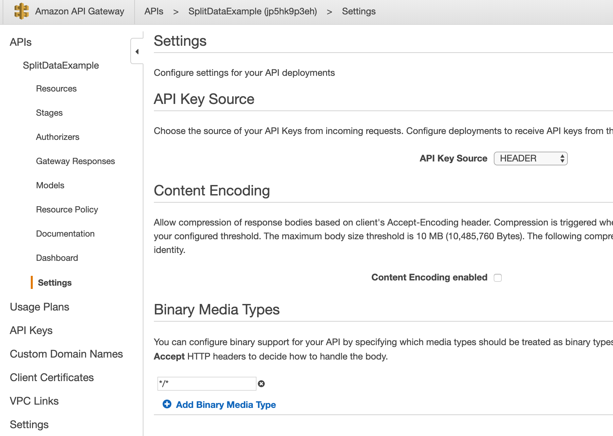
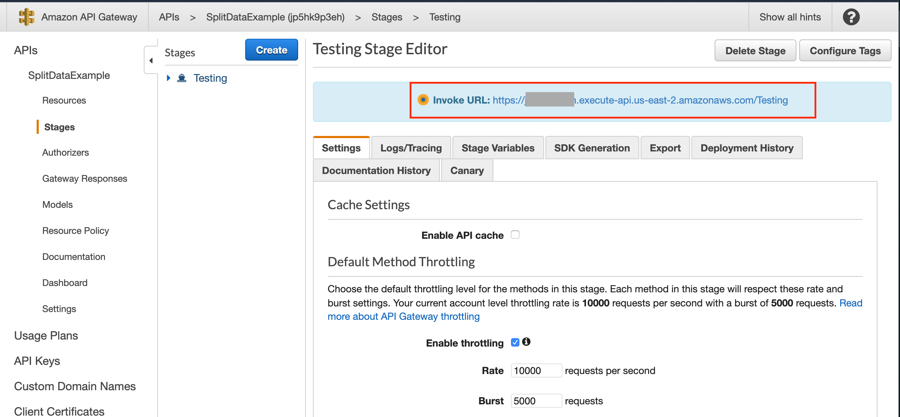
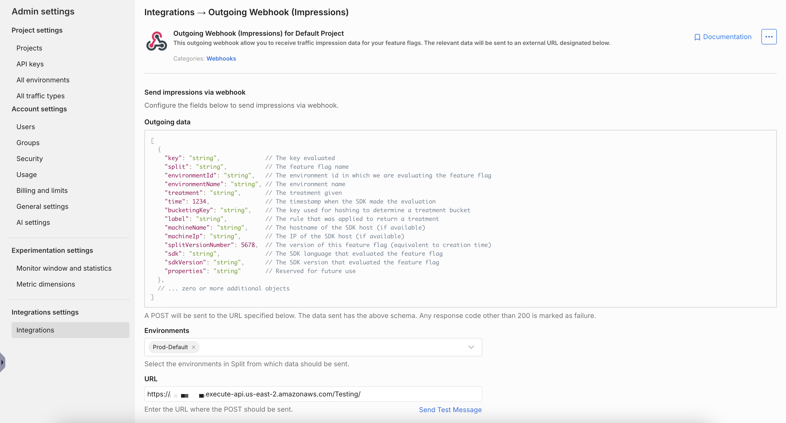

## Overview

This page describes how to setup all the AWS Cloud Serverless components to store Split Impressions data in a cloud database and allow downloading on-demand impressions data in CSV format.

Split Admin site provide a webhook integration option to send the Impression data as they are injected into Split cloud, we will use the webhook to extract Impression data.

We will also use AWS API Gateway as the Webhook service, the API Gateway will forward the post request to AWS Lambda, which will extract the Impression information and store it in an AWS PostgreSQL database.

We can then use a Python script to extract data from the PostgreSQL database with multiple combinations of conditions for User key, treatment, feature flag name, timestamp, and rule.

## Setup

1. To create the cloud database instance, login to AWS and select **Services** > **RDS**.

1. Click on the `PostgreSQL` option, and leave the latest version pre-selected.

   

1. Decide which template you like to use based on the expected amount of Impressions that will be flowing in your database, checkout the JSON structure for [each impression](/docs/feature-management-experimentation/api/webhook/impressions), and consult with a Database Administrator if needed. In our example, we selected the free tier as this is an example service.

   

1. Set the database name (in our example, it is split) and the **postgres** user password.

1. Select the DB instance size and amount of storage assigned to it, and click **Create Database**.

1. Once the database instance is created, click on it, which will open the **Summary** section.
   
   - Under the **Network & Security** tab, change the `Public accessibility` option to **Yes**.
   - Click on the **Modify** button and set this option to **Yes**.

1. Back to the Connectivity & security tab, copy the Endpoint. Your database is now ready to be used.

1. We now need to create the Impressions table in our database and [install the PostgreSQL client](https://www.postgresql.org/download/) in a desktop. Once it's installed, connect to your database using this command line:

   ```bash
   $ psql -h ***************.us-east-2.rds.amazonaws.com --username=postgresPassword for user postgres: *********
   psql (11.1, server 11.5)

   SSL connection (protocol: TLSv1.2, cipher: ECDHE-RSA-AES256-GCM-SHA384, bits: 256, compression: off)

   Type "help" for help.

   postgres=> 
   ```

1. Switch to the Split database and run the SQL below to create the table:
   
   ```sql
   postgres=> \c split
   split=> create table impressions (key varchar(500),  split varchar(1000), environment varchar(1000), treatment varchar(400), label varchar(500), time varchar(100), splitVersionNumber varchar(100)); 
   ```

1. The Second service needed is AWS Lambda, go back to the AWS console and select **AWS** > **Lambda**, click **Create function**, choose the `Author from scratch` option, and use Java 8 for the runtime engine.

1. Create the Java code for the Lambda service, we will use a Eclipse Maven project with the following dependencies:
       
   ```java
   <dependency>
      <groupId>com.amazonaws</groupId>
      <artifactId>aws-lambda-java-core</artifactId>
      <version>1.0.0</version>
   </dependency>
   <dependency>
   <groupId>org.postgresql</groupId>
   <artifactId>postgresql</artifactId>
   <version>42.2.8</version>
   </dependency>
   ```

1. Insert the code below in the class (the class name here is `WebhookConsumer.java`), and make sure to replace the RDS Database connection string and **postgres** user password. The code below will convert the JSON structure passed from the POST request to Dictionary objects, then loop through each Impression block to insert it into the database.

   ```java
   package splitsupport;
   import java.util.ArrayList;
   import java.util.HashMap;
   import java.util.List;
   import java.util.Map;
   import java.util.Properties;
   import com.amazonaws.services.lambda.runtime.Context;
   import com.amazonaws.services.lambda.runtime.RequestHandler;
   import java.sql.*;

   public class WebhookConsumer implements RequestHandler<Object, String> {
   @Override
   public String handleRequest(Object input, Context context) {
      String treatment="";
      try {
      String url = "jdbc:postgresql://*************.us-east-2.rds.amazonaws.com:5432/split";
      Properties props = new Properties();
      props.setProperty("user","postgres");
      props.setProperty("password","*******");
      Connection conn = DriverManager.getConnection(url, props);
      Statement st = conn.createStatement();
      List<Map<String , String>> impressions = StringToHash(input.toString());
      for (Map<String, String> imp1 : impressions) {
   // Implement the line below if you need to insert only unique keys per userid, label, treatment and split version
         if RecordNotExit(conn, imp1.get("key"), imp1.get("treatment"), imp1.get("split"), imp1.get("label"), imp1.get("environmentName"), imp1.get("splitVersionNumber"))
            treatment = imp1.get("treatment");
            String SQL = "INSERT INTO impressions(key, split, environment, treatment, time, label, splitVersionNumber) VALUES(?,?,?,?,?,?,?)";
            PreparedStatement pstmt = conn.prepareStatement(SQL, Statement.RETURN_GENERATED_KEYS);
            pstmt.setString(1, imp1.get("key"));
            pstmt.setString(2, imp1.get("split"));
            pstmt.setString(3, imp1.get("environmentName"));
            pstmt.setString(4, imp1.get("treatment"));
            pstmt.setString(5, imp1.get("time"));
            pstmt.setString(6, imp1.get("label"));
            pstmt.setString(6, imp1.get("splitVersionNumber"));
            int affectedRows = pstmt.executeUpdate();
            if (affectedRows < 1) {
               treatment="Failed";  
            } else {
               treatment="Success";              
            }
         }
      }
      } catch (Exception e) {
         System.out.print("Exception: "+e.getMessage());
         return "Exception: "+e.getMessage();
      }
      return treatment;
   }
   Public boolean RecordNotExit(Connection conn, String key, String treatment, String split, String label, String environmentName, String splitVersionNumber) {
      String SQL = "SELECT * FROM impressions WHERE key='"+key+"' AND split='"+split+"' AND environment='"+environment+"' and treatment='"+treatment+"' and label='"+label+"' and splitVersionNumber='"+splitVersionNumber+"'";
      Statement stmt = conn.createStatement();
      ResultSet resultSet = statement.executeQuery(SQL);
      boolean returnFlag=false;
      while (resultSet.next()) {
         returnFlag=true;
         break;
      }
      return returnFlag;
   }
   Public static List<Map<String , String>> StringToHash(String decomp) {
   List<Map<String , String>> arrayRecord = new ArrayList<Map<String,String>>();
   if (decomp.contains("}, {")) {
      for(final String entry : decomp.split("},")) {
            Map<String,String> oneRecord = new HashMap<String, String>();
            for(final String parts : entry.split(",")) {
               final String[] record = parts.split("=");
               String recordOne = record[0].replace("[{", "");
               recordOne = recordOne.replace("{", "");
               String recordTwo = record[1].replace("}]", "");
               oneRecord.put(recordOne.trim(), recordTwo.trim());
            }
            arrayRecord.add(oneRecord);
      }
   } else { 
      Map<String,String> oneRecord = new HashMap<String, String>();
      for(final String parts : decomp.split(",")) {
            final String[] record = parts.split("=");
            String recordOne = record[0].replace("[{", "");
            String recordTwo = record[1].replace("}]", "");
            oneRecord.put(recordOne.trim(), recordTwo.trim());
      }
      arrayRecord.add(oneRecord);
   }
   return arrayRecord; 
   }
   }
   }
   ```

1. Export a self-contained JAR file for your project, in Eclipse, right-click on the project name and select **Export**.

   

1. Select the **Runnable JAR File** option and click **Next**, then specify the JAR file name and click **Finish**.
   
   

1. Back on the AWS Lambda page, under the **Function code** section, update the **Handler** box with the following: `splitsupport.WebhookConsumer::handleRequest`. Then, upload the JAR file you just created:

   

1. The Third service needed is the API Gateway, select **Services** > **API Gateway**.

1. Click on the **Create API** button, use `Rest API` and `New API` options, type a name for your API service, and click **Create API**.
   
   

1. Click on your new created API Service, click the `Actions` list to add a POST Method Execution, select **Lambda Function** for the Integration type, and type the Lambda function name created previously.
   
   

1. Since Split zip the post body when calling the Webhook, we need to enable binary type for our API Gateway, under **Settings**, add `*/*` in **Binary Media Types**, and click **Save Changes**.
   
   

1. The last step is to create a Stage for your API Gateway, and generate the webhook URL under the **Stages** page, click **Create**.

   

1. Your Webhook service is ready now, login to the Split user interface, go to **Admin Settings**, click on **Integrations**, and click the **Add** button for **Outgoing Webhook (Impressions)**.

20. Select which environment's impressions to export, paste the API Gateway URL, and click **Save**.

    

The integration is setup now, once new Impressions are generated, they will be inserted into the RDS Database. 

## Verify impressions

For testing purposes, make sure a couple of Impressions are generated in any split in the environment, then from the command line `psql` console, verify if the impressions are inserted to the database:

```sql
split=> select * from impressions ;
   key    |     split      | environment | treatment |    label     |     time      
----------+----------------+-------------+-----------+--------------+---------------
 alphonso | sample_feature | Production  | off       | default rule | 1572632114350
 bob      | sample_feature | Production  | on        | whitelisted  | 1572632224436

(2 rows)
```

The attached Python framework can be used to extract the data and generate a CSV file:

1. Install the PostgreSQL Python library from the command line: `pip install psycopg2`.
1. Download the framework classes.
1. Update the following files:
   
   - `Constants.py`: This include the PostgreSQL connection and username/password variables, and the generated report and log files path.
   - `Main.py`: This is the main class to run, the variables below can be set to filter out the data needed:
     
     - `startDate`: The start date in Epoch Time.
     - `endDate`: End date in Epoch Time.
     - `environmentName`: Set the environment name.
     - `userKey`: Set specific user key.
     - `labelName`: Set the rule name.
     - `treatment`: Set the treatment name.
     - `splitName`: Set the feature flag name.

Here is a sample of the generated CSV report:

```bash
User Key, Split, Environment, Treatment, Rule, Time
alphonso,sample_feature,Production,off,default rule,1572632114350
bob,sample_feature,Production,on,whitelisted,1572632224436
anonymous80008,front_end_packages_anonymous,Production,checked,default rule,1572894348393
anonymous652788,front_end_packages_anonymous,Production,checked,default rule,1572894351426
anonymous484843,front_end_packages_anonymous,Production,unchecked,default rule,1572894350414
anonymous854427,front_end_packages_anonymous,Production,unchecked,default rule,1572894349404
anonymous652788,front_end_discount_coupon_anonymous,Production,high,default rule,1572894351425
anonymous854427,front_end_discount_coupon_anonymous,Production,high,default rule,1572894349403
anonymous484843,front_end_discount_coupon_anonymous,Production,high,default rule,1572894350413
anonymous80008,front_end_discount_coupon_anonymous,Production,low,default rule,1572894348392
anonymous28108,front_end_discount_coupon_anonymous,Production,off,default rule,1572894352430
```