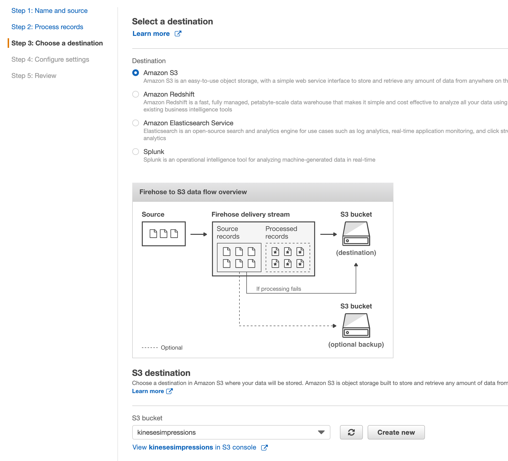
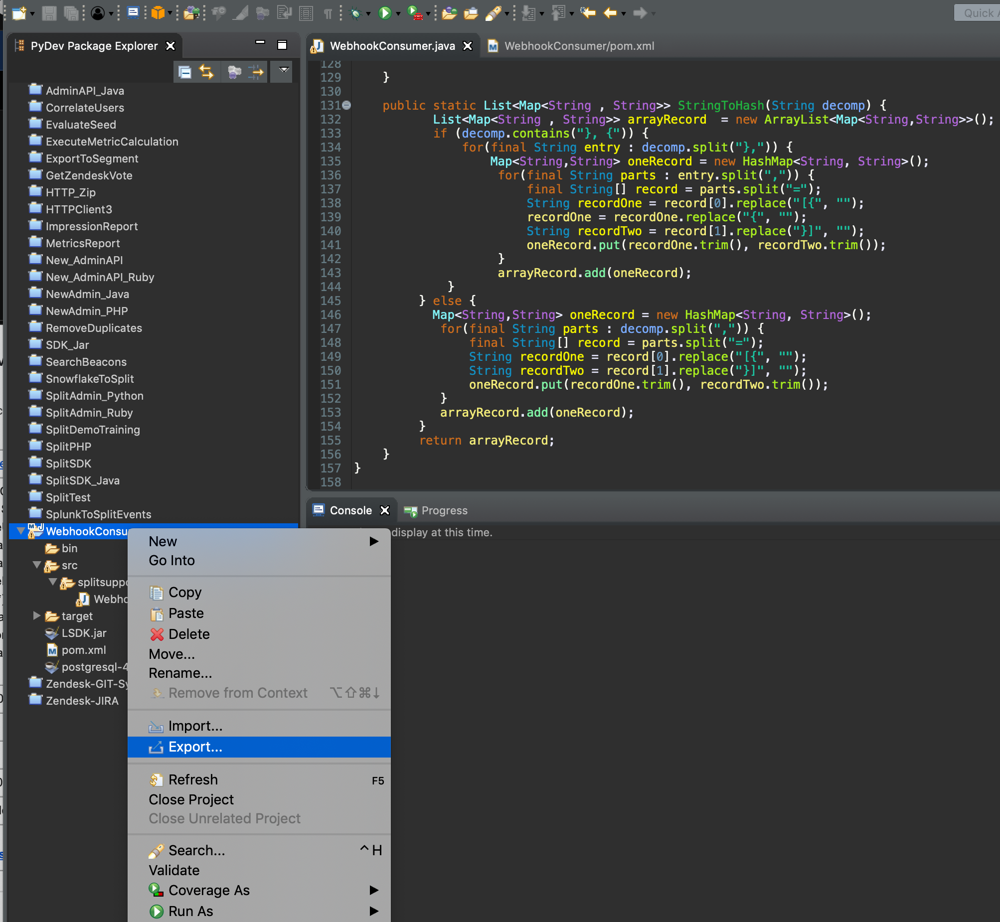
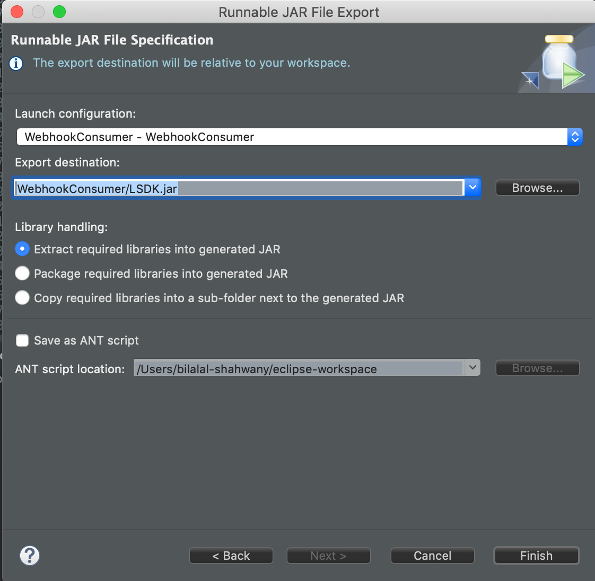
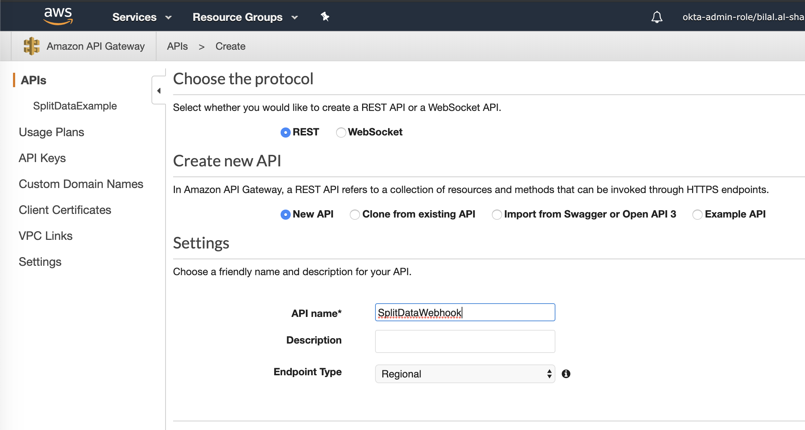
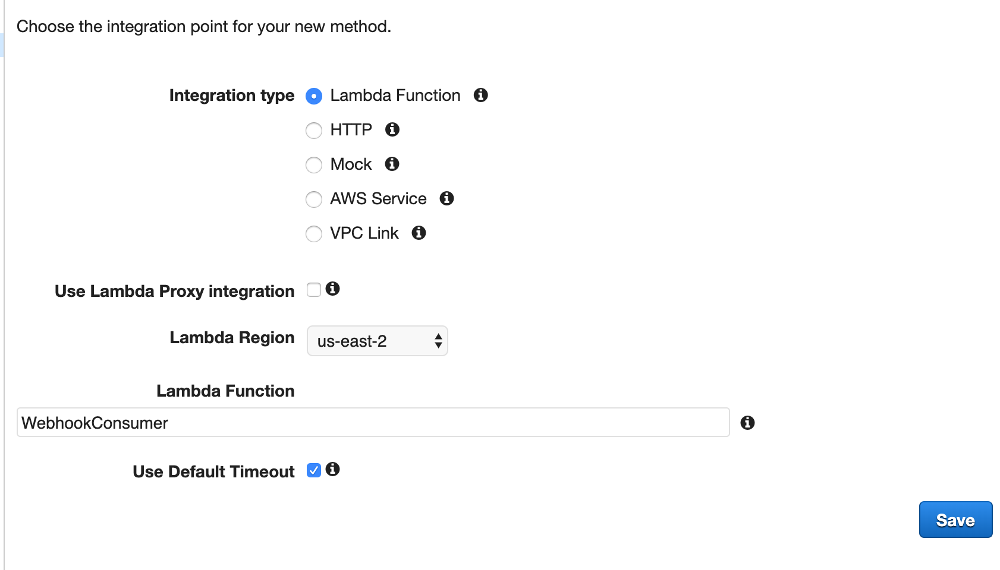
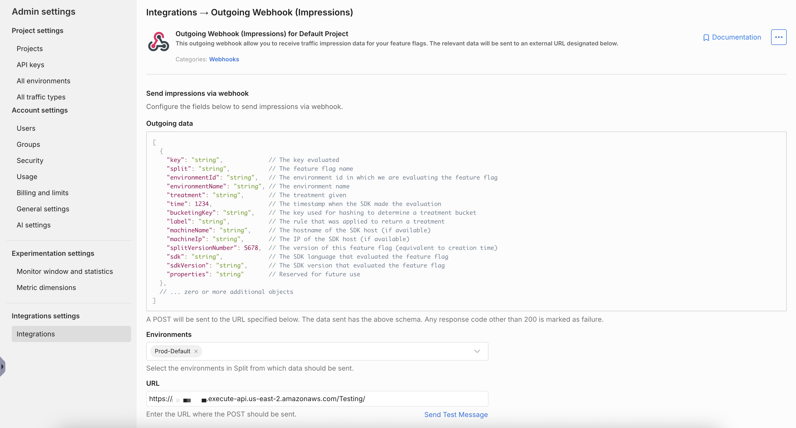

## Overview

This page describes how to setup an AWS Kinesis Stream service to store Split Impressions data in AWS S3 in JSON format.

Split Admin site provide a webhook integration option to send the Impression data as they are injected into Split cloud, we will use the webhook to extract Impression data.

We will also use AWS API Gateway as the Webhook service, the API Gateway will forward the post request to AWS Lambda, which will extract the Impression information and send it to AWS Kinesis Stream, which will send it to Firehose service which has a built-in integration with S3.

## Setup

1. To create the Kinesis Firehose service, login to AWS and select **Services** > **Kinesis** > **Data Stream** and click on **Create Kinesis stream** button.

1. Put the service name, specify the shards number based on the amount of impressions generated, consult an AWS expert for more info on shards, and click **Create Kinesis stream**.

   

1. Once the Kinesis Stream is created, select its record and click **Connect Kinesis consumers**.

   

1. Click on **Connect to Delivery stream** button.
   
   

1. Specify the Firehose service name and click **Next**.
   
   

1. In the **Select a destination** page, make sure **S3** is selected, specify the S3 bucket for the target storage, and click **Next**.

   

1. Select the IAM Role needed to access the service, consult with an AWS expert for more info, in this example, we used a role that has `AmazonKinesisFullAccess` and `AmazonKinesisFirehoseFullAccess` policy, click **Next**, then click **Create delivery stream**.

   

1. The Second service needed is AWS Lambda, select **AWS** > **Lambda**, click on the **Create function** button, choose the **Author from scratch** option, and use `Java 8` for the runtime engine.

   

1. Next step is to create the Java code for Lambda service, we will use an **Eclipse Maven** project with the following dependencies:

   ```java
   <dependency>
       <groupId>com.amazonaws</groupId>
       <artifactId>aws-lambda-java-core</artifactId>
       <version>1.0.0</version>
   </dependency>
   <dependency>
       <groupId>com.amazonaws</groupId>
       <artifactId>aws-java-sdk-core</artifactId>
       <version>1.11.671</version>
   </dependency>
   <dependency>
       <groupId>com.amazonaws</groupId>
       <artifactId>amazon-kinesis-client</artifactId>
       <version>1.11.2</version>
   </dependency>
   <dependency>
       <groupId>org.json</groupId>
       <artifactId>json</artifactId>
       <version>20180813</version>
   </dependency>
   ```

1. Insert the code below in the class (the class name here is `WebhookConsumer.java`), make sure to replace the `awsAccessKey`, `awsSecretKey`, `kinesisStreamName`, and `awsRegion`. The code below will convert the JSON structure passed from the POST request to Dictionary objects, then loop through each Impression block and send a bulk post to the Kinesis Stream service.

    ```java
    package splitsupport;
    import java.nio.ByteBuffer;
    import java.util.ArrayList;
    import java.util.HashMap;
    import java.util.List;
    import java.util.Map;
    import org.json.JSONObject;
    import com.amazonaws.ClientConfiguration;
    import com.amazonaws.ClientConfigurationFactory;
    import com.amazonaws.auth.AWSStaticCredentialsProvider;
    import com.amazonaws.auth.BasicSessionCredentials;
    import com.amazonaws.services.kinesis.AmazonKinesis;
    import com.amazonaws.services.kinesis.AmazonKinesisClientBuilder;
    import com.amazonaws.services.kinesis.model.PutRecordsRequest;
    import com.amazonaws.services.kinesis.model.PutRecordsRequestEntry;
    import com.amazonaws.services.kinesis.model.PutRecordsResult;
    import com.amazonaws.services.lambda.runtime.Context;
    import com.amazonaws.services.lambda.runtime.RequestHandler;

    public class WebhookConsumer implements RequestHandler<Object, String>  {
    @Override
    public String handleRequest(Object input, Context context) {
    String treatment="";
    try {
        String awsAccessKey="xxxxxxxxxxx";
        String awsSecretKey="xxxxxxxxxxxxxxxxxxxxx";
        String awsRegion="us-east-2";
        String kinesisStreamName="SplitStream";

        BasicSessionCredentials awsCredentials = new BasicSessionCredentials(awsAccessKey, awsSecretKey, sessionToken);
        ClientConfiguration awsClientConfig = new ClientConfigurationFactory().getConfig();
        AmazonKinesisClientBuilder clientBuilder = AmazonKinesisClientBuilder.standard();
        clientBuilder.setRegion(awsRegion);
        clientBuilder.setCredentials(new AWSStaticCredentialsProvider(awsCredentials));
        clientBuilder.setClientConfiguration(awsClientConfig);        
        AmazonKinesis kinesisClient = clientBuilder.build();
        List<Map<String , String>> impressions = StringToHash(input.toString());     
        PutRecordsRequest putRecordsRequest  = new PutRecordsRequest();   
        putRecordsRequest.setStreamName(kinesisStreamName);
        List <PutRecordsRequestEntry> putRecordsRequestEntryList  = new ArrayList<>(); 
        PutRecordsRequestEntry putRecordsRequestEntry  = new PutRecordsRequestEntry();
        for (Map<String, String> imp1 : impressions) {
            JSONObject messageJson = new JSONObject();
            messageJson.put("key", imp1.get("key"));
            messageJson.put("split", imp1.get("split"));
            messageJson.put("environmentName", imp1.get("environmentName"));
            messageJson.put("time", imp1.get("time"));
            messageJson.put("label", imp1.get("label"));
            messageJson.put("treatment", imp1.get("treatment"));
                        putRecordsRequestEntry.setData(ByteBuffer.wrap(messageJson.toString().getBytes()));
            putRecordsRequestEntry.setPartitionKey("partition-2");
            putRecordsRequestEntryList.add(putRecordsRequestEntry);         
        }
        putRecordsRequest.setRecords(putRecordsRequestEntryList);
        PutRecordsResult putRecordsResult  = kinesisClient.putRecords(putRecordsRequest);
        System.out.println("Put Result" + putRecordsResult);
        treatment=putRecordsResult.toString();
        } catch (Exception e) {
        System.out.print("Exception: "+e.getMessage());
        return "Exception: "+e.getMessage();
        }
        return treatment;
    }

    public static List<Map<String , String>> StringToHash(String decomp) {
        List<Map<String , String>> arrayRecord  = new ArrayList<Map<String,String>>();
        if (decomp.contains("}, {")) {
        for(final String entry : decomp.split("},")) {
        Map<String,String> oneRecord = new HashMap<String, String>();
            for(final String parts : entry.split(",")) {
            final String[] record = parts.split("=");
            String recordOne = record[0].replace("[{", "");
            recordOne = recordOne.replace("{", "");
            String recordTwo = record[1].replace("}]", "");
            oneRecord.put(recordOne.trim(), recordTwo.trim());
            }
            arrayRecord.add(oneRecord);
        }
    } else {   
        Map<String,String> oneRecord = new HashMap<String, String>();
        for(final String parts : decomp.split(",")) {
        final String[] record = parts.split("=");
        String recordOne = record[0].replace("[{", "");
        String recordTwo = record[1].replace("}]", "");
        oneRecord.put(recordOne.trim(), recordTwo.trim());
        }
        arrayRecord.add(oneRecord);
    }
    return arrayRecord;
    }
    }
    ```

1. Export a self-contained JAR file for your project, in Eclipse, right-click on the project name and select **Export**.

   

1. Select the **Runnable JAR File** option and click **Next**, then specify the JAR file name and click **Finish**.
   
   

1. Back on the AWS Lambda page, under the **Function code** section, update the **Handler** box with the following: `splitsupport.WebhookConsumer::handleRequest`. Then, upload the JAR file you just created:

   

1. The Third service needed is the API Gateway, select **Services** > **API Gateway**.

1. Click on the **Create API** button, use `Rest API` and `New API` options, type a name for your API service, and click **Create API**.
   
   

1. Click on your new created API Service, click the `Actions` list to add a POST Method Execution, select **Lambda Function** for the Integration type, and type the Lambda function name created previously.
   
   

1. Since Split zip the post body when calling the Webhook, we need to enable binary type for our API Gateway, under **Settings**, add `*/*` in **Binary Media Types**, and click **Save Changes**.
   
   

1. The last step is to create a Stage for your API Gateway, and generate the webhook URL under the **Stages** page, click **Create**.

   

1. Your Webhook service is ready now, login to the Split user interface, go to **Admin Settings**, click on **Integrations**, and click the **Add** button for **Outgoing Webhook (Impressions)**.

20. Select which environment's impressions to export, paste the API Gateway URL, and click **Save**.

    