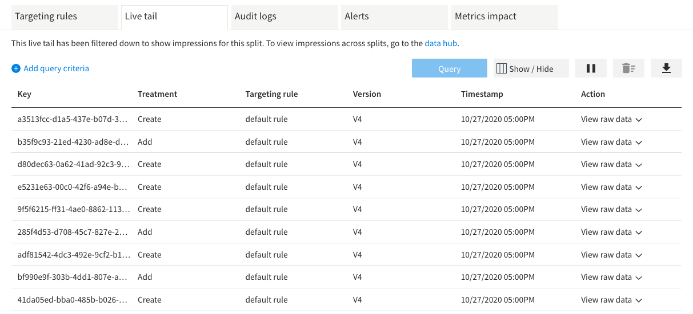
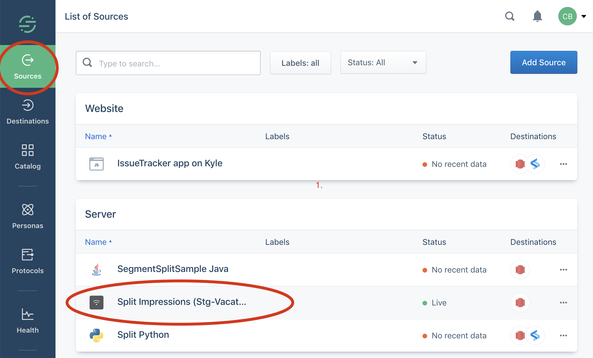
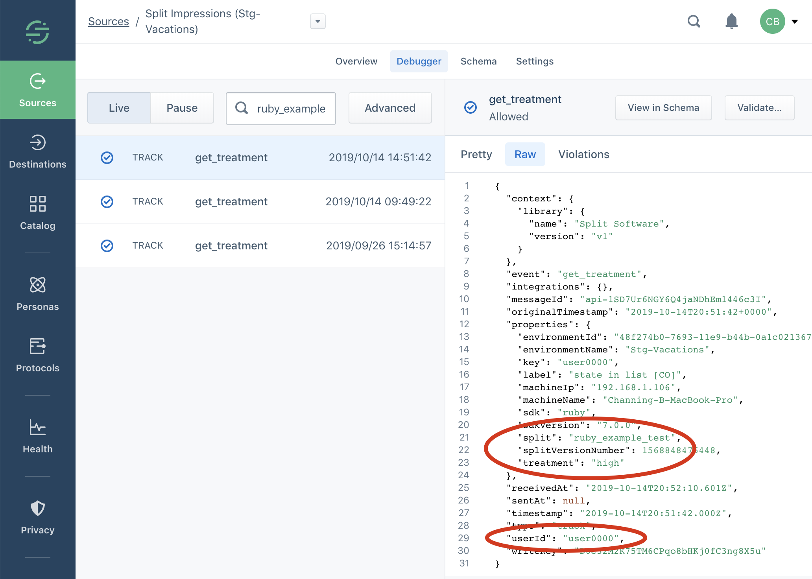

## Overview

This page explains how to verify that you are correctly receiving Split impression events in Segment after configuring [Harness FME as a segment source](/docs/feature-management-experimentation/integrations/segment#harness-fme-as-a-source). If you have specified more than one Split traffic type in the configuration—each traffic type mapped to either Segment's anonymousId or userId—you should check that you are getting impressions correctly for at least one feature flag of each traffic type. Additionally, if you have multiple Split environments configured as Segment sources, make sure to check each of the corresponding Segment sources.

First, a multi-step verification method using the Segment workspace UI is described. Next, we give an alternative technique that you may use if you have an SQL-queryable Warehouse Destination configured in Segment with the Split Source(s) connected to that destination. In this case, a couple of SQL queries can show whether or not you are correctly receiving impressions from Split in Segment. 

## Procedure (If no data warehouse connected to Split Source in Segment)

Run through these steps for each Split environment configured as a Segment source, and each Split traffic type configured for that source.

1. First, make sure that you are getting impressions for the feature flag in the given environment by navigating to the Live tail tab of the feature flag and initiating a query. Keep in mind that this tab will only show impressions if the feature flag is actively receiving traffic.

   

1. In your Segment workspace, navigate to the list of sources and select the source you wish to check. It will be an HTTP Source. Hopefully, whoever set it up will have employed the best practice of including the name of the Split environment in the name of the source, so you know which source corresponds to the environment you are verifying.

   

1. Click on the Source entry to go to the source detail page, where you should select the Debugger tab and then in the search box type the name of the feature flag for which you are looking for impression events (as shown below, where the search term is ruby_example). 

   This will filter the list of events to just those that contain a string matching the search term.The Split/Segment integration sends Split impressions to Segment as events named get_treatment. The list of matching events should include all the get_treatment events for that feature flag.get_treatment_Events.png

1. Click on one of the get_treatment events to see the detailed description of the event. Select the Raw tab in order to see the JSON body of the event.

   

1. Check the JSON data. The value of the environmentName property should be the appropriate Split environment and the feature flag property should be the name of the feature flag for which you are checking impressions. Finally, make sure that the key passed to Split's getTreatment() shows up as the value of either the userId field or the anonymousId field. Which one you should look for depend on how you have configured the Split/Segment integration. 

   If you have mapped the traffic type of the feature flag to Segment's userId, then you should see a userId field (as in the image above). If you have mapped the traffic type of the feature flag to Segment's anonymousId, then you should see an anonymousId field. The value of that field should be a user key that was passed to getTreatment for the feature flag.

Perform each of these steps for every combination of environment and traffic type for which you are sending impression events from Split to Segment, making sure to check whether or not impression events are arriving, and that they have the correct mapping of Split traffic type to either userId or anonymousId in Segment.

## Procedure (with Segment backend data warehouse)

The ability to query the impression events with SQL makes verifying the operation of the Split/Segment integration much simpler. 

```sql
select distinct split from split_impressions_stg_vacations.get_treatment 
                      where user_id != '';
```

This query will return all the feature flags for traffic types configured to map the Split getTreatment key to a Segment user_id (and hence non-null). If this query returns feature flags of a traffic type that is supposed to be mapped to Segment's anonymousId, then something is wrong with your integration configuration, or there are impression events that occurred prior to the configuration being made correctly. 

The view queried (in this case, `split_impressions_stg_vacations`) is determined by the name you have configured for the Segment Source associated with your Split environment. 

Similarly, this query will return all the feature flags for traffic types configured to map the Split `getTreatment` key to a Segment `anonymousId`. 

```sql
select distinct split from split_impressions_stg_vacations.get_treatment 
                      where anonymous_id != '';
```

If you have multiple Split environments configured as Segment sources, you will need to run the queries against each source.

