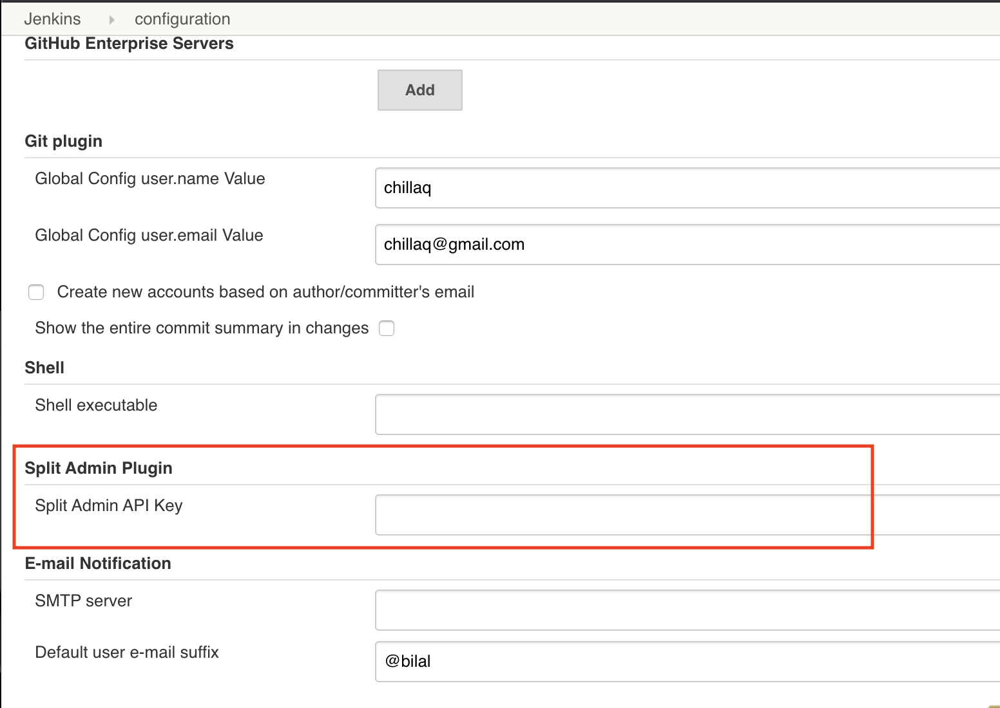

<p>
  <button hidden style={{borderRadius:'8px', border:'1px', fontFamily:'Courier New', fontWeight:'800', textAlign:'left'}}> help.split.io link: https://help.split.io/hc/en-us/articles/360044691592-Jenkins </button>
</p>

## Harness FME Jenkins Plugin
Jenkins plugin uses Harness FME Admin REST API to create, update, and delete feature flags as part of test automation and build workflow. Reference to Harness FME Admin API can be found [here](https://docs.split.io/reference).

### Installation
In Jenkins Plugin Manager page, under Available tab, enter **Split Admin** to find the plugin and install it.


### How to use

1. Store the Harness FME Admin API Key in Split Admin API Key edit box found in Manage Jenkins-> Configure System page.

   

2. To use the plugin in Jenkins Jobs, under the Configure section of the job, click **Add build step** and select **Split Admin Task**.

   

3. Select a task from the available options, see below for supported tasks, fill out the fields that are required for each task and click **Save**.

   If the Admin API call return code is 429 (throttled), the plugin will sleep for 5 seconds then retry the request, max retried are capped at 10.

4. Plugin use Apache Log4j class for logging. Debug level will log every HTTP request headers and body and response payload returned. To enable Debug logging, create a new logger in **Manage Jenkins->System Log->New Log Recorder**, set the logger class to below, and set the Log level to **ALL**.

<ul>

```
io.split.jenkins.plugins
```

</ul>

### Supported Tasks

* **Create Feature Flag From YAML File:** This task will read a given YAML file populated with feature flags containing treatments, individually targeted keys, dynamic configs and percentages for default rule, see YAML format section below. The plugin will check if feature flags and flag definitions exist in the given project/environment, if not, the subtask is skipped, the fields below are required: `Project Name` `Environment Name` `Traffic Type Name`.
   If there are missing fields for feature flags in YAML file, the plugin will attempt to complete the definitions automatically, see examples in YAML format section.

* **Create Feature Flag:** This task will create a new feature flag. The fields below are required. The plugin will check if the feature flag exists in the given project. If it exists, the task is skipped with no errors returned: `Project Name` `Split Name` `Traffic Type Name`.

* **Add Feature Flag To Environment:** This task will add new definitions to an environment of an existing feature flag. The fields below are required. The plugin will check if feature flag definitions exist in the given environment. If it exists, the task is skipped with no errors returned: `Project Name` `Environment Name` `Split Name` `Split Definitions`. The definitions field should match the JSON structure accepted by Harness FME Admin API, see the [API reference](https://docs.split.io/reference#create-split-definition-in-environment) for more info.

* **Add Key To Individual target:** This task will add new key to a treatment's individual target section of an existing feature flag definitions. The fields below are required: `Project Name` `Environment Name` `Split Name` `Treatment Name` `Individual target Key`.

* **Kill Feature Flag:** This task will perform "Kill" action on a given feature flag in an environment. The fields below are required: `Project Name` `Environment Name` `Split Name`.

* **Remove Feature Flag Definition:** This task will delete feature flag definitions in a given environment. The fields below are required. The plugin will check if feature flag definitions exists in the given environment. If it does not, the task is skipped with no errors returned: `Project Name` `Environment Name` `Split Name`.

* **Delete Feature Flag:** This task will delete a feature flag that does not have any definitions in any environment, the fields below are required, the plugin will check if the feature flag exists in the given project, if it does not, the task is skipped, no errors returned: `Project Name` `Split Name`.

#### YAML format

```yaml
- feature_flag_name:
     treatment: "treatment_applied_to_this_entry"
     keys: "single_key_or_list"
     percentage: "integer between (0-100)"
```

##### Examples

The feature flag below has 3 treatments (on/off/unallocated), only on treatment contains Individual target id key1. For default rule, on is set to 80%, off is set to 10%, the plugin will assign the last 10% to unallocated treatment.

```yaml
- percentage_less_100_flag:
    treatment: "on"
    keys: ["key1"]
    percentage: "80"
- percentage_less_100_flag:
    treatment: "off"
    percentage: "10"
- percentage_less_100_flag:
    treatment: "unallocated"
```

The feature flag below contains only treatments, no percentages specified for default rule, the plugin will set the first treatment to 100% for default rule.
```yaml
- no_rule_flag:
    treatment: "on"
- no_rule_flag:
    treatment: "off"
```

The feature flag below contains only one treatments, no percentages specified for default rule, the plugin will add second treatment with name SecondTreatment, and set the first treatment to 100% for default rule.
```yaml
- one_treatment_flag:
    treatment: "one"
```

The feature flag below has two treatments with their dynamic configs, treatment off has two keys in the Individual target section, default rule has only on treatment set to 50%, the plugin will add off with 50%.
```yaml
- correct_data_flag:
    treatment: "on"
    config: "{\\\"desc\\\" : \\\"this applies only to ON treatment\\\"}"
    percentage: "50"
- correct_data_flag:
    treatment: "off"
    keys: ["key1", "key2"]
    config: "{\\\"desc\\\" : \\\"this applies only to ON treatment\\\"}"
```

The feature flag below only has the name, no other information is given, the plugin will add on and off treatments, and set default rule to off with 100%
```yaml
- no_treatment_flag:
```