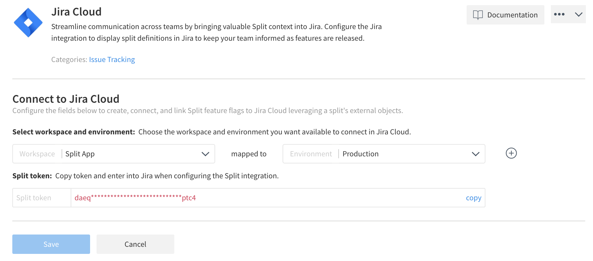
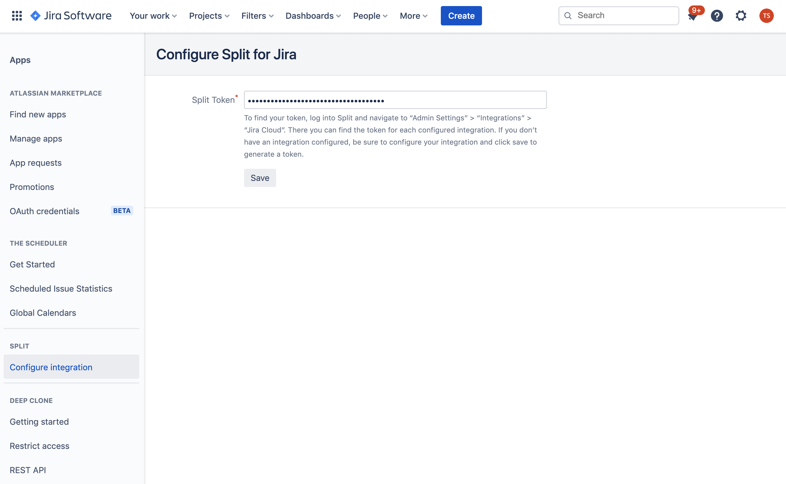
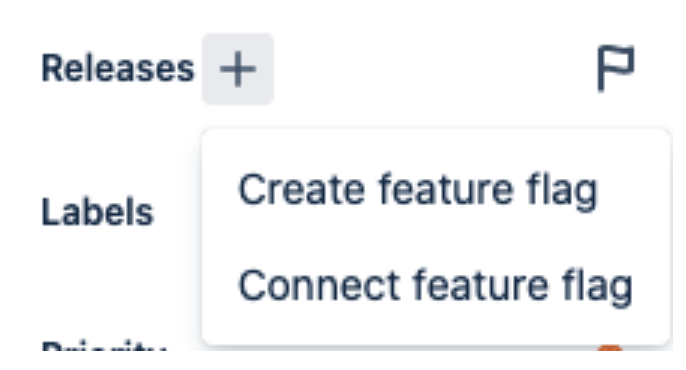
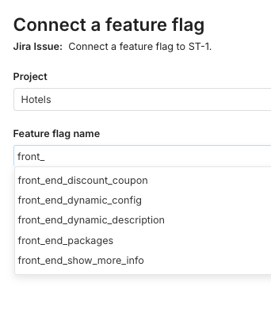
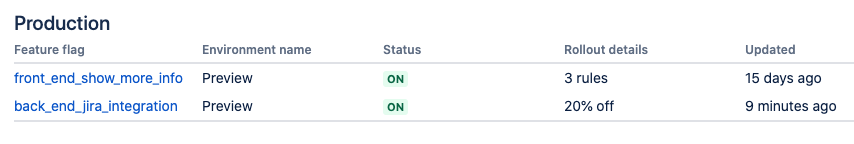

Jira Software offers flexible issue and project tracking, and the Harness FME for Jira integration allows you to connect feature flags and Jira issues from either Jira or FME, and view details in both Jira and FME. With this bidirectional connection, you can track rollouts with an associated issue in Jira and issues tied to a feature flag in Harness FME. If you are tracking source code changes and deployments in Jira, you will be able to go from feature flag to issue to code change or deployment details in as few as three clicks.

:::info[Jira Cloud only]
This integration only works with Jira Cloud product offerings and does not work with Jira Server. 
:::

If you are having trouble completing the integration please contact us at [support@split.io](email:support@split.io).

## Setting up in Harness FME

To set up in Harness FME, do the following:

1. Click the **profile button** at the bottom of the left navigation pane and click **Admin settings**.
2. Click **Integrations** and navigate to the Marketplace tab.
3. Locate the Jira Cloud integration, click **Add** and select the project and associated environments you want to connect to Jira Cloud.

   **Note:** You can select multiple projects but only one environment per project.

4. Click **Save** to generate a token. The token that is generated is a Harness FME Admin API key.

5. Click **copy** to copy the Harness FME token to the clipboard. You can now use this token to configure the Jira Cloud.

   

**Note: If your projects have set [project view permissions](https://help.split.io/hc/en-us/articles/12621628930445-Project-view-permissions), ensure that the projects you want to use with this integration grant access to the Admin API Key that you just generated in this section.**

## Setting up in Jira

To set up in Jira, do the following:

1. In the [Atlassian Marketplace] (https://marketplace.atlassian.com/apps/1224872/split-for-jira?hosting=cloud&tab=overview), install Split for Jira in your Jira Cloud instance.

2. Within **Apps** in Jira Cloud, and after the Split for Jira app is installed, click **Configure integration** in the side menu under Harness FME.

3. Enter the token you copied and click **Save**.

   

With the app configured, you can connect Harness FME feature flags to Jira issues.

## Connecting feature flags and issues
 
Once the integration is installed, you can do either of the following:
  
* **From Harness FME:** Navigate to the Integrations tab of the feature flag and click the **Connect Jira Issue** button. Enter the desired issue number.

* **From Jira:** In the right hand column of an issue, click **More fields** to expand the section and then **Releases +**. When you click the plus sign, you can either create a feature flag or connect to an existing flag.

   
  

  * Selecting Create feature flag takes you to your Harness account and the FME feature flag creation dialog opens, with the current Jira ticket entered. 
  * Selecting Connect feature flag takes you to a new dialog box that allows you to choose a feature flag.

    

:::tip
You can connect multiple flags to an issue and multiple issues to a flag.
:::

:::info[Note]
You must select a Harness project that has been configured in the Jira integration setup. A Jira instance is 1:1 with a Harness account, and the integration can be configured for one or more projects.
:::

## Viewing your connections
 
Once you’ve connected feature flags to issues, you can do either of the following:
 
* **In Harness FME:** You see all attached issues on the Integrations tab of each feature flag.
 
* **In Jira:** You see either the name of the flag or the number of flags to which that issue is connected. On the right hand side, it indicates if the feature flags are active in the primary environment, which is selected for each project when the integration is set up.
 
  If you have multiple flags, hovering over the status indicator shows the status of all flags. If you have only one flag, hovering over the status displays information about the rollout plan. 

  

  

  If you click on the flag name or the text telling you how many flags there are, a dialog box opens with a link to the flag, the primary environment, the status of each flag, and the last time the flag was saved.
 
  For Rollout details, if you only use the Default rule, it shows you the percentage that is allocated to the same treatment you chose for the Default treatment. Otherwise, it shows you the number of rules that you have on the flag. 

  

   :::info[Note]
   Since you can navigate to the feature flag, we no longer send and store all of the changes in Jira.
   :::
 
## Disconnecting an issue
 
You can disconnect an issue from a feature flag, on the Integrations tab of the flag.
