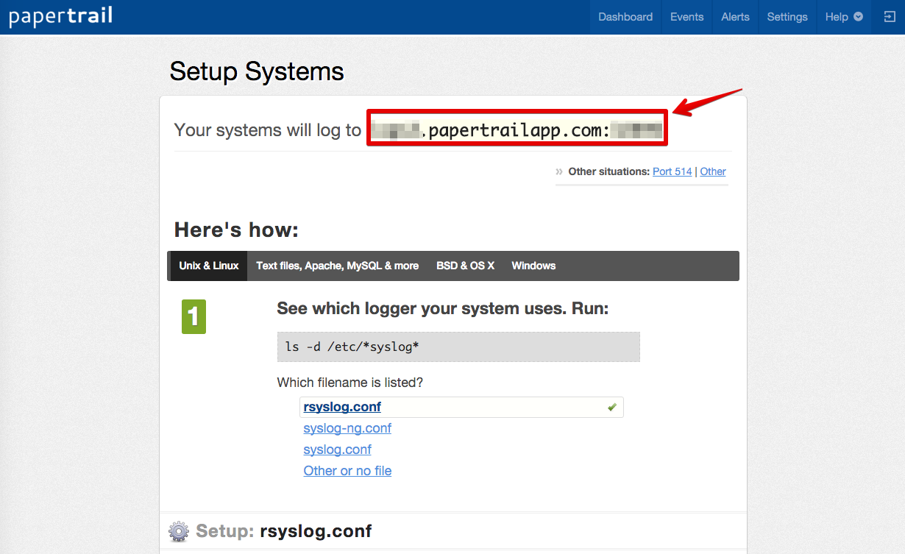
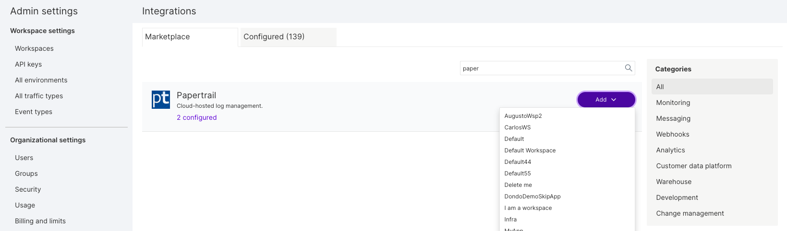
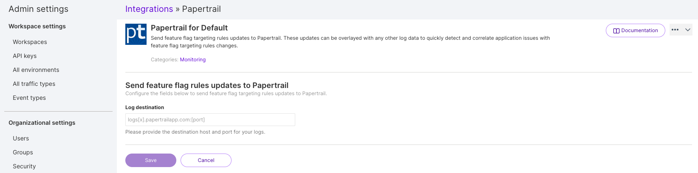

  <button hidden style={{borderRadius:'8px', border:'1px', fontFamily:'Courier New', fontWeight:'800', textAlign:'left'}}> help.split.io link: https://help.split.io/hc/en-us/articles/360020700512-Papertrail </button>

Papertrail provides cloud-hosted log management solutions. Integrate with Papertrail to get Split rollout and rollback events in Papertrail. These events can be overlayed with any other log data to quickly detect and correlate application issues with Split changes.

If you are having trouble completing the integration, contact us at [support@split.io](mailto:support@split.io).

## In Papertrail
 
1. Log in to your Papertrail account.
2. Go to [https://papertrailapp.com/systems/setup](https://papertrailapp.com/systems/setup).
3. Copy the log destination ([host] and [port] information) required for this integration.

   

## In Split

1. Click the **profile button** at the bottom of the left navigation pane and click **Admin settings**.
2. Click **Integrations** and navigate to the Marketplace tab.

   

3. Find Papertrail in the integrations list, click **Add** and select the Split project for which you would like to configure the integration.

   

4. Paste the log destination you copied in step 3 of the Papertrail instructions.
5. Click **Save**.

Split notifications should now be flowing into Papertrail. Of course, please contact [support@split.io](mailto:support@split.io) if you have any issues with this integration.
