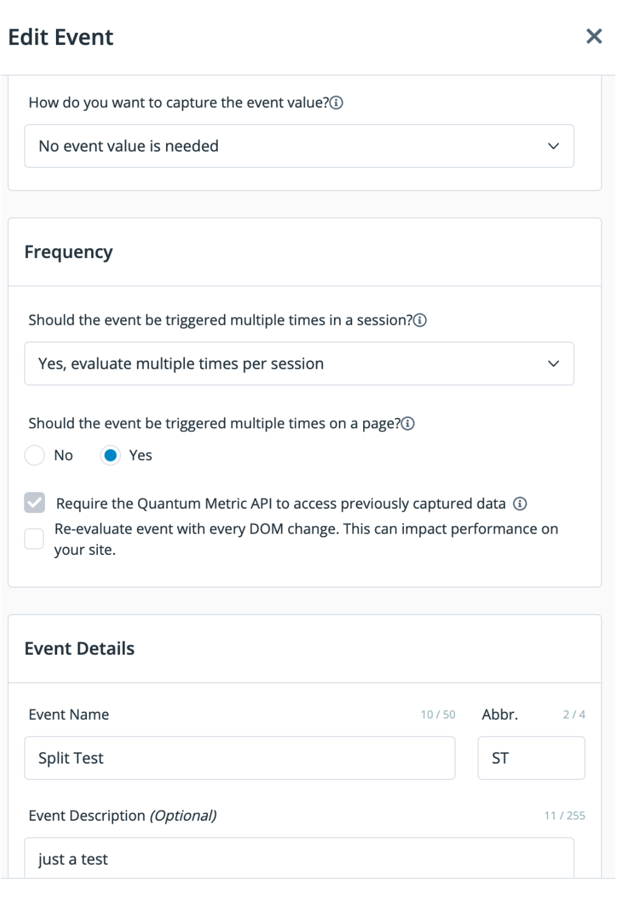
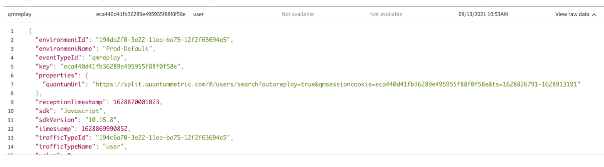

## Harness FME + Quantum Metric

Harness FME and Quantum Metric enable brands to identify what features to test, prioritize feature releases, validate results, and iterate quicker by combining real-time analysis and data-driven experimentation.

Use Quantum Metric’s segment builder to identify sessions with a specific feature flag. Compare each feature flag by validating results and comparing feature-level impact on user behavior. FME impressions (the feature flag treatments seen by each user) become part of segments within Quantum Metric. Sessions are marked with the feature flag treatment for playback and analysis.

## Prerequisites

To connect Quantum Metric with Harness FME, you need:

* Quantum Metric API recording JavaScript installed
* Harness FME JavaScript SDK 10.15.0+ to be installed

## How to use

The following sections explain how to install both your Harness FME and your Quantum Metric software.

### Install in Quantum Metric

**Quantum Metric provisioning**

Quantum Metric must provision a *qsm* script for *Split Test* events as follows:

:::note
This script cannot be configured from the customer’s user interface. It needs to be provisioned by a Quantum Metric CSE.
:::

Quantum Metric injects JavaScript into the customer’s page. The JavaScript listens for API traffic, and the Harness FME bulk impressions endpoint in particular. When the Harness FME SDK calls the bulk endpoint to pass impressions to Harness, the Quantum Metric JavaScript inspects the payload and creates a new Split Test event for each impression. Because the Harness FME SDK changed its JSON naming, the technique only works with Harness FME JavaScript SDK 10.15.0+.

```javascript
(function(){
    try {
        QuantumMetricAPI.addEventListener('api', function (api) {
            if (!!api.url && /split\.io\/api\/testImpressions\/bulk/gi.test(api.url) && api.xhr && api.xhr.qrequest) {
                var qmReq = JSON.parse(api.xhr.qrequest);
                for(var qmI = 0; qmI < qmReq.length; qmI++) {
                    var qmEventVal = qmReq[qmI].f + " - " + qmReq[qmI].i[0].t;
                    QuantumMetricAPI.sendEvent(2, 0, qmEventVal);
                }             
            }
        });
    
    } catch (error) {
        
    }
})();
```

**Harness FME configuration**

You can now create a JavaScript event in the Event settings of the Quantum Metric user interface by entering a JavaScript configuration. Do the following:

1. From the Quantum Metric dashboard, select **Events** and then **Events settings**. The Events page appears.
2. Click **Add event**. The Create event module appears.
3. From the list, select **JavaScript**. The JavaScript configuration is now available.

   <div style={{maxWidth:500}}>  </div>

4. In the Frequency field, select how many times an event is triggered.
5. In the Events name field, select **Split Test**.
6. In the Abbr. field, enter **ST** for Split Test.
7. In the Event Description field, optionally enter a description.

   <div style={{maxWidth:500}}>  </div>

### Install with Harness FME

Harness FME and Quantum Metric must initialize in succession Quantum Metric first and then FME. This allows FME to obtain the Quantum Metric session identifier for its key. To do this, FME waits in a JavaScript setInterval loop until it checks that verify the QuantumMetricAPI is on.

To successfully integrate the two products, you should model your own FME SDK initialization on the setInterval loop shown below. With the Quantum Metric API turned on, FME can receive a “qmreplay” event with an embedded linkback URL to the Quantum Metric session.

The FME SDK needs to get the session ID from Quantum Metric. It then must track a new ‘qmreplay’ event to associate the Quantum Metric linkback with the session.
```javascript
<script type="text/javascript">
	(function() {
	    var qtm = document.createElement('script'); qtm.type = 'text/javascript'; qtm.async = 1;
	    qtm.src = 'https://cdn.quantummetric.com/qscripts/quantum-split.js';
	    var d = document.getElementsByTagName('script')[0];
	    !window.QuantumMetricAPI && d.parentNode.insertBefore(qtm, d);
	})();

	var client;
	var checkSessionIDExists = setInterval( function() {

		if (window.QuantumMetricAPI != null && window.QuantumMetricAPI.isOn()
			&& window.QuantumMetricAPI.getSessionID() != null) {
	      console.log("Quantum Metric Session ID found!");
	      console.log("sessionID: " + window.QuantumMetricAPI.getSessionID());

		    var factory = splitio({
		        core: {
		            authorizationKey: 'your Harness FME API key here',
		            key: window.QuantumMetricAPI.getSessionID(), 
		            trafficType: 'user',
		            labelsEnabled: true
		        },
		        scheduler: {
		            featuresRefreshRate: 1,
		            impressionsRefreshRate: 5
			},
		        storage: {
		        	type: 'LOCALSTORAGE',
		        	prefix: 'WAVE'
		        },
		        impressionListener: {
			    	logImpression: logImpression
		  		},
		        streamingEnabled: true,
		        debug: false,
		        sync: {
		        	impressionsMode: 'OPTIMIZED'
		        }
		    });

			client = factory.client();

			const properties = {
				quantumUrl: window.QuantumMetricAPI.getReplay()
			}
			var queued = client.track ('qmreplay', 0, properties);
			console.log('did qmreplay queue? ' + queued);

			client.on(client.Event.SDK_READY, function() {
				console.log("FME SDK ready!");
				drawUI();
			});	

			client.on(client.Event.SDK_UPDATE, function() {
				console.log("FME SDK update!");
				drawUI();
			});

	      clearInterval(checkSessionIDExists);
	  	}
	}, 100);

    $( document ).ready(function() {
    	console.log( "DOM ready!" );
    	if (window.QuantumMetricAPI == null) {
	   	  console.log("QuantumMetricAPI not available... waiting...");
	    }
	});

</script>
```

The Harness FME SDK loops and waits for the Quantum Metric API to be available. Then, it supplies the Quantum Session ID for the traffic key. Once initialized, it queues a *qmreplay* event (it’s OK for this to happen before SDK_READY).

## What you see

Once you have the FME SDK configured with Quantum Metric, impressions display with Quantum Metric sessions identifiers in the Live tail view of Harness FME. In addition, the Live tail for events show *qmreplay* events with the linkback to Quantum Metric in a property:

   

On Quantum Metric user interface, use Session Segment to filter for replays by your feature flags and treatments.

If you’d like a demo of Harness FME, or help to implement any of our integrations, contact [support@split.io](mailto:support@#split.io).

## About this integration

This is a third-party integration that has been tested by the Harness FME team. Harness does not own or maintain this integration. For more information, reach out to the contributor.