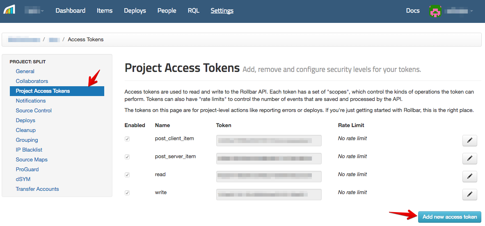
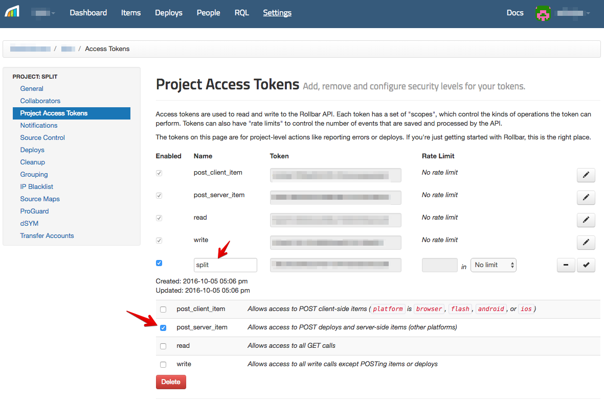
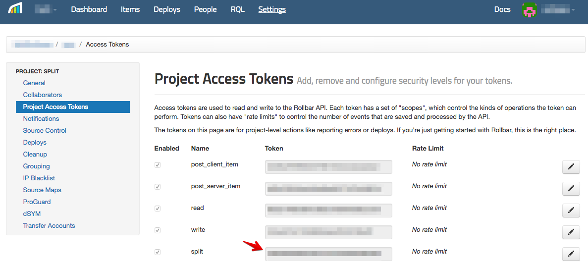
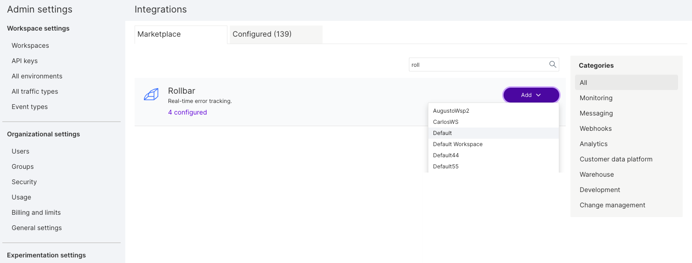
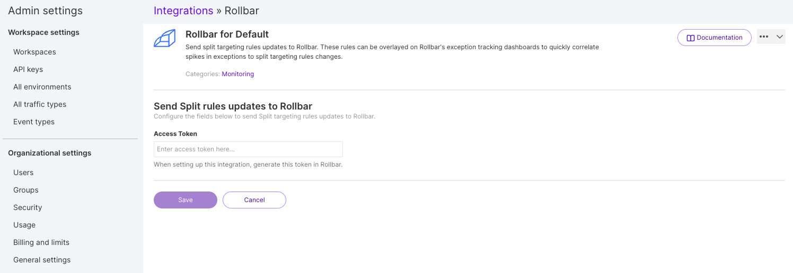

Rollbar is an error tracking software for development teams. Integrate Harness FME data into Rollbar to get rollout events in Rollbar to gain insight on the causes of errors. 

If you are having trouble completing the integration, contact us at [support@split.io](mailto:support@split.io).

## In Rollbar
 
1. Log in to your Rollbar account.
2. Click **Settings**.

   

3. Select **Project Access Tokens**.
4. Click **Add new access token**.

   

5. Edit the new token and **rename** to split.
6. Ensure that `post_server_item` is the only item checked. 

   

7. Copy the token. 

   

## In Harness FME

1. Click the **profile button** at the bottom of the left navigation pane and click **Admin settings**.
2. Click **Integrations** and navigate to the Marketplace tab.

   

3. Click **Add** next to Rollbar and select and select the project for which you would like to configure the integration.

   

4. Paste the token you copied in step 3 of the Rollbar instructions.
5. Click **Save**.

Harness FME notifications should now be flowing into Rollbar. If you have any issues with this integration, contact [support@split.io](mailto:support@split.io).