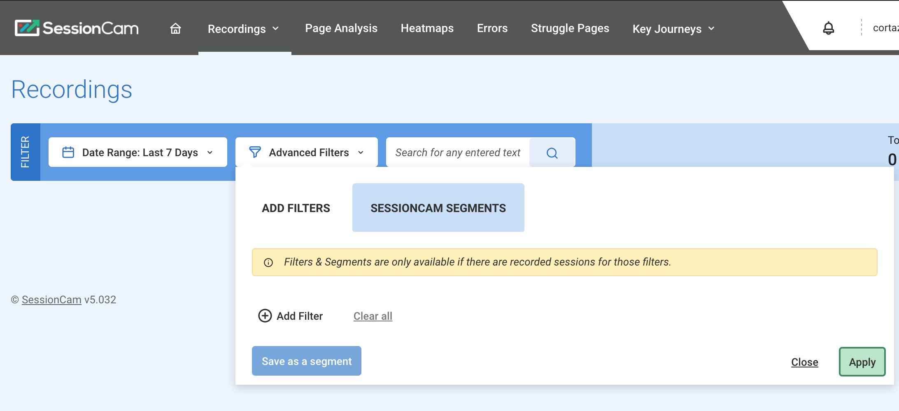
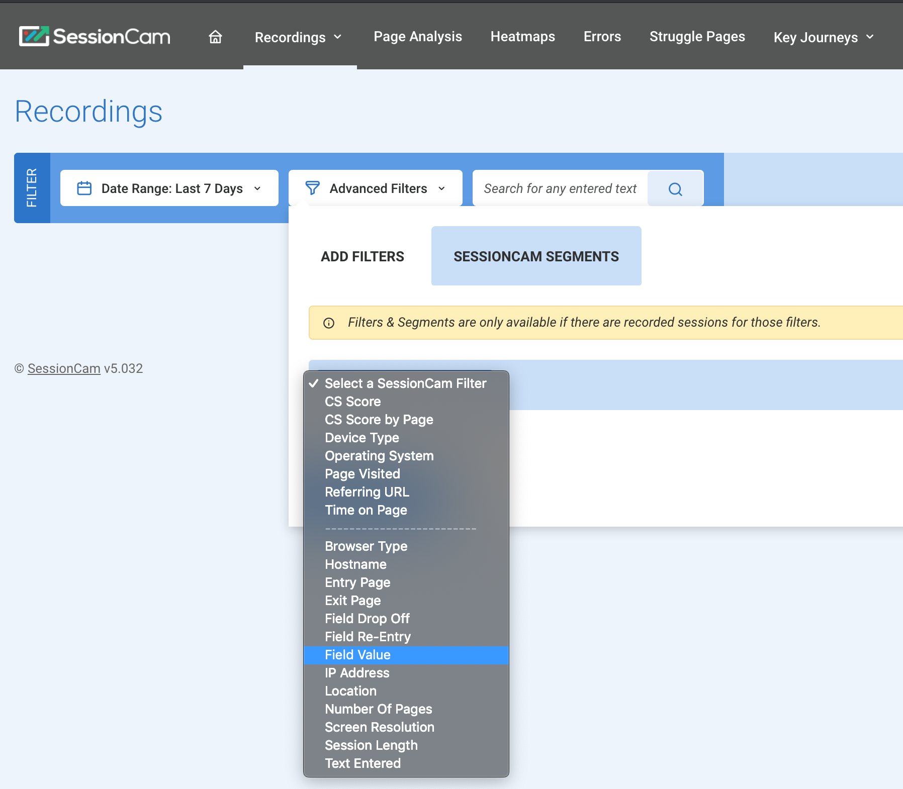
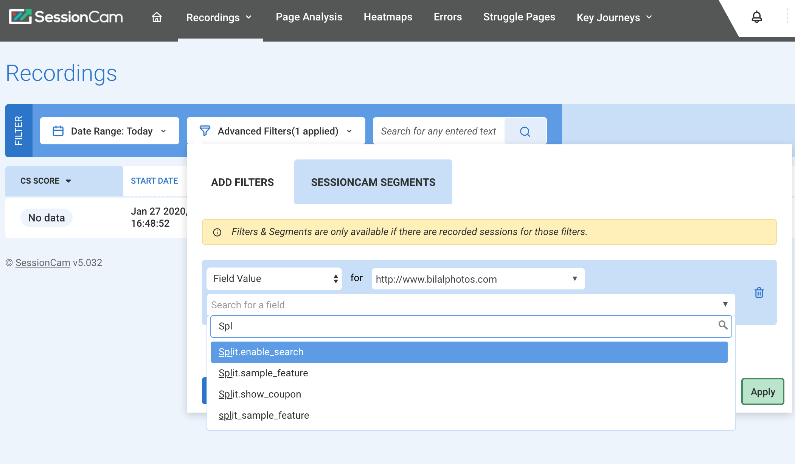
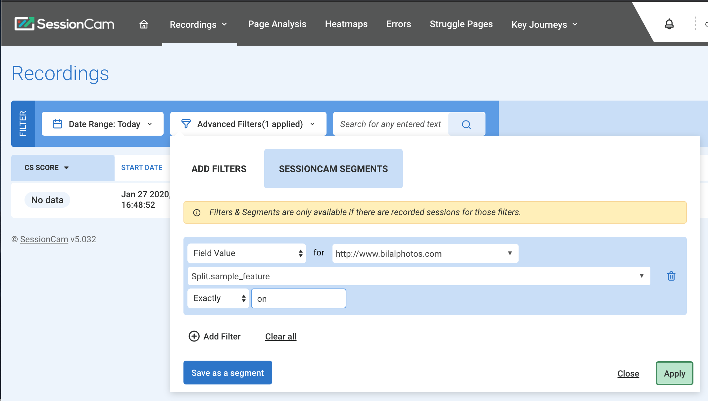

### Example

Basic code sample to use the Harness FME JavaScript SDK to attach feature flag names and treatments as SesisonCam Custom Variable and enable Session Search via Field filter.

### Environment

* Harness FME JavaScript SDK 10.9.0
* SessionCam Web JavaScript Snippet

### How to use

* The code below implements both Harness FME and SessionCam's JavaScript libraries, assuming both libraries are loaded in the header section
* The Harness FME SDK is wrapped with the class SplitIO
  * Make sure to update the key and authorizationKeyfields in the factory initialization
* FME feature flag treatments are calculated for a list of feature flag names defined in an array variable splitNames
  * Make sure to update the array with the correct feature flag names
* Once the treatments are fetched, the script use `window.sessioncamConfiguration.customDataObjects` to add the flag names as a custom variable name and the respective treatments as the value
  * A prefix of `split.` is added to each feature flag name in the below example

**To view the correlated sessions in SessionCam, use the Advanced filter:**

1. Add new filter in the Advanced Filters tab.

   

2. Select **Field Value** option as a filter

   

3. Select which feature flag you like to filter. You can enter `split`. and SessionCam displays the available stored variable names.

   

4. The filter value can be any value of treatments logged, for example to view all sessions with users who received the **on** treatment, set the value to `on`.

   

### Example JavaScript code

```javascript
userId="bob";
class SplitIO {
    constructor() {
        this.isSDKReady=false;
        this.factory = splitio({
            core: {
                authorizationKey: 'BROWSER API KEY',
                key: userId,
            },
            storage: {
                type: 'LOCALSTORAGE'
            },
        });
        this.client = this.factory.client();
        this.client.on(this.client.Event.SDK_READY, () => {
            this.isSDKReady=true;
        });
    }
    applyFeatureFlags(featureNames) {
        return this.client.getTreatments(featureNames);
    }
    destroySplit() {
        this.client.destroy();
        this.client=null;
    }
}

function calculateTreatments() {
    splitNames=["sample_feature", "show_coupon", "enable_search"];
    treatments = mySplit.applyFeatureFlags(splitNames);
    if (!window.sessioncamConfiguration)
        window.sessioncamConfiguration = new Object();    
    if (!window.sessioncamConfiguration.customDataObjects)
        window.sessioncamConfiguration.customDataObjects = [];
    var split_treatments ={};
    for (var i = 0; i < splitNames.length; i++) {
        console.log(splitNames[i]+": "+treatments[splitNames[i]]);
        var item = {        
            key: "Split."+splitNames[i],
            value: treatments[splitNames[i]]
        };        
        window.sessioncamConfiguration.customDataObjects.push(item);
    }
}

var mySplit = new SplitIO();
if (!mySplit.isSDKReady) {
    console.log("FME not ready yet");
    mySplit.client.on(mySplit.client.Event.SDK_READY, () => {
        calculateTreatments();
    });
} else {
    calculateTreatments();
}
```