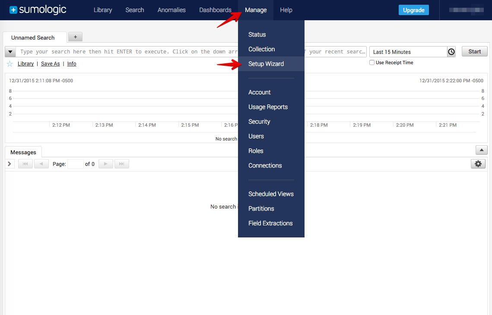
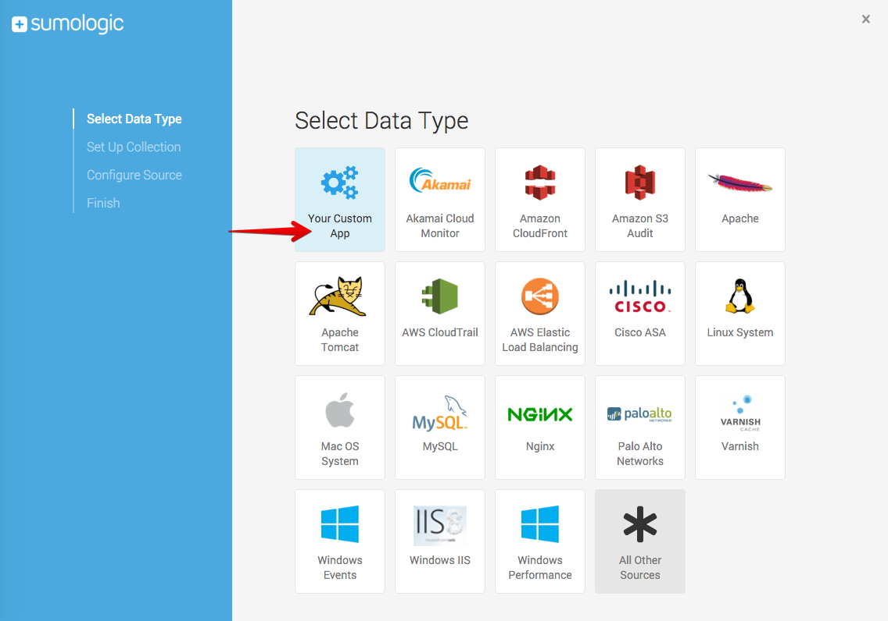
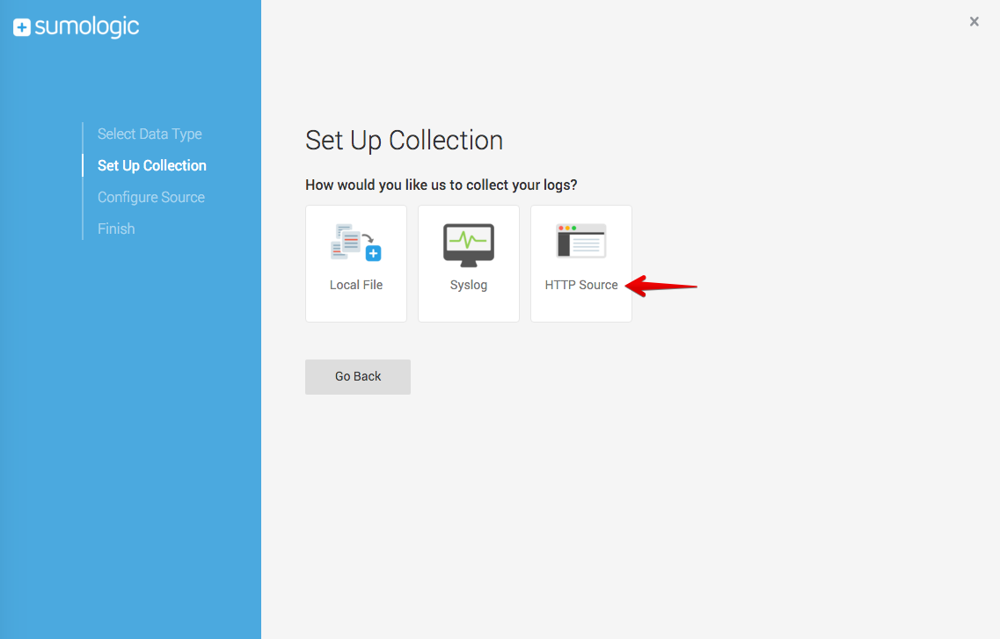
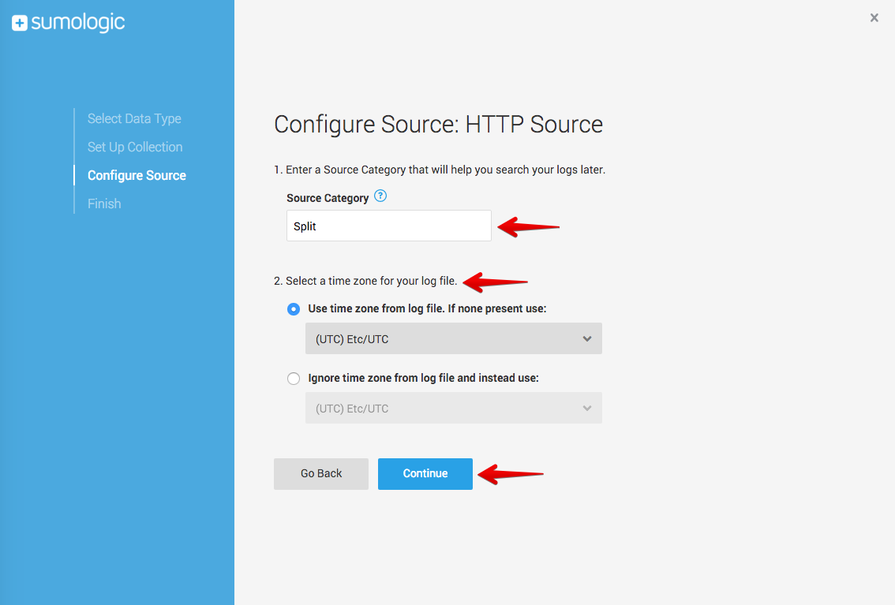
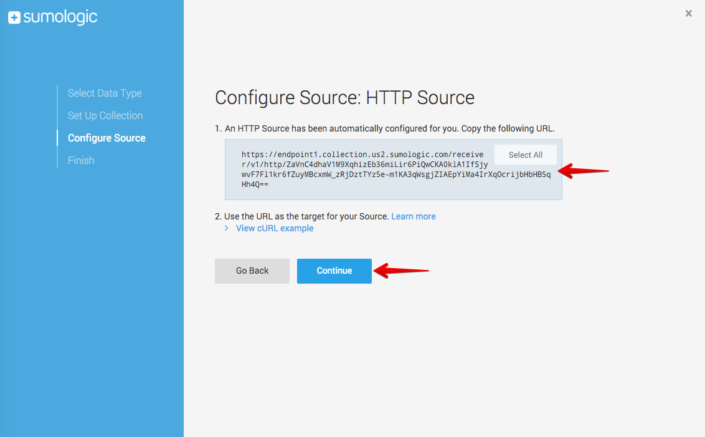
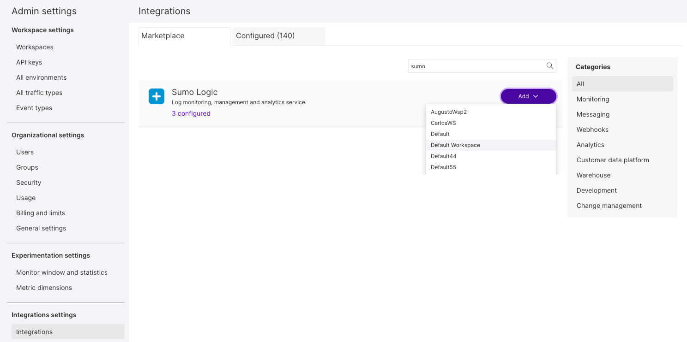
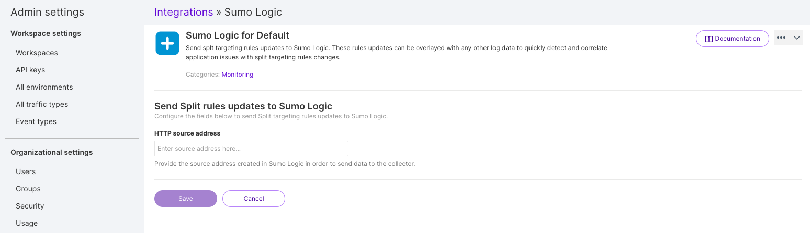

  <button hidden style={{borderRadius:'8px', border:'1px', fontFamily:'Courier New', fontWeight:'800', textAlign:'left'}}> help.split.io link: https://help.split.io/hc/en-us/articles/360020746172-Sumo-Logic </button>

import UpdateBanner from "./shared/_update-banner.mdx";

 <UpdateBanner integration={frontMatter.title} />

Sumo Logic provides log monitoring, management, and analytics service. Integrate Split data into Sumo Logic to get rollout and rollback events in Sumo Logic. These events can be overlayed with any other log data to quickly detect and correlate application issues with feature flag changes.

If you are having trouble completing the integration, contact us at [support@split.io](mailto:support@split.io).

## In Sumo Logic
 
1. Click **Manage** and **Setup Wizard** from the dropdown to set up new streaming data.

   

2. On the Select Data Type page click **Your Custom App**.

   

3. On the Set Up Collection page click **HTTP Source**.

   

4. On the Configure Source page specify a **Source Category** (use *Split* as the name) and a **Time zone**, and then click **Continue**.

   

5. Copy the URL provided to configure the Sumo Logic integration in Split , and then click **Continue**. This URL contains the token/key used to identify your Sumo Logic account.

   

## In Split

1. Click the **user's initials** at the bottom of the left navigation pane and click **Admin settings**.
2. Click **Integrations** and navigate to the Marketplace tab.
3. Find Sumo Logic in the integration list, click **Add** and select the Split project for which you would like to configure the integration.

   

4. Paste the Source Address you copied in step 5.

   

5. Click **Save**.

Split notifications should now be flowing into Sumo Logic. If you have any issues with this integration, contact [support@split.io](mailto:support@split.io).
