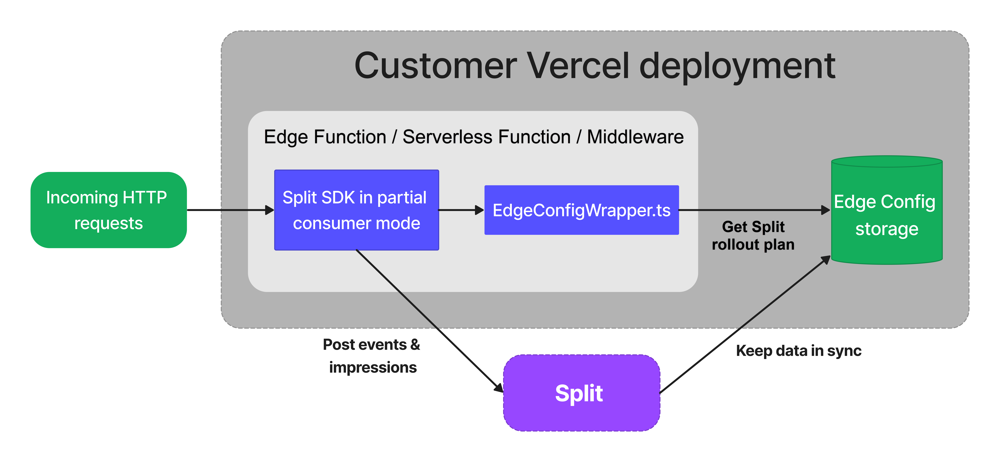

[Vercel](https://vercel.com/) is an advanced hosting and deployment platform for modern web applications.

Developers can incorporate serverless code that runs in the Edge Runtime on the Vercel platform using [Edge Functions](https://vercel.com/docs/concepts/functions/edge-functions) and [Middleware](https://vercel.com/docs/concepts/functions/edge-middleware). Vercel supports compute logic in Edge Functions and Middleware that is scalable, on-demand, and stateless with the [Edge Config](https://vercel.com/docs/storage/edge-config) low-latency data store. Harness FME provides out-of-the-box integration that wraps the Edge Config data store, allowing near-instant reads at the edge.

## Architecture of the integration

The following diagram shows the architecture of the Split (renamed to Harness FME) integration for Vercel.



The Harness FME integration for Vercel writes the FME definitions (the set of feature flags and segment definitions) to the Edge Config instance of your application, and keeps this data synchronized. The Edge Config wrapper is an adapter that connects the FME SDK with the Edge Config, allowing the SDK to rapidly evaluate feature flags. The SDK sends tracked events and impressions data to Harness servers.

Setting up the Harness FME integration for Vercel is done in two phases:

* Add the Harness FME integration to your Vercel project.
* Set up the FME JavaScript Browser SDK client.

The integration setup process requires Harness admin level access. You can create a Harness account during the Harness FME integration setup.

## Add the Harness FME integration to your Vercel project

The Harness FME integration is added from within Vercel as follows.

1. Add an instance of the Edge Config to your Vercel project. (The integration will add a root-tree to the JSON contents of your Edge Config instance, but will never erase or overwrite any other existing JSON data.) If you forgot to do add the Edge Config instance, you can safely restart adding the Harness FME integration to your Vercel project from this step.

2. Go to [https://vercel.com/integrations/split](https://vercel.com/integrations/split) or search for "Split" in the Vercel Marketplace, click **Add Integration**, and follow the setup process. You will be prompted to log in or create your Harness account, and then you will see the Vercel setup page. Specify each [Harness FME environment](/docs/feature-management-experimentation/management-and-administration/fme-settings/environments) and choose the Edge Config instance that each should sync to. You are given an authentication key for each environment to use in your code to access the correct JSON root-tree for that environment in your Edge Config instance. Click **Save** to save the setup for all environments. Then click the **Finish integration** link near the top of the window to close the dialog.

## Set up the Harness FME JavaScript Browser SDK client

To set up the FME SDK in the code of your Vercel project, follow the steps below.

1. Install the required packages by running the `npm install` command.

<ul>

```bash
npm install @splitsoftware/splitio-browserjs @splitsoftware/vercel-integration-utils @vercel/edge-config
```

</ul>

2. Instantiate the SDK within your Vercel Edge Function or Middleware. The FME SDK client must run in _partial consumer_ mode and be initialized with the Edge Config wrapper. See our [example](https://github.com/splitio/vercel-integration-utils/tree/main/example/pages/api/get-treatment.js) on GitHub. Note that the `core.initializationKey` passed to the `SplitFactory` constructor is your client-side API key for your Harness FME environment.

Following this setup, you can consume FME feature flags from Edge Config and send events to Harness servers.

### Manage the integration after installation

Read more about [Managing Integrations After Installation](https://vercel.com/docs/integrations/using-an-integration/manage-integration) in the Vercel docs.
