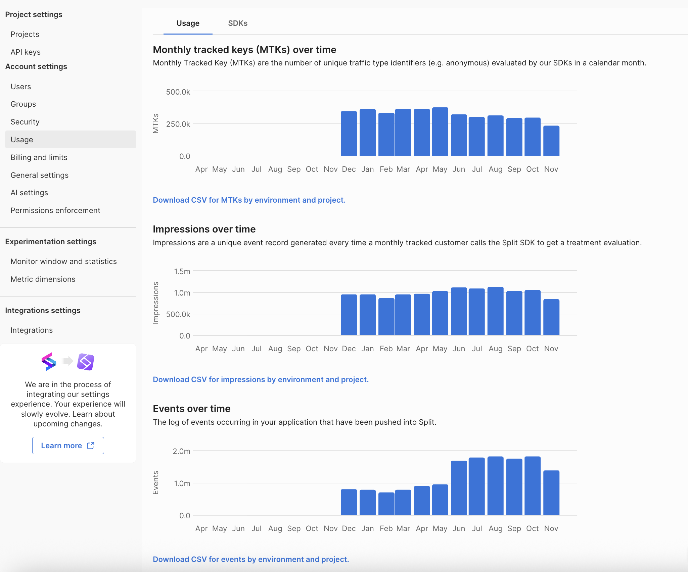
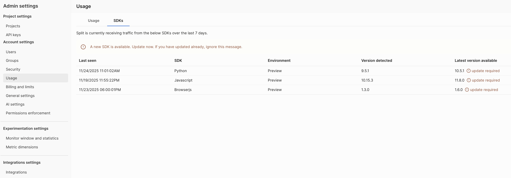
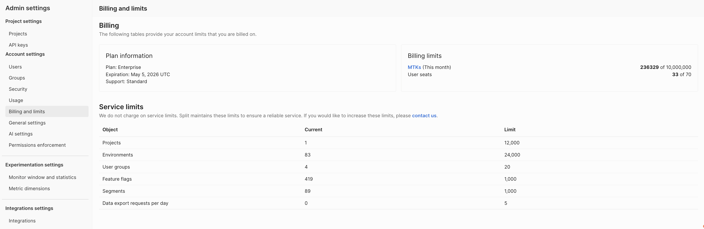

This page describes the usage reports, billing details, and service limits available in Harness Feature Management & Experimentation (FME). Navigate to the **Usage** and **Billing and limits** pages in **FME Settings** to access the following information:

* [Usage metrics](#view-usage-data) such as Monthly Tracked Keys (MTKs), impressions, and events
* [SDK usage](#view-sdk-usage-data), displaying which SDKs are actively sending traffic
* [Account-level billing information and service limits](#view-billing-and-service-limits)

:::danger Upcoming change to user-based billing
Harness FME is transitioning away from seat-based pricing. **User seats** will be replaced with active users, defined as any user who accesses an FME capability (including view-only usage).

Until this update rolls out, the **Billing and limits** page will continue to show registered seats.
:::

import Tabs from '@theme/Tabs';
import TabItem from '@theme/TabItem';

<Tabs queryString="usage-and-billing">
<TabItem value="usage" label="Usage">

Harness FME provides three primary usage metrics on the **Usage** tab, and usage data (MTKs, impressions, and events) updates daily. 

### Monthly Tracked Keys (MTKs)

Monthly Tracked Key (MTKs) are the number of unique [traffic type identifiers](/docs/feature-management-experimentation/traffic-types) (e.g. users) evaluated by an SDK in a calendar month.

* MTKs represent the number of unique keys evaluated for treatments.
* Keys are de-duplicated across projects, environments, traffic types, and feature flags.
* A key evaluated across multiple flags or traffic types counts once.
* MTKs do not represent impressions.
* MTKs typically approximate the number of unique end users interacting with your application.

### Impressions

[Impressions](/docs/feature-management-experimentation/feature-management/monitoring-analysis/impressions/) are unique event records generated each time an SDK evaluates a treatment for a tracked key.

### Events

[Events](/docs/feature-management-experimentation/release-monitoring/events/) capture user or system behavior. 

For example:

* Page views
* Button clicks
* Transaction metadata
* Performance metrics such as response time

## View usage data

To access your usage data:

1. From the FME navigation menu, click **FME Settings**.
1. Under **Account Settings**, select **Usage**.

You can export each usage report as a CSV file by clicking the **Download CSV by environment and project** link under each chart. 

:::tip
For additional usage data, contact [Harness Support](/docs/feature-management-experimentation/fme-support). 
:::

</TabItem>
<TabItem value="sdk-usage" label="SDK Usage">

Harness FME displays which SDKs are actively sending traffic over the last seven days on the **SDKs** tab.

This data helps you monitor:

* Which SDKs are integrated in your application
* The environment each SDK is reporting from
* The version that is currently detected vs. the latest available version

If a newer version is available, update the SDK to ensure compatibility and access to the latest features. 

## View SDK usage data

To access your SDK usage and versioning data:

1. From the FME navigation menu, click **FME Settings**.
1. Under **Account Settings**, select **Usage** and click on the **SDKs** tab.

</TabItem>
<TabItem value="billing" label="Billing and Service Limits">

On the **Billing and limits** page, you can view the following:

* Your current billing plan
* Plan expiration date
* Support plan
* Billing limits (for example, MTKs and user seats)

The **Service limits** section includes a table that displays your usage toward FME object-level limits and any feature-gated consumption thresholds. These limits help ensure platform reliability and prevent unexpected usage spikes. 

## View billing and service limits

To access your billing and service limits data:

1. From the FME navigation menu, click **FME Settings**. 
1. Under **Account Settings**, select **Billing and limits**.

:::tip
Service limits do not affect billing. Harness FME service limits require that you request limit increases manually by contacting [Harness Support](/docs/feature-management-experimentation/fme-support).
:::

</TabItem>
</Tabs>