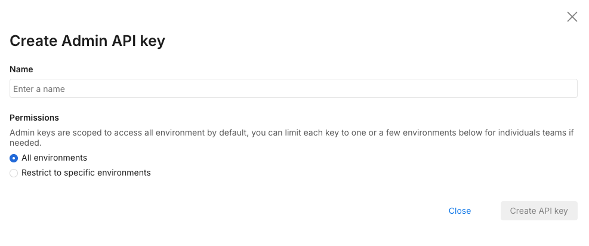

## Overview

Change control is critical to the success of any ongoing project and especially fundamental to software development. It is used to ensure that changes are introduced in a controlled and coordinated manner, reducing the risk of unnecessary changes and ensuring minimal disruption to services.

Split supports change control on segment and feature flags objects. If change control is enabled in your environment, then API calls to modify these objects directly without creating a change request returns a 403 stating that Approvals are required, for example:

```bash
{
   "code": 403,
   "message": "Approvals are required. orgId=id-org-UUID envId=id-envronment-UUID",
   "details": "",
   "transactionId": "22ugt6f5igp"
}
```

### Prerequisites

- Install [cURL](https://curl.se/). This application is a free HTTP API client that we will use to make API calls in this document. It should be installed already if you are on a Mac or a Linux machine. If you are more comfortable with other ways to call HTTP endpoints or other HTTP clients, you should be able to follow along. It is a command line tool, so you need to have basic familiarity with the CMD.exe command prompt on Windows or Terminal emulators on Mac or Linux machines.

- You need to create an Admin API key. You can create this by navigating to **Admin settings** and then **API keys**. Click the **Action** button and from the menu list, select **Create API key** in the top right. 

  The following page displays:

  

  Select **Admin** as this tutorial’s API key needs to be for the Admin API. Give it a name and optionally restrict it to environments and projects that you are using the API key for.

  Once you click **Create**, an API key is available for use:

  

:::tip
This page uses `$orgId` and `$apiKey` to replace the actual API key and account ID that we gathered previously. Replace these with what you have copied as the account ID and API key.
:::

To use this key for approving change requests, you need to first set this API Key as an approver by following these steps:

1. In **Admin settings**, click **Projects**.
1. Find the project in which you want to set the API key as an approver. Click the **View** link in the **Actions** column.
   
   

1. Find the environment in which you want to set the key as an approver. Click the **Edit** link in the **Actions** column.
1. On the **Edit Environment** page, select **Require approval for changes**.

   

   If you select:

   * **Let submitters choose their own approvers**, the API cannot be used to approve change requests, but it can still create them and set user account email addresses as approvers.
   * **Restrict who can approve**, you must explicitly select the API key as an approver.

1. Click **Save**. The next screen shows that the environment requires approvals.

For both of the following sections, we also need the project ID and environment ID. Those can be collected from the Split user interface or from API calls. Using our API key we can call to the Workspaces endpoint (used for projects) as follows:

```bash
curl --location --request GET 'https://api.split.io/internal/api/v2/workspaces' \
--header 'Content-Type: application/json' \
--header 'Authorization: Bearer $apiKey‘
```

To retrieve our list of projects and their IDs:

```bash
{
"objects": [
       {
          "name": "Default",
          "type": "workspace",
          "id": "id-defaultProject-UUID",
           "requiresTitleAndComments": false
       },
………
   ],
    "offset": 0,
    "limit": 10,
    "totalCount": 3
}
```

Then, using that project ID, we can get the environments:

```bash
curl --location --request GET 'https://api.split.io/internal/api/v2/environments/ws/id-defaultProject-UUID' \
--header 'Content-Type: application/json' \
--header 'Authorization: Bearer $apiKey‘
```

This returns the following data:

```bash
[
   {
      "name": "Prod-Default",
      "id": "id-prodEnv-UUID",
      "production": true
   },
   {
       "name": "Staging-Default",
       "id": "id-stgEnv-UUID",
       "production": false
   }
]
```

To do this using the user interface, go to **Admin settings** and select **Projects** to see the project names and IDs. 


Click the **View** link in the **Actions** column to see a project's environment names and IDs.


## Change requests with segments

:::info
Some of the actions listed below (such as updating segment owners and tags) cannot be done with the Admin API.
:::

| Requires a change request | Does not require a change request |
|---|---|
| Adding keys to a segment | Creating a segment in a project |
| Removing keys from a segment | Adding an initial empty segment definition to an environment |
|   | Updating segment tags |
|   | Updating segment owners |
|   | Updating segment descriptions |
|   | Removing an empty segment definition from an environment |
|   | Deleting a segment |

Creating or deleting segment keys via the Admin API both require a HTTP POST request. All change requests go to the changeRequest endpoint. Before submitting the change request, you must gather the data required. 

### Segment Operation Payload

| Property         | Description                                                                 |
|------------------|-----------------------------------------------------------------------------|
| `segment.name`   | The name of the segment being updated.                                      |
| `segment.keys`   | The segment keys to use as part of the operation.                           |
| `operationType`  | The type of operation to perform (see [operationType Values](#operationtype-values)). |
| `title`          | The title of the change request.                                            |
| `comment`        | Any change request comments.                                                |
| `approvers`      | Email address(es) of the approver(s). Cannot be the API key. See notes below. |

### `operationType` Values

| Value     | Description                      |
|-----------|----------------------------------|
| `CREATE`  | Add the keys to the segment.     |
| `ARCHIVE` | Remove the keys from the segment.|

### Approvers Behavior by Environment Setting

| Environment Setting            | Rule                                                                 |
|-------------------------------|----------------------------------------------------------------------|
| Let submitters choose approvers | Provide email address(es) of desired approver(s).                    |
| Restrict who can approve      | Leave the `approvers` array empty. The environment defines approvers. |

In the following scenario, we plan on adding the segments *San Francisco* and *Clark's Mountain* to our segment `beta_accounts`. This object will look like the following:

```bash
{
  "segment":{"name":"beta_accounts", "keys":["San Francisco","Clark's Mountain"]},
  "operationType":"CREATE",
  "title":"Adding new beta accounts",
  "comment":"Processed via Admin API",
  "approvers":[]
}
```

Then, the call to create the change request will look like the following:

```bash
curl --location --request POST 'https://api.split.io/internal/api/v2/changeRequests/ws/id-defaultProject-UUID/environments/id-prodEnv-UUID' \
--header 'Content-Type: application/json' \
--header 'Authorization: Bearer $apiKey' \
--data-raw '{
   "segment":{"name":"beta_accounts", "keys":["San Francisco","Clark'\''s Mountain"]},
   "operationType":"CREATE",
   "title":"Adding new beta accounts",
   "comment":"Processed via Admin API",
   "approvers":[]
}
'
```

The result shows the successful creation of the change request:

```bash
{
   "split": null,
   "segment": {
     "name": "beta_accounts",
     "keys": [
       "San Francisco",
       "Clark's Mountain"
       ]
   },
    "id": "id-cr-UUID",
    "status": "REQUESTED",
    "title": "Adding new beta accounts",
    "comment": null,
    "workspace": {
       "id": "id-defaultProject-UUID",
       "type": "workspace"
   },
    "approvers": [
      "admin-api-key"
   ],
    "operationType": "CREATE",
    "comments": [
       {
         "comment": "Processed via Admin API",
         "user": "admin-api-key",
         "role": "SUBMITTER",
         "timestamp": 1646219795355
       }
   ],
    "rolloutStatus": null,
    "rolloutStatusTimestamp": null
}
```

To confirm this change request, we can call the GET request on the changeRequests endpoint: 

```bash
curl --location --request GET 'https://api.split.io/internal/api/v2/changeRequests' \
--header 'Authorization: Bearer $apiKey’‘
```

We then see the REQUESTED status change request:

```bash
{
  "data": [
     {
       "split": null,
       "segment": {
          "name": "beta_accounts",
          "keys": [
             "San Francisco",
             "Clark's Mountain"
            ]
           },
          "id": "id-cr-UUID",
          "status": "REQUESTED",
          "title": "Adding new beta accounts",
          "comment": null,
          "workspace": {
            "id": "id-defaultProject-UUID",
            "type": "workspace"
          },
         "approvers": [
           "admin-api-key"
           ],
         "operationType": "CREATE",
         "comments": [
           {
             "comment": "Processed via Admin API",
             "user": "admin-api-key",
             "role": "SUBMITTER",
             "timestamp": 1646219795355
            }
          ],
        "rolloutStatus": null,
        "rolloutStatusTimestamp": null
       }
   ],
    "nextMarker": null,
    "previousMarker": null,
    "limit": 20,
    "count": 1
}
```

The GET supports pagination using `nextMarker` and `previousMarker` as optional query parameters. It also is possible to also get APPROVED, REJECTED, WITHDRAWN, and PUBLISHED change requests using the status query parameter. 

In the Split user interface, we can also confirm the pending change request exists when you see the message `This segment has pending change. View the change`. 

At this point, if the API key is not set as an approver, the only other thing we can do with it is withdraw the change request. 

```bash
curl --location --request PUT 'https://api.split.io/internal/api/v2/changeRequests/id-cr-UUID' \
--header 'Content-Type: application/json' \
--header 'Authorization: Bearer $apiKey‘ \
--data-raw '{
   "status":"WITHDRAWN",
   "comment":"CR withdrawn via Admin API"
}
'
```

Now if we call the GET request like we did previously, you won’t see the change request. 

```bash
curl --location --request GET 'https://api.split.io/internal/api/v2/changeRequests' \
--header 'Authorization: Bearer $apiKey‘
```

This call returns the following:

```bash
​​{
  "data": [],
   "nextMarker": null,
   "previousMarker": null,
   "limit": 20,
   "count": 0
}
```

To see a withdrawn change request, use this endpoint to see a single change request. To do this, we need to put the change request ID into the endpoint URL: 

```bash
curl --location --request GET 'https://api.split.io/internal/api/v2/changeRequests/id-cr-UUID’ \
--header 'Authorization: Bearer $apiKey’
```

This returns the change request showing the WITHDRAWN status. Notice the comments objects at the bottom also showing the history of comments as well. In the case of change request management, it is helpful to have meaningful comments. 

```bash
{
  "split": null,
  "segment": {
    "name": "beta_accounts",
    "keys": [
      "San Francisco",
      "Clark's Mountain"
     ]
   },
  "id": "id-cr-UUID",
  "status": "WITHDRAWN",
  "title": "Adding new beta accounts",
  "comment": null,
  "workspace": {
    "id": "id-",
    "type": "workspace"
   },
  "approvers": [
    "admin-api-key"
  ],
  "operationType": "CREATE",
  "comments": [
    {
      "comment": "Processed via Admin API",
      "user": "admin-api-key",
      "role": "SUBMITTER",
      "timestamp": 1646219795355
     },
     {
      "comment": "CR withdrawn via Admin API",
      "user": "admin-api-key",
      "role": "SUBMITTER",
      "timestamp": 1646221275904
     }
   ],
  "rolloutStatus": null,
  "rolloutStatusTimestamp": null
}
```

Another way to see this is to explicitly call to list all WITHDRAWN change requests. 

```bash
curl --location --request GET 'https://api.split.io/internal/api/v2/changeRequests?status=WITHDRAWN' \
--header 'Authorization: Bearer $apiKey‘
```

If the Admin API is set as an approver, you can approve the change request by setting the status to APPROVED instead of WITHDRAWN as shown below: 

```bash
curl --location --request PUT 'https://api.split.io/internal/api/v2/changeRequests/id-cr-UUID' \
--header 'Content-Type: application/json' \
--header 'Authorization: Bearer $apiKey‘ \
--data-raw '{
  "status":"APPROVED",
  "comment":"CR approved via Admin API"
}
'
```

The status changes to PUBLISHED if the change request is successfully approved.

```bash
{
  "split": null,
  "segment": {
    "name": "beta_accounts",
    "keys": [
      "San Francisco",
      "Clark's Mountain"
      ]
   },
   "id": "id-cr-UUID",
   "status": "PUBLISHED",
   "title": "Adding new beta accounts",
   "comment": null,
 …..
}
```

It is important to note that you cannot use the same API key to submit and approve the same request. In that scenario you would need two API keys. One API key to submit requests and the other set up as an approver.

## Change requests with feature flags

Change requests with feature flags have a few more options than change requests with segments. 

:::info
Some of the actions listed below (such as updating feature flag owners and tags) cannot be done with the Admin API.
:::

| Requires a change request | Does not require a change request |
|---|---|
| Changing a feature flag definition in an environment | Creating a new feature flag in a project |
| Adding a feature flag definition to an environment | Updating feature flag tags |
| Removing a feature flag definition from an environment | Updating feature flag owners |
| Killing or reactivating a feature flag | Updating a feature flag description |
|   | Updating a feature flag rollout status |
|   | Deleting a feature flag with no targeting rules |

The same changeRequest endpoint is used for feature flag change requests. However, the object sent in the body of the request is different. 

We need to gather the following information to build the object to send:

### Feature Flag Operation Payload

| Property             | Description                                                                                                                                                       |
|----------------------|-------------------------------------------------------------------------------------------------------------------------------------------------------------------|
| `split`              | The feature flag definition object. Use a GET call on the feature flags endpoint to retrieve the existing definition.                                             |
|                      | For `KILL`, `RESTORE`, or `ARCHIVE` operations, only `split.name` is required.                                                                                    |
|                      | For `UPDATE` and `CREATE` operations, the full feature flag definition is required.                                                                               |
| `operationType`      | The type of operation to perform (see [operationType Values](#operationtype-values-1)).                                                                             |
| `title`              | The title of the change request.                                                                                                                                   |
| `comment`            | Any change request comments.                                                                                                                                       |
| `rolloutStatus.id`   | The rollout status ID. Not required for `KILL` operations.                                                                                                         |
| `approvers`          | Email address(es) of the approver(s). Cannot be the API key. See [Approvers Behavior](#approvers-behavior-by-environment-setting-1).                                |

### `operationType` Values

| Value      | Description                                                                 |
|------------|-----------------------------------------------------------------------------|
| `KILL`     | Kill the feature flag, resulting in only the default treatment being served.|
| `RESTORE`  | Restore a killed feature flag.                                               |
| `UPDATE`   | Update the treatment definition of the feature flag.                        |
| `CREATE`   | Create a new feature flag.                                                   |
| `ARCHIVE`  | Remove the feature flag definition from the environment.                    |

### Approvers Behavior by Environment Setting

| Environment Setting            | Rule                                                                 |
|-------------------------------|----------------------------------------------------------------------|
| Let submitters choose approvers | Provide email address(es) of desired approver(s).                    |
| Restrict who can approve      | Leave the `approvers` array empty. The environment defines approvers. |

For this exercise, you are going to take an existing feature flag definition and create a new, different feature flag called `copy_of_onboarding_flow` with the rollout percentage changed from 50/50 to 80/20 on/off.

The feature flag we are using is called `new_onboarding_flow`. 

In the Split user interface, the default rule shows a 50/50 rollout:


The first thing we need to do is to create the project level feature flag in order to add a feature flag definition to our environment. This call creates the new feature flag with a simple description. 

```bash
curl --location --request POST 'https://api.split.io/internal/api/v2/splits/ws/557c90d0-7c44-11ec-97df-eafbc0e90433/trafficTypes/user/' \
--header 'Content-Type: application/json' \
--header 'Authorization: Bearer $apiKey' \
--data-raw '{
"name": "copy_of_onboarding_flow",
"description": "New Split"
}'
```

You don’t need the feature flag id here so just having a successful result of the API call will be sufficient. 

Rather than trying to create the feature flag definition object we want from scratch, it’s much easier to retrieve the existing feature flag object and make the necessary modifications. 

As such, we first get the feature flag definition.

```bash
curl --location --request GET 'https://api.split.io/internal/api/v2/splits/ws/id-defaultProject-UUID/new_onboarding_flow/environments/id-prodEnv-UUID' \
--header 'Content-Type: application/json' \
--header 'Authorization: Bearer $apiKey'
```

The returned value is the full feature flag definition with ID, name, environment, and trafficType along with the treatment definitions. However, for what you need, you can ignore that. The properties we need are the ones below that are returned. 

```bash
{
…..
 "name": "new_onboarding_flow",
….
 "treatments": [
   {
    "name": "on",
    "description": ""
   },
   {
    "name": "off",
    "description": ""
    }
  ],
  "defaultTreatment": "off",
  "trafficAllocation": 100,
  "rules": [
     {
       "buckets": [
         {
           "treatment": "on",
           "size": 100
          }
        ],
        "condition": {
          "combiner": "AND",
          "matchers": [
             {

               "type": "IN_SEGMENT",
               "string": "employees"
             }
           ]
         }
       }
  ],
  "defaultRule": [
     {
       "treatment": "on",
       "size": 50
      },
      {
        "treatment": "off",
        "size": 50
       }
   ],
….
}
```

| Property | Description |
|---|---|
| `name` | Feature flag name. |
| `treatments` | Name and description of treatments. |
| `defaultTreatment` | Name of default treatment. |
| `trafficAllocation` | 0-100, percentage of traffic allocated to the feature flag. |
| `rules` | Targeting rule objects. |
| `defaultRule` | Default targeting rule. |

Now that we have our feature flag object, we are going to change the defaultRule object to give the on treatment a size of 80 and the off treatment a size of 20.  The object now looks like the following:

```bash
{
  "name": "copy_of_onboarding_flow",
  "treatments": [ {"name": "on", "description": ""}, {"name": "off", "description": ""} ],
  "defaultTreatment": "off",
  "trafficAllocation": 100,
  "rules": [
     {
      "buckets": [ {"treatment": "on", "size": 100} ],
      "condition": {
        "combiner": "AND",
         "matchers": [ {"type": "IN_SEGMENT", "string": "employees"} ]
        }
      }
   ],
  "defaultRule": [ {"treatment": "on", "size": 80}, {"treatment": "off", "size": 20} ]
}
```

The other piece of information that we need is the rollout status we want to use. Getting the rollout status ids can be done with this HTTP GET request. 

```bash
curl --location --request GET 'https://api.split.io/internal/api/v2/rolloutStatuses?wsId=id-defaultProject-UUID' \
--header 'Authorization: Bearer $apiKey‘
```

This returns the rollout statuses. In our case, we are interested in the *Ramping* status. 

```bash
[
……
 {
   "id": "id-ramping-UUID",
   "name": "Ramping",
   "description": "Splits that are turned on for a small percentage of users to make sure no performance issues or larger issues come up"
 },
 {
   "id": "id-experimenting-UUID",
   "name": "Experimenting",
   "description": "Splits that have are ramped for max power in an experiment to get results as quickly as possible"
 },
……
]
```

Putting this object into our change request would look like the following:

```bash
{
  "split": {
  "name": "copy_of_onboarding_flow",
  "treatments": [ {"name": "on", "description": ""}, {"name": "off", "description": ""} ],
  "defaultTreatment": "off",
  "trafficAllocation": 100,
  "rules": [
     {
      "buckets": [ {"treatment": "on", "size": 100} ],
      "condition": {
        "combiner": "AND",
        "matchers": [ {"type": "IN_SEGMENT", "string": "employees"} ]
         }
     }
   ],
   "defaultRule": [ {"treatment": "on", "size": 80}, {"treatment": "off", "size": 20} ]
  },
   "operationType": "CREATE",
   "title": "New rollout split copy",
   "comment": "Copy of the new_onboarding_split with updated rollout percentage",
   "rolloutStatus": {"id": "id-ramping-UUID"},
   "approvers": []
}
```

With our object created and information gathered, now you can submit this as a CREATE change request. 

```bash
curl --location --request POST 'https://api.split.io/internal/api/v2/changeRequests/ws/id-defaultProject-UUID/environments/id-defaultEnvironment-UUID' \
--header 'Content-Type: application/json' \
--header 'Authorization: Bearer $apiKey‘ \
--data-raw '{
 "split": {
  "name": "copy_of_onboarding_flow",
  "treatments": [ {"name": "on", "description": ""}, {"name": "off", "description": ""} ],  
  "defaultTreatment": "off",
  "trafficAllocation": 100,
  "rules": [
     {
      "buckets": [ {"treatment": "on", "size": 100} ],
      "condition": {
        "combiner": "AND",
        "matchers": [ {"type": "IN_SEGMENT", "string": "employees"} ]
      }
    }
  ],
  "defaultRule": [ {"treatment": "on", "size": 80}, {"treatment": "off", "size": 20} ]
 },
 "operationType": "CREATE",
 "title": "New rollout split copy",
 "comment": "Copy of the new_onboarding_split with updated rollout percentage",
 "rolloutStatus": {"id": "id-ramping-UUID"},
 "approvers": []
}'
```

The returned value shows the change request and the change request ID. 

```bash
{
  "split": {
   ……
    "name": "copy_of_onboarding_flow",
……
    "killed": false,
    "treatments": [ {"name": "on", "description": ""}, {"name": "off", "description": ""} ],
    "defaultTreatment": "off",
    "trafficAllocation": 100,
    "rules": [
      {
       "buckets": [ {"treatment": "on", "size": 100} ],
       "condition": {
         "combiner": "AND",
         "matchers": [ {"type": "IN_SEGMENT", "string": "employees"} ]
       }
     }
  ],
  "defaultRule": [ {"treatment": "on", "size": 80}, {"treatment": "off", "size": 20} ],
  "openChangeRequestId": "id-cr-UUID"
 },
 "segment": null,
 "id": "id-cr-UUID",
 "status": "REQUESTED",
 "title": "New rollout split copy",
……..
 "operationType": "CREATE",
……..
 "rolloutStatusTimestamp": null
}
```

As with segments change requests, Split doesn’t allow for the same API key or user to approve a change request that it submitted. This can be approved either by a different Admin API Key or by a user manually. 

Once approved, let’s say we want to update the feature flag to a 90/10 rollout. You need to create a change request of operationType UPDATE. The only difference between UPDATE and CREATE is that UPDATE operations act upon existing feature flag definitions. 

For example, this is an UPDATE call to update the existing feature flag we created to a new rollout percentage. 

```bash
curl --location --request POST 'https://api.split.io/internal/api/v2/changeRequests/ws/id-defaultProject-UUID/environments/id-defaultEnvironment-UUID' \
--header 'Content-Type: application/json' \
--header 'Authorization: Bearer $apiKey‘ \
--data-raw '{
  "split": {
    "name": "copy_of_onboarding_flow",
    "treatments": [ {"name": "on", "description": ""}, {"name": "off", "description": ""} ],
    "defaultTreatment": "off",
    "trafficAllocation": 100,
    "rules": [
      {
       "buckets": [ {"treatment": "on", "size": 100} ],
       "condition": {
         "combiner": "AND",
         "matchers": [ {"type": "IN_SEGMENT", "string": "employees"} ]
        }
      }
   ],
   "defaultRule": [ {"treatment": "on", "size": 90}, {"treatment": "off", "size": 10} ]
 },
 "operationType": "UPDATE",
 "title": "New rollout split percentage",
 "comment": "updated rollout percentage",
 "rolloutStatus": {"id": "id-ramping-UUID"},
 "approvers": []
}'
```

The Admin API can also be used for creating change requests to kill a feature flag. For this, you don’t need the feature flag definition, only the feature flag name. 

You would kill the feature flag in the case of alerts showing performance problems, for example:

```bash
curl --location --request POST 'https://api.split.io/internal/api/v2/changeRequests/ws/id-defaultProject-UUID/environments/id-prodEnv-UUID' \
--header 'Content-Type: application/json' \
--header 'Authorization: Bearer $apiKey' \
--data-raw '{
  "split": {"name":"new_onboarding_flow"},
  "operationType":"KILL",
  "title":"Killed Split",
  "comment":"Seeing some performance problems",
  "approvers":[]
}'
```

The response shows the proposed feature flag definition with a `split.killed` property equal to true. 

This same API call can be used to create a change request to RESTORE the killed feature flag to its state before the kill or ARCHIVE the feature flag to remove it from the environment entirely just by changing the operationType object property. 

You’ve learned all about change requests via the Admin API in Split.

## Troubleshooting

### Posting a change request fails when the approver is specified

When [submitting a change request](https://docs.split.io/reference#create-change-request) while using the Admin REST API to specify the approver contact, the request fails with a `400` error.

```bash
{"code":400,"message":"Something was wrong","details":"","transactionId":"xxxxxxx"}
```

This error is possible if the approver option is set in the environment that has the feature flag. When approvers are pre-selected, it is not allowed to specify an approver when submitting the change request, similarly to when submitting the change from Split user interface; the approver edit box will be greyed out.

Verify if the feature flag definitions belong to an environment that has approvers set in its permissions. If so, remove the approver contact and leave the approvers array empty in the JSON payload.

For example:

```bash
"approvers":[]
```

## See also

- [API Reference Documentation](https://docs.split.io/reference/feature-flag-overview)
- [API Wrappers Examples](./examples/)
- [Postman API Collection](https://github.com/splitio/public-api-postman)