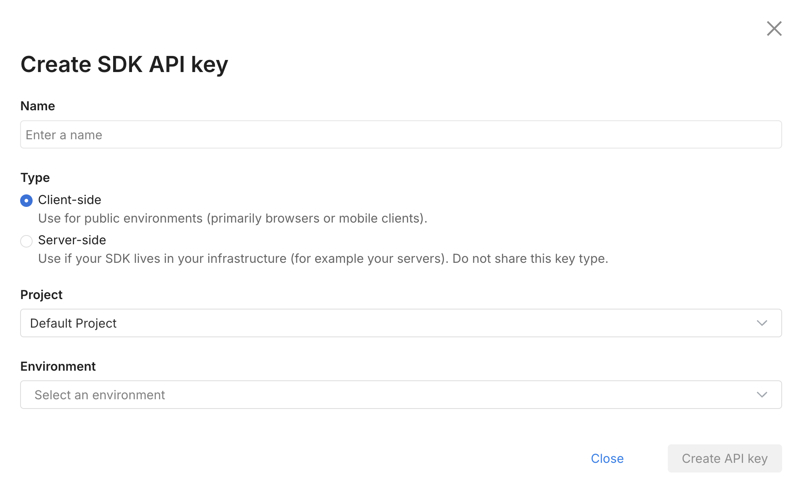
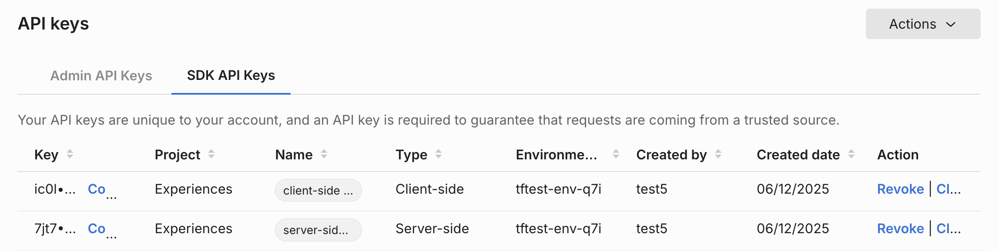
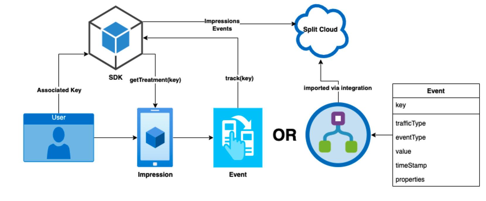

## Overview

You can use the Admin API to send events programmatically using HTTP-based API calls. This allows you to calculate metrics and compute significance as part of experimentation without needing to use the `track()` methods for individual SDKs.

This approach is useful if you already have an external system that tracks events and are interested in passing that data to Split directly.

### Prerequisites

- Install [cURL](https://curl.se/). This application is a free HTTP API client that we will use to make API calls in this document. It should be installed already if you are on a Mac or a Linux machine. If you are more comfortable with other ways to call HTTP endpoints or other HTTP clients, you should be able to follow along. It is a command line tool, so you need to have basic familiarity with the CMD.exe command prompt on Windows or Terminal emulators on Mac or Linux machines.

- You need to create an server-side SDK API key. You can create this by navigating to **Admin settings** and then **API keys**. Click the **Action** button and from the menu list, select **Create API key** in the top right. 

  The following page displays:

  

  Select **Server-side**. Give it a name and optionally restrict it to environments and projects that you are using the API key for.

  Once you click **Create**, an API key is available for use to send events:

  

:::tip
This page uses `$apiKey` to replace the actual API key that we gathered previously. Replace this with what you have copied as the API key.
:::

## Sending events

If you are not using the SDK track method, then events need to be imported in some other way, such as using the Admin API.



In order to send event data to Split, it must be a properly formatted JSON array that contains a series of objects. Refer to the format description below and an example with two event record objects.

### Event Record Fields

| Field              | Data Type | Required | Description                                                                 |
|--------------------|-----------|----------|-----------------------------------------------------------------------------|
| `eventTypeId`      | STRING    | Yes      | The name of the event.                                                      |
| `trafficTypeName`  | STRING    | Yes      | The name of the traffic type for this event.                                |
| `key`              | STRING    | Yes      | The same key value used in the `getTreatment()` call. **This is critical to ensuring proper attribution.**                                                                                                            |
| `timestamp`        | LONG      | Yes      | Unix Epoch timestamp.                                                       |
| `value`            | FLOAT     | No       | The value associated with this event record.                                |
| `properties`       | JSON      | No       | Additional properties associated with this event.                           |

For example:

```bash
[
   {
      "eventTypeId": "page_latency",
      "trafficTypeName": "user",
      "key": "Liam",
      "timestamp": "1645557823",
      "value": 3.85,
      "properties": {
         "country": "CA"
       }
   },
   {
     "eventTypeId": "page_load",
     "trafficTypeName": "user",
     "key": "Ava",
     "timestamp": "1645557824",
     "value": 1.31,
     "properties": {
       "country": "CA"
       }
   }
]
```

To send these events to Split using the Admin API, use the following cURL command: 

```bash
curl --location --request POST 'https://events.split.io/api/events/bulk' \

--header 'Content-Type: application/json' \
--header 'Authorization: Bearer $apiKey \
--data-raw '[
  {
     "eventTypeId": "page_latency",
     "trafficTypeName": "user",
     "key": "Liam",
     "timestamp": "1645557823",
     "value": 3.85,
     "properties": {
        "country": "CA"
      }
  },
  {
    "eventTypeId": "page_load",
    "trafficTypeName": "user",
    "key": "Ava",
    "timestamp": "1645557824",
    "value": 1.31,
    "properties": {
      "country": "CA"
      }
  }
]
'
```

:::tip
This is a POST command. It creates new events in Split. It cannot be used to edit or update existing events. It is not idempotent. Sending the same data multiple times will create multiple events.
:::

The endpoint returns a 202 code, which indicates that the events have been accepted. 

## Considerations

Some things to keep in mind when using the API to track events include the following:

* Do not track the same events that are already being tracked by the SDK track methods.
* Check for the 202 response code to ensure that events have been imported successfully.
* Unlike other Admin API functions, sending event data requires a Server Side or Client Side SDK key.
* If using a supported language (such as Java, Ruby, Python, or PHP), you can accelerate your development by using one of the [Admin API wrappers](./wrappers/python-admin-api).
* It cannot be stressed enough how important it is to ensure that the key used in the event records matches the key used in the `getTreatment()` SDK calls. If they do not match then metrics cannot be calculated properly.
* Be mindful that API calls are [rate limited](https://docs.split.io/reference/rate-limiting).

## See also

- [Attribution and Exclusion](/docs/feature-management-experimentation/experimentation/experiment-results/analyzing-experiment-results/attribution-and-exclusion/)
- [API Reference Documentation](https://docs.split.io/reference/feature-flag-overview)
- [API Wrappers Examples](./examples/)
- [Postman API Collection](https://github.com/splitio/public-api-postman)