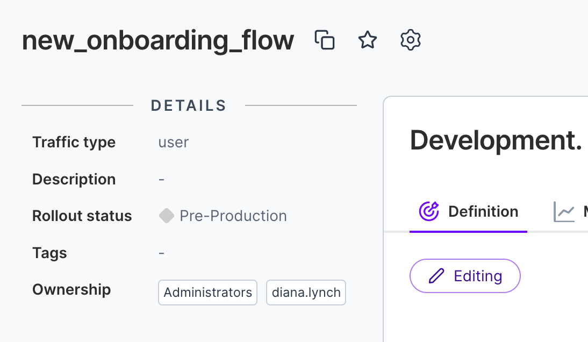
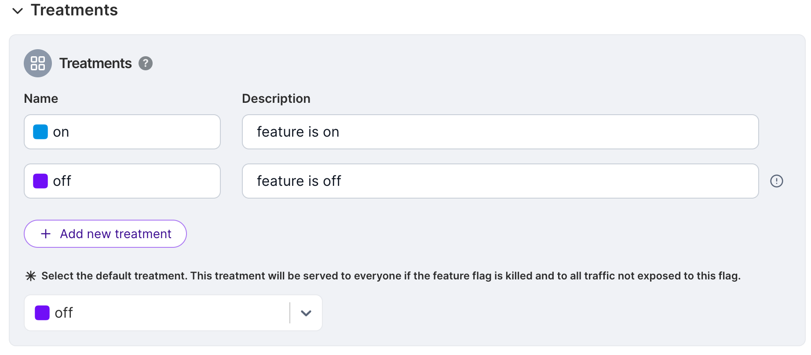
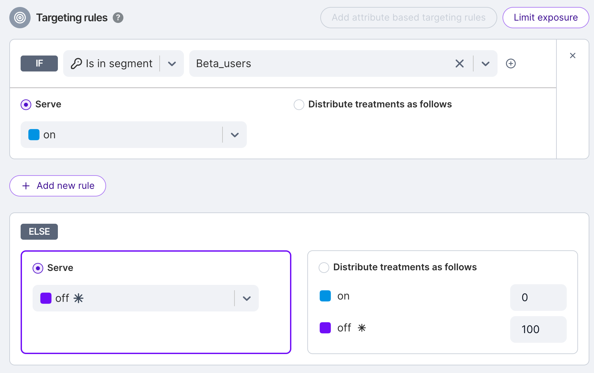
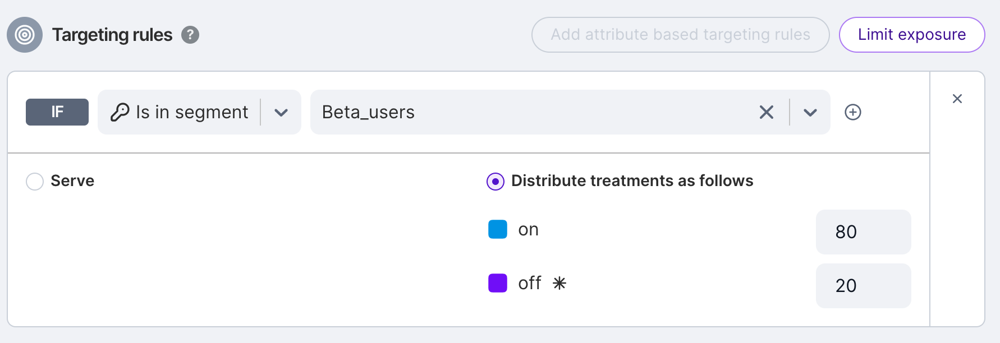
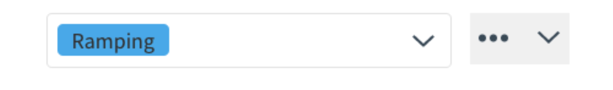
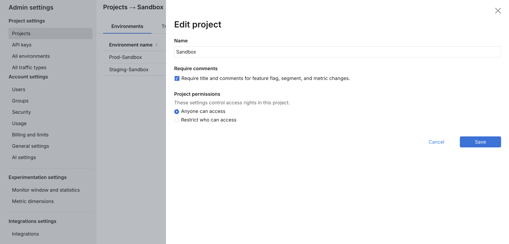

## Overview

You can use the Admin API to create, edit, and delete feature flags programmatically using HTTP-based API calls. This allows you to manage your feature flags and control their rollouts from an external system instead of using the UI.

This approach is useful if you're building a management console for internal subject matter experts (SMEs) to configure and manage feature flags, or if you're implementing simple automation of feature flags as part of a workflow.

### Prerequisites

- Install [cURL](https://curl.se/). This application is a free HTTP API client that we will use to make API calls in this document. It should be installed already if you are on a Mac or a Linux machine. If you are more comfortable with other ways to call HTTP endpoints or other HTTP clients, you should be able to follow along. It is a command line tool, so you need to have basic familiarity with the CMD.exe command prompt on Windows or Terminal emulators on Mac or Linux machines.

- Get the account ID of your Split account. You can retrieve that from the first string that comes after split.io/org/ in the URL you see in your url bar once you are logged in to Split.

  

  Keep this handy as you will need it to drill down to the data in the projects and environments that will be used for creating, editing, and deleting feature flags in this document. 

- You need to create an Admin API key. You can create this by navigating to **Admin settings** and then **API keys**. Click the **Action** button and from the menu list, select **Create API key** in the top right. 

  The following page displays:

  

  Select **Admin** as this tutorial’s API key needs to be for the Admin API. Give it a name and optionally restrict it to environments and projects that you are using the API key for.

  Once you click **Create**, an API key is available for use:

  

:::tip
This page uses `$orgId` and `$apiKey` to replace the actual API key and account ID that we gathered previously. Replace these with what you have copied as the account ID and API key.
:::

## Creating a feature flag

Feature flags exist in a single project and have targeting rules that can be modified on a per environment basis. To create a feature flag, you need to first determine which project within your account you are creating the feature flag in. 

To get your list of projects, use the following cURL command:

```bash
curl --location --request GET 'https://api.split.io/internal/api/v2/workspaces' \
--header 'Content-Type: application/json' \
--header 'Authorization: Bearer $apiKey
```

This returns a list of projects and their corresponding project IDs.

```bash
{
"objects": [
 {
  "name": "Default",
  "type": "workspace",
  "id": "id-default-project-UUID",
  "requiresTitleAndComments": false
  },
  {
   "name": "client-team",
   "type": "workspace",
   "id": "id-client-project-UUID",
   "requiresTitleAndComments": false
   },
   {
    "name": "server-team",
    "type": "workspace",
    "id": "id-server–project-UUID",
    "requiresTitleAndComments": false
   }
 ],
 "offset": 0,
 "limit": 10,
 "totalCount": 3
}
```

Let’s say you want to create a feature flag in the Default project. So store the id for that project, `id-default-project-UUID`. Now, to create your feature flag, you can call the POST API endpoint for creating feature flags. 

Start by creating a feature flag `our_new_split_name` and we can give it a description as description of what this new feature flag does. This feature flag is using the `trafficType` of `user`. 

The following cURL command creates this feature flag:

```bash
curl --location --request POST 'https://api.split.io/internal/api/v2/splits/ws/id-default-project-UUID/trafficTypes/user/' \
--header 'Content-Type: application/json' \
--header 'Authorization: Bearer $apiKey' \
--data-raw '{
  "name": "our_new_split_name",
  "description": "Description of what this new split does"
}'
```

:::info
The name and description are part of the JSON body of the cURL command. The string `user` that defines the `trafficType` is part of the endpoint being called out to. 
:::

The return value from calling this command is the following:

```bash
{
 "id": "id-split-UUID",
 "name": "our_new_split_name",
 "description": "Description of what this new split does",
 "trafficType": {
  "id": "id-user-trafficType-UUID",
  "name": "user"
},
 "creationTime": 1645214274838,
 "rolloutStatus": {
   "id": "id-preprod–rolloutStatus-UUID",
   "name": "Pre-Production"
},
 "rolloutStatusTimestamp": 1645214274838,
 "tags": null
}
```

:::tip
You need the feature flag’s ID, `id-split-UUID`, in order to make modifications to the feature flag, so keep track of this ID.
:::

The default rollout status for a feature flag is `Pre-Production`. This feature flag has no targeting rules in any environment as we have not defined any. 



## Editing a feature flag

If you are managing configuration of feature flags from your own tool, or programmatically through automation, you inevitably need to edit feature flags. In this section, we discuss what is included in the API to edit and make modifications to feature flags.

Our feature flag in the last section was created in the proper project, but without targeting rules, it can’t be used. Targeting rules exist only in a single environment so you need to get the list of environments for the project. 

To get the list of environments, run the following cURL command:

```bash
curl --location --request GET 'https://api.split.io/internal/api/v2/environments/ws/id-default-project-UUID' \
--header 'Content-Type: application/json' \
--header 'Authorization: Bearer $apiKey
```

The response is similar to the following:

```json
[
 {
  "name": "Prod-Default",
  "id": "id-prodEnv-UUID",
   "production": true
 },
 {
  "name": "Staging-Default",
  "id": "id-stgEnv-UUID",
  "production": false
 }
]
```

:::info
This response is a JSON array at the root level of the response body, not an object containing an array.
:::

For example, let’s say we want to create targeting rules in the staging environment. So we need to store the `id-stgEnv-UUID` for later processing. 

Let’s get the configuration of our existing feature flag to see what the configuration currently looks like from the API perspective:

```bash
curl --location --request GET 'https://api.split.io/internal/api/v2/splits/ws/id-default-project-UUID/id-split-UUID/environments/id-stgEnv-UUID' \
--header 'Content-Type: application/json' \
--header 'Authorization: Bearer $apiKey' \
--data-raw ''
```

We get a 404 response, stating the feature flag definition does not exist in the environment.

```bash
{
 "code": 404,
 "message": "Could not find splitmetadata id-split-UUID",
 "details": "",
 "transactionId": "22f0rxo8uno"
}
```

This is an important item to note. Feature flags exist at a project level but their definition, including targeting rules, exist individually in each feature flag environment. Colloquially, the environment level feature flag is referred to as a meta-feature flag. The rollout status, feature flag name, traffic type, tags, description, and feature flag owners exist at the project level. The rest of the feature flag is defined per environment. 

So now let’s talk about the configuration we want to add to our feature flag. The feature flag configuration is passed via the API in the body of the HTTP API request. To build this, we need the UUID identifiers for the feature flag, the environment, and the traffic type. Additionally, we have given this feature flag two treatments: *On* and *Off*. It is rolled out 100%. The `employees` segment gets the *On* treatment, all other users get 50/50 randomized on or off. 

```bash
{
 "id": "id-split-UUID",
 "name": "our_new_split_name",
 "environment": {
  "id": "id-stgEnv-UUID",
  "name": "Staging-Default"
 },
  "trafficType": {
   "id": "id-user-trafficType-UUID",
   "name": "user"
 },
 "killed": false,
 "treatments": [
    {
     "name": "on",
     "description": "feature is on"
    },
    {
     "name": "off",
     "description": "feature is off"
    }
  ],
  "defaultTreatment": "off",
  "baselineTreatment": "off",
  "trafficAllocation": 100,
  "rules": [
    {
     "buckets": [
       {
         "treatment": "on",
         "size": 100
       }
      ],
      "condition": {
        "combiner": "AND",
        "matchers": [
          {
           "type": "IN_SEGMENT",
           "string": "employees"
          }
        ]
      }
     }
  ],
  "defaultRule": [
    {
      "treatment": "on",
      "size": 50
    },
    {
     "treatment": "off",
      "size": 50
    }
   ]
  }
```

We can send this configuration to Split using cURL in this way, with the configuration passed in as raw data:

```bash
curl --location --request POST 'https://api.split.io/internal/api/v2/splits/ws/id-default-project-UUID/our_new_split_name/environments/id-stgEnv-UUID' \
--header 'Content-Type: application/json' \
--header 'Authorization: Bearer $apiKey \
--data-raw ' {
     "id": "id-split-UUID",
     "name": "our_new_split_name",
     "environment": {
       "id": "id-stgEnv-UUID",
       "name": "Staging-Default"
     },
     "trafficType": {
       "id": "id-user-trafficType-UUID",
       "name": "user"
     },
     "killed": false,
     "treatments": [
       {
         "name": "on",
         "description": "feature is on"
       },
       {
         "name": "off",
         "description": "feature is off"
        }
     ],
     "defaultTreatment": "off",
     "baselineTreatment": "off",
     "trafficAllocation": 100,
     "rules": [
       {
         "buckets": [
           {
            "treatment": "on",
            "size": 100
           }
       ],
         "condition": {
           "combiner": "AND",
           "matchers": [
            {
              "type": "IN_SEGMENT",
              "string": "employees"
             }
          ]
        }
      }
    ],
    "defaultRule": [
      {
       "treatment": "on",
       "size": 50
      },
      {
       "treatment": "off",
        "size": 50
      }
    ]
  }
'
```

:::info 
The body of the message in the `–data-raw` parameter must be enclosed in single straight quotes.
:::

You should get a response confirming the response successfully was accepted by the endpoint. It mirrors back the configuration that you sent with 2 additional pieces of information at the end, a *creationTime* and a *lastUpdateTime*. 

```bash
{
  "id": "id-split-UUID",
  "name": "our_new_split_name",
  "environment": {
   "id": "id-stgEnv-UUID",
   "name": "Staging-Default"
},
  "trafficType": {
   "id": "id-user-trafficType-UUID",
   "name": "user"
},
  "killed": false,
  "treatments": [
    {
     "name": "on",
     "description": "feature is on"
    },
    {
     "name": "off",
     "description": "feature is off"
    }
 ],
 "defaultTreatment": "off",
 "baselineTreatment": "off",
 "trafficAllocation": 100,
 "rules": [
   {
    "buckets": [
      {
       "treatment": "on",
       "size": 100
      }
 ],
 "condition": {
   "combiner": "AND",
   "matchers": [
     {
       "type": "IN_SEGMENT",
       "string": "employees"
      }
    ]
   }
  }
 ],
 "defaultRule": [
   {
     "treatment": "on",
     "size": 50
   },
   {
     "treatment": "off",
     "size": 50
    }
 ],
 "creationTime": 1645220815555,
 "lastUpdateTime": 1645220815555
}
```

Now if you go into the Split user interface, you should see the feature flag definition. 




For more information on the components of a feature flag's JSON definition, see [Feature flag definition](https://docs.split.io/reference/feature-flag-definition). After we’ve added that to the feature flag definition, let’s say we want to increase the randomization from 50/50 on/off to 80/20 on off, as we’re fairly confident in the feature. 

We do not have to build that JSON definition again. We can call the Feature Flags endpoint with a PATCH request to just update what we want to. 

Review the following command. 

```bash
curl --location --request PATCH 'https://api.split.io/internal/api/v2/splits/ws/id-default-project-UUID/our_new_split_name/environments/id-stgEnv-UUID' \
--header 'Content-Type: application/json' \
--header 'Authorization: Bearer $apiKey \
--data-raw '[{"op": "replace", "path": "/defaultRule", "value":[
   {
     "treatment": "on",
     "size": 80
   },
   {
    "treatment": "off",
    "size": 20
   }
   ]}]'
```

We are defining an op (operation) to perform. It can be either replace, add, or remove. We are also defining a path in the JSON of the feature flag to perform the operation. In this case, we are replacing the `defaultRule` with one that defines an 80/20 randomization as opposed to a 50/50 one.

If we log in to the Split user interface, we can see the rollout updated. 



Updating the description, tags, or rollout status requires a different endpoint. Let’s say we want to update this to have the status Ramping now because you’re working on ramping up the feature rollout percentage. Currently it is in Pre-Release. 

First we have to get the list of rollout statuses. You can do that with this command:

```bash
curl --location --request GET 'https://api.split.io/internal/api/v2/rolloutStatuses?wsId=id-default-project-UUID' \
--header 'Authorization: Bearer $apiKey
```

The response shows the list of all rollout statuses in a JSON array:

```bash
[
 ……
  {
   "id": "id-ramping-UUID",
   "name": "Ramping",
   "description": "Splits that are turned on for a small percentage of users to make sure no performance issues or larger issues come up"
  },
  {
   "id": "id-experimenting-UUID",
   "name": "Experimenting",
   "description": "Splits that have are ramped for max power in an experiment to get results as quickly as possible"
  },
  …
]
```

With this, now we have the ID for the ramping rollout status, and can call a command to update your feature flag. This is a PATCH command as well, so note that you are replacing the `rolloutStatus/id` from the project-wide feature flag JSON that was created in the previous section, [Creating a Feature Flag](#creating-a-feature-flag). 

```bash
curl --location --request PATCH 'https://api.split.io/internal/api/v2/splits/ws/id-default-project-UUID/our_new_split_name' \
--header 'Content-Type: application/json' \
--header 'Authorization: Bearer $apiKey \
--data-raw '[
   {
     "op":"replace",
     "path":"/rolloutStatus/id",
     "value":"id-ramping-UUID"
   }
]'
```

The result should be the following:

```bash
{
 "id": "id-split-UUID",
 "name": "our_new_split_name",
 "description": "Description of what this new split does",
 "trafficType": {
   "id": "id-user-trafficType-UUID",
   "name": "user"
 },
 "creationTime": 1645214274838,
 "rolloutStatus": {
   "id": "id-ramping-UUID",
   "name": "Ramping"
 },
 "rolloutStatusTimestamp": 1645223192008,
 "tags": null
}
```

You can see the updated rollout status upon logging in to the user interface: 



## Deleting a feature flag

Finally, let’s say you’ve moved the feature flag up to rollout at 100% and have removed it from your codebase. You’ve successfully rolled out a new feature. Congratulations! 

:::tip
Killing a feature flag is more than just updating the rollout status. To kill a feature flag, you have to call the specific Kill endpoint. For more information, see [Kill feature flag in environment](https://docs.split.io/reference/kill-feature-flag-in-environment). 
:::

Now it’s time to remove the feature flag from the Split user interface. Individual feature flag definitions can be deleted on an environment by environment basis using this endpoint:

```bash
curl --location --request DELETE 'https://api.split.io/internal/api/v2/splits/ws/id-default-project-UUID/our_new_split_name/environments/id-stgEnv-UUID' \
--header 'Content-Type: application/json' \
--header 'Authorization: Bearer $apiKey \
--data-raw ''
```

The request returns true with no other information to denote a successful deletion.

You can also delete the project-wide feature flag using the following endpoint. For most cases this should be sufficient, as it will also remove the feature flag definitions in the project environments. 

```bash
curl --location --request DELETE 'https://api.split.io/internal/api/v2/splits/ws/id-default-project-UUID/our_new_split_name' \
--header 'Content-Type: application/json' \
--header 'Authorization: Bearer $apiKey \
--data-raw ''
```

Similarly, this request also returns true when a feature flag is successfully deleted.

If you try to navigate to your feature flag in the Split user interface, you get an error message because this feature flag no longer exists. 

## Troubleshooting

### PATCH request to update the feature flag definition fails

Admin APIs allows one to update existing feature flag definitions. When using the cURL command below to add a key into an existing individual target section, it fails with a `400` bad request error.

```bash
curl -v -X PATCH -d '[{"op": "add", "path": "/treatments/0/keys/-", "value": "key1"}]' -H "Authorization: Bearer ADMIN API KEY" -H "Content-Type: application/json" https://api.split.io/internal/api/v2/splits/ws/[Workspace ID]/[Split Name]/environments/[Environment Name]

HTTP/2 400 
< strict-transport-security: max-age=15770000; includeSubDomains
< vary: Cookie
< content-length: 0

* Connection #0 to host api.split.io left intact
```

The workspace configuration provides the admin the option to **require title and comments** for a feature flag, segment and metric changes via a checkbox option. 



If checked, it is required to provide a title and comment when changing the feature flag definition, in the user interface and Admin API.

Add the title and comment optional parameters in the URL query as below.

```bash
curl -v -X PATCH -d '[{"op": "add", "path": "/treatments/0/keys/-", "value": "key1"}]' -H "Authorization: Bearer ADMIN API KEY" -H "Content-Type: application/json" https://api.split.io/internal/api/v2/splits/ws/[Workspace ID]/[Split Name]/environments/[Environment Name]?title=Split-Engineer-Testing&comment=Split-Engineer-Testing-Comment
```

## See also

- [API Reference Documentation](https://docs.split.io/reference/feature-flag-overview)
- [API Wrappers Examples](./examples/)
- [Postman API Collection](https://github.com/splitio/public-api-postman)