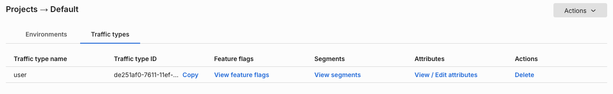

## Overview

You can use the [Split Admin API](https://docs.split.io/reference/introduction) to:

* Push data into Split
* Get data out of Split
* Build custom integrations
* Build on top of the Split platform

## Identify users

:::warning Not used for `targeting` and `getTreatment`
Customer attributes stored using the methods discussed here aren't used for targeting your roll out definitions or as part of the standard usage of `getTreatment`. In order to target, you must pass the attribute with the `getTreatment` call. 

Learn more about [targeting based on custom attributes](/docs/feature-management-experimentation/feature-management/targeting/target-with-custom-attributes/).
:::

You can use the [Identities REST API](https://docs.split.io/reference/identities-overview) to identify your keys in Split, making them available when writing targeting rules in the user interface and enriching autocomplete functionality throughout the user interface. Identifying your keys is useful if you want to pre-populate the user interface for your team and provide customer data when setting up your rollouts and analyzing [impression data](/docs/feature-management-experimentation/feature-management/monitoring-analysis/impressions/).

Split offers both an Identities API and [client-specific API wrappers](/docs/feature-management-experimentation/api/wrappers/python-admin-api) to use when sending to Split attributes on your keys. As an administrator in Split, you can see the attributes that your team is sending to Split and the last time an update is received.

To manage your accounts's attributes, do the following:

1. From the left navigation, navigate to **Admin settings** and then **Projects**.
1. Click **View** for the project you are working in and then the **Traffic types** tab.
1. Click **View/edit attributes**.
   
   

1. Optionally, edit the display name, description, and attribute type.
1. Click **Save**. The attribute has been updated.

You can view a customer's attribute data on the third tab of the customer dashboard which is populated from the attribute data you send using Split's API. To navigate to this dashboard, click on a unique key when you view impression data or use the search bar on the left navigation panel.

## Fetching feature flag definitions without using the Admin API key

In addition to using the Admin API, you can fetch feature flag definitions for a specific environment using the SDK API key. This is done using the SDK HTTP endpoint rather than the Admin API.

:::warning
This endpoint is not publicly documented, and its response structure may change without notice.
:::

Use the following request to fetch all feature flag definitions for the environment associated with the SDK API key:

```bash
curl -H "Authorization: Bearer [SDK_API_KEY]" \
     -H "Accept-Encoding: gzip, deflate, br" \
     -H "Accept: application/json" \
     https://sdk.split.io/api/splitChanges?since=-1 | gunzip
```

The request returns a JSON payload (`gzipped`) containing all feature flag definitions for the environment.

```json
{ 
 "splits":[ 
 { 
    "trafficTypeName":"account",
    "name":"sample_feature",
    "trafficAllocation":100,
    "trafficAllocationSeed":-554128485,
    "seed":1569859022,
    "status":"ACTIVE",
    "killed":false,
    "defaultTreatment":"off",
    "changeNumber":1580851834698,
    "algo":2,
    "configurations":{ 
       "off":"{\"off_key\":\"off_value\"}",
       "on":"{\"On_key1\":\"on_value1\",\"On_Key2\":\"on_value2\"}"
    },
    "conditions":[ 
    { 
       "conditionType":"WHITELIST",
       "matcherGroup":{ 
       "combiner":"AND",
       "matchers":[ 
       { 
           "keySelector":null,
           "matcherType":"WHITELIST",
           "negate":false,
           "userDefinedSegmentMatcherData":null,
           "whitelistMatcherData":{ 
              "whitelist":[ 
                 "bob"
              ]
            },
            "unaryNumericMatcherData":null,
            "betweenMatcherData":null,
            "booleanMatcherData":null,
            "dependencyMatcherData":null,
            "stringMatcherData":null
        }
       ]},
       "partitions":[ 
       { 
          "treatment":"on",
          "size":100
       }],
       "label":"whitelisted"
    },
    { 
       "conditionType":"ROLLOUT",
       "matcherGroup":{ 
       "combiner":"AND",
       "matchers":[ 
       { 
          "keySelector":{ 
             "trafficType":"account",
             "attribute":"country"
          },
          "matcherType":"WHITELIST",
          "negate":false,
          "userDefinedSegmentMatcherData":null,
          "whitelistMatcherData":{ 
             "whitelist":[ 
                "US"
             ]
          },
          "unaryNumericMatcherData":null,
          "betweenMatcherData":null,
          "booleanMatcherData":null,
          "dependencyMatcherData":null,
          "stringMatcherData":null
       }]
       },
       "partitions":[ 
       { 
          "treatment":"on",
          "size":100
       },
       { 
          "treatment":"off",
          "size":0
       }],
       "label":"country in list [US]"
    },
    { 
       "conditionType":"ROLLOUT",
       "matcherGroup":{  
       "combiner":"AND",
       "matchers":[ 
       { 
          "keySelector":{ 
             "trafficType":"account",
             "attribute":null
          },
          "matcherType":"ALL_KEYS",
          "negate":false,
          "userDefinedSegmentMatcherData":null,
          "whitelistMatcherData":null,
          "unaryNumericMatcherData":null,
          "betweenMatcherData":null,
          "booleanMatcherData":null,
          "dependencyMatcherData":null,
          "stringMatcherData":null
       }]
       },
       "partitions":[ 
       { 
          "treatment":"on",
          "size":0
       },
       { 
          "treatment":"off",
          "size":100
       }],
       "label":"default rule"
    }]
    },
 ],
 "since":1572295747543,
 "till":1580851834698
}
```

## Admin API specifications

The [Split Admin API documentation](https://docs.split.io/reference/introduction) provides specifications for all public API endpoints, along with details on [authentication](https://docs.split.io/reference/authentication) and [rate limiting](https://docs.split.io/reference/rate-limiting). You can also access the [Postman collection](https://github.com/splitio/public-api-postman) containing all Split Admin API endpoints.

## Admin API wrappers

Admin API wrappers are available for Java, Node, PHP, Python, and Ruby. Learn more in the [Admin API wrappers documentation](/docs/feature-management-experimentation/api/wrappers/python-admin-api).

## Admin API examples

Working examples that call the Split Admin API to accomplish typical tasks are available in the [Admin API examples documentation](/docs/feature-management-experimentation/api/examples/).

## Admin API webhooks

Webhook integrations are available to send real-time event payloads to Split. Each integration allows you to automate workflows and capture important event data externally.

- [Audit Logs](/docs/feature-management-experimentation/api/webhook/audit-logs) allow you to stream audit log events from your Split organization.
- [Admin Audit Logs](/docs/feature-management-experimentation/api/webhook/admin-audit-logs) allow you to send admin-level audit log events to your endpoint.
- [Impressions](/docs/feature-management-experimentation/api/webhook/impressions) allow you to send impression data for treatments served to users.

The standard webhook integration automatically compresses the POST body request using `gzip` when sending data to the target application server.

## Troubleshooting

When using Azure Logic Apps as the target, there is a compatibility issue between the way Split uses the `gzip` library and how Azure Logic Apps decodes the payload. 

To resolve this, disable `gzip` by appending the following parameter to the end of the Azure Logic App Webhook URL: `&gzip=false`.
