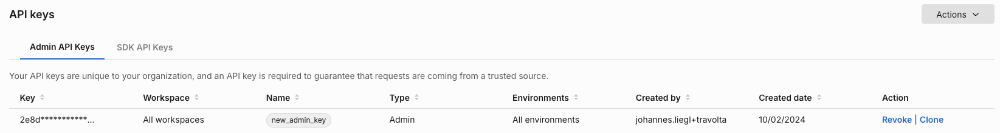

## Overview

You can use the Admin API to create, edit, and delete segments programmatically using HTTP-based API calls. This allows you to manage your data from external systems instead of using the UI.

This approach is useful if you have a customer data platform that manages user segments, and you'd like to use these segments for targeting in a feature flag.

### Prerequisites

- Install [cURL](https://curl.se/). This application is a free HTTP API client that we will use to make API calls in this document. It should be installed already if you are on a Mac or a Linux machine. If you are more comfortable with other ways to call HTTP endpoints or other HTTP clients, you should be able to follow along. It is a command line tool, so you need to have basic familiarity with the CMD.exe command prompt on Windows or Terminal emulators on Mac or Linux machines.

- You need to create an Admin API key. You can create this by navigating to **Admin settings** and then **API keys**. Click the **Action** button and from the menu list, select **Create API key** in the top right. 

  The following page displays:

  

  Select **Admin** as this tutorial’s API key needs to be for the Admin API. Give it a name and optionally restrict it to environments and projects that you are using the API key for.

  Once you click **Create**, an API key is available for use:

  

:::tip
This page uses `$apiKey` to replace the actual API key that we gathered previously. Replace this with what you have copied as the API key.
:::

## Managing segments

One of the most important parts of experimentation is managing your segments. A segment is a list of keys for a traffic type, each key having certain attributes. For example, if your traffic type is account, then the segment would be a list of accounts. If the traffic type is user, it would be a list of users. Segments allow you to group users in order to perform experiments, they are used as part of targeting rules within a feature flag. 

Now, let’s say you want to create a segment. Segments live in individual workspaces, so you need to get the workspace Id of the workspace you want to create the segment in. 

To do that, call the Workspaces API endpoint:

```bash
curl --location --request GET 'https://api.split.io/internal/api/v2/workspaces' \
--header 'Content-Type: application/json' \
--header 'Authorization: Bearer $apiKey’
```
The response you get shows the workspaces and their workspace IDs. 

```bash
{
  "objects": [
   {
    "name": "Default",
    "type": "workspace",
    "id": "id-defaultWorkspace-UUID",
    "requiresTitleAndComments": false
   },
…….
],
  "offset": 0,
  "limit": 10,
  "totalCount": 3
}
```

Notice there is also an offset, limit, and totalCount, similar to the groups API endpoint, you can set a `?limit=<limit>` parameter up to 200 in order to get up to 200 workspaces in one API call, or you can set the `?offset=<offset>` parameter in order to offset the API call’s returned workspaces to skip the first certain number of workspaces.

Now that we have the workspace we want, we can create a segment in that workspace. We call it *friendly_customers_2* with a description `this is a segment that groups friendly customers`. It uses the account `trafficType`.

```bash
curl --location --request POST 'https://api.split.io/internal/api/v2/segments/ws/id-defaultWorkspace-UUID/trafficTypes/account' \
--header 'Content-Type: application/json' \
--header 'Authorization: Bearer $apiKey \
--data-raw '{
   "name":"friendly_customers_2",
   "description":"this is a segment that groups friendly customers"
}'
```

The response shows the successful segment creation.

```bash
{
  "name": "friendly_customers_22",
  "description": "this is a segment that groups friendly customers",  
  "trafficType": {  
     "id": "id-accountTrafficType-UUID",
     "name": "account"
  },
  "creationTime": 1646087605575,
  "tags": null
}
```

To review the segment we created, we can call the GET method to list all of our segments in our workspace:

```bash
curl --location --request GET 'https://api.split.io/internal/api/v2/segments/ws/id-defaultWorkspace-UUID' \
--header 'Content-Type: application/json' \
--header 'Authorization: Bearer $apiKey’
This returns the list of segments:

{
  "objects": 
    {
      "name": "beta_accounts",
      "description": "",
      "trafficType": {
        "id": "id-accountTrafficType-UUID",
        "name": "account"
    },
    "creationTime": 1642939348450,
    "tags": null
    },
……..
    {
     "name": "friendly_customers_2",
     "description": "this is a segment that groups friendly customers",
     "trafficType": {
       "id": "id-accountTrafficType-UUID”,
       "name": "account"
     },
     "creationTime": 1646087291578,
     "tags": null
   },
  …..
 ],
 "offset": 0,
 "limit": 20,
 "totalCount": 7
}
```

Again, similar to workspaces, we also have the `offset`, `limit`, and `totalCount` parameters available here. Take down the `trafficTypeid` value as this is necessary to populate the segment keys.

We can log into the Split user interface to view this segment. However, segments are like feature flags. The segment exists at a workspace level, but the definition of the segment lives at the environment level. 

To add keys to this segment, you first need to create the keys and their attributes. In Split, these segment keys are also referred to as identities. 

:::tip
Creating identities first is only necessary if you have attributes that you need to associate to the identities in the segment, otherwise the segments can have keys created directly and you can skip this step.
:::

To populate the segment in an environment, you need to get the environment ID values. 

Use the HTTP GET method on the environments endpoint like the following:

```bash
curl --location --request GET 'https://api.split.io/internal/api/v2/environments/ws/id-defaultWorkspace-UUID' \
--header 'Content-Type: application/json' \
--header 'Authorization: Bearer $apiKey‘
```

The above returns a list of the environment ID values, such as below:

```bash
[
  {
    "name": "Prod-Default",
    "id": "id-prodEnv-UUID",
    "production": true
  },
  {
    "name": "Staging-Default",
    "id": "id-stgEnv-UUID",
    "production": false
  }
]
```

So let’s say you have 2 friendly customers in our segment, with various attributes that you want to use for viewing within Split. It is important to note that these are not used for targeting.

| `Key`      | `NumEmployees` | `HQState` |
|----------------|--------------|---------|
| Annie’s Apples | 350          | PA      |
| Bob’s Berries  | 200          | CA      |

You need to create a JSON object with this data using the following format:

```bash
[
  {
   "key":"<string: key>",
   "values":{
     "<string: attribute_id>":"<string: value>",
     "<string: attribute_id2>":"<string: value2>"
  }
 },
 {
  "key":"<string: key2>",
  "values":{
    "<string: attribute_id>":"<string: value>",
    "<string: attribute_id2>":"<string: value2>"
   }
 }
]
```

We have done so below, showing our data in this JSON format. Notice the escaped apostrophes. Escaping the apostrophe may be different depending on what tool or language you are using.

```bash
[
  {
   "key":"Annie\'’s Apples",
   "values":{"NumEmployees":350, "HQState":"PA"}
  },
  {
   "key":"Bob\'’s Berries",
   "values":{"NumEmployees":200, "HQState":"CA"}
   }
]
```

Now you need to send this to the identities endpoint to create these identities to be used in a segment, using the environment and trafficType IDs that have been gathered from earlier API calls:

```bash
curl --location --request POST 'https://api.split.io/internal/api/v2/trafficTypes/id-accountTrafficType-UUID/environments/id-prodEnv-UUID/identities' \
--header 'Content-Type: application/json' \
--header 'Authorization: Bearer $apiKey’ \
--data-raw '[
  {
   "key":"Annie'\''s Apples",
   "values":{"NumEmployees":350, "HQState":"PA"}
  },
  {
   "key":"Bob'\''s Berries",
   "values":{"NumEmployees":200, "HQState":"CA"}
  }
]
'
```

The response returns the created identities: 

```bash
{
 "objects": [
   {
    "values": {
      "NumEmployees": "350",
      "HQState": "PA"
     },
     "key": "Annie's Apples",
…….
    },
    {
     "values": {
       "NumEmployees": "200",
       "HQState": "CA"
    },
    "key": "Bob's Berries",
……..
   }
 ],
 "failed": [],
 "metadata": null,
 "offset": null,
 "limit": null,
 "count": null,
 "total": null
}
```

We have to activate the segment definition in the environment in order to populate the segment. 

The HTTP POST method to the endpoint of the segment in the environment activates the segment and makes it ready for use in the environment:

```bash
curl --location --request POST 'https://api.split.io/internal/api/v2/segments/id-prodEnv-UUID/friendly_customers_22' \
--header 'Content-Type: application/json' \
--header 'Authorization: Bearer $apiKey'
The return value below shows the segment, environment, and traffic type: 

{
  "name": "friendly_customers_22",
  "environment": {
    "id": "id-prodEnv-UUID",
    "name": "Production-Default"
 },
 "trafficType": {
  "id": "id-accountTrafficType-UUID",
  "name": "account"
 },
 "creationTime": 1646150507341
}
```

Now with the identities created and the segment activated, the segment can be populated with an array of the key values.

```bash
curl --location --request PUT 'https://api.split.io/internal/api/v2/segments/id-prodEnv-UUID/friendly_customers_2/upload' \
--header 'Content-Type: application/json' \
--header 'Authorization: Bearer $apiKey‘ \
--data-raw '["Annie'\''s Apples", "Bob'\''s Berries", "Carl'\''s Craisins"]'
```

Here we’ve also added another key, *Carl’s Craisins*. Even though the identity was not created previously, the call to the segment endpoint is successful and the segment is populated with all 3 keys. 

:::tip
Segments can at maximum only store 100,000 identities and updates can only add 10,000 at one time. The CSV file-based approach has the same limitation.
:::

```bash
{
 …….
 "environmentURN": {
   "type": "Environment",
   "id": "id-prodEnv-UUID",
   "name": "Prod-Default"
 },
 "name": "friendly_customers_2",
…….
   },
"description": "this is a segment that groups friendly customers",
…………
"status": "ACTIVE",
"creationTime": 1646134007733,
"lastUpdateTime": 1646134726088,
……..
"type": "Segment"
}
```

We can also use an API call to confirm the segment keys are populated: 

```bash
curl --location --request GET 'https://api.split.io/internal/api/v2/segments/id-prodEnv-UUID/friendly_customers_2/keys' \
--header 'Content-Type: application/json' \
--header 'Authorization: Bearer $apiKey‘
```

The above API call returns a list of segment keys:

```bash
{
 "keys": [
   {
    "key": "Annie's Apples"
   },
   {
    "key": "Bob's Berries"
   },
   {
    "key": "Carl's Craisins"
   }
 ],
 "openChangeRequestId": null,
 "count": 3,
 "offset": 0,
 "limit": 100
}
```

Log in to the Split user interface to view the segment that was populated.

Select **Bob’s Berries** and then the **Attributes** tab at the top to view the attributes associated for this environment.

Do the same for **Carl’s Craisins** and notice the attributes are blank.

These can be updated by sending another POST command to the identities endpoint. 

If the data is:

| `Key` | `NumEmployees` | `HQState` |
|---|---|---|
| Carl’s Craisins | 400 | OR |

Then we can build a JSON object like the following:

```bash
[
  {
"key":"Carl\'’s Craisins",
"values":{"NumEmployees":400, "HQState":"OR"}
   }
]
```

And send across the identity like so:

```bash
curl --location --request POST 'https://api.split.io/internal/api/v2/trafficTypes/id-accounts-UUID/environments/id-prodEnv-UUID/identities' \\
--header 'Content-Type: application/json' \
--header 'Authorization: Bearer $apiKey‘ \
--data-raw '[
  {
   "key":"Carl'\''s Craisins",
   "values":{"NumEmployees":400, "HQState":"OR"}
  }
]
'
```

We should get an affirmative response from the endpoint. Reviewing in the Split user interface confirms it. The POST endpoint we used here for updating the identity is the same one used for creating an identity. 

These three identities and this segment can now be used for experimentation and feature flag targeting. The attributes here are mostly for ease of use in the Split user interface. The attributes sent here cannot be used for attribute-based targeting. 

If you want to delete a key from a segment, say if they’re no longer part it for whatever reason, there is a removeKeys PUT endpoint that can be called with a comment to denote why it was deleted:

```bash
curl --location --request PUT 'https://api.split.io/internal/api/v2/segments/id-prodEnv-UUID/friendly_customers_2/removeKeys' \
--header 'Content-Type: application/json' \
--header 'Authorization: Bearer $apiKey‘ \
--data-raw '{"keys": ["Annie'\''s Apples"], "comment": "deleted via API"}'
```

The endpoint has the ID of the environment but the name of the segment in it. 

The value returned by the endpoint should show the confirmation message of the deleted key.

```bash
{
 "code": 200,
 "message": "Deleted 1 keys",
 "details": null,
 "transactionId": null
}
```

The comment sent shows up in the audit logs for the segment.

Finally, to remove this segment, you can call DELETE on the segments endpoint with our segment name as part of the API endpoint. 

```bash
curl --location --request DELETE 'https://api.split.io/internal/api/v2/segments/ws/id-defaultWorkspace-UUID/friendly_customers_2' \
--header 'Content-Type: application/json' \
--header 'Authorization: Bearer $apiKey'
```

The endpoint returns true to denote a successful delete operation.

Deleting segments happens at the workspace level. It is possible to delete the segment definition for an environment individually (i.e., deactivate it), but to do that requires removing all keys to make the segment empty. The deactivate endpoint can be used if necessary.

If we list segments it in, our workspace should no longer show up:

```bash
curl --location --request GET 'https://api.split.io/internal/api/v2/segments/ws/id-defaultWorkspace-UUID' \
--header 'Content-Type: application/json' \
--header 'Authorization: Bearer $apiKey‘
```

Which returns the following list of workspace level segments:

```bash
{
  "objects": [
    {
     "name": "beta_accounts",
 …….
     "name": "beta_users",
 ……..
     "name": "employees",
 …….
     "name": "qa_teams",
 ……..
     "name": "strategic_accounts",
 ……
 ],
 "offset": 0,
 "limit": 20,
 "totalCount": 5
}
```

You’ve completed this tutorial including the whole lifecycle segments from creation to deletion.

## See also

- [API Reference Documentation](https://docs.split.io/reference/feature-flag-overview)
- [API Wrappers Examples](./examples/)
- [Postman API Collection](https://github.com/splitio/public-api-postman)