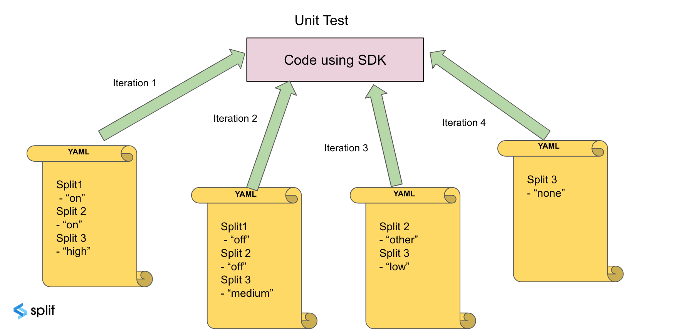

## Overview

If your development environment requires unit tests, we recommend running tests on your code that is integrated to Split SDK for all possible treatments values returned from SDK's `getTreatment` call. The SDK `Localhost` mode is the best option to achieve this while keeping your code integrated to the SDK.

Each SDK language support localhost mode which reads the Split names and their treatments from a local YAML file, instead of connecting to Split cloud. This enables the creation of multiple YAML files, each with unique treatment values and cycle through all the possible treatments returned from each Split.

As mentioned above, using localhost mode does not require any network connection to Split cloud and will not write any Impressions records to the Split account, making the unit test runs smoothly.

To automatically create YAML files containing feature flag names and treatments from a given feature flag list, see [Export Feature Flag Treatments to a YAML File](./examples/export-treatments).