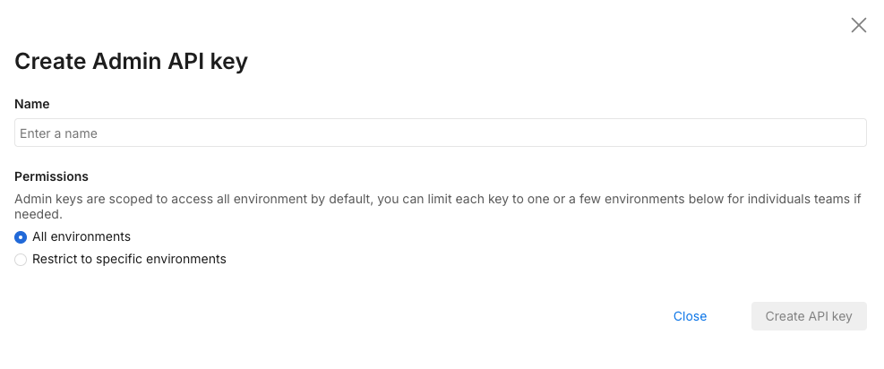
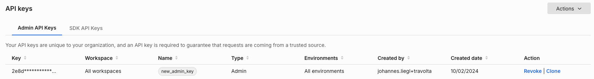
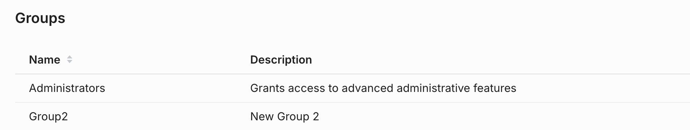
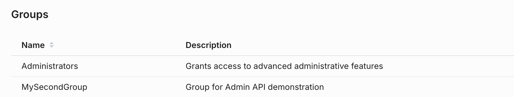
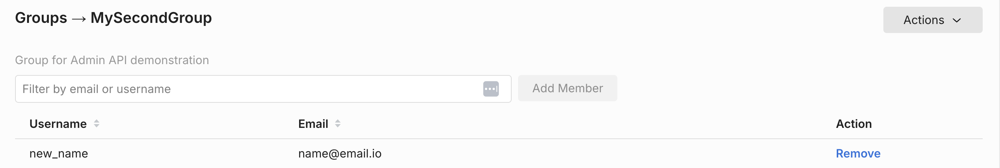

## Overview

You can use the Admin API to create, edit, and delete users and groups programmatically using HTTP-based API calls. This allows you to manage your users and groups from an external system instead of using the UI.

This approach is useful if you're building a management console to automate the process of adding and removing users, or assigning users to groups.

### Prerequisites

- Install [cURL](https://curl.se/). This application is a free HTTP API client that we will use to make API calls in this document. It should be installed already if you are on a Mac or a Linux machine. If you are more comfortable with other ways to call HTTP endpoints or other HTTP clients, you should be able to follow along. It is a command line tool, so you need to have basic familiarity with the CMD.exe command prompt on Windows or Terminal emulators on Mac or Linux machines.

- You need to create an Admin API key. You can create this by navigating to **Admin settings** and then **API keys**. Click the **Action** button and from the menu list, select **Create API key** in the top right. 

  The following page displays:

  

  Select **Admin** as this tutorial’s API key needs to be for the Admin API. Give it a name and optionally restrict it to environments and projects that you are using the API key for.

  Once you click **Create**, an API key is available for use:

  

:::tip
This page uses `$orgId` and `$apiKey` to replace the actual API key and account ID that we gathered previously. Replace these with what you have copied as the account ID and API key.
:::

## Managing users

Users have accounts that are associated with an email address, a Split account, and zero or more groups. It’s important to note that you cannot create users with the Admin API. You can invite them to join via email, whereafter the user has to click the link in their email and create an account with a password.

To invite a user to our account, we can call this cURL command:

```bash
curl --location --request POST 'https://api.split.io/internal/api/v2/users' \
--header 'Authorization: Bearer $apiKey \
--header 'Content-Type: application/json' \
--data-raw '{
  "email": "email@address.com",
  "groups":[]
}'
```

We then receive the following response:

```bash
{
  "id": "a2e7fb00-9668-11ec-834a-1212d10271b3",
  "type": "user",
  "name": "email",
  "email": "email@address.com",
  "status": "PENDING",
  "2fa": false,
  "groups": []
}
```

The returned value for status is PENDING. The user doesn’t exist until they log in and finish creating their account. 

Meanwhile, the user should receive an email at their email address telling then that they are invited to join their team on Split.

The user should be able to click the **Create your new account** link and then log in. We can now get the user and see that they were created successfully:

```bash
curl --location --request GET 'https://api.split.io/internal/api/v2/users' \
--header 'Authorization: Bearer $apiKey
```

The above command gets all users that the Admin API key has access over.

```bash
{
"data": [
 {
   "id": "id-user-UUID",
   "type": "user",
   "name": "email",
   "email": "email@address.com",
   "status": "ACTIVE",
   "2fa": false
  },
  {
   "id": "id-user2-UUID",
   "type": "user",
   "name": “user2",
   "email": "user2@demo.com",
   "status": "ACTIVE",
   "2fa": false,
   "groups": [
     {
       "id": "id-group-UUID”,
       "type": "group"
     }
    ]
   }
  ],
 "nextMarker": null,
 "previousMarker": null,
 "limit": 20,
 "count": 2
}
```

Above, you can see the response with the listing of users, their IDs, statuses, email addresses, usernames, 2FA setting, and group membership. This can be filtered down using query parameters to users in a specific status (`?status=<status>`) or group (`?group_id=<group uuid>`) if necessary. 

The returned JSON here is paginated. The default limit is 20 returned user records. Use the After query parameter to retrieve the next page of results. Use the limit query parameter to increase the number of results returned to 200. For example, if you are using default pagination settings and have more than 20 users, you’ll see something like this:

```bash
{
  "data": [
           {
             ……userdata…….
           }
],
"nextMarker": "bmV4dF9fMTY0MzgyNTk0M……yMTAtODQ1NC0xMWVjLTgzNDAtODY3Y2FhZjE3ZGI2",
"previousMarker": null,
"limit": 20,
"count": 20
}
```

To retrieve the next page of user data, the cURL command looks like this:

```bash
curl --location --request GET 'https://api.split.io/internal/api/v2/users?after=bmV4dF9fMTY0MzgyNTk0M……yMTAtODQ1NC0xMWVjLTgzNDAtODY3Y2FhZjE3ZGI2 \
--header 'Authorization: Bearer $apiKey
```

And the response below has a previousMarker and nextMarker showing that there are still records that have not been retrieved: 

```bash
{
  "data": [
          {
            ……userdata…….
          }
   ],
   "nextMarker": "bmV4dF9fMTYzNjQ2OTA0……xMWVjLTg0ZGMtODZhNTdjNjFmODhh",
   "previousMarker": cHJldl9fMTY0MzgxOTE4NTY……YzUtN2FmNDE2OWJlM2Q4
  ,
    "limit": 20,
    "count": 20
}
```

API calls to the users endpoint can be continued until `previousMarker` is null, indicating that there are no more users to retrieve. 

Alternatively, if we just want to retrieve the data for a single user, we can call the API with the user ID as part of the endpoint:

```bash
curl --location --request GET 'https://api.split.io/internal/api/v2/users/id-user-UUID' \
--header 'Authorization: Bearer $apiKey
```

And we then retrieve the user’s information: 

```bash
{
 "id": "id-user-UUID",
 "type": "user",
 "name": "email",
 "email": "email@address.com",
 "status": "ACTIVE",
 "2fa": false
}
```

Let’s say we want to change the user’s information. Let’s say their email address and name are updated as part of a name change. We can use this PUT command on the Users endpoint. However, we do need to send all of the object properties, as this is not a PATCH partial update.

```bash
curl --location --request PUT 'https://api.split.io/internal/api/v2/users/id-user-UUID' \
--header 'Authorization: Bearer $apiKey \
--header 'Content-Type: application/json' \
--data-raw '{
  "email":"new.email@address.com",
  "name":"new_name",
  "status":"ACTIVE",
  "2fa": false,
  "type": "user"
}'
```

We get an affirmative response showing the user’s new record. 

```bash
{
 "id": "id-user-UUID",
 "type": "user",
 "name": "new_name",
 "email": "new.email@address.com",
 "status": "ACTIVE",
 "2fa": false
}
```

You cannot enable 2FA using the API. You can delete pending users using the HTTP DELETE method to the users endpoint, but once the user has been activated, you can only deactivate using the PUT command, setting the status to DEACTIVATED. 

A DELETE request looks like this:

```bash
curl --location --request DELETE 'https://api.split.io/internal/api/v2/users/id-user-UUID' \
--header 'Authorization: Bearer $apiKey’
```

However, if we try to delete our active user, we would get this response:

```bash
{
 "code": 400,
 "message": "Active users cannot be deleted from your org. You can use a PUT request to deactivate the user",
 "details": "",
 "transactionId": "22syjubq6de"
}
```

## Managing groups

Now, let’s say you want to add this user to a group. The first thing we do is see what groups exist. 

Calling this cURL command returns all of the groups.

```bash
curl --location --request GET 'https://api.split.io/internal/api/v2/groups' \
--header 'Authorization: Bearer $apiKey'
```

In our account, we just have an administrators group, as shown below:

```bash
{
"objects": [
  {
   "id": "id-groupAdmin-uuid",
   "name": "Administrators",
   "description": "Grants access to advanced administrative features",
   "type": "group"
  }
],
"offset": 0,
"limit": 50,
"totalCount": 1
}
```

The totalCount value is 1 here. There is only one group in this account. For accounts with more than 50 groups, you can use the ?offset= query parameter added to the endpoint URL in order to get all of the groups up to the totalCount value. 

For example, in this scenario, if we set the offset to 1, we get no groups returned as we are returning a list of groups starting with the second group: 

```bash
curl --location --request GET 'https://api.split.io/internal/api/v2/groups?offset=1' \
--header 'Authorization: Bearer $apiKey'
```

We get this as a response, showing no groups: 

```bash
{
  "objects": [],
  "offset": 1,
  "limit": 50,
  "totalCount": 1
}
```

You can also use the `?limit=<limit>` query parameter on the HTTP endpoint to increase the limit of groups returned up to 200.

Now let’s say we want to add a group. We can use the HTTP POST method such as the below:

```bash
curl --location --request POST 'https://api.split.io/internal/api/v2/groups' \
--header 'Authorization: Bearer $apiKey \
--header 'Content-Type: application/json' \
--data-raw '{
  "name":"Group2",
  "description":"New Group 2"
}'
```

The above command creates a group called `Group2` with a description of New Group 2. Group names are the primary keys, so an account can only have a single group with a single name. 

The message returned from the endpoint will be like the following, showing the group was created and returning the group ID:

```bash
{
  "id": "id-group2-UUID",
  "name": "Group2",
  "description": "New Group 2",
  "type": "group"
}
```

Logging in to the Split user interface shows the following groups:



Now to give this group a better description, we can use the PUT command to update the name and description to something more descriptive: 

```bash
curl --location --request PUT 'https://api.split.io/internal/api/v2/groups/id-group2-UUID' \
--header 'Authorization: Bearer $apiKey’ \
--header 'Content-Type: application/json' \
--data-raw ' {
    "id": "id-group2-UUID",
    "name": "MySecondGroup",
    "description": "Group for Admin API demonstration",
    "type": "group"
 }'
```

The returned values display as updated: 

```bash
{
 "id": "id-group2-UUID",
 "name": "MySecondGroup",
 "description": "Group for Admin API demonstration",
 "type": "group"
}
```

The results is seen in the Split user interface:



Now, to add our user to the group, we use this PATCH command as below. We are making a call to the users endpoint for the specific user we are updating, and patching that user entity with an op (operation) value of add and setting the value to be the ID of our group. 

To remove users from the group, the op would be removed:

```bash
curl --location --request PATCH 'https://api.split.io/internal/api/v2/users/id-user-UUID' \
--header 'Content-Type: application/json' \
--header 'Authorization: Bearer $apiKey \
--data-raw '[
  {
   "op": "add",
   "path": "/groups/0",
   "value": {"id" : "id-group2-UUID", "type":"group"}
  }
]'
```

The value returned is the full user object, displaying the new group the user is a member of.

```bash
{
 "id": "id-user-UUID",
 "type": "user",
 "name": "new_name",
 "email": "new.email@address.com",
 "status": "ACTIVE",
 "groups": [
   {
   "id": "id-group2-UUID",
   "type": "group"
  }
 ]
}
```

Now you can see below the user added to the group: 



As our last group-related action, we can delete a group using the DELETE HTTP request: 

```bash
curl --location --request DELETE 'https://api.split.io/internal/api/v2/groups/id-group2-UUID' \
--header 'Authorization: Bearer $apiKey'
```

The API endpoint returns true to denote a successful deletion of the group.

Congratulations! You’ve completed this tutorial including the whole lifecycle of users and groups from creation to deletion. 

## See also

- [API Reference Documentation](https://docs.split.io/reference/feature-flag-overview)
- [API Wrappers Examples](./examples/)
- [Postman API Collection](https://github.com/splitio/public-api-postman)