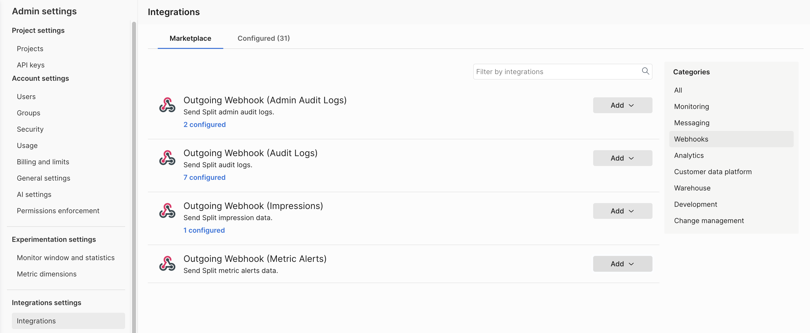
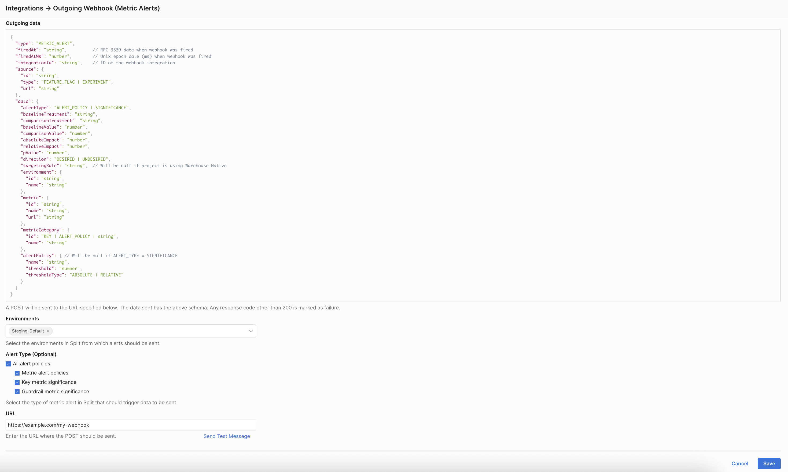

Use the Metric Alert webhook to automatically send Harness FME [metric significance alerts](/docs/feature-management-experimentation/release-monitoring/alerts/#determine-an-alert-mechanism) and [alert policy degradations](/docs/feature-management-experimentation/release-monitoring/alerts/#determine-an-alert-mechanism) to your preferred tools, such as Jira, PagerDuty, Slack, or custom systems. This webhook helps experimentation, SRE, and product teams improve visibility and reduce manual monitoring.

Whenever a metric alert or significance event is triggered in Harness FME, a JSON payload is sent as an HTTP `POST` to the configured webhook URL. You can filter alerts by environment and alert type to control which notifications are delivered.

You can use metric alert webhooks to automate the ingestion of [alerts](/docs/feature-management-experimentation/release-monitoring/alerts/) across your systems. For example:

- **PagerDuty**: automatically trigger an incident when a guardrail metric degrades.
- **Slack**: Notify experiment owners when a key metric reaches statistical significance.
- **Jira**: Create a ticket when a metric alert policy threshold is breached.
- **Custom analytics pipelines**: Forward metric data to a data warehouse for aggregation or visualization.

### Prerequisites

- [FME Administrator access](/docs/feature-management-experimentation/permissions/rbac/#out-of-the-box-roles) is required to create webhooks 
- An HTTPS endpoint for receiving `POST` payloads
- A standardized payload schema consistent with existing webhooks for [impressions](/docs/feature-management-experimentation/api/webhooks/impressions) and [audit logs](/docs/feature-management-experimentation/api/webhooks/audit-logs)

## Outgoing data

When a [metric alert](/docs/feature-management-experimentation/release-monitoring/alerts/alert-policies/) is triggered, Harness FME sends a `POST` request to the specified webhook URL with the following payload schema:

```json
{
  "type": "METRIC_ALERT",
  "firedAt": "string",          // RFC 3339 date when the webhook was fired
  "firedAtMs": "number",        // Unix epoch date (ms) when the webhook was fired
  "integrationId": "string",    // ID of the metric alert webhook integration
  "source": {
    "id": "string",
    "type": "FEATURE_FLAG | EXPERIMENT",
    "url": "string"
  },
  "data": {
    "alertType": "ALERT_POLICY | SIGNIFICANCE",
    "baselineTreatment": "string",
    "comparisonTreatment": "string",
    "baselineValue": "number",
    "comparisonValue": "number",
    "absoluteImpact": "number",
    "relativeImpact": "number",
    "pValue": "number",
    "direction": "DESIRED | UNDESIRED",
    "targetingRule": "string",  // Will be null if the project is using Warehouse Native Experimentation
    "environment": {
      "id": "string",
      "name": "string"
    },
    "metric": {
      "id": "string",
      "name": "string",
      "url": "string"
    },
    "metricCategory": {
      "id": "KEY | ALERT_POLICY | string",
      "name": "string"
    },
    "alertPolicy": { // Will be null if ALERT_TYPE = SIGNIFICANCE
      "name": "string",
      "threshold": "number",
      "thresholdType": "ABSOLUTE | RELATIVE"
    }
  }
}
```

A `200` response indicates a successful delivery. Any other response code is marked as a failure.

## Retry

If Harness FME receives a non-`200` response to a webhook POST, it waits 300 milliseconds and retries delivery once.

## Setup

To configure the metric alert webhook:

1. From the Harness FME navigation menu, click **FME Settings** > **Integrations** and select **Webhooks** from the categories menu.
1. Click **Add** on the **Outgoing Webhook (Metric Alerts)** integration and select a project to add the webhook to.
   
   

1. Select one or more environments in Harness FME from which alerts should be sent from under **Environments**.

   

1. Select the type of metric alert that should trigger webhook delivery:

   * **All alert policies**
     * **Metric alert policies** 
     * **Key metric significance** 
     * **Guardrail metric significance**

1. Enter the webhook URL where `POST` requests should be sent when an alert fires. You can click **Send Test Message** to verify the configuration.
1. Click **Save** to create the webhook.

If you experience any issues with webhook delivery or payload configuration, contact [Harness Support](/docs/feature-management-experimentation/fme-support).